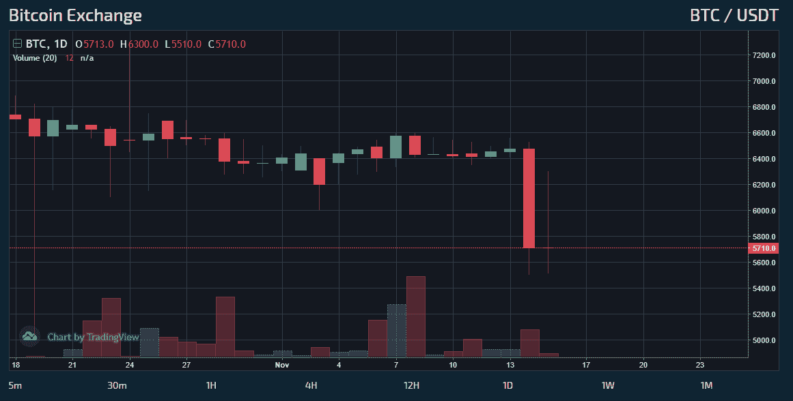
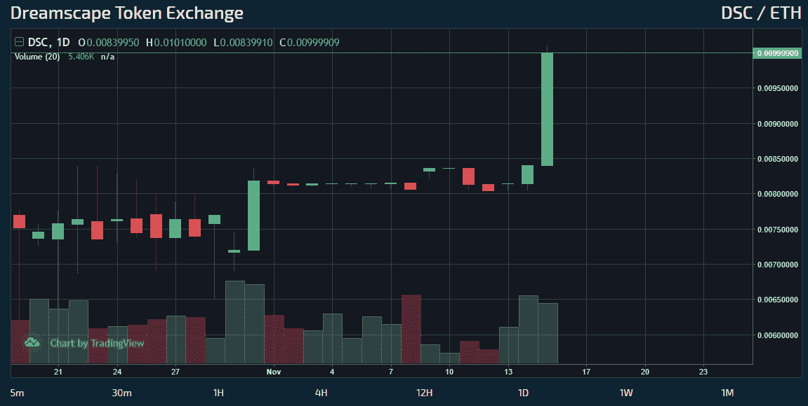

# 是啊！在熊市中可以获利。

> 原文：<https://medium.datadriveninvestor.com/yes-profits-can-be-made-in-a-bear-market-b0d9877472b3?source=collection_archive---------32----------------------->

波动性对于任何市场的流动都是至关重要的，没有波动性的波动，市场的停滞性质会对从业务到概念开发甚至投资者资本的一切产生不利影响。对波动性的迫切需求使经济引擎保持运转，并最终为全世界所有市场的企业提供了发展潜力。

Bitcoin sees more volatility and a new low on November 14, 2018

最近一段时间，波动性不太理想，因为许多全球资产的日波动性都有所下降，导致股价走势图停滞不前，或者近期获得的任何动力都消失了。尽管波动性有所放缓，但全球各地的基金都微调了自己的策略，并寻求新的策略来保持竞争优势。

Dreamscape Capital 似乎是那些跳出传统金融策略束缚思考的基金之一，尤其是在投资方面。自 9 月初以来，该基金是为数不多的获得超常增长的基金之一，特别是在他们的 DSC 代币的价值方面，据 Stex 称[目前持有的价值约为 1.49 美元。即使在波动性一般的时期，Dreamscape Capital 也设法保证了资产的安全，并使其象征性价格不断攀升。](https://app.stex.com/en/basic-trade/pair/ETH/DSC/1D)

Dreamscape Capital is able to profit from any market direction

根据他们的[白皮书](https://dreamscape.capital/documents/dreamscape.pdf)，Dreamscape Capital 的成功秘诀来自他们独特的多样化和风险管理模式。他们不是将 100%的资金分散在单一市场，而是战略性地分散在多个业务渠道，包括 ***波动性交易*** 、加密业务风险投资和项目投资。通过这种方式降低风险，Dreamscape Capital 建立了一种战略，这种战略在他们的历史图表中反映得非常好。

> 我们喜欢波动性，它让我们的基金在短时间内快速获利。—保罗·韦拉格

通过关注时机、资本和执行，该基金利用一种复杂的方法来产生利润，投资者似乎对这种方法感兴趣，而许多其他基金似乎在经济低迷时期承受损失。

安然度过意外的波动归结为有一个可靠的投资策略，一个不仅能处理波动，而且能与之合作而不是对抗的策略。在熊市中，时间不仅可以考验个人的决心，也可以考验他们的投资策略。虽然有些人屈服于恐慌，但其他人相信他们的策略，并做出必要的改变，以保持绿色而不是红色。

当前的市场时代强调拥有有能力的策略和能够执行这些策略的基金的重要性。