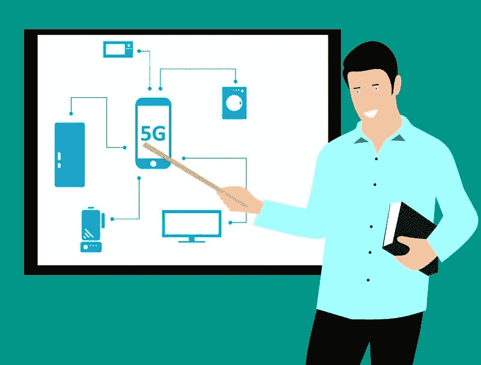
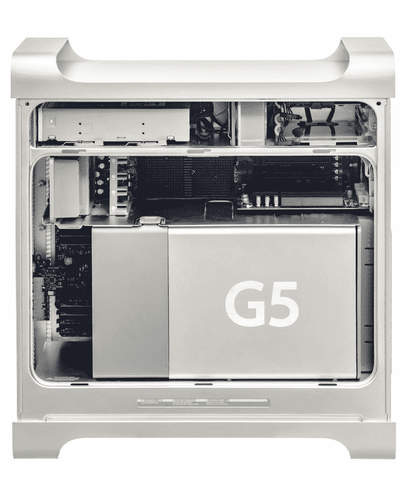
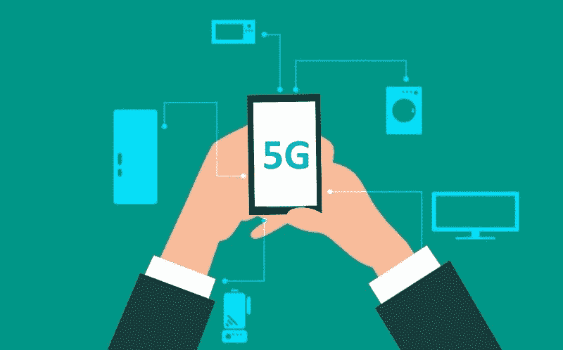
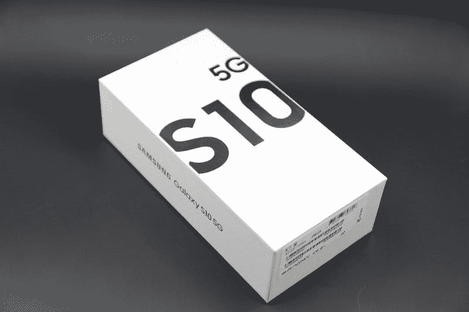
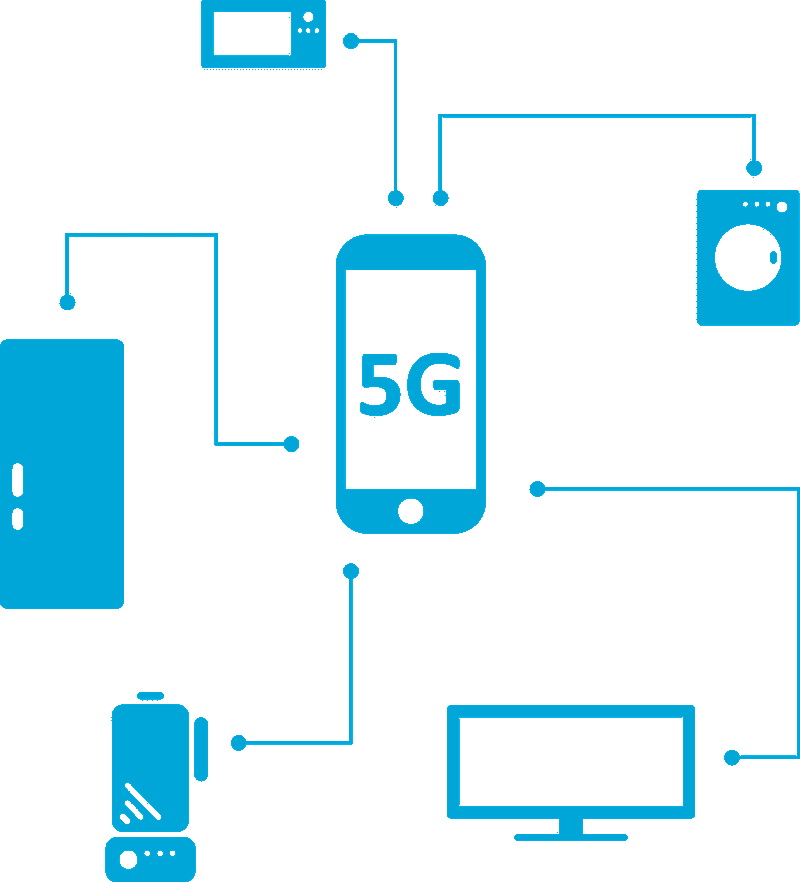
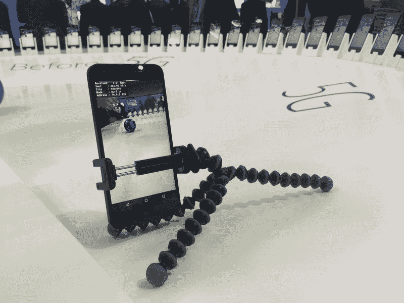
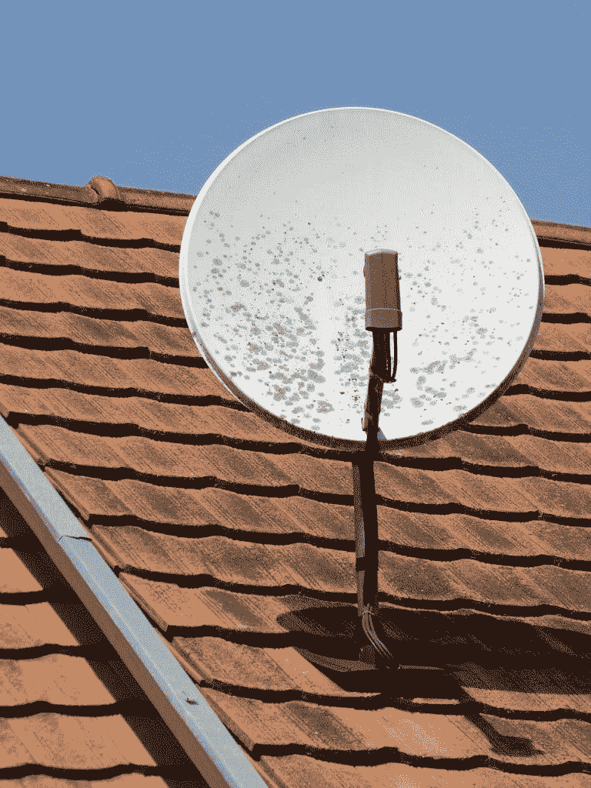

# 是的，电视死了，碟网赚钱了吗？—市场疯人院

> 原文：<https://medium.datadriveninvestor.com/yes-television-is-dead-and-is-dish-network-making-money-market-mad-house-9ea5593eef3d?source=collection_archive---------3----------------------->

有证据表明电视已死。美国最大的电视供应商之一；**碟网(NASDAQ: DISH)** ，正在走出电视业务。

具体来说，DISH Network 董事长查理·厄根[告诉](https://www.axios.com/dish-charlie-ergen-on-his-5g-plans-09b62045-a32f-4e46-8f13-0e0d5fa2f3d5.html) *Axios* 他希望尽快建立 5G 无线网络。澄清一下，5G 平台是第五代无线蜂窝网络。

 [## 投资算法快速指南|数据驱动投资者

### 让我们想象一下 30 年前的股票市场:让我们想象一下现在:像现在的许多其他领域一样，投资市场已经…

www.datadriveninvestor.com](https://www.datadriveninvestor.com/2019/01/31/a-quick-guide-to-investment-algorithms/) 

理论上，5G 可能比当前的无线网络更快，提供更多内容。例如，据《数据个人电脑》杂志估计，ATT 在达拉斯的 5G 提供 1.3 千兆字节每秒(GBS)。此外，威瑞森声称其 4G LTE 无线技术比 3G 快 10 倍。

5G 的明显原因是让客户更容易下载大型文件，如流媒体视频、游戏、大型多人在线游戏(MMOGs)、区块链 DApps(去中心化应用)、加密货币、智能合同、人工智能(AI)和数字机器人。我的猜测是，Ergen 认为大多数人很快就会想要这些设施。此外，Ergen 认为人们会为它们支付额外的费用。

# DISH 可能成为美国第四大无线服务提供商

因此，DISH 将以 15 亿美元收购 Boost Mobile，以 35 亿美元收购 T-Mobile 和 Sprint 的部分频谱资产。此外，The Verge 推测这笔交易可能会使 DISH 成为美国第四大无线供应商。

德国电信的 T-Mobile 和 Sprint(纽约证券交易所:S) 正在合并，以取代威瑞森**(纽约证券交易所:VZ)**；或者作为美国最大或第二大的无线供应商。Statista [估计](https://www.statista.com/statistics/283507/subscribers-to-top-wireless-carriers-in-the-us/)2018 年第三季度，威瑞森在美国拥有 1.5148 亿无线用户。与此同时，AT & T 在 2018 年第三季度拥有 1.4383 亿美国用户。

遵守美国反垄断法；并获得美国国务院的批准，德国电信必须出售部分 Sprint 和 T-Mobile 的无线资产。DISH 正在购买这些资产，这看起来像是为了生存而孤注一掷。

# DISH 为了生存正在抛弃电视

在采访中，厄根承认，为了生存，迪什需要尽快退出电视。查理[承认](https://www.axios.com/dish-charlie-ergen-on-his-5g-plans-09b62045-a32f-4e46-8f13-0e0d5fa2f3d5.html)“我们现在手头有钱收购 Boost，并开始建设我们未来几年的网络。”

翻译过来就是:“两年后，DISH 的平台将无法产生足够的现金来开展新业务，取代付费电视。”因此，如果 Ergen 想在五年内找到一份工作，他需要寻找新的业务。

Ergen 想退出收费电视，因为他知道电视已经死了。我认为查理认为传统电视将很快不再吸引足够多的用户成为一项有利可图的业务。

# 证明电视已死

可怕的是，有大量的数据证明了我的怀疑。证明电视正在消亡的统计数据包括:

因此，不到 1%的美国人口在 2019 年 7 月 24 日观看了收视率最高的有线电视节目。此外，如果 Deadline 的估计是正确的，不到 5%的美国人在 2019 年 7 月 25 日观看了广播电视。说详细点，32926.2 万的 10%就是 1643.1 万。

这种情况对 DISH 来说是灾难性的，因为它的业务是销售通过卫星分发的有线电视和广播电视。然而，我估计超过 90%的美国人不再看传统电视。

# DISH Network 的观众正在减少

可怕的是，来自英国的数据显示电视观众人数可能很快会下降到更低的水平。英国媒体监管机构 Ofcom 估计，16 至 24 岁的英国人每天只看两分钟的电视新闻，*卫报* [报道](https://www.theguardian.com/tv-and-radio/2019/jul/24/young-people-uk-abandon-tv-news-almost-entirely-ofcom)。相比之下，65 岁以上的人每天看 33 分钟的电视新闻。

这一数字表明，DISH 的用户群年龄较大，可能会逐渐消失。例如，Incendar.com[估计](https://incendar.com/baby_boomer_deathclock.php)每天有 4671 名婴儿潮一代(55 岁至 75 岁的美国人)死亡。因此，每年约有 170.5 万婴儿潮一代死亡。

我认为 Ergen 理解这些数字是因为他的言论和 DISH 的无线计划。然而，尔根也明白，DISH 仍有办法从视频中赚钱。

# 电视已死，但视频永存

美国仍然是一个电视迷的国度，但是它不再看传统的电视节目了。数据显示，相比传统电视，美国人更喜欢流媒体视频和游戏。

[**网飞**](https://marketmadhouse.com/netflix-lost-subscribers-is-it-losing-money/) **(纳斯达克股票代码:NFLX)** 现在是美国最大的“电视网”，2019 年第二季度拥有 60.01 名付费用户，Statista [估计](https://www.statista.com/statistics/250934/quarterly-number-of-netflix-streaming-subscribers-worldwide/)。与此同时，据 Statista [估计](https://www.statista.com/statistics/258014/number-of-hulus-paying-subscribers/)，截至 2019 年 5 月 1 日，Hulu 是美国第二大电视网络，拥有 2680 万美国用户。重要的是，从 2018 年第四季度到 2019 年第二季度，Hulu 的美国用户数量增长了 180 万，从 2500 万增加到 2680 万。

对传统电视更大的威胁可能是亚马逊 Prime 该公司在 2019 年 3 月拥有 1.03 亿美国用户， *Market Mad House* [估计](https://marketmadhouse.com/can-colgate-palmolive-survive-2/)。具体来说，Statista [估计](https://www.statista.com/statistics/546894/number-of-amazon-prime-paying-members/)美国 Prime 用户数量从 2018 年的 9500 万增长到 2019 年 3 月的 1.03 亿。

因此，**亚马逊(NASDAQ:AMZN)**Prime video 的潜在市场是 2019 年 7 月 25 日网络电视观众规模的 10 倍以上。此外，网飞的用户群几乎是所有五家电视广播电视网观众总数的六倍。

此外，流媒体视频的观众在增加，而网络和有线电视的观众在减少。

# 堡垒之夜比电视网或广播电视更受欢迎吗？

最后，视频游戏可能是我们最受欢迎的娱乐形式。

例如，一款大型在线多人游戏(MMOG) *堡垒之夜*在 2019 年 3 月拥有 2.5 亿全球注册用户，Statista [估计](https://www.statista.com/statistics/746230/fortnite-players/)。此外，注册玩家数量在四个月内从 2018 年 11 月的 2 亿增长了 5000 万。

此外，githp[估计](https://www.githyp.com/?type=twitch-viewer-counts)有 158，674 人观看了其他人玩*英雄联盟*，另有 140，289 人在 2019 年 7 月 27 日观看了堡垒之夜在 Twitch 上的比赛。对于那些超过 40 岁的人和没有孩子的人来说， [Twitch](https://en.wikipedia.org/wiki/Twitch.tv) 是亚马逊拥有的一项服务，让我们看你其他人玩视频游戏。

值得注意的是，我估计 2019 年 7 月 27 日 Twitch 上前五名游戏的收视率为 553，095。然而，当天 Twitch 上前 10 名游戏的收视率为 786，182。

因此，前 10 名 Twitch 游戏的收视率超过了 2019 年 7 月 25 日美国第五大广播网络 CW 的收视率。*截止日期* [预计](https://deadline.com/2019/07/robert-mueller-hearing-tv-ratings-viewers-fox-news-1202653870/)CW 在 2019 年 7 月 25 日吸引了 58 万观众。此外，Twitch 前五名游戏的收视率接近 CW。

# DISH Network 计划如何在电视死亡后生存

Ergen 计划通过进入 5G 业务来度过电视的死亡。解释一下，人们将需要一个强大的无线信号来访问 Twitch，玩*堡垒之夜*，在亚马逊购物，在 **Spotify 上听音乐，在 Hulu、 [Disney+](https://marketmadhouse.com/netflix-lost-subscribers-is-it-losing-money/) 、亚马逊和网飞上观看他们的节目。**

Ergen 认为 DISH 可以从 5G 中赚钱；但它很快就会在卫星视频上赔钱。此外，DISH 可以使用其卫星舰队将互联网和视频传输到 5G 无线发射机。特别是，DISH 可以向没有光纤电缆连接的小城镇和农村地区提供 5G 服务。

DISH Network 可以通过向城市以外所有想要 5G 的人收取订阅费来赚钱。例如，所有想玩*堡垒之夜*的人，都喜欢看网飞、Hulu 或 Disney plus 上的节目，观看 YouTube 视频或 Twitch 上的游戏。

有意思的是，[脸书](https://marketmadhouse.com/there-is-nothing-original-about-facebooks-project-libra/)，**摩根大通(NYSE: JPM)** ，**高盛(NYSE: GS)** 都在探索提供[加密货币](https://marketmadhouse.com/will-the-jpmorgan-chase-cryptocurrency-have-any-value/)的可能性；或 [stablecoin](https://www.coindesk.com/firm-that-monitors-coinbases-stablecoin-audited-over-10-billion-in-client-assets) 支付服务。这些服务需要快速可靠的互联网来运行，而 DISH 可以提供这种服务。

# 菜网赚钱吗？

目前，DISH network 正在从电视上赚钱。例如，DISH 报告 2019 年 3 月 31 日的季度毛利为 10.02 亿美元。

然而，该毛利低于 2018 年 12 月 31 日的 10.523 亿美元和 2018 年 3 月 31 日的 10.88 亿美元。此外，截至 2019 年 3 月 31 日，DISH 报告的营业收入为 4.563 亿美元，净收入为 3.3976 亿美元。

这些数字与 2018 年 12 月 31 日的季度净收入 3.3708 亿美元和净收入 4.8275 亿美元形成对比。相比之下，营业收入为 5.2951 亿美元；以及 2018 年 3 月 31 日 3100 万美元的净收入 3.6756 亿美元。

因此，DISH 从电视上赚的钱比去年少了。事实上，DISH 的季度收入从 2018 年 3 月 31 日的 34.58 亿美元下降到 2018 年 12 月 31 日的 33.07 亿美元，再到 2019 年 3 月 31 日的 31.87 亿美元。

# DISH 有多少现金？

重要的是，Ergen 关于 DISH 有足够的现金资助其无线冒险的声明似乎是准确的。

例如，截至 2019 年 3 月 31 日，DISH 报告的营业现金流为 7.3293 亿美元，融资现金流为 475 万美元，自由现金流为 6.1207 亿美元。此外，DISH 当天还有 23.93 亿美元的现金和短期投资。具体而言，DISH 拥有 15.77 亿美元的现金及等价物，以及 8.1638 亿美元的短期投资。

因此，我认为 DISH 有足够的现金来资助无线收购。然而，我不知道 DISH 是否有资金来建设 5G 网络。

# DISH 潜在的财大气粗的 5G 合作伙伴

另一方面，迪什可能会有一个富有的合作伙伴。现金充裕的合作伙伴，可以转而包括: **Alphabet(纳斯达克股票代码:GOOG)** ，**脸书(纳斯达克股票代码:FB)** ，**苹果(纳斯达克股票代码:AAPL)** 和**亚马逊(纳斯达克股票代码:AMZN)。**例如，亚马逊在 2019 年 3 月 31 日拥有 370.2 亿美元的现金和短期投资。

与此同时， **Alphabet(纳斯达克股票代码:GOOGL)** 在 2019 年 6 月 30 日拥有 1210 亿美元的现金和短期投资。最后，苹果在 2019 年 3 月 31 日拥有 800.9 亿美元的现金和短期投资。

因此，有几个潜在的合作伙伴为 DISH 的 5G 项目提供了大量资金。然而，我认为 Ergen 可以保守硅谷合伙人的秘密，以避免引起特朗普政府的注意。

有趣的是，唐纳德·j·特朗普总统(纽约州共和党人)可能会在 2020 年连任努力中对大型科技公司进行监管改革。在那种情况下，埃尔根可以将他的硅谷联盟秘密保留到大选之后。

# 碟网是价值投资吗？

鉴于这些可能性，我认为 **DISH Network (NASDAQ: DISH)** 可能是一项价值投资。

特别是，DISH 很便宜,“市场先生”在 2019 年 7 月 29 日将其股票定价为 38.28 美元。然而，自 2012 年以来，DISH 一直没有分红。

如果你正在寻找一只便宜但有风险的电信股，赚了一些钱，但有很大的增长潜力，DISH 是一个有趣的选择。如果 Ergen 的 5G 赌博成功，DISH 可能成为 21 世纪的价值投资。

数据显示，美国人想要他们的游戏、社交媒体和流媒体视频。如果 DISH 可以通过 5G 更快地提供这些便利设施，它就可以赚钱，并在电视死亡后生存下来。

*原载于 2019 年 7 月 29 日*[*https://marketmadhouse.com*](https://marketmadhouse.com/yes-television-is-dead-and-is-dish-network-making-money/)*。*