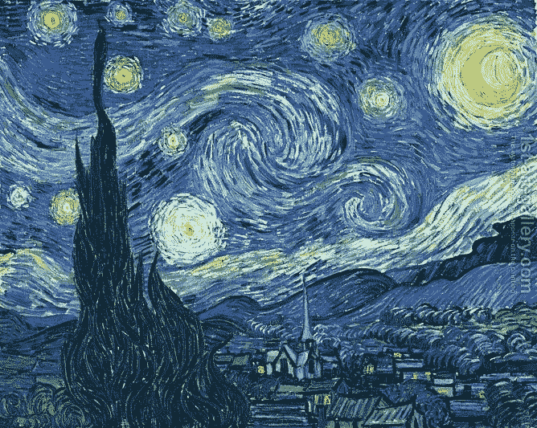
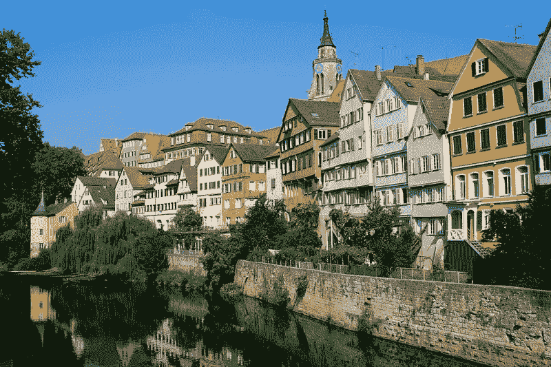
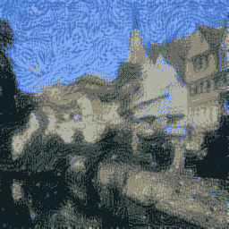
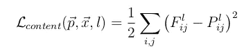
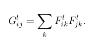
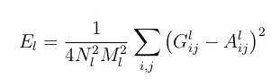
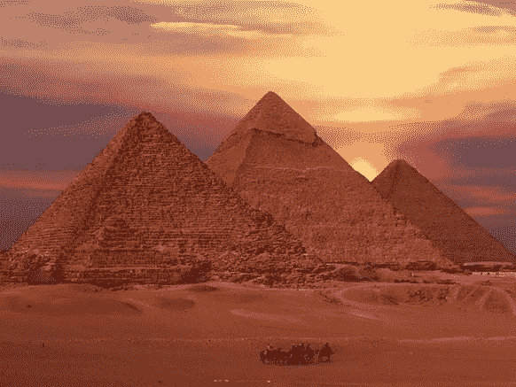
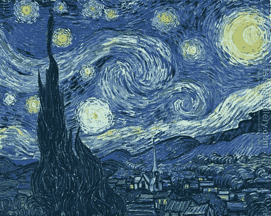
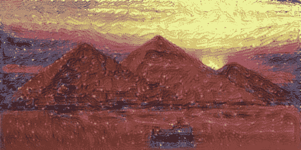

# 又一个神经风格转移项目，或者如果梵高画了金字塔呢

> 原文：<https://medium.datadriveninvestor.com/yet-another-neural-style-transfer-project-or-what-if-van-gogh-painted-the-pyramids-f0827f90c0fe?source=collection_archive---------12----------------------->

随着人工智能的进步，并在许多领域和任务中成为游戏规则的改变者，人们开始想知道它何时才能创作出艺术风格的作品，但直到 2015 年 8 月，Gatys 等人才取得突破，发表了他们的论文“艺术风格的神经算法”——[arXiv](https://arxiv.org/abs/1508.06576)

该论文利用了对深度卷积神经网络的不同层中存储了什么信息的理解

从上面的视频中可以看出，前几层充当简单的过滤器，检测简单的东西，如角落，边缘..虽然中间层可以探测物体，但是外层呢？…当我第一次使用 DCNN 时，我认为这些层只是将神经网络的注意力引导到输入图像中的特定区域，特别是在使用它对动物进行分类并看到当给定大象的图像时，外部过滤器之一挑出了大象的耳朵

然而，这并不是它的全部，因为事实证明外层也包含了我们所说的风格和纹理的信息，正如 Gatys 和公司所展示的那样，人们可以使用这些信息来融合内容(边缘、角落、物体..等)和另一幅图像的风格元素，并通过将德国图宾根的图像与梵高的《星夜》的风格融合在一起来展示它们的效果

starry night + Tubingen = my result

他们的想法是为内容和风格的损失定义错误术语

如果在层 l，构造的图像产生特征 F，而内容图像产生特征 P，那么内容的损失仅仅是平方差和的一半，正如作者所解释的，我们只需要对内容使用一个层。

然而，对于样式来说，这变得有点棘手，首先，我们计算生成的图像(G)和样式图像(A)的感兴趣层的特征的格拉米矩阵

Gramian matrix

层 l 的风格损失由下式给出

其中 N_l 是层的深度，M_l 是滤波图像的面积/大小

并且总损失是这些损失的加权和，然而该损失函数的结果并不平滑，因此建议添加另一个损失项“总变化”损失，其最小化相邻像素之间的差异，使得过渡更平滑

# 我的实现

我使用 keras 作为我的 DL 库实现了这篇论文，并在 Colab 上运行，同时密切关注 keras 团队的官方[示例](https://github.com/keras-team/keras/blob/master/examples/neural_style_transfer.py)，我的代码可以在我的 [github](https://github.com/NoureldinYosri/deep-dive/blob/master/style_transfer.ipynb) 上找到

# **结果**

pyramids + van gogh’s starry night

嗯，纹理当然被转移了，但它仍然不是那么引人注目，中间左侧的那批绿色来自风格图像，而不是来自内容图像+底部黑色骑手的完全模糊，使他们看起来像图像中的一个洞，但是可以尝试使用不同的权重来获得更好的混合

# 参考

1.  [艺术风格的神经算法](https://arxiv.org/abs/1508.06576)
2.  [用卷积神经网络进行艺术风格转移](https://medium.com/data-science-group-iitr/artistic-style-transfer-with-convolutional-neural-network-7ce2476039fd)
3.  [马尔科·杰基奇的教程](https://markojerkic.com/style-transfer-keras/)
4.  [神经风格转移:利用 tf.keras 深度学习和热切执行创造艺术](https://medium.com/tensorflow/neural-style-transfer-creating-art-with-deep-learning-using-tf-keras-and-eager-execution-7d541ac31398)
5.  [使用 Keras 制作具有风格转移的人工智能艺术](https://medium.com/mlreview/making-ai-art-with-style-transfer-using-keras-8bb5fa44b216)
6.  [kera 官方举例](https://github.com/keras-team/keras/blob/master/examples/neural_style_transfer.py)
7.  来自谷歌的所有图片——当然除了 2 个输出图片