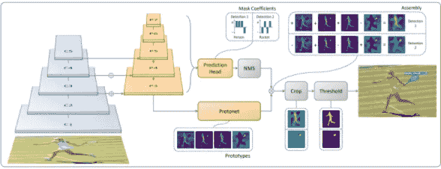
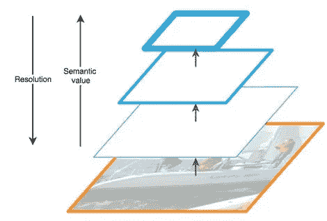
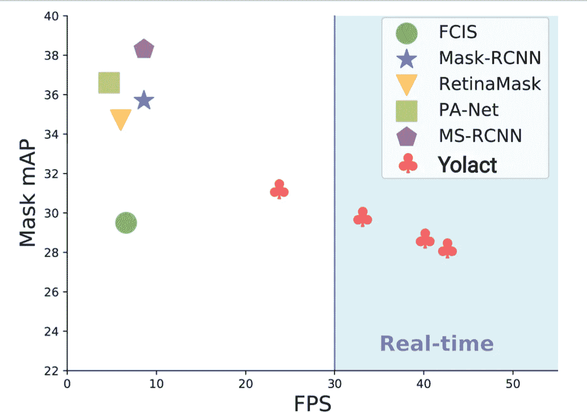

# YOLACT —实时实例分段

> 原文：<https://medium.datadriveninvestor.com/yolact-real-time-instance-segmentation-5cbe6fc2ba36?source=collection_archive---------1----------------------->

实例分割[【1】](https://www.theregister.co.uk/2018/11/28/aws_self_driving_car/)是人工智能领域最热门的研究领域之一。当前形式的过程在计算上相对昂贵，因此能够产生最佳结果的当前体系结构不太适合“实时”应用。实例分割效果较好的网络有 FCIS[【2】](https://arxiv.org/abs/1611.07709)，Mask-R CNN[【3】](https://arxiv.org/abs/1703.06870)，retina Mask[【4】](https://arxiv.org/abs/1901.03353)，PA-Net[【5】](https://arxiv.org/abs/1803.01534)等。

这些框架虽然执行得相对较好，但是从它们获得的推断不能“实时”使用，这是由于创建这种系统所涉及的计算复杂性，参数的绝对数量使得这些网络不可能在具有较低计算能力的机器上执行。因此，这项任务需要一种能够在“实时”计算中执行的不同架构。

 [## 人工智能与创造力:梦想成真|数据驱动的投资者

### 人工智能总是让我着迷。不仅作为一套有用的工具，不断发展，而且作为一个…

www.datadriveninvestor.com](https://www.datadriveninvestor.com/2019/01/28/ai-creativity-deep-dream-comes-true/) 

## **勇往直前**

yol act[【6】](https://arxiv.org/abs/1904.02689)(你只看系数)是一个更优化的实例分割版本，它因其速度和准确性的权衡而获得了良好的声誉。它能够在 MS COCO 上以每秒 33 帧的速度实现 29.8 的平均精度(mAP)，比其他竞争框架快得多。

## **那么什么是 YOLACT**

YOLACT 将 ResNet-101[【7】](https://medium.com/@14prakash/understanding-and-implementing-architectures-of-resnet-and-resnext-for-state-of-the-art-image-cf51669e1624)与 FPN(特征金字塔网络)[【8】](https://medium.com/@jonathan_hui/understanding-feature-pyramid-networks-for-object-detection-fpn-45b227b9106c)一起使用，这有助于创建高分辨率图像的特征地图金字塔，而不是传统的图像金字塔方法，因此减少了时间和对计算能力的要求。通过仅使用具有更高语义值的更高级别的提取特征层，计算成本被进一步削减(如下图所示，在给定的架构中，分辨率和语义值都成反比)。该架构具有自上而下的路径，该路径允许从这些语义丰富的层构建更高分辨率的层，以便在上采样和下采样之后保持对对象位置的检测能力。在重建的层和相应的特征图之间存在横向连接。

Source: [9]

上采样层然后与原型神经网络[【10】](https://arxiv.org/pdf/1703.05175.pdf)和预测头交互，该预测头具有用于各个检测的屏蔽系数，从预测头获得的所有帧然后经过非最大抑制，其中我们仅接收具有最高检测系数的检测。然后对组合输出进行裁剪，然后通过对最终输出进行阈值处理来生成不同实例的颜色。

## **与现有架构相比如何:**

## **速度**

与现有架构相比，YOLACT 有许多优势，其中最重要的一个优势是预测速度。如前所述，YOLACT 是现有的唯一一个能够真正实现“实时”推理的架构。
下图比较了 YOLACT 不同架构的多种变体的性能:

从上面的对比图中可以清楚地看出，YOLACT 的推理速度比所有其他同类产品都要快。准确性和速度是一个权衡，YOLACT 的一些变体也能够在准确性方面击败 FCIS。

## **更高质量的面具**

YOLACT 生成的遮罩比现有架构的质量更高，因为遮罩实际上使用了整个图像空间域，因此不会因重新轮询而造成任何损失。

## 摘要

总之，YOLACT 体系结构在准确性方面比现有的体系结构稍有不足，但它在推理速度方面弥补了不足。

有许多现实世界的应用程序需要这种行为，例如:移动设备上的对象检测(使用图像过滤器的应用程序等)、自动驾驶汽车、地理传感、精准农业(因为它能够生成更好的遮罩)、人脸分割、电子商务等。这些领域为 YOLACT 的实时实现提供了相当大的空间，它在生成更好的掩码和速度方面优于现有的架构。YOLACT 是一个相对年轻的架构，在这个早期阶段的结果是有希望的，随着时间的推移，越来越多的人能够在其上工作，性能将会有显著的改善。

## 参考资料:

[1].[https://www . the register . co . uk/2018/11/28/AWS _ self _ driving _ car/](https://www.theregister.co.uk/2018/11/28/aws_self_driving_car/)

[2].https://arxiv.org/abs/1611.07709

[3].【https://arxiv.org/abs/1703.06870 

[4].[https://arxiv.org/abs/1901.03353](https://arxiv.org/abs/1901.03353)

[5].[https://arxiv.org/abs/1803.01534](https://arxiv.org/abs/1803.01534)

[6].[https://arxiv.org/abs/1904.02689](https://arxiv.org/abs/1904.02689)

[7].[https://medium . com/@ 14 Prakash/understanding-and-implementing-architectures-of-resnet-and-resnext-for-state-of-art-image-cf 51669 e 1624](https://medium.com/@14prakash/understanding-and-implementing-architectures-of-resnet-and-resnext-for-state-of-the-art-image-cf51669e1624)

[8].[https://medium . com/@ Jonathan _ hui/understanding-feature-pyramid-networks-for-object-detection-fpn-45b 227 b 9106 c](https://medium.com/@jonathan_hui/understanding-feature-pyramid-networks-for-object-detection-fpn-45b227b9106c)

[9].[https://cdn-images-1 . medium . com/max/800/1 * _ kxgfskprj 6 bsxejh 9 ch 6g . JPEG](https://cdn-images-1.medium.com/max/800/1*_kxgFskpRJ6bsxEjh9CH6g.jpeg)

[10].[https://arxiv.org/pdf/1703.05175.pdf](https://arxiv.org/pdf/1703.05175.pdf)

[11].[https://img-blog.csdnimg.cn/20190410164829996.png](https://img-blog.csdnimg.cn/20190410164829996.png)