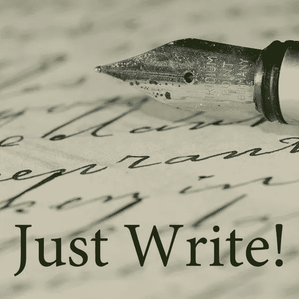
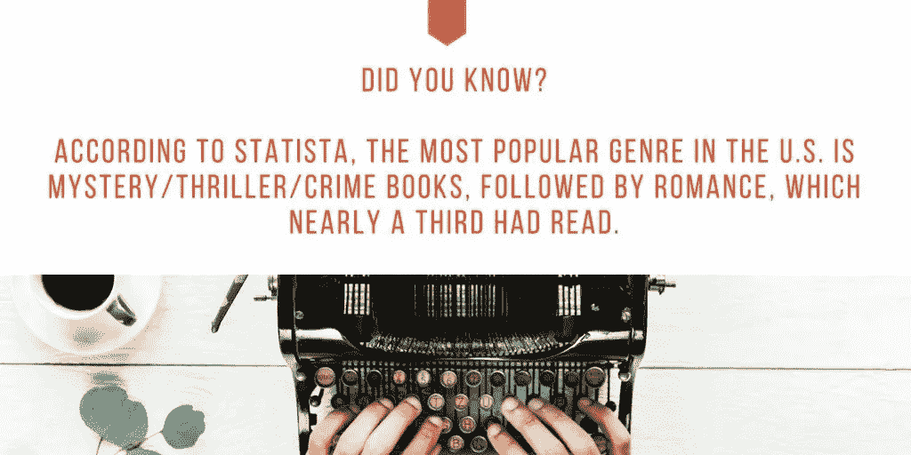
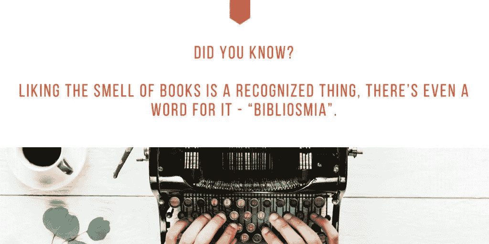
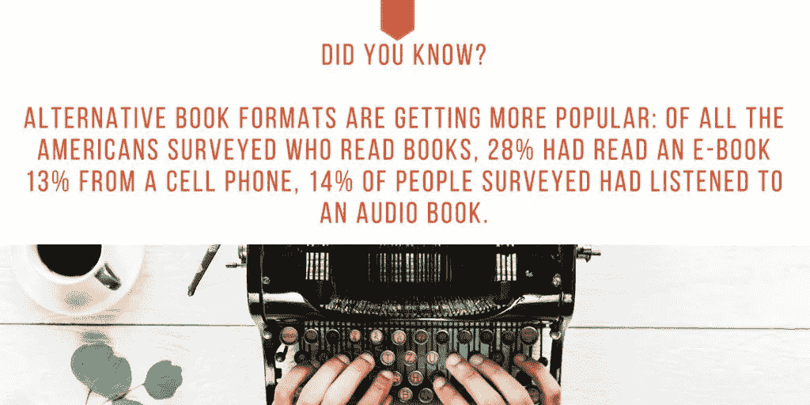

# “你内心绝对有一本书”

> 原文：<https://medium.datadriveninvestor.com/you-absolutely-have-a-book-inside-you-bac99427b303?source=collection_archive---------3----------------------->

## 释放你的压抑，说出你想写的故事

我们都有[一本书在等着我们拿出来](https://medium.com/@JKatzaman/so-you-want-to-write-a-book-590580c7eab5)。虽然经常有人说，但这正是[凯瑟琳·朗](https://twitter.com/Kathrynclang)热切相信的。

“你有故事要讲，你的故事很重要，”她说。

这位自称作者、演讲者和“希望史密斯”的人与伊万娜·泰勒和伊瓦·伊尼亚托维奇谈论如何写一本书。

泰勒拥有 DIYMarketers 公司，这是一家“致力于帮助小企业主摆脱困境”的公司 Ignjatovic 是一名营销、战略、领导力和商业顾问。

每个人都有喜欢读的书。

“在非小说类方面，我正在读“ [*如何赢得朋友和影响他人*](https://www.amazon.com/How-Win-Friends-Influence-People/dp/0671027034) ”郎说我几乎什么都读——只要我的孩子无意中拿起它开始读时不会感到尴尬。"

泰勒喜欢“教我做某事并提供实际操作技巧”的书

为了工作，Ignjatovic 阅读商业和工业相关的书籍。离开办公室后，她让自己的思绪游走。

 [## 成功人生的 25 种自我提升方式|数据驱动的投资者

### “我活得越久，学到的就越多。学的越多，体会的越多，知道的越少。”―米切尔·莱格兰德时间到…

www.datadriveninvestor.com](https://www.datadriveninvestor.com/2019/03/12/25-self-improvement-ways-for-a-successful-life/) 

“我喜欢历史、传记、哲学和科幻小说，”她说。

读别人的书激发了郎把自己的话发表出来。

“你内心绝对有一本书，”她说。“你有故事要讲，你的故事有价值。

“我妈妈在 2012 年去世后，我找到了她收藏的故事和诗歌，因为他们告诉她需要找一份真正的工作，”郎说。"那时我下定决心，决不看着另一个人的梦想在盒子里死去."

她说原创想法会给作家最大的火花。

“不要试图改变一切，”郎说。“从一件事开始。什么话题最能激发你的动力？这就是你想要开始的地方。”

有抱负的作者需要工具，最明显的工具并不复杂。

“写书最重要的是你要有写作的意愿，”郎说。“之后，你需要选择一种书写工具。我对初稿持保守态度——铅笔和纸——铅笔必须要锋利。

“总会有人告诉你，你不够好——即使只是你自己，”她说。"无论如何都要做，即使只是说是你做的。"

 [## 所以，你想写一本书

### 与出版相比，写作可能是容易的部分

medium.com](https://medium.com/datadriveninvestor/so-you-want-to-write-a-book-590580c7eab5) 

不要害怕认为自己没有创意。

郎说:“太阳底下没有什么新的东西，除了你的声音。“没有人会像你这样讲述这个故事。

“写作是一门艺术，”她说。“你在用文字描绘场景。剪辑是一门手艺。您正在将框架添加到作品中。所以是的，你肯定希望其他工匠帮助你创造出最好的结果。”

# 冒名顶替问题

泰勒同意冒名顶替综合症是作家的敌人。

“我们每个人——没有写过书的人——都用‘不够好’来说服自己不要去写，”她说。

“像 [Evernote](https://twitter.com/evernote/) 这样的笔记和研究抓取工具很棒，”泰勒说。"如果你是一个比作家更好的演讲者，使用语音转文本应用程序真的可以让写作变得更快."

Ignjatovic 还提醒大家使用语法和风格指南以及校对工具。

一个很好的理由是写书是为了讲述别人不知道的个人故事，这可能会让读者感到有趣。

郎给出了写这本书的两个主要原因:

*   你有故事要讲。
*   有一个你想看却还没找到的故事。

泰勒说:“写书的一个很好的理由是，如果你想说些真正能帮助人们的话。”

 [## 爱情的样子写在文字里

### 最好的故事与你的使命和目标紧密相连

medium.com](https://medium.com/datadriveninvestor/the-look-of-love-is-in-the-writing-dc7880b7fbc7) 

那些没写过书的人遇到了常见的路障。

“我与人合写了一本书，但从来没有一本书是完整的，”泰勒说。“阻止我的是说服自己不要这么做。我不认为我对有用的书有好的想法。

“当我不得不整理我所有的内容时，我完全停了下来，”她说。“这太令人难以承受了。我需要几天完全安静的时间。”

还缺乏内部和外部支持。

郎说:“那些经常阻止我们追寻我们内心种子的东西——我们的大梦想目标或我们的创意灵感——是来自自己或他人的话语。”

*   “我会当的。”
*   “我不能直到。”
*   “我明天开始。”

“把你的灵感写在索引卡上，”郎说。“当你有足够多的文件时，把它们翻译成手稿。重要的不是你能多快完成，而是你能完成。一点一滴累积起来会产生巨大的结果。

“我有一个朋友，她在家教育五个小学生的时候，每天只用 10 分钟就写完了她的小说，”她说。“你有时间，但如何投资才是关键。”

Lang 有一个简单的组织解决方案。

“我对我的内容进行了文字搜索，然后将那些文章放入文件夹，”她说。“现在，当我想写一个主题时，我会准备好相关内容的文件夹。

“计划重新利用你创造的词汇，”郎说。“当你有更多的方法把这些话付诸实践时，就更容易把它们写下来。”

你让借口变得有多强大，它就有多强大。

郎说:“关键是要找到适合你的方法，然后去做。”。“总会有理由不去*和*总会有办法。

“把你的话付诸行动，”她说。“你投资创造了它们。现在找到更多他们可以为你工作的方法。”

 [## 疯狂设定目标背后是有方法的

### 专注于一个目标，为自己或公司制定一个计划

blog.markgrowth.com](https://blog.markgrowth.com/theres-method-behind-goal-setting-madness-9a8ba0a96ee1) 

在开始一本书之前，你必须回答你的为什么。有理由、目的和目标会帮助你集中注意力。

泰勒按照以下步骤写作:

*   [设定目标](https://medium.com/@JKatzaman/goal-setting-as-simple-as-it-sounds-d6d7ac7e4911)
*   脑猝病
*   研究
*   概述
*   安排写作时间
*   结束
*   编辑
*   编辑
*   编辑
*   促进

Ignjatovic 说:“决定类型，类型的具体主题，并想出一个标题。”“外面有那么多书。很难脱颖而出。”

郎对两步走的过程很满意:

*   开始写吧。
*   一直写到结尾——在那一点之后才能编辑。

Ignjatovic 说:“最困难的部分是不要在写作和编辑之间迷失方向，坚持下去，保持主要思想的存在。”

 [## 她的话不言自明

### 公司生活为单飞创造了条件

medium.com](https://medium.com/datadriveninvestor/her-words-speak-for-themselves-ed38f934e582) 

泰勒发现了三个难点:开始、结束和提升。

“对大多数人来说，写书最难的部分是开始，”郎说。“然后最难的部分变成了收尾。然后最难的部分就变成了打磨。

“*就写*，”她说。"这是我最喜欢的建议——给予和接受."

雇佣代笔人也是一种可能。

"真正的问题是你想写你的书吗？"郎说。“你有一个故事，但如果玩弄文字不是你最喜欢的事情或你的强项，你可能会考虑与代笔人合作，让你的故事被讲述。

“你雇用代笔人来写内容的原因也是因为你有一些需要说的话，而你没有时间——也没有兴趣写出来——自己写，”她说。"把代笔想象成一种写作工具."

泰勒更喜欢亲自动手。

“我有客户使用代笔人，但我更喜欢自己写作并聘请编辑，”她说。“比较正宗。”

Ignjatovic 区分了不同类型的创作。

“写作有两个不同的层次，”她说。“对于一篇文章，我想可以雇一个代笔人，自己编辑。但是如果我要雇别人来帮我写一本书，那写这本书又有什么意义呢？”

# 发布选项

自助出版越来越流行。它有利有弊。

“自助出版——或独立出版——的最大优势是控制，”郎说。“传统出版的最大优势是认可度。关于‘认可’的伟大之处在于，你可以通过投资于他人并专注于不懈地帮助他们来建立这种认可。”

“独立出版就像是一个图书承包商，”她说。“你将负责寻找和雇佣完成项目所需的所有分包商。传统出版仍然被视为“真正”出版的行业标准，尽管现在有接受独立书籍的趋势。”

 [## 用一种特别的方式写博客，开启你的成功之路

### 把你的主张标在一个利基市场上，并每天写下来

medium.com](https://medium.com/datadriveninvestor/blog-your-way-to-success-in-a-special-way-aa07e5364cac) 

Ignjatovic 喜欢自助出版。更重要的是对内容和设计的完全创造性控制。

“这本书是你自己的投资，”她说。

泰勒认为自助出版是一条出路。

“这是对自己的投资，”她说。“它更便宜，借助亚马逊搜索和当今的营销，你可以有效地推广它。

“传统出版仍然迫使你推销自己的书，”泰勒说。“很难被录取。”

虽然写一本书是一个梦想，但朗、泰勒和 Ignjatovic 都不会错过这本书。

郎说:“没有那些觉得有必要使用淫秽语言的书，我也能活下去。”"有更好更有力的方法来表达你的观点。"

泰勒更喜欢和平。

“没有‘战争故事’书籍、书籍销售和记录他们旅程的首席执行官，我完全可以活下去，”她说。“我经常从那些东西里得不到任何东西。那是他们的经历，不是我的。”

虽然 Ignjatovic 认为“每本书在某种程度上都是有价值的”，但她可以放弃那些关于浪漫或爱情的书。

对于那些想要帮助他们写书的人，郎有一个免费的[立即写网上研讨会](https://www.kathrynlang.com/get-your-book-written)。

**关于作者**

吉姆·卡扎曼是[拉戈金融服务公司](http://largofinancialservices.com)的经理，曾在空军和联邦政府的公共事务部门工作。你可以在[推特](https://twitter.com/JKatzaman)、[脸书](https://www.facebook.com/jim.katzaman)和 [LinkedIn](https://www.linkedin.com/in/jim-katzaman-33641b21/) 上和他联系。