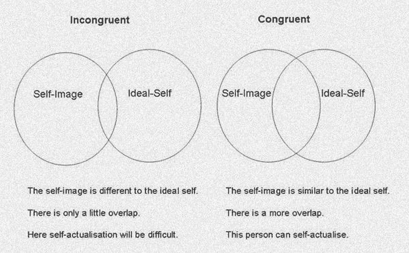
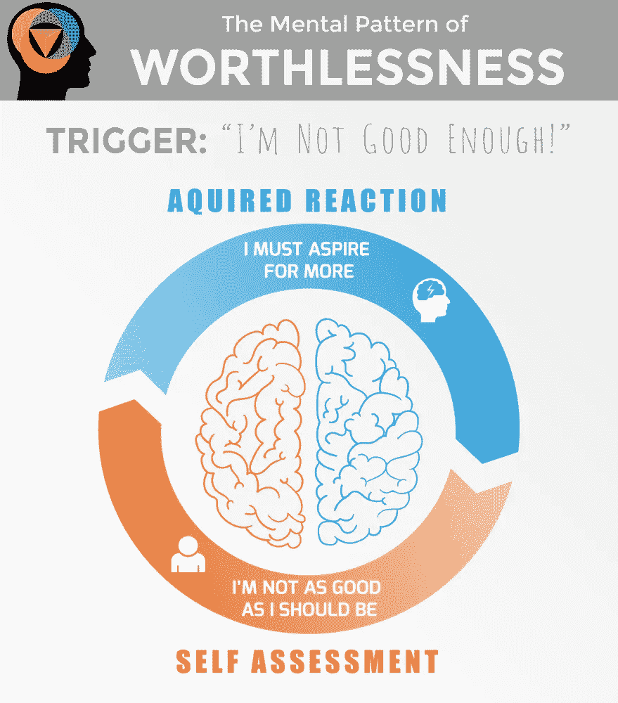

# 你的野心正在摧毁你的自我价值感

> 原文：<https://medium.datadriveninvestor.com/you-ambition-is-destroying-your-sense-of-self-worth-931a23cfffee?source=collection_archive---------0----------------------->

Fake it To Make it — Photo by [rawpixel](https://unsplash.com/photos/qy1da0Y12Q4?utm_source=unsplash&utm_medium=referral&utm_content=creditCopyText) on [Unsplash](https://unsplash.com/?utm_source=unsplash&utm_medium=referral&utm_content=creditCopyText)

在现代资本主义社会，人们普遍认为，为了增加自我价值感，我们必须取得越来越多的成就。含蓄地指导我们首先选择我们希望成为什么样的人，然后，不懈地努力成为这个人。

当然，这听起来很合理，也很符合逻辑，但是，这种方法最终创造了一个充满不安全感的人的社会，他们倾向于感到极度不满足。导致[羞耻](https://emotionalintelligenceproject.com/how-to-trust-yourself/shame)、[内疚](https://emotionalintelligenceproject.com/language-of-emotion/guilt-based-morality)，无价值成为流行病。

我给你分享一个不一样的方法。一种更容易、更快捷、在各方面都更优越的方法，但由于某种原因，尽管人本主义心理学家卡尔·罗杰斯多年前就已经对它进行了全面的记录，但只有少数人完全理解并实践它。

这篇文章将更深入地探究我们自我认知的内部运作，揭示坚持不懈地寻求自我改善的心理副作用，并试图发现一种激励我们自己而不会在这个过程中变得心理不稳定的方法。在这篇文章结束时，你会知道不足的全部含义，以及它背后的真正原因。

# 背景——自我价值的组成部分

为了理解自我感知背后的机制，我首先要澄清一些基本术语(由卡尔·罗杰斯和亚伯拉罕·马斯洛创造)。

**理想自我:**你希望自己成为的那个人——一个心理概念，它是由一个人相信其他人期望在他们身上看到的品质构成的。
**自我形象:**你认为自己实际上是什么样的人——基于以往生活经验的自我的心理表征。
**不一致:自我形象和理想自我之间缺乏相容性——这种差距是自我判断和低自我价值感的原因。
自我价值:一个人对自己的看法——一个人不辜负期望的能力。**

****

****自我实现**:根据马斯洛需求层次理论，这是人类自然需求的最高层次，是最大限度地发挥自我能力和实现最高潜力的需求。根据罗杰斯的说法，自我实现只有在一种和谐的状态下才能实现——在这种状态下，理想自我和自我形象重叠。**

# **经历低自我价值感**

**在现代西方社会，我们不断被鼓励追求更高的目标，想要更多，尽可能多地激励自己。我们被教导要战胜任何不足和无价值的感觉，我们必须提升自己，实现无数的目标，变得富有和成功。**

**因此，当感觉不充分时，人们会自动通过更努力地推动来让自己感觉更好。增加他们的野心，创造更多的目标和自我期望。因此，进一步美化了他们的理想自我概念。这无意中增加了不协调性，造成了高度的压力，进一步降低了他们的自我价值感，使他们感到比以前更不充分。最终，导致人们在自我期望的重压下崩溃，认为自己毫无价值。**

****

**这种方法可能会激励人们更加努力地工作，但它无法减少不充分的感觉，相反，它会让人们一头扎进低自我价值的漩涡。当理解了大脑是如何工作的，我们就会明白为什么我们不够好的感觉如此普遍。**我们用来激励自己努力改进的机制也被用来评判我们。我们越努力，就越觉得自己不值得，越觉得自己不值得，就越努力。****

**一旦陷入这种恶性循环，彻底的一文不值只是时间问题。**

****

**The Anxiety Loop of Worthlessness**

# **正确管理自我价值**

**为了把我们从这种无休止的不足循环中拯救出来，罗杰斯给我们提供了一种不同的方法来处理低自我价值感。这种方法可能看起来令人惊讶，甚至一开始就颇有争议，但是，却非常有效。**

**根据罗杰斯的观点，**要有效地增加一个人的自我价值感，一个人必须首先接受真实的自己。不要增加自我期望和美化理想自我，而是通过降低自我期望来减少不一致。将理想自我的心理概念与个人的自我形象相重叠，从而平衡他们对自我价值的认知。****

**的确，这种方法也会降低一个人的野心，但会让他们更有效地表现。提高生产力，消除任何不充分或无价值的感觉。**

**此外，只有在这种和谐的状态下，一个人才能成为一个功能齐全的人。一个在情感和心理上有能力转变、成长和自我实现的人。因此，一个真正有价值的人。**

> **奇怪的矛盾是，当我接受我自己时，我就可以改变**
> 
> ***~卡尔·罗杰斯***

****

# **成功的心智模式**

**罗杰斯向我们展示了低自我价值感、不足和无价值感可能根本不是低动机的产物，而是过度动机的意外结果。因此，朝着膨胀的目标努力根本不是成功之路。从心理方面来说，我们对自己的期望越高，我们就变得越没有效率。**

**罗杰斯发现，容易实现目标的人是那些接受自己本来面目的人。那些没有设定极端目标，只是渴望稍微好一点的人。然后，一旦缩小了差距，他们就把标准再提高一点，努力变得比以前稍微好一点。当他们慢慢向一个更大的目标前进时，保持情绪平衡，压力水平可控。**

> **美好的生活是一个过程，而不是一种状态。它是一个方向，而不是目的地**
> 
> **~卡尔·罗杰斯**

**根据这一理论，它同时考虑了智力和情绪状态，自我实现的力量并不来自征服更多的目标和改善自我，而是来自正确管理我们对理想自我的心理概念。**巧妙地操纵我们的自我期望来管理我们的情绪状态，并最大限度地提高效率。因此，保持一个稳定的心态，保持相对较低的动力和最小的压力。****

**因此，为了获得成为一个更有价值的人和自我实现的能力，首先一个人必须达到真实，接受他们自己——接受他们所有的缺点和“负面”情绪。只有当一个人的自我表现与他们的行为一致时，他们才能充分发挥作用，并有能力实现他们的真正潜力。**

> **在一个开放体验的人身上，每一个刺激都通过神经系统自由传递，没有被任何防御过程扭曲**
> 
> **~卡尔·罗杰斯**

**【bayonEI.com】原载于**

*** [## 抱负和自我价值之间的负相关

### 在我们的现代资本主义社会，普遍的看法是，为了增加我们的自我价值感，我们必须获得更多的…

bayonei.com](https://bayonei.com/how-to-trust-yourself/taking-control-over-self-worth)***