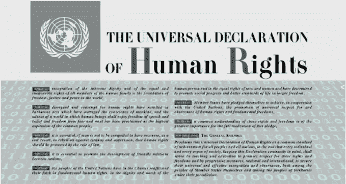
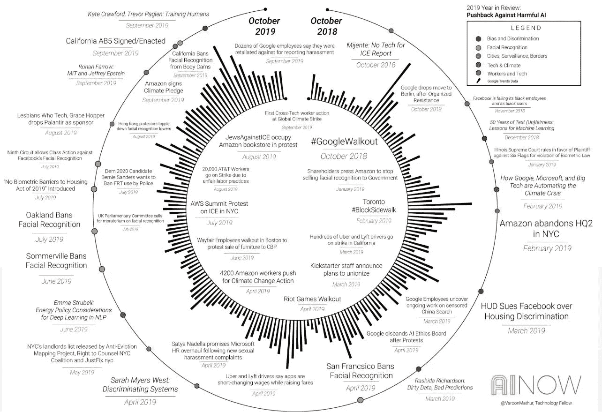

# 你和人工智能——在人工智能和人权的交叉点上

> 原文：<https://medium.datadriveninvestor.com/you-and-ai-on-the-intersection-of-artificial-intelligence-and-human-rights-719ec128da53?source=collection_archive---------3----------------------->

## AI 正在影响人权。但是 AI 本身是人权吗？

生命、自由、安全和进入人工智能的途径。《世界人权宣言》听起来肯定不是这样。但根据一组人工智能行业专家的说法，应该是这样的。

今年早些时候，云计算软件先驱 Salesforce 的首席执行官马克·贝尼奥夫(Marc Benioff)表示，人工智能是一种“新人权”。[理论神经科学家 Vivienne Ming](https://www.socos.me/vivienne) 和人工智能专家介绍了同样的想法，即我们需要开始将人工智能视为一项人权。乍一看，对于一个在人权保护领域工作并来自发展中国家的人来说，这似乎有些夸张。

# 巨大的技术鸿沟还是更有道德和包容性的社会？

**如果你每天生活费 2 美元** (7 亿人每天生活费低于 1.90 美元，这是[世界银行的国际贫困线](https://www.worldbank.org/en/topic/poverty/brief/global-poverty-line-faq) ) **无法接触到 AI 这样的尖端技术意味着什么？**对于一个每天靠几乎没有米饭和牛奶生活的人来说，用最少的食物喂养整个家庭，如果他们的声音正在形成日常问题的新算法解决方案，那又有什么关系呢？事实上，这很重要！最贫穷的人口往往最有可能受到新技术发展的影响。至少有两个重要的原因，为什么在人工智能的创建和实施中包含不同的声音是重要的，以及为什么人工智能不仅应该通过伦理，而且应该通过人权的镜头来处理。

首先，如果情况不是这样，我们可以期待另一个**巨大的技术鸿沟**带来深远的后果。第二，人工智能解决方案将**更不道德，更不包容**。

 [## 今年值得关注的 5 大人工智能趋势|数据驱动的投资者

### 预计 2019 年人工智能将取得广泛的重大进展。从谷歌搜索到处理复杂的工作，如…

www.datadriveninvestor.com](https://www.datadriveninvestor.com/2019/02/19/artificial-intelligence-trends-to-watch-this-year/) 

有机会接触 AI 的人会更健康、更聪明、更富有，而没有机会接触的人会更弱、更穷、越来越弱势。我在这里不仅仅指发展中国家和发达国家之间的鸿沟。即使在美国，也有成千上万的人生活在贫困线以下(看看所有个人的[调查报告的美国家庭收入，](https://www.economist.com/democracy-in-america/2019/06/20/how-many-americans-live-on-2-a-day)大约 2.6%的人每天生活费不到 2 美元)。这在我居住的城市旧金山尤其明显，那里的贫富差距一年比一年大。白人居民与有色人种居民之间的收入中位数差距在[不断扩大，这也是同样的道理。](https://www.sfchronicle.com/bayarea/heatherknight/article/SF-economy-thriving-but-gap-growing-between-13743525.php)

明相信并在她的工作中证明了人工智能可以帮助改善教育和健康，但她也认为它增加了不平等。能够接触到人工智能的人是最不需要这些解决方案的人。

> ”[世界上 99.999%的人口对这些东西的用途没有发言权。我们需要将人工智能视为人权，就像我们看待司法审查和获得疫苗一样”。](https://www.theguardian.com/technology/2018/dec/07/technologist-vivienne-ming-ai-inequality-silicon-valley)

技术领域仍然主要由年轻、白人和男性工人主导，他们虽然拥有良好的编程技能，但往往无法理解他们试图解决的问题的深层原因和特征。明认为，女性和边缘群体需要发起一场革命，以实现多样性、包容性和人工智能这一人权。与此相关的另一个**危险是，如果不包括不同的声音，人工智能解决方案将缺乏道德和包容性，导致不利的利益和歧视。**

# 当人工智能出错时

关于人工智能的(不)道德使用和相关影响的激烈辩论已经在世界许多科技中心展开。AI 出问题的例子已经很多了。仅在今年，几个引人注目的案例被曝光，显示了算法偏见在许多情况下可能造成的损害，影响了我们的人权。 [AI Now](https://ainowinstitute.org/symposia/2019-symposium.html) 刚刚公布了他们在过去 12 个月里对抗 AI 有害后果的详细地图。让我们来看看其中的几个。

今年早些时候，来自东北大学、南加州大学和研究公民权利和技术交叉的非营利组织[upper up](https://www.upturn.org/about/)的几位学者所做的一项新的[研究](https://arxiv.org/abs/1904.02095)称，脸书的广告投放算法基于种族和性别进行歧视，并使就业、贷款和住房歧视永久化，即使广告商正试图触及广泛的受众。一则木材行业的招聘广告展示给了 90%的男性观众，超市收银员的广告吸引了 85%的女性观众，而出租车司机的广告则吸引了 75%的黑人观众。例如，根据联邦民权法，将女性排除在招聘广告之外是非法的。住房、就业和贷款广告不能针对或排斥某些种族、性别、年龄或宗教。

在美国各地，人工智能算法正在决定是拘留还是释放被告，提供监狱判决建议(国际政策制定界考虑使用相同的工具)。来自 ProPublica 的一份[报告显示，有证据表明，人工智能系统对黑人被告有偏见，因为它不断建议对同样的罪行判处比白人更长的刑期。最近发表的](https://www.propublica.org/article/machine-bias-risk-assessments-in-criminal-sentencing)[报告《人工智能伙伴关系》](https://www.partnershiponai.org/report-on-machine-learning-in-risk-assessment-tools-in-the-u-s-criminal-justice-system/)记录了美国刑事司法系统中算法风险评估工具的严重缺陷，并强调了引入标准的必要性。他们提出了在部署该工具之前必须满足的十项最低要求，而美国没有一个司法管辖区能够满足所有这十项要求。

# AI 本身应该被认为是一种人权吗？

这些例子清楚地表明，人工智能是一种对人权、保护和侵犯具有巨大影响的力量。但这是否意味着人工智能本身就应该被视为一种人权？2012 年，当联合国宣布将上网视为一项人权时，人们提出了同样的问题。前面提到的《世界人权宣言》得到了“升级”。对第 19 条进行了补充，内容如下:

> *“人人都有主张和表达自由的权利；这项权利包括持有主张而不受干涉的自由，以及通过任何媒介和不论国界寻求、接受和传递信息和思想的自由。”*

第 32 节增加了 ***"在互联网上促进、保护和享受人权"*** 。这引发了一场持续的争论，对这种方式最强烈的批评来自“互联网之父”T4 温顿·瑟夫本人。，谁声称互联网本身不能成为权利。“技术是权利的推动者，而不是权利本身”，他说。另一方面，大赦国际是支持承认互联网不仅是一项公民权利，也是一项人权的最强有力的声音。

我们看到了人工智能如何影响我们的就业和平等的例子。同样，它影响我们的教育和健康，所有我们有权享受的东西。鉴于人工智能对社会和个人的广泛影响，人权肯定会受到这一领域发展的影响。在某些情况下，人工智能正变得与权利本身密不可分。为了能够更进一步回答人工智能本身是否是一项人权，我们需要定义人权，并就人权的确切构成达成一致？

## 如何定义人权？

根据联合国的规定，**人权是所有人固有的权利，不分性别、民族、种族、语言、宗教或任何其他身份。人权包括生命权和自由权、免受奴役和酷刑的自由、意见和言论自由、工作权和教育权等等。被认为是人权的东西有很高的标准。我们还需要定义人工智能，这是一件困难得多的事情。**

## *如何定义 AI？*

*人工智能没有公认的定义。人工智能更多地被视为一个领域，一个总括术语，包括各种计算技术和相关过程，致力于提高机器处理需要智能的事情的能力。它可以分为许多子领域，如机器学习，机器人，神经网络，自然语言处理。哪一项是固有人权？尽管人工智能的不同子领域已经在塑造我们的生活方面发挥了重要作用，但它们仍然是达到目的的手段，是保护或损害遗传人权的工具。*

*即使它被宣布为一项人权，按照互联网的例子，它仍然是一项“软”法律的一部分，只建议采取行动，缺乏任何执行机制。然而，即使不可执行，它仍然会带来重量，并照亮从人权角度看待人工智能的重要性。*