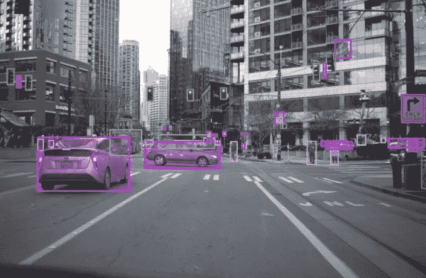
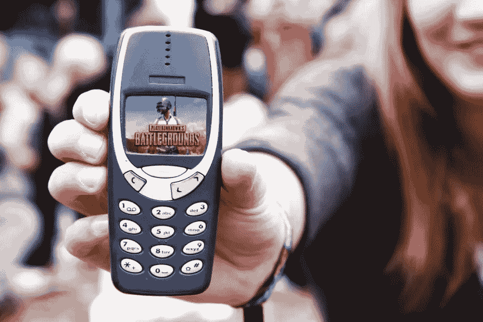
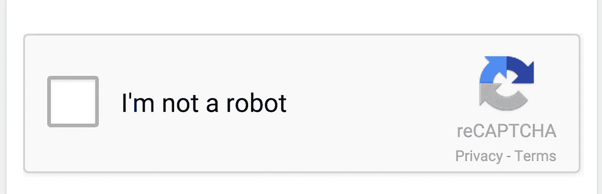
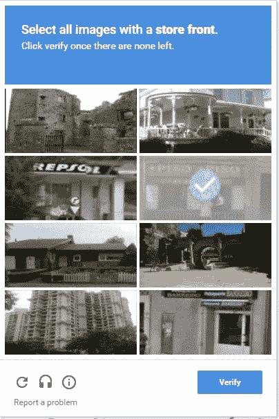

# 你是谷歌的高级数据标签专家。阅读为什么？

> 原文：<https://medium.datadriveninvestor.com/you-are-a-senior-data-labelling-expert-at-google-read-why-134175d03d1a?source=collection_archive---------11----------------------->

Real-time data labelling

> 谷歌是一家在互联网处于青春期时诞生的公司，几乎没有人知道它是否会生存下去。但是今天，当我写这篇文章的时候，互联网已经不仅仅是生活，谷歌是世界上最大的公司之一。

在这 20 年里，我们走过了一段漫长的旅程，从为诺基亚经典游戏中蛇二的高分而自豪，到在 PUBG 游戏中得到一顿鸡肉大餐。

PUBG vs Nokia Snake Classic. Source- GImages

但随着互联网进入成熟期，我们突然意识到，不用去图书馆，我们可以在谷歌上几秒钟内找到答案。2010 年中期，谷歌实现了一项壮举，他们数字化了地球上的每一本书，实际上是每一本书。他们是怎么做到的？他们没有你有。

Re-captcha

还记得验证码吗？继续按钮前烦人的看门人。这个故事就是关于它的。CAPTCHA 代表完全自动化的公共图灵测试，用于区分计算机和人类。

2000 年代中期，验证码由[路易斯·冯·安](https://www.linkedin.com/in/ACoAAAD-jwIBi-D_lg-d1r-A_vwNNxv5powA4Q4/)介绍给世界。它的建立是为了确保内容只被人类访问。

2009 年，[谷歌](https://www.linkedin.com/company/1441/)收购了验证码，并将其重新设计为 reCAPTCHA，在此帮助下，他们已经通过人类的答案将所有的实体书数字化为数字形式。无论文本的哪一部分不清楚，谷歌问我们，这是什么，我们写了，他们找到了答案，有数万亿人使用验证码，谷歌只需要几个月就可以得到所有想要的答案。

Image Re-captcha

现在，他们已经转向使用数据集进行人工智能研究和标记图像的图像重新获取，这就是我们如何帮助谷歌逐一解决他们的问题。

现在，他们问 9 张图片中哪一张是房子/汽车/商店。我们一如既往地为他们提供答案。

所以，谷歌用我们的答案来回答我们的问题。现在你知道谷歌如何为你的问题提供所有的解决方案了吧？

> 所以你通过帮助他们，非正式地拥有了谷歌数据标签员的职位。