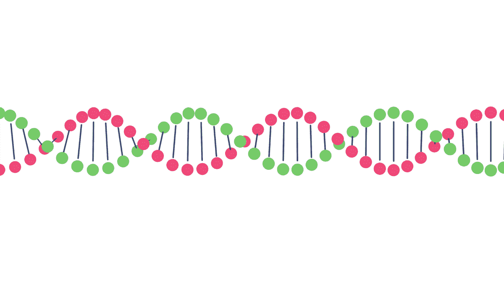

# 你不是父亲

> 原文：<https://medium.datadriveninvestor.com/you-are-not-the-father-e1701c9fd56a?source=collection_archive---------15----------------------->

每隔一段时间，你就会发现故事中的精彩之处，它会带你经历情感的过山车。这是我们的同事朱利安的作品之一。

尽情享受吧！

***兵败***

****编辑 DDI****

## ***消费者 DNA 测试如何揭露我生父的真相***

**

***由** [**朱利安·委拉斯开兹**](https://medium.com/@jvwritesthings)*

***不是我亲生父亲***

*我一直有所怀疑，因为我看起来一点也不像抚养我长大的那个人。从来没有人告诉我，我有他的鼻子，微笑，或任何其他身体特征。尽管如此，他仍然是我唯一认识的父亲。*

*他的名字印在我的出生证明上，在我一岁时，我妈妈做出了令人心痛的决定，离开了我，让她的生活步入正轨，之后他抚养了我。她 17 岁了，还没准备好做父母。我和我的孪生兄弟并不反对她的决定。*

*我记得在我上小学的那几年，有一天我惹上麻烦后，对我爸爸很生气。当他离开我的卧室走下楼梯时，我尖叫道:“你不是我真正的爸爸！”我不是第一个(当然也不是最后一个)在生气的时候喊出这句话的孩子，但回想起来，我会完全避免这样做。这对他伤害很深…我注意到了。*

*快进到 2004 年。我当时 16 岁，我和哥哥从 2001 年起就和妈妈失去了联系。我们在一系列搬家和电话号码变更之间失去了联系。这是在每个人(和他们的母亲)都有手机和社交媒体账户之前。那时，我们住在俄勒冈州南部，而她在近 2000 英里外的俄克拉荷马州。*

*我们曾无数次尝试拨打 411(查号台)，希望能找到线索，但都无济于事。一个注定的夜晚，我突然有了再试一次的冲动。我独自一人呆在房间里，整理了一份由几个数字组成的清单。我一个接一个地拨号码，然后开始我的演讲:*

> *你好，我叫朱利安·委拉斯开兹。我 16 岁了，我在找我妈妈。*

*有些电话响了，但没有人接，有些转到了语音信箱，还有一些是陌生人接的，但他们帮不上忙。只剩下两个数字，我失去了希望。有东西告诉我继续走，我就拨了倒数第二个号码，等着。几声铃响后，一个女人接了电话。是她。*

*我永远不会忘记她透露我生父一些细节的那个晚上。那时我们已经联系了几个星期了。我独自在家，躺在客厅的地板上。她告诉我她有一些可能有点令人震惊的消息要分享。我深吸一口气，告诉她我准备好了。​*

*[阅读全文](https://medium.com/datadriveninvestor/you-are-not-the-father-5d0abc32785) …*