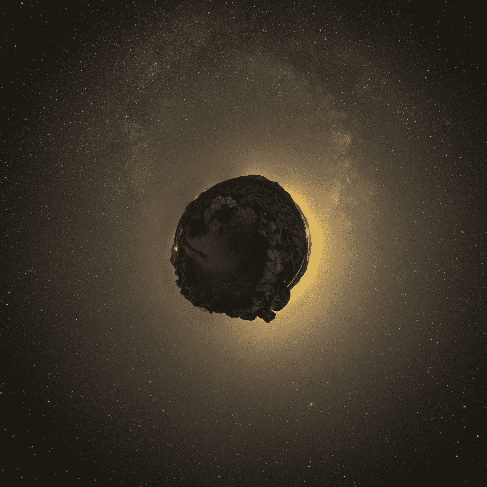
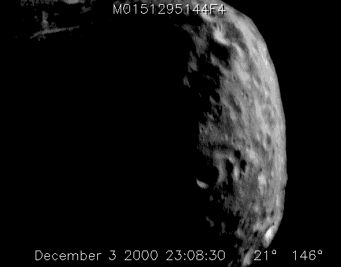
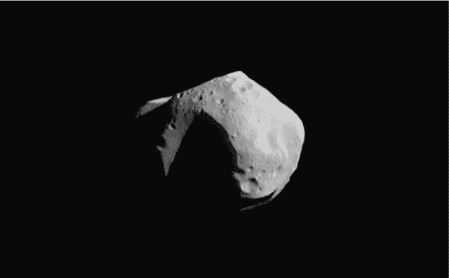

# 你可以拥有一颗小行星——某种程度上

> 原文：<https://medium.datadriveninvestor.com/you-can-own-an-asteroid-sort-of-fc04e0d76901?source=collection_archive---------1----------------------->

## 财产权显然延伸到地球之外

Photo by [Bryan Goff](https://unsplash.com/@bryangoffphoto?utm_source=medium&utm_medium=referral) on [Unsplash](https://unsplash.com?utm_source=medium&utm_medium=referral)

> 总统通过适当的联邦机构采取行动，应
> (1)促进美国公民对空间资源的商业探索和商业回收；
> (2)消除政府对在美国发展经济上可行、安全和稳定的
> 产业的障碍，以符合美国国际义务的方式对太空资源进行商业勘探和商业回收
> ；以及
> (3)根据美国的
> 国际义务，并在联邦
> 政府的
> 授权和持续监督下，促进美国公民在不受有害干扰的情况下参与
> 太空
> 资源的商业探索和商业回收的权利。
> 
> —摘自[美国商业航天发射竞争法案](https://www.congress.gov/bill/114th-congress/house-bill/2262/text)

2015 年，美国国会通过了一项模糊的法律，并由总统签署成为法律。尽管新闻中没有广泛报道，但它可能是我们星球历史上最具革命性的法律之一。

 [## 为什么包容性财富指数比 GDP 更能衡量社会进步？|数据驱动…

### 你不需要成为一个经济奇才或金融大师就能知道 GDP 的定义。即使你从未拿过 ECON 奖…

www.datadriveninvestor.com](https://www.datadriveninvestor.com/2019/03/08/why-inclusive-wealth-index-is-a-better-measure-of-societal-progress-than-gdp/) 

据英国《独立报》的一篇[文章](https://www.independent.co.uk/news/science/asteroid-mining-made-legal-after-barack-obama-gives-us-citizens-the-right-to-own-parts-of-celestial-a6750046.html)称，这项法律将允许私人公司开采小行星。从技术上讲，法律并没有规定私人公司可以拥有小行星，但可以占有他们从中提取的任何东西。

这篇文章解释说，在那之前，太空一直被视为公有资源。此前，太空资源的所有权由 1967 年的“外层空间条约”管理，该条约由美国和俄罗斯签署，目前还有 104 个其他国家签署。

该条约将月球和其他外层空间物体称为“人类的共同遗产”。它还禁止来自月球和其他太空物体的武器，同时声明太空探索必须是和平的。

# 为什么会有人想要小行星的所有权？

Video Of Asteroid ‘Eros’ — NASA / Johns Hopkins University Applied Physics Laboratory [[Public domain](https://commons.wikimedia.org/wiki/File:Eros_rotation_Dec._3-4_2000.gif)]

当你想到小行星时，脑海中浮现的是什么形象？你最有可能想到的就是上面这张 GIF。你会想到死气沉沉的漂浮太空岩石。就我个人而言，我认为布鲁斯·威利斯炸毁了一块摇摇欲坠向地球的巨大岩石。

一般来说，你唯一想到小行星的时候，就是你想到它们可能释放的破坏力的时候。地球上可以发现巨大的陨石坑，显示了它们的毁灭性力量。在现代，西伯利亚通古斯卡地区发生了 1908 年的小行星撞击事件。

根据英国广播公司的一篇文章，这次袭击摧毁了大约 2000 平方公里的森林。它在一个足以媲美好莱坞史诗的巨大火球中摧毁了 8000 万棵树。

然而，这些浮体不仅仅是威胁我们星球的死石。它们是浮动的银行，可以携带各种珍贵的矿物，这些矿物可能会带来惊人的财富。

《独立报》上的一篇[文章](https://www.independent.co.uk/news/science/asteroid-worth-35-trillion-set-to-pass-earth-on-sunday-and-you-can-watch-it-live-10398708.html)提到了小行星 2011 UW-158，它于 2015 年在距离地球 150 万英里的地方经过。这块石头有什么特别的？

> 它的核心被认为是由白金制成的，价值约 4.3 万亿美元。

是的，那种一美元的数字有办法引起你的注意。另一件可能引起你注意的事情是，这颗小行星并不独特。许多小行星内部带有贵金属。事实上，与最近发现的另一颗小行星相比，UW-158 实际上是一颗小行星。

据[国际商业时报](https://www.ibtimes.co.in/100bn-every-human-space-missions-explore-gold-iron-rich-asteroids-760332)报道，小行星杰夫·贝索斯漂浮在火星和木星之间。这颗被命名为 Psyche 16 的小行星估计价值 700 万亿美元。什么是万亿分之一？那是一个后面有 18 个零的数字。据商业内幕报道，据信世界上的货币总量接近 80 万亿美元。

因此，如果你能从波西卡 16 中获得哪怕一小部分的黄金、镍和铁，你就能使世界经济在价值上相形见绌。这就是为什么有人想要拥有一颗小行星，甚至是小行星的碎片。

这颗特殊的小行星引发了如此多的兴趣，美国国家航空航天局计划在 2022 年进行一项探索漂浮美元的任务。

# 无主物的所有权？

Liberland Flag & Border — Picture From The [Liberland Press](https://liberlandpress.com/2019/05/serbia-croatia-and-terra-nullius/)

对许多人来说，拥有一颗小行星或者你能从它身上切下什么的想法可能听起来很奇怪。在我们这个时代，绝大多数的东西都是由一个国家、个人或公司所拥有的。当你想取得某物的所有权时，补偿被交换，所有权被转移。无论是物质财产还是知识产权都是一样的。

但是，如果有些东西没有被拥有呢？那是怎么处理的？这不像你可以跑上去在什么东西上插一面旗子然后宣称它是你的。

事实上，这并不完全正确。2015 年，也就是开采小行星变得合法的那一年，确实有人在一块土地上插了一面旗帜，声称这块土地是他的。他们不仅宣称拥有这片土地，还在那里建立了一个新的国家。

2015 年 4 月 13 日，vít Jed lika 和 Jana Markovicova [宣布](https://liberland.org/en/about)位于塞尔维亚和克罗地亚之间的一块 7 平方公里的土地为自由共和国。

> 这怎么可能呢？

这一小块土地没有塞尔维亚和克罗地亚的所有权。听起来很奇怪，两国都声称对方拥有它。因此，这部分土地被认为是无主地或“无人之地”。所以从技术上来说，它可以被称为。

Liberland 已经存在 4 年了。它有一部宪法、总统、2 名副总统和 5 名部长。他们最近还在布鲁塞尔开设了常驻代表[办事处](https://liberlandpress.com/2019/04/liberland-opens-an-office-in-brussels/)。显然，在适当的情况下，你可以在某样东西上扔一面旗子，宣布它的所有权。

# 不仅是美国

我敢肯定，当你读这篇文章的时候，“人类的共同遗产”这几个字会闪现在你的脑海里。将商业企业送入太空探索天体的想法似乎有点令人不快。然而，这并没有阻止其他人追求这一冒险。

> “每年三次航天飞机任务可以为全世界所有人带来足够的燃料”——欧阳紫阳，中国科学院

中国已经公开宣布他们计划开采月球。CNN 最近的一篇[文章](https://www.cnn.com/2019/01/04/asia/china-space-moon-science-intl/index.html)解释了中国的探月计划不仅仅是为了声望。中国对散布在月球表层的氦 3 感兴趣。人们认为这种稀有元素可以提供更安全的核能。用于电子设备和手机的稀土金属也存在于月球上。

中国目前有一辆漫游车在月球表面徘徊。他们设法在月球的黑暗面着陆，这对人类来说是第一次。他们大费周章是有原因的，不仅仅是为了升旗。

除了中国人之外，日本人也设法从一颗小行星上收集了样本并带回地球。他们的卫星 Hayabusa2 向一颗目标小行星发射了一颗钛子弹，并抓取了从表面漂浮的碎片。但是中国和日本并不是唯一对太空采矿感兴趣的国家。

> “问题不是这一切是否会发生，而是何时发生。在那里，我看到了卢森堡的巨大机遇。”
> 
> — [卢森堡经济部长艾蒂安·施耐德](https://www.outerplaces.com/science/item/16532-space-mining-luxembourg)

就连卢森堡也开始行动了。这个欧洲小国已经把自己建成了对开采小行星感兴趣的公司的欧洲基地。卢森堡最近的[采矿法](https://www.engadget.com/2017/07/30/luxembourg-asteroid-mining-law-august-1/)与美国的法律非常相似。然而，该矿业公司并不一定要设在卢森堡才能受到法律保护。该组织只需要在一个小国家有一个办事处。

因此，看来美国不会是唯一一个淘金的国家。小行星甚至月球都不再是无主之地了。国际上正在建立的现有法律不允许你在这些机构上插一面旗帜，就像创建自由国度的活动一样。然而，似乎这些法律将允许你种植采矿设备和保持资源。

# 结论

Photo Of Asteroid Mathilde — Taken By Space Probe NEAR Shoemaker / NASA [[Public domain](https://commons.wikimedia.org/wiki/File:(253)_mathilde.jpg)]

这种在太空中采矿的想法对许多人来说似乎是科幻小说，但它是真实的。正如你所看到的，许多国家对此非常重视。这项技术可能还不存在，还不能让太空采矿变得经济，但这似乎只是一个暂时的减速带。

已经成立了两家公司，深空工业公司和行星资源公司，主要目的是从空间获取资源。尽管两家公司都出现了财务问题，并被收购，但它们仍然存在，法律结构正在建立，以保护它们的努力。

除了收获业务，DSI 还进一步扩大了业务。该公司开发了一种推进器，利用无毒水蒸气推动火箭。可以从天体中收获的一种东西恰好是水。所以，这是对他们最初目标的补充。

你会很快看到拿着鹤嘴锄和平底锅的宇航员吗？很可能不是。更有可能的是，现有的公司将致力于太空旅行的技术，同时使未来的采矿作业成为可能。然而，私人太空旅行业务正在蓬勃发展。

SpaceX、蓝色起源和维珍银河是实时私营公司，拥有使太空飞行成为现实的技术。看了之后，就不难想象未来的私人太空采矿公司了。随着太空飞行变得越来越便宜，资源变得越来越有限，在太空中寻找元素只会变得更合乎逻辑。

除了财富，开采小行星还能让人类更好地了解这个天体。或许也可以获得如何移动这些物体的知识。如果这项技术能够得到发展，通古斯卡可能发生的袭击可能在未来被阻止。此外，探测和登陆小行星的技能似乎会提高我们探索行星的能力。

诸如此类的想法可能仅限于纸上草图或实验室模型，但它们成为现实只是时间问题。我敢肯定，如果你向一个人解释人类将在 1929 年到达月球，他们会告诉你那是不可能的。仅仅 40 年后，尼尔·阿姆斯特朗将在月球上行走。人类从双翼飞机到太空飞行只用了 40 年

## 40 年后我们的世界会是什么样子？我们可能会和 1929 年的那个人一样震惊。

感谢你阅读我的漫谈。如果你喜欢你读过的东西，请分享。