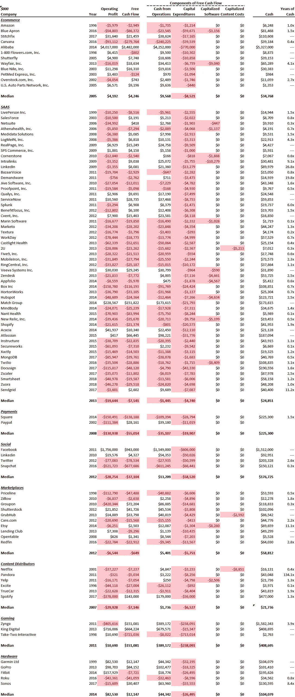

# 你不需要盈利就可以退出

> 原文：<https://medium.datadriveninvestor.com/you-dont-need-to-be-profitable-to-exit-10734244a6ad?source=collection_archive---------14----------------------->

我不愿写这个标题，因为我们坚持现金效率和实现现金收支平衡。然而，我们在 IPO 时观察了 94 家科技公司，发现其中 72 家没有盈利(77%)，60 家没有产生正现金流(64%)。数据和附加观察如下。

电子商务、硬件和游戏确实产生了利润。在 IPO 时，电子商务产生的营业利润中位数为 410 万美元，游戏产生的营业利润中位数为 1060 万美元，硬件产生的营业利润中位数为 8250 万美元。这些行业必须产生利润才能上市，这是有道理的，因为它们的客户可能不会像软件公司的客户那样反复出现。因此，每笔销售都必须盈利，而在 SaaS，你可以无限期地留住客户，在 2 到 3 年内为客户创造利润是可以的。

**SaaS 和内容分销商尤其无利可图。52 家 SaaS 公司中只有 9 家在首次公开募股时盈利(尽管其中 18 家确实产生了正的自由现金流)。这些公司在首次公开募股时平均每年烧钱 1900 万美元。图中显示的 6 家内容分销商在 IPO 时都没有盈利，只有 Spotify 产生了自由现金流。**

**市场&社交媒体喜忧参半。**半数退出的社交媒体公司盈利，而 10 个市场中有 4 个盈利。

不盈利的公司有 14 个月的过渡期。根据中位数，那些没有产生利润的公司在整个数据集中有 1.3 年的手头现金。他们申请 IPO 时有充足的时间来完成交易。

总之，虽然你不需要盈利才能退出/上市，但你需要给自己时间来完成交易，所以要确保你有足够的现金(至少 12 个月)。在我们看来，同样的规则也适用于你的融资:确保你在进行融资时有不少于 6 个月的准备期，希望能更长。

*在 blossomstreetventures.com 拜访我们*