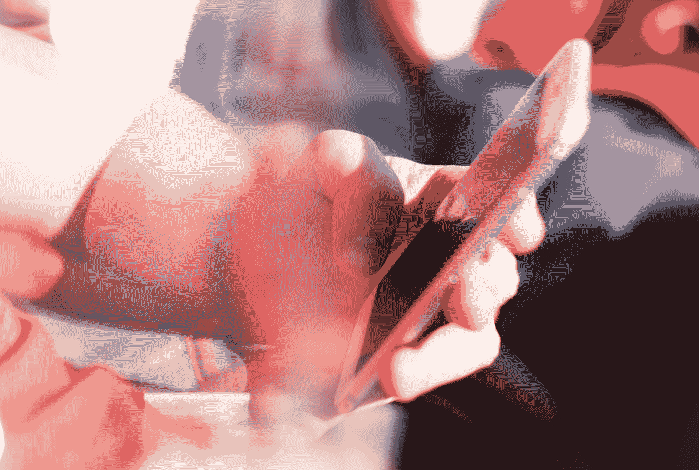

# 你没有意识到你的这个小习惯正在毁掉你的生活

> 原文：<https://medium.datadriveninvestor.com/you-dont-realize-that-this-small-habits-of-yours-is-ruining-your-life-b4996343d2b?source=collection_archive---------3----------------------->

## 有时候，与破坏你生活的“最好的朋友”绝交是你唯一需要的。

Photo by [ROBIN WORRALL](https://unsplash.com/@robin_rednine?utm_source=medium&utm_medium=referral) on [Unsplash](https://unsplash.com?utm_source=medium&utm_medium=referral)

作为人类，我们在生活中有两个基本的选择。喜欢*阴*和*阳*，喜欢水火，喜欢恶与善，喜欢正与负，喜欢爱或恨等等。但是有时候，我们没有做任何决定。然而，我们站在两种选择的中间。这是因为我们周围的环境，外部刺激。我们被要求我们做出选择的选择所包围。就像我们可以在早上醒来后选择爱自己一样。但一小时后，甚至一分钟后，我们可能会恨自己。这里到底发生了什么？

今天我们醒来，告诉自己我们很棒，我们告诉自己今天我们会迎头痛击，今天将会是我们一生中最美好的一天，耶！动员讲话结束后，我们变得非常兴奋。然后我们用我们称之为“最好的朋友”的小设备——电话来吃早餐。我们可能会打开新闻门户或者社交媒体。我们滚动和阅读那里的一切和 *shazaam！*我们被标题上一条恼人的政治新闻吸引住了，或者有人刚刚在 Instagram 上发布了一张照片，我们开始了令人惊叹的会议；哦，她有一辆新的好车！哇，他刚刚升职了！嘿，看，他们刚刚结婚！诸如此类。或者甚至只是一张早晨的自拍或精美的早餐照片，都比坐在我们旁边的配偶或孩子更能吸引我们的注意力。

Photo by [iamSherise](https://unsplash.com/@iamsherise?utm_source=medium&utm_medium=referral) on [Unsplash](https://unsplash.com?utm_source=medium&utm_medium=referral)

最终，我们的精神会因为一个标题、一张照片或一段视频而开始衰退。我们不再是以前的自己了。再也没有“今天棒极了”或“我是最棒的”之类的了。我们的大脑开始以消极的态度处理我们刚刚得到的信息。就像我们开始将自己的生活与那些看起来更幸福、更富有的人进行比较。或者我们充满焦虑，我们担心生活，政治，工作，未来等等。因为 Twitter 上的负面新闻或热门话题。哦，为什么这种生活如此令人讨厌？然后我们带着一半的精神和希望离开我们的房子，另一半是更多的焦虑，更少的自尊，恐惧等等。我们在地狱和天堂的地面上移动我们的脚——我们不确切地知道我们踩在什么东西上。一个小时后，当我们回到家，我们开始意识到今天不是我们希望的那一天，我们感到内疚。我们对自己感觉很糟糕。我们痛恨自己如此糟糕，因为我们无法掌控自己的生活。我们感到心烦意乱，不知所措，负担沉重，一团糟。我们恨自己，恨我们的生活。那我们能做些什么来解决这个问题呢？

 [## 跑步摆脱疯狂:锻炼如何提高你的生产力——数据驱动型投资者

### 没有比锻炼更好的方式来开始一天的工作了。我试着一周至少做四天，在…

www.datadriveninvestor.com](https://www.datadriveninvestor.com/2018/10/23/running-to-get-rid-of-the-crazy-how-working-out-increases-your-productivity/) 

> 我今天在这里警告你:我要你提防敌人。保护自己远离任何权利精神。克制任何微妙的诱惑，以获得关注或寻找提升自己的方法。
> 
> 查尔斯·r·斯温多尔

# 改变你早上的习惯

这是你可以尝试解决的实际问题，可能会一次又一次地困扰你。

## 把目标和承诺写在纸上

你必须了解你的目标，并做出承诺，通过做所有必要的事情让你投入其中来实现它。比如培养新的习惯或者最大化你已经拥有的好习惯。写在纸上，每天读。晚上睡觉前和早上醒来后，在黎明时读一读。你可以在中午的时候再读一遍，或者在你情绪低落或者面临挫折的任何时候。

## 创建一个习惯跟踪器

一旦你知道了最大化自我提升的最佳习惯，每天都要坚持下去。制作一个电子表格或在纸上创建，然后打勾，督促自己坚持做习惯。不要忘记在周末评估你的表现，并不时取得更好的成绩。

## 如果你没有戒掉这个习惯，设定你必须做的惩罚

所以你开始认为“不做”一次没什么，然后你做两次，如此类推，直到你打破那些你想在生活中养成的习惯。睁开你的眼睛，分析那些阻碍你实现最佳自我的事情。比如社交媒体的分散注意力。

## 试着在潜在的干扰杀死你之前先杀死它

你很清楚，哪怕只是一次点击，一个滚动，一个帖子，一个标题——任何事情都会分散你的注意力，甚至只是一眨眼的功夫，就能打乱你的生活。设置一个复杂的密码，或者卸载你很难控制的应用程序——解除好友关系。消灭那些让你落入陷阱的诱惑，这些诱惑会占用你的一秒钟和宝贵的一整天。

## 你必须对自己真实

我是说，你是你思想的守门人。唯一能决定向你跑来的任何事情的人，那个能给他们进入你思想的入场券并掌控方向盘的人，不管你是有选择地做还是随机地做，都是你自己。

创建你的图片，选择你的颜色，了解你自己；你想成为什么样的人。定义自己是谁，说清楚。一旦你很好地了解它，你就会知道如何分析你能做的一切来变得更好。知道你需要的任何东西来设定你的生活规则，定义什么是错的，什么是好的。避免什么和接近什么。除了你，没有人会做这件事。“他们”知道的是引起你的注意，所以是你决定你要把你的注意力给谁。把一切都搞清楚，开始比以前过得更好。

> 我们都有弱点，这些弱点会阻碍我们实现目标。认识到你最有可能屈服于诱惑的时候，让一时的软弱更难破坏你最大的努力。
> 
> 艾米·莫林