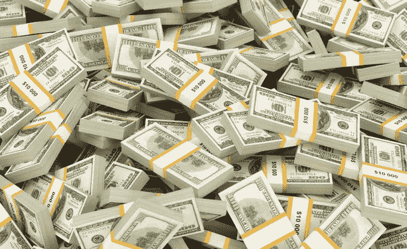

# 你不知道 10 亿美元有多少

> 原文：<https://medium.datadriveninvestor.com/you-have-no-idea-how-much-1-billion-is-4d0d985b726c?source=collection_archive---------0----------------------->

## 理解美国不平等的第一步

尽管他们在我们的社会心理中占据重要地位，但美国只有 540 名亿万富翁。他们总共控制了大约 2.4 万亿美元，超过了美国全部财富的 3%。我们在我们最伟大的文化机构中看到他们的名字，在书籍、电影和电视中看到他们的肖像，毫不奇怪，“亿万富翁”这个词在美国方言中已经变得平淡无奇。然而，令人惊讶的是，我们大多数人都很少真正理解拥有 10 亿美元的真正含义，以及当存在拥有这种财富的人时，对社会的更广泛影响。当我们审视美国的财富和不平等时，10 亿这个数字是一个相对武断的衡量标准。在我的用法中，它真正代表的是拥有巨额财富的人(如 5 亿至 1000 亿美元)，而 100 万美元将是拥有中等至大量财富的人(更像是 100 万至 2000 万美元，偏高)。为了便于参考以及在我们的社会中的频繁使用，我们将采用这些简化。

任何人是否以及为什么应该拥有 10 亿美元是另一篇文章的问题，因为首先弄清楚有多少钱是一个足够大的挑战。我们喜欢用大整数来思考，这一点在我们使用财富指标的语言中得到了充分体现。你赚了六位数。有“百万富翁”和“亿万富翁”。我们认为人们是“百分之一”或“百分之九十九”当我们试图解决美国的不平等时，这种暗示是有问题的。T2 大约有 1500 万人的净资产超过 100 万美元。这是一个经常和亿万富翁一起被提及的群体。我们听到像伯尼·桑德斯这样的人谴责“百万富翁和亿万富翁”，就好像这两个群体只差一步之遥。当然，我们都明白这两个政党之间有着巨大的差异；然而，这种差异真正代表了什么？我们如何理解一个拥有 100 万美元和 10 亿美元的人的财富差距？

好吧，简单来说，100 万美元和 10 亿美元之间的差额与 0 美元和 9.99 亿美元之间的差额相同。换句话说，大约 10 亿美元，这是一大笔钱。即使是 10 亿美元和 3000 万美元之间的差异本质上也是 10 亿美元——我的意思是，你真的认为一个拥有 9.7 亿美元和 10 亿美元的人之间的生活方式有很大差异吗？较低的财富水平之间存在巨大差异(例如，一个拥有 50 万美元净资产的人与一个拥有 1000 万美元的人的生活水平可能会有很大不同，尽管这一差距远小于 9.7 亿美元和 10 亿美元之间的差距)。这些群体(接近 100 万的群体和接近 10 亿的群体)之间没有什么相似之处，但这些数字经常被混淆。例如，我最近有一个朋友向我抱怨一个县软件项目浪费了 150 亿美元的开发成本。她想说的是“百万”，虽然这是一个无伤大雅的错误，但她对这些价值观的简单融合很能说明问题。许多护士、会计师和中层管理人员可以在职业生涯中期突破 100 万美元的净资产大关，但只有一种方式可以赚到 10 亿美元:通过拥有资产，几乎完全以证券(如持有公司股票)或房地产(在较小程度上)的形式。

你们中的许多人可能会想到这一点，并认为我在陈述显而易见的事实。懂数字的人都知道，1，000，000，000 比 1，000，000 多得多。我们也理解所谓财富的固定装置:路易包、劳力士手表、德国汽车。由于现代媒体，我们甚至可以想象超级财富:法国别墅，百英尺长的游艇，兰博基尼。尽管如此，用生活方式的选择作为净资产的代表仍然存在一些问题，这不仅仅是因为这种显示可以通过过度杠杆化来实现。

第一个问题是，比如说，在银行有 1000 万美元存款的人和有 5 亿美元存款的人，在外人看来可能非常相似。这两个群体都被认为迷恋某些品牌，在经济上有能力进行广泛的国际度假，经常光顾米其林星级餐厅，并在多个家庭之间流动。当然，鉴于我们的社会在互联网的刺激下不断融合“高雅”和“低俗”文化(参见:精致餐饮的消亡，T2 的卡哈特 x 科姆·德·加尔孔的合作，或者最近 T4 拍卖行的班克斯的成功)，我们辨别财富阶梯不同等级的能力受到了损害。这些东西——外部符号——塑造了我们对富人的看法，但从外表上看，几乎不可能知道他们是拥有 8 位数还是 9 位数的资产组合，这还没有考虑到许多超高净值个人选择不以有意义的方式展示他们的财富。这只会带来更多的问题。

当我们从生活方式的角度思考财富时，它会让我们偏向于自己的生活经历和与他人的互动。认为富人就是富人会导致对我们的经济前景和不平等程度的不准确看法。你可能认为你比这聪明，但这比你想象的要难理解。很可能你认识一个你认为“富有”的人，但更可能的是你不认识任何超过 1 亿美元的人，更不用说 10 亿美元了。需要注意这两者之间的区别——仅仅被视为“富有”与拥有 1 亿美元或更多——以正确理解围绕不平等使用的语言以及各种政策措施将对我们的生活产生的影响。

(如果不想钻研什么数学就跳过这一段)1 亿美元俱乐部有 5000 户。考虑到他们的财富，这些人很可能有很大的社交网络，经常会遇到很多其他人，但很难想象每个家庭认识的平均人数会远远超过 3000 人。当然，也有可能这个俱乐部的人认识的人之间有很多重叠，9 位数俱乐部的其他人可能也构成了他们社交网络的一大块。假设这些重叠占他们社交网络的 75%，这意味着每个家庭都认识 700 个不同的人(例如，其他 9 位数家庭不认识的人)。这意味着只有大约 350 万人(每个社交网络中有 5000 个家庭* 700 个不同的人)与 1 亿美元以上的人在同一个社交网络中，约占美国人口的 1%。

这是(非常)粗糙的数学，但如果不到 1%的美国人认识任何拥有 1 亿美元或更多财富的人，你(普通美国人，而不是阅读 Medium 页面的普通软件工程师)可能不认识。你认识亿万富翁的几率几乎为零。

那么，为什么人们似乎认为自己对巨额财富如此熟悉呢？我不认识任何一个福布斯排行榜上的人，也不认识任何一个我认识的人，但是我们所有人都可以想象出一个亿万富翁的生活应该是什么样子。我们如何做到这一点？通过前面提到的某些生活方式和财富之间的等式。然而，这是美国看待财富的一种危险方式，因为它没有给我们空间去正确评估 10 亿美元比 100 万美元多多少钱。这是一种根植于审美的熟悉错觉，而不是他们银行账户中的数字。一个百万富翁可以买得起一个漂亮的房子，也许是一个小屋，也许是一些高档品牌，也许是为了支付他们孩子的大学学费，也许是后院的一个游泳池，以及频繁的国际旅行。一个拥有 1000 万、2000 万或 3000 万英镑的百万富翁可以将所有这些提升一个层次，用快艇换一艘小游艇，用小木屋换一个农场，并确保他们的孩子在常春藤名校上学。然而，在某一点上，你碰到了天花板。一旦超过这个门槛，那么钱就真的开始堆积了。你会买更大、更好、更多的东西，但事实是这个世界上的商品都有一定的价格限制。一个人能花在大学学费上的钱是有限的。去古驰的商店，那里有一个最高价格标签(1 亿美元足够你花 5000 美元买一个包，在 55 年里每天都可以穿不同的包)，你只能穿这么多。即使是纽约最贵的餐馆，人均消费也不会超过 500 美元。那么 10 亿美元到底有多少呢？

在这种对话中经常被忽略的是这笔钱带来的利息以及它开始复利的速度。已故的保罗·艾伦[在他只有 100 亿美元时签署了捐赠财产的誓言](https://www.theatlantic.com/technology/archive/2018/10/paul-allen-shows-its-hard-to-donate-10-billion/573109/)，在接下来的十年里，他向值得尊敬的事业捐赠了数十亿美元*，多次做出超过 9 位数的个人捐赠。然而，当他去年去世时，他的净资产已经上升到*200 亿美元，是他开始尝试捐赠时的两倍。那些年，钱增长得太快了，以至于他不能很快地捐出去。同样，艾伦的微软创始人同事比尔·盖茨捐出了更多的钱，但他的净资产仍在向 1000 亿美元攀升。系统正在与他们作对，这是我们都需要认识到的。**

*对于所有美国人来说，商品成本理论上是不变的，复利的指数曲线可能是惊人的。赚第一个 100 万很难，但以后的每一个都会变得容易，因为你所要做的就是保持支出以较慢的速度增长。例如:假设你的净资产达到 100 万美元的那一年，你的支出是 10 万美元。你通过工资支付了这些费用，然后继续前进，你决定不再努力存钱，而是让你现在的储蓄增加。好吧，如果你的投资回报率为 7%(忽略通货膨胀)，那么这意味着你可以在下一年花费少于 170，000 美元的任何东西，同时仍然允许你的钱以不断增长的速度积累(这没有任何收入变化，也没有考虑到你将从工资中支出的额外资金，因为你不再储蓄任何钱)。如果你第二年花费 115，00 美元，然后允许自己每年增加 15，000 美元，即使你的支出继续增加，十年后你的财富仍将接近 200 万美元。钱生钱。富人越来越富。另一方面，如果你的净资产很低，你不会看到这种趋势的出现，因为你首先必须比你的支出多赚足够多的利润才能到达那里。如果你有大量的债务，你会看到同样的趋势，*除了它会对你不利*。一个人的生活方式只能变得如此廉价。如果你赚了 30，000 美元(特别是如果你住在这个国家更昂贵的地方)，要完全覆盖基本开支将是极其困难的，更不用说存够钱开始看到复利的威力了。*

*现在让我们把它应用到一个亿万富翁身上…*

*假设你的科技创业公司被谷歌吞并，你发现自己是一个羽翼未丰的 B 级亿万富翁。最近，全球亿万富翁的财富以令人难以置信的 20%的年增长率增长。(当你有足够的钱开一家名副其实的[投资公司，专门让你变得更富有的时候，这很有帮助。)这对你来说意味着什么？嗯，你还没有时间让家庭财富办公室完全启动，所以为了安全起见，给你 10%的利率。这意味着如果你想让你的钱留在原处，明年你将不得不在*花费*整整 1 亿美元。如果你做不到这一点，那么明年这 10 亿美元将跃升至 10.5 亿美元。所以现在你必须花费超过 1 亿美元来保持你的财富不增加。但是也许一个月花掉 500 万美元对你来说就足够了。如果是的话，那么 10 年后，从 10 亿美元开始，每年花费 6000 万美元，你的净资产实际上将会增加到 15 亿美元。那几乎是每天 20 万美元，比普通美国家庭 3 年的收入还要多。请记住，所有这些都是假设你在这 10 年期间没有赚到一美元，并且你完全依靠这 10 年开始时的 10 亿美元生活。怎么会。疯狂。是。那个。把这个应用到像比尔·盖茨这样的人身上，只要把所有这些数字乘以 100 就行了。他将需要每年捐赠 10 亿美元来阻止他的财富增长。这样做的逻辑令人眼花缭乱，我想很少有慈善机构(包括他自己的)拥有处理这种现金的基础设施。](https://www.economist.com/leaders/2018/12/15/how-the-0001-invest)*

*这远非非凡的数学，但这是大多数人(包括我自己，直到最近)不常考虑的事情。当你跨过一定的财富门槛时，地心引力对你不起作用。只有这么多钱可以花，到了某个时候，它会开始积累到令人麻木的水平，足以养活几代最初与赚取财富毫无关系的子孙后代。是的，你可以看到这种数学方法也适用于较小的财富(在 100 万到 1000 万美元之间)，但它远没有那么明显，因为一年花 10 万美元甚至几百万美元比花 1 亿美元要容易得多。*

*不管你对最初让人们能够拥有如此丰厚资产的体系有什么看法(这是另一篇值得写的文章)，但毫无疑问，这种经济结构正在以前所未有的速度推动不平等。我可以链接一篇又一篇关于它的文章(好吧，这里只有一篇)，但是我会把谷歌搜索留给你。我想说的是，有钱不只是有钱。银行里有几百万存款的人在某些方面看起来可能与拥有几亿存款的人相似，但他们财富背后的数学是在完全不同的尺度上运作的，一个舒适的生活与一个王朝。尽管亚历山大·奥卡西奥-科尔特斯(Alexandria Ocasio-Cortez)提出的对收入超过 1000 万美元的人征收 70%的税的建议引起了很多关注，但在我看来，还有其他方法可以打击极端不平等。惩罚那些通过工资挣钱的人不会对最富有的美国人产生太大影响。然而，对超过一定水平的财富征收 1%或 2%的财富税(我相信她也提到了)会产生巨大的影响，如果我们把它与 UBI 这样的想法结合起来，影响会更大。这些巨额财富中的大部分都与证券或房地产等资产密切相关，因此仅对收入征税存在诸多问题(更不用说资本利得税率更低的事实了)。尽管如此，我不是经济学家，我的观点也不是提出解决美国严重不平等的最佳方法。相反，我想帮助你，我亲爱的读者，接受美国财富的 1%，0.1%和 0.0001%之间的差异，因为这是巨大的，每个群体与美国其他人之间的差距需要以独特和明智的方式来思考和解决。*