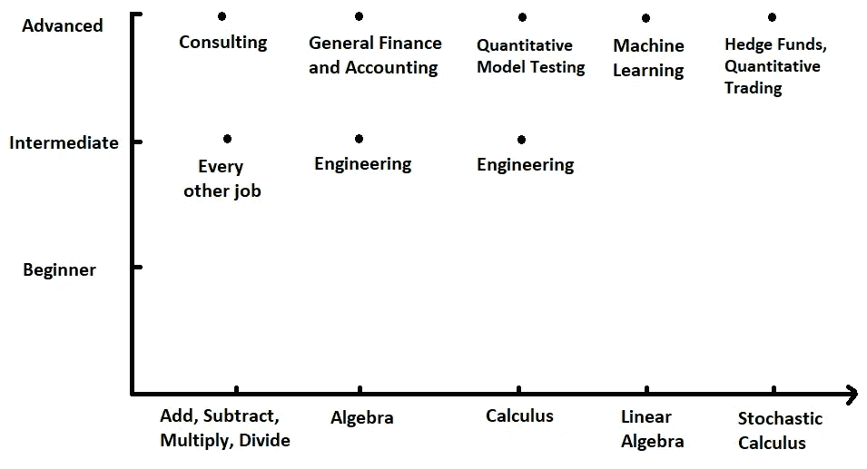
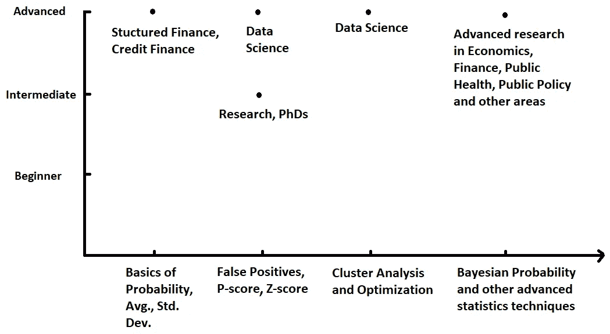
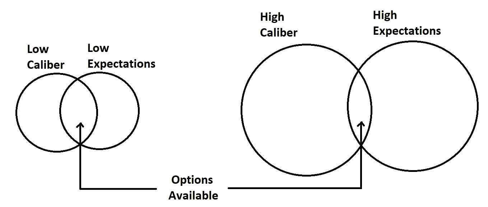

# 你必须精通基础数学

> 原文：<https://medium.datadriveninvestor.com/you-have-to-be-advanced-at-basic-math-3dfa5d34eda8?source=collection_archive---------3----------------------->

注意:本文表达的观点仅是我个人的观点，并不代表我的雇主或任何其他人的观点。

“定量”现在是一个非常流行的词。随着大数据和机器学习的兴起，擅长数字被视为简历上的一颗金星。一般来说，人们把技能，尤其是数学，与智力和能力联系在一起。电影《大空头》中有一个著名的场景是“这就是我的 Quant ”,展示了擅长数学的人基本上是金融界的上帝。所有这些例子都清楚地表明，真正擅长数学被视为通往繁荣未来的道路。

另一个极端是那些认为数学在当今世界没有必要的人。他们认为没有人在他们的现实生活中真正使用微积分，而且他们做的大多数数学运算都是在计算机上进行的。有人认为学习文科中的定性技能比定量技能更有价值[3]。

就像生活中的大多数事情一样，真相就在中间。**擅长数学很重要，但将数学融入文科同样重要**。更重要的是，即使涉及到数学，大多数人也不会真的需要每天使用微积分和微分方程[4]。相反，人们经常使用基础数学。基础数学包括知道 800 万的 15%是多少，或者知道如何乘以 85×65 以及其他基本的数学任务，但是要在没有计算器的情况下快速完成。**换句话说，你必须是基础数学专家**。

这是人们经常混淆的事情。专业知识和高级技能。数学方面的高级技能是了解随机微积分和蒙特卡罗模拟。专业知识仅仅意味着掌握你所学的任何概念。你可能学过随机微积分，但可能对代数有些生疏，这实际上比你想象的要常见得多。

有些工作确实需要高级数学技能，如金融和机器学习，但与整个经济相比，这些工作相对较少，而且有足够多的人来填补这些工作。大多数人应该把时间投入到擅长基础数学或“顾问数学”上。有些人认为，即使你不使用高等数学，你仍然应该学习它。这里的想法是，你是“数学通”，所以即使软件在做数学，你至少知道软件大概在做什么，至少知道答案的方向，并能调试它。

同样，即使你只需要基础知识，当你学习更高级的技能时，也会有一个迭代学习的过程。换句话说，当你在微积分前使用代数的时候，你对代数的理解得到了加强，当你在微积分中使用代数的时候，你对代数的理解得到了加强。这个想法是，仅仅做基础知识是不够的，你必须把它应用到其他领域，才能真正学到这个概念。这不仅仅是在其他数学课程中，你可以在其他课程中应用这些技能，比如物理、计算机科学和其他课程。**图 1** 显示了大多数工作如何要求中级水平的基本数学，如加法、减法等。金融和工程领域的一些高级工作需要稍微高级一点的数学，很少需要随机微积分方面的高级专业知识。**初学数学没什么奖励，但擅长高等数学也没什么奖励**。

**Figure 1** showing the advanced level of math on the x-axis and the level of expertise on the y-axis. It also shows the jobs that require such skills for the level of expertise and skill level.

统计学也是如此。数据现在炙手可热，每个人都在努力学习统计学，以处理他们拥有的所有数据并获得洞察力。数据科学工作的绝大多数增长将需要与概率和抽样相关的统计学基础知识的高级专业知识。你不需要知道贝叶斯概率。

**Figure 2** showing the advanced level of statistics on the x-axis and the level of expertise on the y-axis. It also shows the jobs that require such skills for the level of expertise and skill level.

这种观点的另一面是不确定性。现在的新趋势不是预测趋势。人们的新职业建议是不要规划未来[5]。他们基本上是在说，我们不知道未来的趋势是什么，并且把自己局限在只研究基础知识上。10 年前我们不知道机器学习的存在，那时我们也不知道需要什么技能。基础数学可能是他们今天想要的，但谁知道明天会不会是真的。

这不仅仅适用于数学和统计学，它适用于所有行业，人们应该在大学里努力培养广泛的技能，以便在现实世界中立足。在这些行业中，成为基础领域的专家也是事实。**人们普遍认为越高级的技能越受欢迎。**

**Figure 3** showing overlap between expectations and caliber

这在一定程度上是正确的，拥有更高技能的人在所有工作中都更受欢迎，但他们并不关注所有的工作。他们的能力提高了，但他们的期望也提高了。擅长高等数学的人可能有资格获得较低层次的数学工作，但现在他们期望获得数量较少的高级工作。他们确实想要的工作不一定要他们。他们实际上可能更适合低水平和低期望值，而不是高水平和高期望值。

所有这些的基本要点是，基础真的很重要。你必须能够把很多非常简单的事情做得非常好。

**来源:**

1.[https://www.youtube.com/watch?v=QpsI_Gvn7C8](https://www.youtube.com/watch?v=QpsI_Gvn7C8)

2.[https://www . nytimes . com/2012/07/29/opinion/Sunday/is-algebra-required . html](https://www.nytimes.com/2012/07/29/opinion/sunday/is-algebra-necessary.html)

3.[https://www . Bloomberg . com/news/articles/2018-02-06/maybe-stem-is-the-future-after-all-soft-skills-coming-on-strong](https://www.bloomberg.com/news/articles/2018-02-06/maybe-stem-isn-t-the-future-after-all-soft-skills-are-coming-on-strong)

4.[http://www . Washington post . com/WP-dyn/content/article/2010/10/22/ar 2010 10 2205451 . html](http://www.washingtonpost.com/wp-dyn/content/article/2010/10/22/AR2010102205451.html)

5.[https://www . CNBC . com/2018/06/27/Wharton-professor-Adam-grant-do-not-follow-this-common-career-adv . html](https://www.cnbc.com/2018/06/27/wharton-professor-adam-grant-do-not-follow-this-common-career-adv.html)