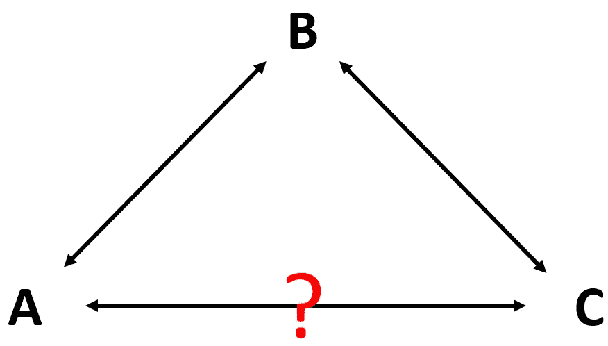
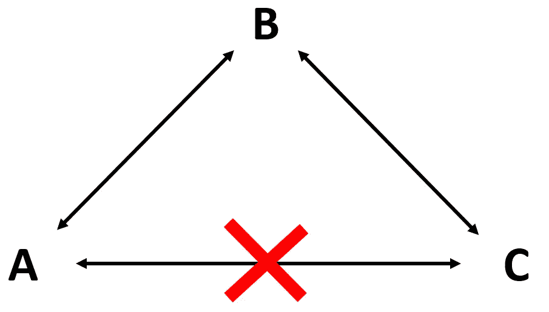
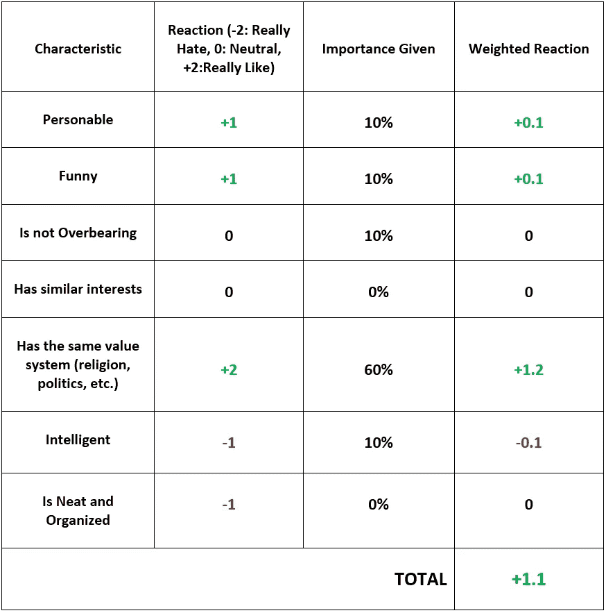
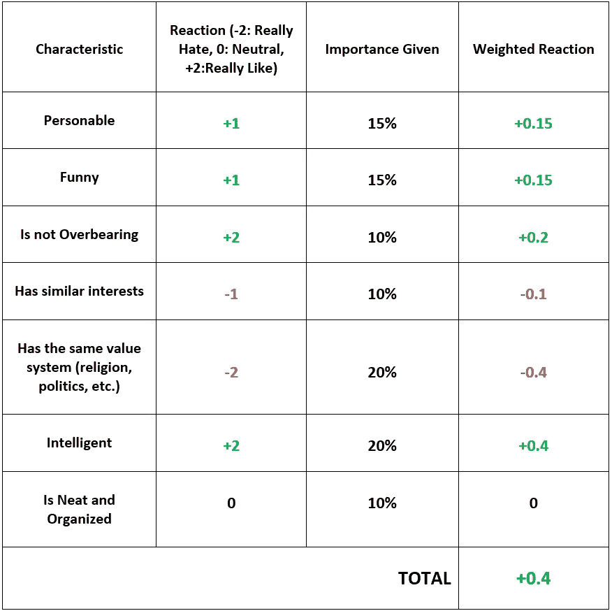
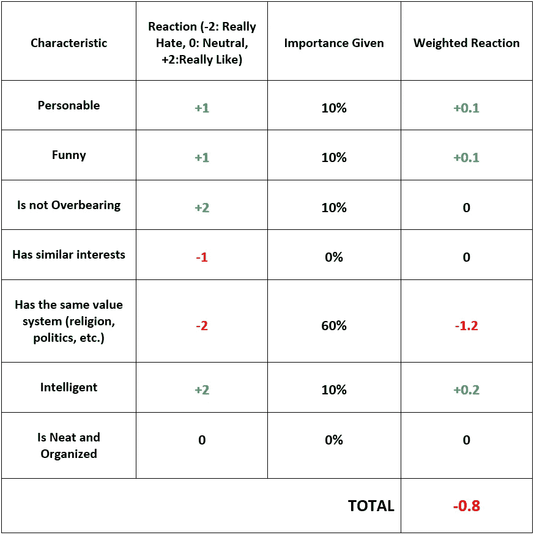

# 你可能不喜欢你朋友喜欢的人

> 原文：<https://medium.datadriveninvestor.com/you-may-not-like-the-people-your-friends-like-dcc8a6ec543d?source=collection_archive---------11----------------------->

Photo by [Raghu Nayyar](https://unsplash.com/@raghunayyar?utm_source=medium&utm_medium=referral) on [Unsplash](https://unsplash.com?utm_source=medium&utm_medium=referral)

注意:本文表达的观点仅是我个人的观点，并不代表我的雇主或任何其他人的观点。

参考资料是当今工作的一大部分。人们努力为现在的工作和将来的工作建立良好的关系。不仅仅是为了工作，一般来说，人们会利用某人对某事或其他人的看法来形成自己的看法。想想美食评论，水管工和电工之类的服务，甚至是约会。人们会偏离他们信任的人所说的很多。假设是，如果你信任某人，那么你可以信任他们的意见。不幸的是，大多数时候这并不奏效。**你喜欢一个人，并不意味着你会喜欢他们喜欢的每个人。**

想起朋友；有多少次你有一个最好的朋友，不喜欢他们的一些朋友？甚至约会；夫妻多久抱怨一次不喜欢他们的姻亲？在这两种情况下，A 喜欢 B，即朋友或夫妇都喜欢对方，而 B 喜欢 C，即伙伴的朋友喜欢另一个人。然而，A 不喜欢 C，也就是说，你不喜欢他们的朋友或爱人。这在社会环境中是很常见的事情，通常有三个原因:

**我们了解不同背景下的人**

假设你在工作中认识两个人，并且和第一个人是好朋友，和第二个人是熟人。你和他们都不共事，只是通过社交活动和非正式的工作午餐认识他们。和你做朋友的人很有风度，知道如何和人交谈；第二个人有点冷漠，不善社交。你真的很喜欢第一个男人，但却不明白为什么他和第二个男人是好朋友？后来你发现这两个人一起工作，那个社交笨拙的家伙真的很聪明，努力工作，是一个很好的团队成员。你意识到你的朋友喜欢第二个人是因为他的职业道德、智慧和态度。他在他身上看到了你没有机会看到的特质。他可能不是一个非常合群的人，但他是一个努力工作的人，如果你在这种情况下与他共事，你可能也会喜欢他。所以这是需要考虑的事情——如果你不喜欢某人，可能只是因为环境没有让他们发挥出最好的一面。

**有些人对待别人的方式不同。**

这一点很棘手，也最难辨别，但却非常真实。有些人从第一次见到其他人的时候，就以非常不同的方式对待他们。可能有其他因素或隐含的偏见形成了他们对一个人的看法，但如果一个人不明白为什么他的朋友不喜欢他们喜欢的人，那个人很可能不会像对待你一样对待你的朋友。

有些人把这叫做结党营私，本质上，人们只善待自己圈内的人。如果你问你的点击型朋友对你的另一个朋友的看法，他们可能会给出完全不合理的负面反馈，你可能甚至无法指出是什么原因造成的，因为这又是一个点击型和随机的问题。

**我们对不同的特征赋予不同的权重和反应**

这一条是最复杂的原因，我们来分解一下。让我们回到上面的三角形例子。假设 A 喜欢 B，B 喜欢 C，但 A 不喜欢 C。我们还假设你也根据 7 个品质来判断你喜欢和不喜欢这个人。很可能会有更多，但在本例中，我们将其保持在 7。所以你“喜欢”或“不喜欢”某人意味着你已经根据你的**反应和对他们的重视程度**对这 7 种品质进行了加权平均。如果加权平均值大于 0，那么你喜欢它们，如果小于 0，那么你不喜欢它们。这听起来可能很专业，但是每个人都在他们的头脑中进行这种计算，不管这是否科学，也不管他们是否意识到。让我们来看 3 个案例，概述 A - > B，B - > C 和 A - > C 的加权反应。

**案例 1 (A 喜欢 B)**——A 喜欢 B。A 有一套他们想要的品质，并相应地进行了加权。然后它会对 B 的这些品质做出反应，不管是积极的还是消极的。在这种情况下，这些品质的加权平均值大于 0，所以 A 喜欢 b。

**案例 2 (B 喜欢 C)**—B 喜欢 C。B 对 C 的品质和反应有不同的重视程度。基于这些加权平均，它喜欢人 c。

**案例 3 (A 不喜欢 C)** —人 A 不喜欢人 C。在这种情况下， **A 使用案例 1 (A 喜欢 B)的反应，但重要性来自案例 2 (B 喜欢 C)** 。人 A 不喜欢人 C，因为即使它不喜欢人 C 与人 A 相同的品质，但它更看重某些不同意见，如政治观点。

正如你所注意到的，A 最终并没有喜欢上 C，因为它比 B 更重视政治分歧。这种权重的差异对每个人来说都是真实的。每个人都有某些“破坏交易”的品质，即使他们没有，他们肯定会比其他人更重视某些品质。

因此，当你考虑一个人对另一个人的看法时，你总是要看看是什么具体地推动了他们的决定，以及你是否会在他们的情况下做出同样的反应。