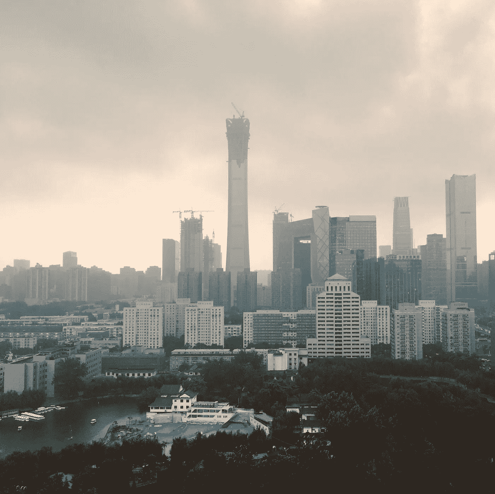
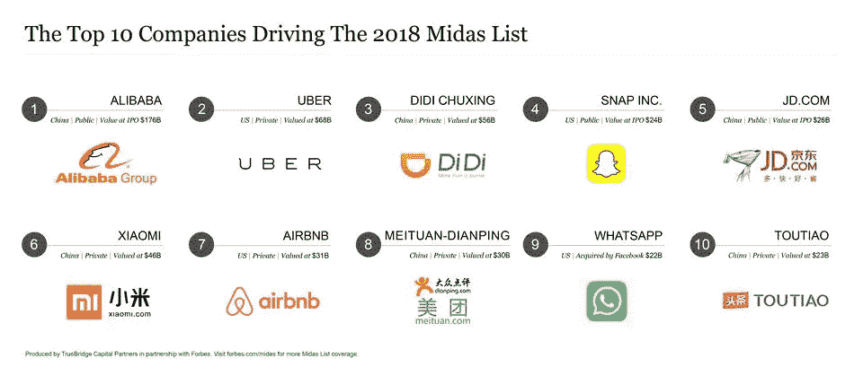

# 所以当你听到硅谷的时候你融化了，但是你还没有检查地球的另一边有什么？哈

> 原文：<https://medium.datadriveninvestor.com/you-melt-when-you-hear-silicon-valley-yet-you-havent-checked-whats-on-the-other-side-of-the-globe-7329a2362950?source=collection_archive---------15----------------------->

亚洲文化与西方文化完全不同。想象一下，你只能用一只眼睛看，生活在亚洲让你终于-终于！！-用你的第二只眼睛看！说什么？

我是欧洲人，尽管美国对我来说有点不同，但我们都使用脸书、Instagram 和 Twitter。周五晚上，我们一边吃披萨，一边看艾伦或路易斯·CK 的节目，之后我们去参加派对。第二天，我们醒来后抱怨有太多的卡路里，我们需要在 Crossfit 训练中消耗掉，用蛋白质奶昔杀死它。然后我们变得非常兴奋，因为我们刚刚预定了另一个滑雪假期，就像每年一样。或者我们去晒日光浴。或者我们只是试图击败硅谷初创公司的工作狂。每天都一样。

举例来说，中国有多大的不同呢？很多。很多！

下面我将说说

1.  文化和创业
2.  如何与中国人打交道
3.  创业行业

# 文化和创业

我过去在那里住了两年。看到和学习就足够了。你要么爱中国，要么恨中国。但是这一天也会发生变化。先说创业公司和社交媒体。

**微信。**你们很多人不知道脸书、Instagram 或 Whatsapp 以及更多西方社交媒体在那里被屏蔽了。但是有微信。QQ。微博。还有很多。微信是日常用来交流的。我敢说这款应用正在超越脸书。设计简单，但功能更强大。腾讯的消息应用程序集合了许多易于使用的功能。想象一下有二维码支付系统、群聊和迷你程序的 Whatsapp。我想举一个无家可归者的例子。一个情景:你看到一个无家可归的人，你想给他(或她)一便士。但是你身上没有现金。在中国，这不是问题。就因为每个无家可归的人都有电话(对，没错)。而且每部手机都有带支付系统的微信。你只需要扫描他(或她)的二维码给点钱。简单！或者你可以给他买去泰国的机票让他开心。直接用微信！全在一个应用程序中。

**Mobike.** Let’s continue the situation, as we all prefer to read stories instead of raw facts. 8 AM Monday, Chinese time. Beijing, capital city. You need to hurry up to get to work, but — oh not again, there is a heavy traffic — queue to ENTER a subway station. A line that starts below the ground level, where security is checking everybody before entering Metro, and it ends, not event at the front doors to enter subway station on ground level, but even across the street. Human traffic. So what do you do? You just catch a bike from $1 billion worth startup Mobike or Ofo that is just laying under your feet. You actually cannot decide which color suits you best today from 5367537 bike brands nearby you, but let’s take a red Mobike. And then you bike. However you want. Which way you want. You beep. Somebody may spit on you, but that’s normal. And here we are, by the elevators taking you upstairs to your office. Breakfast or lunch, doesn’t matter, 包子 or Baozi, chinese dumplings are there for you. Coffee? Well, it’s the only habit you have back from your Western times, so you go and take it from Xingbake, which is just Starbucks. You can have how many breaks you want, at noon don’t forget to take a nap! Monday, Tuesday, Wednesday, Thursday and finally.. Friday.

通常中国人不像西方人那样喜欢聚会，你可以看到白天挤满了亚洲人，而晚上挤满了西方人。比起酒吧，他们更喜欢卡拉 ok。我不太喜欢喝酒。很难找到比萨饼店，但中国烧烤工作刚刚好。如果你坚持跳舞，每三条街可能会为你提供一个集体舞，通常平均年龄是 60 岁，但你知道吗？他们动了！告诉你奶奶。

他们可以在汽车上花很多钱，但是他们可以住在没有窗户的房间里。他们可能很脏，但你看到 5 个工人在清洁一扇窗户。你告诉他们，给我盖房子！他们会给你 20 栋一模一样的摩天大楼(复制粘贴)。

[original photo: @mu5l1 IG](https://www.instagram.com/mu5l1/)

让我们来看看独角兽名单对他们的创业公司说了些什么。

By Forbes

中国。美国。中国。美国。中国。美国。这意味着什么。别忘了，那里住着 15 亿人！我们还有印度和非洲作为另一个世界，即将到来！

> 我们会成功的，因为我们还年轻，我们永远不会放弃。**马云**

**阿里巴巴。**如果你在寻找一位优秀而睿智的导师，我推荐马云。阿里巴巴集团创始人。我肯定你已经在速卖通上订了东西。他们的电子商务解决方案和支付系统彻底改变了世界。他们成立于 1999 年，估值超过 2000 亿美元。马云是一个伟大的成功故事，你应该在 YouTube(或优酷)上看到他的一些采访。他被哈佛拒绝了 10 次！然而，他的热情和坚持让他走向了成功。

# 怎么和中国人打交道？

1.  **不同的经历。首先，他们的文化不同，因为他们在不同的环境中长大。当我们有电脑的时候，他们什么都没有。他们跳过这段时间，直接使用手机，这使他们比电子邮件或网站更频繁地使用信使和应用程序。这也是为什么你可以只用手机做任何事情。**
2.  **关系**。信任。中国人在想和你做生意时，需要信任你，所以他们会想和你见几次面，交交朋友。预计会有很多带表情符号的消息。
3.  **要有礼貌**！直截了当不是亚洲人的事情。经常询问交易可能看起来很粗鲁。
4.  **正好有人说中文。**试图完成一些官僚主义的事情？最好寻求帮助，通常事情是不同的，没有人能用英语向你解释！

# 创业行业

中国奇怪的快节奏发展使得他们的创业产业缺乏基础设施等基本的东西。但是他们无论如何都要去。他们可能会比西方多做 10000 家创业公司，大部分都被忽视了，但少数会赢，这就足够了。

进入他们的市场很难，西方公司肯定需要帮助，至少需要曾经在那里生活过的人的帮助。他们必须知道并非一切都是完美的。

我又学到了一课。我们太保守了，试图让每一栋旧建筑保持原样，而中国人更喜欢拆除并重建同一个建筑。它会变得更强，更好，事实上，它是一个重要的地方，而不是岩石和沙子。他们不怕破坏、改变和创造新的东西。因为对他们来说，改变总是好事，不管结果如何。也许这就是他们成功如此之快的原因。因为他们确实做了一些事情。

谢谢！

[original photo: @mu5l1 IG](https://www.instagram.com/mu5l1/)