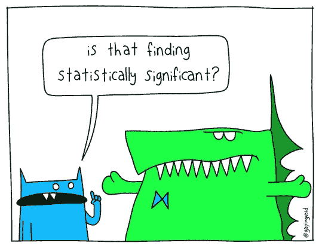
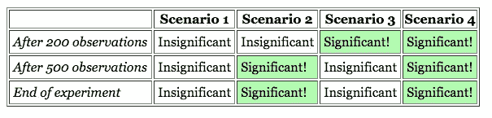
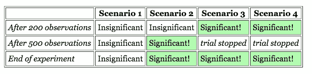
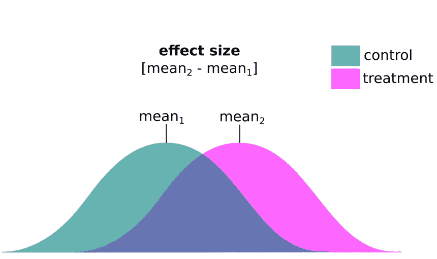

# 你说你要统计学意义？

> 原文：<https://medium.datadriveninvestor.com/you-say-you-want-statistical-significance-aefc35aa377f?source=collection_archive---------1----------------------->

> "确定统计显著性所需的最小样本是多少？"

这可能是我作为数据科学家在公司工作时收到的最常见的问题，这些公司希望测试产品的新功能，寻找新的创意方向，或旨在优化用户体验。

让我们首先从我亲眼目睹的所有陷阱开始:

# 第一个陷阱:

由于我从事营销工作，我们主要关注转化率，所以我听到的主要观点是:

> “我们没有足够的安装/点击量来确定统计意义”

然而，如果你试图衡量点击率(CTR =点击/印象)之类的东西，那么你实际上会关心你的整个样本，而不仅仅是那些点击了你广告的人。也就是说，你在乎你服务过的所有(独特的)印象。同样，如果你在衡量转化率(CVR =安装/点击),那么你会关心网站/应用的所有点击。

这类似于你对临床试验的看法。你的样本被确定为每个治疗组的总人数，而不仅仅是那些对治疗有反应的人。

既然我们已经有了直接的，我们可以进入其他出现的陷阱..

# 第二个陷阱:

让我们假设测试目标已经设定，预算已经分配，并且测试正在进行。当然，每个人都渴望知道测试是如何进行的，因为，嗯，需要做出决定，时间就是金钱。因此，有人致力于不断监测测试，检查每一步的重要性。

如果这是你正在做的，停下来！这往往会导致你在发现显著性的时候就提前结束测试，从而导致假阳性。

为了更好地理解，假设你有一个实验，你在 200 次和 500 次观察后评估结果。以下是可能导致的不同情况:

From: [http://www.evanmiller.org/how-not-to-run-an-ab-test.html](http://www.evanmiller.org/how-not-to-run-an-ab-test.html)

然而，如果你在发现显著性的时候就结束测试，结果会是这样的:

From: [http://www.evanmiller.org/how-not-to-run-an-ab-test.html](http://www.evanmiller.org/how-not-to-run-an-ab-test.html)

请注意，这种方法使你增加了重要结果与不重要结果的比率。因此，报告的显著性水平(即“观察到的差异是由于偶然因素造成的时间百分比”)将是错误的

更多关于这一点的含义，请阅读[这里](http://www.evanmiller.org/how-not-to-run-an-ab-test.html)。

# 第三个陷阱:

当**统计**显著性被确定并且没有围绕**实际**显著性的谈话时。有时，对照组和治疗组之间的差异可能小到 0.5%。

我的意思是很好，这在统计学上很重要，但它可行吗？这将取决于具体情况…

现在我们已经讨论了所有这些，让我们讨论一下我们可以采取的具体行动来克服这些问题。

1.  在开始测试(也称为功效分析)之前，确定样本量**。**
2.  在达到指定的样本数量之前，不要检查测试结果！

这将极大地有助于获得干净和准确的测试结果，这可能会花费很多钱。

所以让我们开始吧…

# 最小样本量

假设你被分配了这项工作——为即将到来的实验寻找最小样本量。你会怎么做？谷歌一个样本量计算器，对不对？没错！这将引导您访问以下网站:

*   [样本量计算器](http://www.evanmiller.org/ab-testing/sample-size.html)
*   [A/B 测试样本量计算器](https://www.optimizely.com/sample-size-calculator/?conversion=4.75&effect=30&significance=90)

很简单。你开始玩数字游戏，但是等等..

> 什么是效果尺寸？？为什么较小的效应量会导致较大的样本量？？权力，权力是什么？呸！

你开始查找影响大小，深入挖掘你的记忆，试着记住你几年前学到的统计数据！不会发生..

好吧，好吧..深呼吸。让我们从头开始。

为了确定正确评估所需的最小样本量，我们需要了解在计算中起作用的所有因素之间的密切关系，它们是:

*   效果大小
*   显著性水平(1 类错误的概率)
*   功效(第二类错误的概率)

对于最后两个输入，我们可以使用学术界使用的推荐值(行业应用的规则可以更灵活)，即显著性(alpha)值为 0.05，幂为 0.8。因此，我们只需要确定一个值——效应大小。很好，对吧？也许…

这个特殊的输入需要一点思考(和一些简单的计算),因为效果大小会根据你要测量的东西而变化。

根据定义，效应大小代表您想要检测的治疗组之间的均值差异。记住:你想要测量的效应越小，你需要的样本就越多。因此，在预算有限的情况下，你需要考虑你想要测量的最小实际差异。

Cohen 的 d 表示效果大小的标准化版本，其中值 0.1、0.3 和 0.5 对应于小、中和大效果。但是根据您的使用情况，您想要测量的标准化效果大小可能非常小(甚至小于 0.1！).

例如，假设你有一个对照组和一个治疗组，你想测量 1%的绝对差异。我们还假设您从历史知识或过去的实验中知道基线转化率为 4%。那么相对效应将是(5–4)/4 或 25% —由于这是一个二项式分布，您也可以将标准差计算为 sqrt(p*q) = 0.195，给出标准化效应大小 0.01/0.195 或 0.05。那么*绝对*效果大小为 1%，相对*效果大小为 25%，而*标准化*效果大小将约为 0.05。*

有了这些信息，你现在可以得到效果大小、alpha 和功率，并插入你最喜欢的样本大小计算器。或者您可以通过利用`pwr`库并使用以下或类似的[代码](https://www.statmethods.net/stats/power.html)来使用 R:

**pwr.anova.test(k =，n =，f =，sig.level =，power = )**

通过填写 k(治疗组数)、f(标准化效应大小)、sig.level (0.05)和 power (0.8)，它会向您反馈每个变体所需的推荐样本量。

恭喜你。现在轮到你来教育你的公司，为什么他们不应该不断地检查测试结果，直到你在你的样本中达到至少那么多。

排队结束测试。现在由你来评估这个测试，但是我会把它留到下一天..