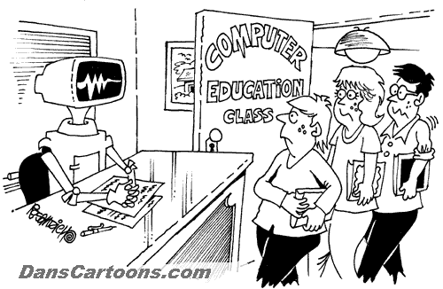
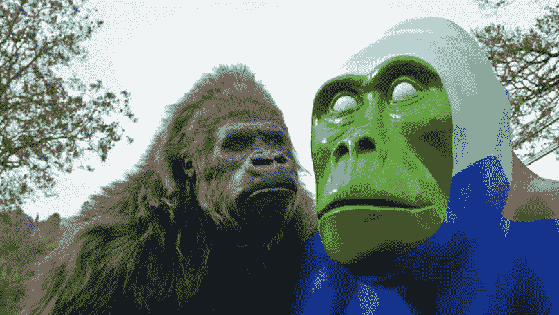

# 你应该害怕 AI，但不是因为好莱坞告诉你的。

> 原文：<https://medium.datadriveninvestor.com/you-should-be-afraid-of-ai-but-not-because-of-what-hollywood-has-told-you-4c8eb20d540?source=collection_archive---------11----------------------->

Future……Future…….

(最初发布于 LinkedIn)

诚然，我最喜欢的电影之一是 IRobot。我喜欢任何有机器人和人工智能的电影。但是这是一种有罪恶感的快乐，因为好莱坞，像大多数事情一样，倾向于从计算机科学中获取它想要的，而留下其他的。人工智能是它最喜欢的主题之一，甚至在出现任何类似沃森的东西之前就一直如此。2001 年《太空漫游》中的 HAL 9000 经常被许多评论家评为“电影中最好/最恐怖的反派”。我认为这只是有趣的电影理论讨论，但相反，我听到的是这种不断的偏执，即自动化将取代人类的位置，并决定什么对我们最好。在这里我也需要做一点声明:人工智能和机器人不是同义词，但因为我们希望给机器人人工智能和使用机器人给人工智能物理身体，为了这篇文章，我将它们视为同一枚硬币的两面。

**无论如何，我们真的是以自我为中心:**

我们倾向于在我们的图像中思考概念，希望看到人性，即使显然没有人性。这就是为什么你的电源插座看起来像一个表情符号版的“尖叫”人。但是正是这种对我们自己的偏见才让我们感到害怕。Pareidolia 和 Dunning-Kruger 效应合在一起就是机器人/人工智能的可怕之处。

为了理解这一点，我们需要停止假装和散布恐惧，技术比它实际上更有能力(直觉)。正如约翰·朗博士在伟大课程 plus 的*机器人*系列中解释的那样，机器人和人工智能擅长我们不擅长的事情，但不擅长我们擅长的事情。他们可以比最有经验的数学家更好地划分非常复杂的数字，但两岁的人类可以学会区分人脸，就像我们最近才学会用人工智能做的一样。让我们用一个有趣的例子来说明这一点！

**令人作呕的例子:**

康奈尔大学的研究人员创建了一个深度学习模型来区分狼和狗。它正确地识别了许多狼的照片，但随后又将一只哈士奇犬识别为狼。公平地说，我猜哈士奇看起来像狼…但这不是原因。经过进一步测试，它是根据画面中是否有雪来决定的！这是我在许多技术会议上讲过的一个幽默的例子，但还有更多阴险的例子。

来自四面八方的非常聪明的人已经争论过这将走向什么样的政治方向，但我将给出一个最容易解释但相当严重的例子。

我认为错误主要在于我们如何把事情分配得很清楚是“主观”还是“客观”。绝大多数人实际上错误地使用了这些术语，但这超出了 Linkedin 快速阅读的范围。关键是，我们已经在文化上认为任何与硬件或软件相关的东西都是“客观的”，也就是说，没有偏见、成见、偏好、意识形态、政治等等。基本上，所有或多或少是人类独有的东西。问题是人类制造了软件。这听起来很像是我在自说自话，但这是我在大学里反复学到的一个错误，即使是伟大和受人尊敬的学者也会犯这个错误。我们必然会受到我们的经历、背景、观点等的限制。这可以是一种实力，但是没有不好很难有好的。事情是这样的:一位聪明的数据科学家对大量数字有着罕见的敏锐理解，他创造了一个人工智能，可以处理许多关于已定罪罪犯的图像和文件。它是如此复杂，以至于只有极少数数据科学家能够理解它实际上是如何工作的，并对其进行修改。它获得了尽可能多的互联网数据，目的甚至是减轻创造者的偏见。正如他们所说，它被投入生产，在你知道之前，它根据肤色预测谁会成为罪犯。我们已经花钱请人来做了，现在怎么办？这不是一个理论上的例子，这实际上发生了，即使生活在岩石下也不能保护你免受它们的名字。谷歌一直以自己是一家具有前瞻性思维的公司而自豪，甚至惹恼了许多极右翼共和党人，因此具有讽刺意味的是，他们的软件本可以被一个没有太多区别的茶党边缘政客所取代(见:过去搜索“大猩猩”的图片会出现有色人种)。如果你现在尝试，你就不走运了。谷歌在被要求修复它后，设法在三年内迅速修复了它，所以我想这就是原因。)这是因为我们认为数据是“客观的”(尽管很少有人在其正确的学术认识论定义中使用它，但那是另一天的战斗)。但是即使是这个刚毕业的大学生也可以整天歪曲数字来表达我想让他们说的话。如果你不相信我的观点，看看评论。我相信会有人好心给你解释的。在任何情况下(撇开小毛病不谈)，您可能会想起在同一事件中听到/看到相互矛盾的统计数据的时候。

Did not want to use actual screenshots of Google’s mess-up as I don’t want to show faces…..So here is a disappointed King-Kong.

**所以总之………………:**

在这里用政治手指指指点点真的不会有多大作用；声称谷歌人工智能开发人员有种族主义议程(这篇文章已经危险地接近“对 LinkedIn 来说太政治化了”)并没有给我带来多少好处。关键是我们高估了自己把握真实能力的能力，以做到不偏不倚。开发真正没有偏好的软件(或任何东西)就像那些试图达到绝对零度的科学家一样。他们已经非常接近了，但是还没有真正到达。那我们怎么才能接近呢？有几种方法。最明显的一个趋势是更加多样化的招聘。对于一个解决方案来说，这可能是一个很好的核心，但是我们到达了一个众所周知的吃蛇尾巴，因为一般来说，越来越多的招聘软件和流程被证明存在上述问题。例如，雇佣软件更倾向于支配性而非和解性的语言(例如，男人和女人通常被教导重视自己的方式)，以及偏爱讲述与我们认为他们背景的人应该拥有的一致的故事的人的流程(例如，几乎要求非白人解决问题，这是大多数白人没有的期望，包括我自己)。).那还有什么？我建议努力接受和欣赏尽可能多的来自不同资源的批评，包括人口统计学和思维过程。说到这，你觉得呢？我不需要人工智能就能知道你有意见，而且我想看看。诚实的讨论是我们对自己的 HAL 9000 的唯一防御。

**来源:**

【https://www.afcea.org/content/ai-please-explain-yourself 号

[https://www . datasciencecentral . com/profiles/blogs/人工智能 vs 机器学习 vs 深度学习](https://www.datasciencecentral.com/profiles/blogs/artificial-intelligence-vs-machine-learning-vs-deep-learning)

[https://hacker noon . com/dogs-wolves-data-science-and-why-machines-must-learn-like-humans-do-41 c 43 BC 7 f 982](https://hackernoon.com/dogs-wolves-data-science-and-why-machines-must-learn-like-humans-do-41c43bc7f982)

[https://arxiv.org/abs/1602.04938](https://arxiv.org/abs/1602.04938)

[https://www . Washington post . com/opinions/2018/12/17/why-your-ai-may-be-racistic/？no redirect = on&UTM _ term = . d79c 6262 f16c](https://www.washingtonpost.com/opinions/2018/12/17/why-your-ai-might-be-racist/?noredirect=on&utm_term=.d79c6262f16c)

[https://www . the verge . com/2018/1/12/16882408/Google-种族主义者-大猩猩-照片-识别-算法-ai](https://www.theverge.com/2018/1/12/16882408/google-racist-gorillas-photo-recognition-algorithm-ai)