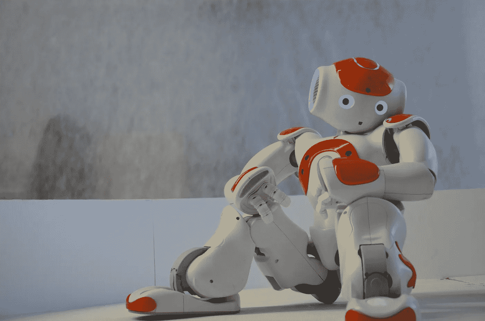

# 你也应该花更多的时间学习

> 原文：<https://medium.datadriveninvestor.com/you-too-should-spend-more-time-learning-3669f9c044a0?source=collection_archive---------2----------------------->

## 为什么学习和“忘却”在我们成为电子人的世界中是至关重要的技能

Photo by [Erhan Astam](https://unsplash.com/@vaultzero?utm_source=unsplash&utm_medium=referral&utm_content=creditCopyText) on [Unsplash](https://unsplash.com/s/photos/robot?utm_source=unsplash&utm_medium=referral&utm_content=creditCopyText)

不管我们喜不喜欢，我们已经是半机械人了——科技增强了人类能力的杂交生物。

让我解释一下为什么，这对数字时代的学习意味着什么。

上周，我参加了一个活动，席间话题转到了优步和 Lyft。与会者都是反垄断专家。他们在讨论拼车公司最近遇到的法律难题。

我想积极参与讨论。主要是因为我把这样的讲座看作是一个学习的机会。

在过去，在互联网和智能手机出现之前，最好的策略是改变话题——轻轻地将谈话引向我更了解的话题。或者，保持沉默，希望有人将话题转移到更熟悉的领域。

 [## 教科书行业如何最终被颠覆，并将继续改变|数据驱动…

### 就此而言，教科书产业在美国乃至全世界都有着悠久的历史。事实上，他们已经…

www.datadriveninvestor.com](https://www.datadriveninvestor.com/2018/09/25/how-the-textbook-industry-has-finally-been-disrupted-and-will-continue-to-change/) 

但是在数字时代，我们都变成了电子学习者。在听其他人讲话的同时，我用智能手机“谷歌”了一些关于拼车公司、他们的司机以及最近串通指控的信息。

我通过使用技术，实时提高了我的人类能力。尽管这项技术还没有被植入，但也有可能被植入。毕竟，智能手机无缝地融入了我们的日常生活。

结果是惊人的。几分钟之内，我就能跟上谈话，而且还能对讨论做出重要贡献。

这不是一个孤立的例子。我们一直都在使用类似的“增强策略”。

我们都熟悉智能手机为我们提供相关信息的不同情况，这些信息让我们能够应对日常生活中的挑战:

*   我们可以拍一些东西的照片(例如，一株植物或一朵花)，我们的智能手机会告诉我们看到了什么。
*   如果我们听到一段我们喜欢的音乐，我们可以使用我们的手机，Soundcloud 会立即为我们识别它。三十秒后(使用 Spotify)，我正在手机上听那首音乐。
*   而且，无论何时我们迷路了，谷歌地图都会让我们回到正轨。

我们可能不喜欢接下来的事情，但这似乎是不可避免的——可穿戴设备通过机器-思维接口为我们提供了即时访问“群体智慧”的机会。

## 在一个即时专业知识的时代，我们还需要学习吗？

最近这个问题让我夜不能寐。如果信息和知识如此唾手可得，我们还需要学习什么吗？

我自己也是老师。当然，我需要知道该教下一代什么。但是，在一个即时知识和专业知识的世界里，专注于积累知识似乎并不明智。

那么，这是否意味着教师的终结？不，当然不是，但是我们必须开始改变我们的课程内容和教学方式。不再强调信息共享是没有意义的。我们需要对自己诚实——几乎在任何话题上，每个人都可以获得更好的信息来源。

这一切当然不足为奇。只要上网(利用我们的电子人能力)看看未来需要什么。你会发现很多关于软技能和人际技能的文章。网络。团队合作。创造性思维。解决问题。仅举几个例子。

我完全同意，我们不应该教计算机和人工智能应用程序可以做得更好的东西。我们必须学会如何与人工智能一起工作，并理解我们可以带来的人类能力。

所有这些似乎都是真的。但是还有一项技能我们必须学会。

> 我们必须学会如何学习和忘却！

再说一次，这并不是积累相关知识(以及忘记不再有用的经验)。而是不断重塑自己。这是关于理解你在新兴技术主导的世界中的角色。但这也是关于理解你的角色将如何不断变化和发展。

## 电子人学习

本周早些时候，我正在给内部法律顾问提供培训。我们谈到了变化和转型。那次经历让我害怕。一些参与者认为理解人工智能和其他新兴技术是浪费时间。他们告诉我，法律工作永远不会改变。

然后是对新发展真正感兴趣的群体。但是他们认为他们没有时间去研究它并跟上最新的技术。

这两种观点都是错误的。根据世界经济论坛的一份报告，到 2022 年，我们都将平均需要 101 天来进行再培训和提高技能。到目前为止，我的经验是这个估计是相当准确的。

由于“重塑自我”的能力将成为 21 世纪 20 年代的一项基本技能，你的学习方式也必须改变。正式的、结构化的“课堂”培训将变得不那么重要。如今，在“在职”培训被视为最重要的学习组成部分的地方，“社交和同伴学习”预计将成为未来的主导学习。

公司似乎意识到了学习来源的变化，并开始实施学习平台，员工可以在这里交流想法，策划和分享有趣的文章、播客、视频等。

## 还有，“忘却”的艺术

然后就是忘却。

在一个重新发明的时代，一剂协调的混乱——有些人称之为开放的思想——是必不可少的。这意味着你必须愿意放弃一些给我们带来舒适和安全的确定性。你必须愿意放弃构成我们生活的过程和程序。

放弃熟悉的套路从来都不容易。我开培训班的时候经常能看到这种情况。参与者不愿意接受旧流程和程序面临生存威胁的观点。太多的人对他们固定的操作方式太过舒适。

但是每个人都必须准备好接受新的事物，不受旧事物的阻碍。我们必须“学会如何忘却”

我相信，我们对新世界了解得越多，就越容易摆脱旧的思维和运作方式。在一个无摩擦信息的世界里，我们从任何一个版本的自我中解放出来，并提供了独特的机会去做我们选择的任何事情和成为我们选择的任何人。这种定制电子人自我的能力是数字革命的决定性特征之一。