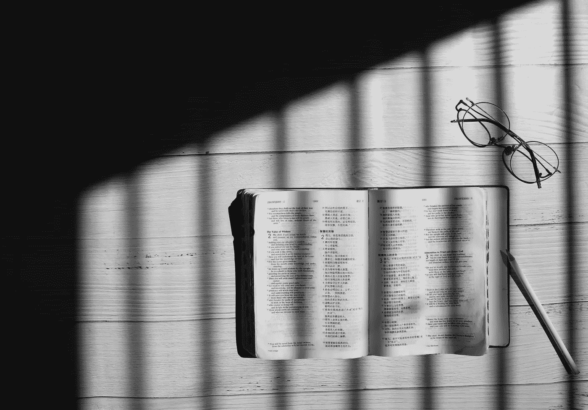

# 你只和你消费的内容一样好

> 原文：<https://medium.datadriveninvestor.com/youareonlyasgoodasthecontentyouconsume-a099bd7962f1?source=collection_archive---------14----------------------->

What’s the last book that you’ve read?

> "首席执行官平均每年阅读 60 本书"
> 
> 大约四分之一的美国成年人(24%)说[他们在过去的一年里没有读过一本书的全部或部分内容](https://www.pewresearch.org/fact-tank/2018/03/23/who-doesnt-read-books-in-america/)，无论是纸质、电子还是音频形式
> 
> “如果我们遇到一个才智非凡的人，我们应该问他读什么书。”——拉尔夫·瓦尔多·爱默生
> 
> “你五年后会成为什么样的人，是由你今天花时间与之相处的人和你读的书决定的。”——乔·邓肯

如果你了解我，你可能知道我是一个固执的读者。我真的一直都是。我妈妈和我小时候每天晚上都一起看书。我曾经赢过小学和中学所有的“阅读比赛”。

但是后来…我就不读了。为什么？不太确定。高中没读过。那些指定的书？哦，我不认为我真的读过那些。我的论文得了 A，我为什么要看呢？？在大学里也是这样…我花了 3 个小时写了一篇 5 页的论文，却得了 A，甚至没有买书。

但是两年前的夏天，我意识到一件事，我有一段时间没看书了。我不断看到这样的消息:CEO 平均每年阅读 60 本书。所以我心想…嗯，我想当 CEO，不是吗？

于是我开始看书。

人们以各种不同的方式接受内容。有些人喜欢听播客，看 YouTube 视频，或者读文章(可能像我一样)，但我主要是看书。这将是今天的重点，周二将围绕我的阅读目标，我将在周四跟进，更详细地了解我在读什么，读多少，为什么读。

这就是我今天想思考的三件主要事情，我在消费内容方面做的三件次要事情。

> 1.听播客
> 
> 2.观看 YouTube 或 IGTV 视频
> 
> 3.阅读文章

**1。听播客**

这些都很棒，我很喜欢听其中的一些。但是，可能会有很多绒毛。如果我在听一个采访，我可能已经听过这个信息了，我可能已经按照这个信息行动了。但是，我喜欢看到事情结束，当它的内容。我喜欢听到不同的观点，播客绝对允许我这样做。但是，如果它只是我已经听说过的东西，我宁愿把我的精力花在其他地方。

It’s good to listen sometimes

话虽如此，我有时喜欢听的一些播客(链接如下)包括刘易斯·霍维斯的“[伟大学校](https://lewishowes.com/blog/)”、加里·维纳查克的“[加里维音频体验](https://www.garyvaynerchuk.com/podcast/)、乔伊·塞韦洛的“[乔·钱播客](https://www.thejoemoneypodcast.com/)、加里·罗斯的“[蓝领咨询集团播客](https://www.bluecollarconsultinggroup.com/podcast)、拉沙德·比拉尔的“[赚你的闲](http://earnyourleisure.com/)”和我个人最喜欢的……安迪·弗里塞拉的“[MFCEO 项目](https://andyfrisella.com/blogs/mfceo-project-podcast)。

**2。观看 YouTube 或 IGTV 视频**

我看 YouTube 上的视频，Twitter 上的视频，IGTV 上的视频。但是，我不把这些作为重点，为什么不呢？

我关注的一些人是[格兰特·卡尔多内](https://www.instagram.com/grantcardone/)(和[艾琳娜·卡尔多内](https://www.instagram.com/elenacardone/)，[加里·维纳查克](https://www.instagram.com/garyvee/)，[贾斯普雷特·辛格的《少数民族心态账户》](https://www.instagram.com/minoritymindset/)，[戴蒙德·约翰](https://www.instagram.com/thesharkdaymond/)，[兰德尔·皮奇](https://www.instagram.com/randall_pich/)，[蒂姆·格罗弗](https://www.instagram.com/attackathletics/)，[安迪·弗里塞拉](https://www.instagram.com/andyfrisella/)，[泰·洛佩兹](https://www.instagram.com/tailopez/)等等。虽然上面列出的人是我在 YouTube、IGTV 或两者上观看的最长内容的发布者。

I love being able to easily review what I learn

都是自由流动的。虽然我确实喜欢这种长格式的内容，但有时我很难以一种容易检索的方式跟踪我的笔记。如果我要看视频，我倾向于不像看印刷的东西那样记很多笔记。因此，我觉得当我观看视频时，我的记忆力不如当我阅读允许我直接在所学内容中记笔记的内容时好。

**3。阅读文章**

Let’s learn together

我喜欢读文章。我关注一些伟大的人(链接如下)。我在 LinkedIn 上看到来自[奥列格·维什内波尔斯基](https://www.linkedin.com/in/vishnepolsky/?originalSubdomain=uk)和[加里·维纳查克](https://www.linkedin.com/in/garyvaynerchuk/)的文章。我追随阿约德吉·阿沃西卡、本杰明·哈迪、大流士·弗鲁和其他一些人。

但是，这些人大多不仅仅关注文章。加里写了许多书，经常演讲。到目前为止，Ayodeji Awosika 已经写了两本书。本杰明·哈代正在写一本书。除了其他资源，Darius Foroux 还有一个播客和一本电子书。

文章很棒，但它们真的不用花那么长时间来写……(我应该知道，因为我每周写 3 篇)。再加上大多数人(不是所有人)花在写作上的时间很少，它们也不需要大量的数据或思考。

有些人，比如哈代先生，他们的文章比我、奥列格或加里要深入得多，他们的文章有时不到 200 字。

尽管总的来说，文章本身通常缺乏足够的信息和全面的数据。

Learning is everywhere

我喜欢以不同的方式从不同的人那里获取内容。太棒了，我一直在学习。对我有效的可能对其他人不一定有效，这没关系。这就是我欣赏加里·维纳查克的地方，他在每一个平台上，以每一种形式制作内容，并且永远是真实的。

我总是愿意尝试新事物，与 6 个月前相比，我现在追随了更多的时尚影响者。我看的或者想看的书，很多都是来自别人的推荐。我听的很多音乐可能是因为别人告诉了我这张专辑或这位艺术家。

我们都有不同的目标，我将在周二的文章中深入谈谈我的阅读目标。