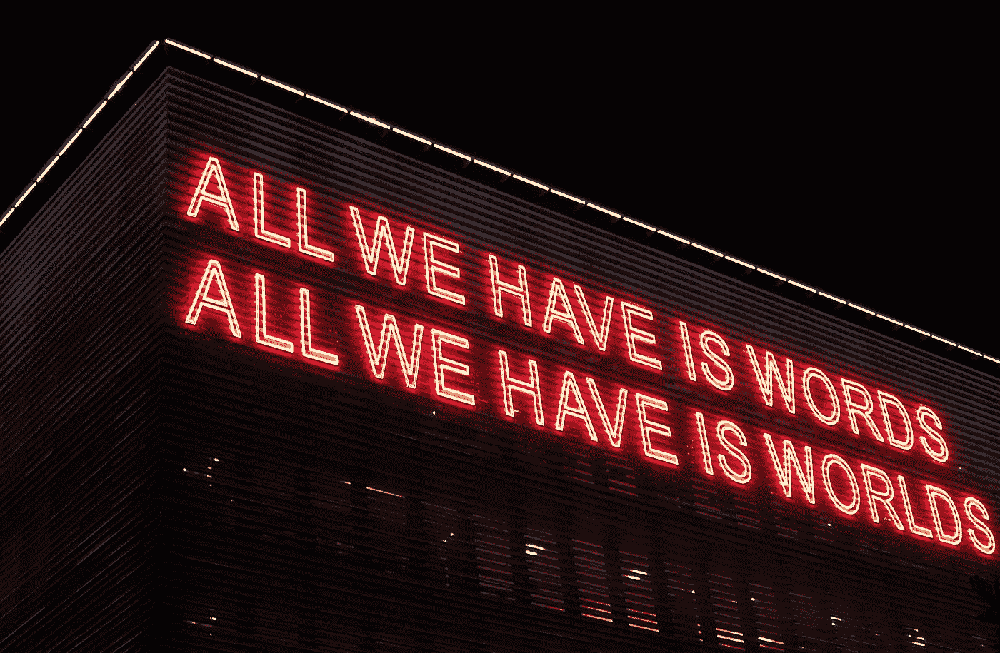

# “我会做到的。我向你保证。”角。2

> 原文：<https://medium.datadriveninvestor.com/youhavemyword-4ec03f201534?source=collection_archive---------21----------------------->

我们可以说些什么，但这并不总是意味着我们有利害关系。

当事情变得艰难时，会发生什么？我们可以退出，对吗？

> “哦不！我不是那个意思！”我们有时会说。

但是，为什么不承认呢？为什么不承担改变事物的责任呢？因为很难做？因为人们可能会把我们排除在外？(反正他们就是这么做的)。

 [## 不开玩笑:营销是为了搞笑——数据驱动的投资者

### 当你把幽默和营销结合在一起时，这是一件有趣的事情。当然，马克·安德森希望如此。别叫他雪莉。相反…

www.datadriveninvestor.com](https://www.datadriveninvestor.com/2019/02/25/no-fooling-marketing-goes-for-laughs/) 

不在乎别人说什么真的是一种力量。对我来说，我的话就是金子。但是，人们并不总是理解这意味着什么。这可能意味着很多不同的事情。如果我说我要做什么，我就会去做。但当我这么做时，它可能会改变，可能会有一点波动。我不介意。我不介意人们有时误解我或者我是谁。

加里·维纳查克是这方面的大师，我下面也将重点介绍他。多年来，他一直能够埋头苦干，能够无视赞扬和批评。因为他知道自己的使命，他知道自己的愿景，他会去实现它。句号。

我说过一些话，我承诺过一些事，但我没有坚持到底。我不经常这样做，我不经常宣传这个，但我努力做到真实，我说过我要做一些事情，但我没有…

我说今年每周日，周二，周四都要写文章。今年我想做 4 件大事，写作是其中之一。我甚至把它写在我的白板上作为提醒。但是，我请了整整 8 周的假。但我真的不为此烦恼。

> “如果你告诉所有人你要做某件事，但 100 天后你发现这不是正确的选择，那是一种优势——而不是劣势。”—加里·维纳查克

我会在周四进一步讨论这个问题，原因如下:

因为即使你口头承诺了什么，那也不是你承诺的。当我在[周二](https://link.medium.com/PyyxYIO0CX)开始时，我也将在周四继续深入到一个承诺中，并思考我真正认为承诺某事意味着什么。请允许我在周四写下我们全心全意的承诺时进行更多的思考。