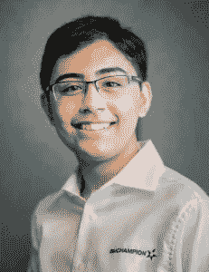
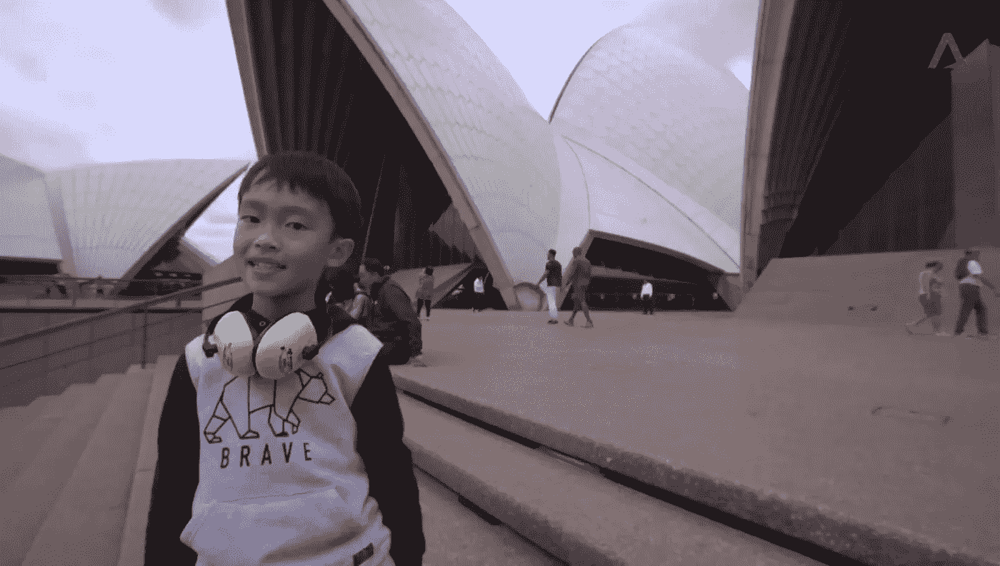

# 当代的年轻程序员

> 原文：<https://medium.datadriveninvestor.com/young-programmers-of-this-modern-age-b40303ff21df?source=collection_archive---------4----------------------->

众所周知，科技发展迅速，如今科技正吸引着当代的新一代。在这篇文章中，我想向你介绍一些这个时代的年轻程序员。

首先让我自我介绍一下。我是詹姆斯·罗根，我是一名记者。现在我想说为什么我选择这个话题，我喜欢阅读文章，最近我听说了许多这个年龄的年轻程序员，他们是自学的。所以我认为写一篇关于他们和媒体的文章是与这个星球上的每个人分享我们信息的最好方式。

Tanmay Bakshi

让我们见见坦梅·巴克西。他是一名自学成才的青少年开发人员，从五岁开始就开发了几个应用程序和源代码。2004 年，在他一岁的时候，他的父母从印度的德里移民到了 T4 的布兰普顿。普内特·巴克西神父是一名电脑程序员。妈妈 Sumita 是家庭主妇。Tanmay 是世界上最年轻的 IBM Watson 程序员。现在，他是一名计算机程序员、人工智能专家和全能技术专家。他开发了多种应用程序，出版了一本书，主持了一场 [TEDx](https://www.youtube.com/watch?v=y-lyzsqnK-c) [演讲](https://www.youtube.com/watch?v=y-lyzsqnK-c)，并在包括芬兰、新西兰、丹麦和澳大利亚在内的世界各地的 IBM Watson 峰会上发表了演讲。

但是他有些令人惊讶的地方:他只有 14 岁。

尽管巴克西在 11 岁时第一次引起 IBM 的注意，但他在科技行业的崛起要早得多。当同龄人在堆乐高积木和玩虚拟游戏时，一个五岁的巴克西正在学习如何编码。

他的父亲 Puneet Bakshi 多年来一直是一名计算机程序员。当老巴克西打出代码时，他着迷的儿子看着这个过程。

他的父亲察觉到了这种初露头角的好奇心，于是教他如何编程。从那时起，Bakshi 开始自己使用互联网并阅读编程书籍。

七岁时，Bakshi 建立了一个 YouTube 频道，在那里他发布了关于编码和网络开发的教程。每次上传视频，他都会收到来自世界各地的数千个问题。

他对同龄人来说是一个很好的激励。

现在让我们见见安什·多曼。他还是一名自学成才的青少年程序员。他是一名 Android 和 iOS 应用程序开发人员，对人工智能有着浓厚的兴趣。

16 岁时，他开始编程，在几周内学会了许多语言，并在 16 岁时在 play store 推出了他的第一个应用程序。

> 他来自印度的那格浦尔(马哈拉施特拉邦)，在一次采访中他告诉我们，他从第一次接触电脑时就对技术如此着迷。他没有很大的编程背景，他过去常常看到他父亲的弟弟做编程，这引起了他对编程的兴趣，而他也在做他用来编写代码的第 10 标准准备，给两者同等的时间。

他向我们展示了他在 android world 中的许多创作，像 snapchat 这样带有面部过滤器的增强现实应用程序，机器学习应用程序，像 shareIt 和 PC 应用程序共享这样的快速共享应用程序。现在他在机器学习，深度学习方面洗手不干了。他告诉我们他的使命是帮助那些编程能力差的人，他想和这个世界分享他的知识。所以他计划在 YouTube 上建立一个频道，因为他认为 YouTube 是这个星球上分享知识的最好方式。

他对每个人来说都是一种神奇的灵感。

Seth Yee

现在来认识另一个伟大的神童 Seth Yee。Seth Yee 懂三种编程语言 Arduino，JavaScript，Python。他以年龄比他大两倍的学生的水平思考问题。他是一个非常有天赋的孩子。他对量子计算和物理学感兴趣。2 年前，他在 KSP 建造了一艘船中船(Kerbal 太空计划)。

他说，当我在电脑上编码时，我感到非常兴奋，因为我可能能够给人工智能编程，我可以与它进行虚拟对话。

在 6 岁的时候，新加坡的老师联系他们的父母，告诉他们 Seth 他理解我们所教的东西非常快，而且他分散了其他同学的注意力。所以他的父母决定搬到澳大利亚的墨尔本，在那里参加墨尔本一所小学提供的课程。计算机教师基伦·诺兰(Kieren Nolan)对这位来自新加坡的新学生的第一印象是，就他的年龄而言，他是多么聪明。“令我震惊的是他是如此先进。老实说，我认为他的很多想法都是大学水平的，”他说。

诺兰先生目前教授赛斯编码、计算机构建和区块链技术。

UNSW 大学的量子工程学教授安德里亚·莫瑞罗博士带着这个 8 岁的孩子参观并解释了他的研究。他给 Seth 的建议是，如果他想成为一名“专业科学家”:要有毅力。“对于这样一个聪明又好奇的孩子来说，最重要的是在某个时候学会坚持一件事并坚持到底，”他说。“他必须决定这就是他想要的，并成为某方面的佼佼者。”

他也是每个人的伟大灵感之一。

现在让我们总结一下，我仍然在为这个世界上许多年轻的程序员做研究。第 2 部分将很快带来更多年轻程序员和他们的故事。