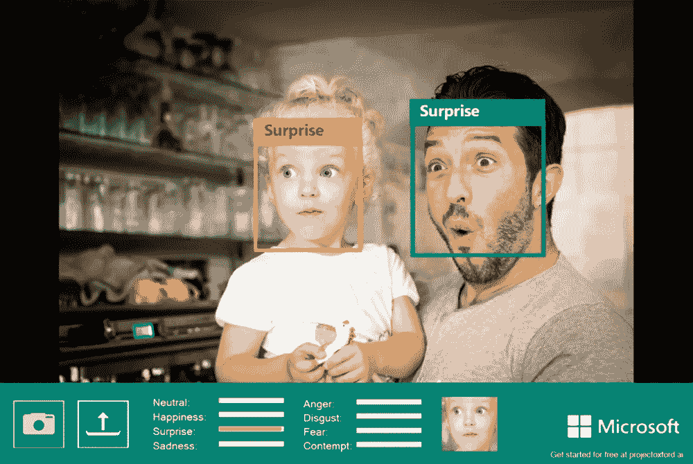

# 你的应用程序可以读取情绪。人工智能与微软的认知服务

> 原文：<https://medium.datadriveninvestor.com/your-apps-can-know-read-emotions-ai-with-microsofts-cognitive-services-f6ff1f4788db?source=collection_archive---------26----------------------->

微软开发人员希望将人工智能带到所有技术用户的每一次数字体验中。他们正在使用人工智能来创建更加个性化的计算，提高生产力，重塑业务流程，并建立智能云平台。他们使用人工智能的主要目的是通过使设备更强大和增强使用体验来增强人类的能力。微软认知服务提供的五种人工智能服务是视觉、语音、语言、知识和搜索。微软研究院执行副总裁 Harry Shum 发表了一篇演讲，讨论了微软目前如何使用人工智能来做出将改变未来的预测。

视觉可以用来检测几乎任何物体，并通过训练学会检测不寻常的物体。然而，它能做的最疯狂的事情之一是通过分析面部表情和学习个人特定的面部表情模式来读取情绪。语音是用来做翻译器的，语言是用来做语言分析的，信息是用来做知识探索的，搜索对 bing 自动建议有好处。微软总是确保他们的认知服务在可扩展性、[安全性、](https://medium.com/@gabnyante/imagine-this-no-more-passwords-for-anything-c73e8e430482)和灵活性方面超越标准。

微软的项目经理安娜·罗斯做了一个关于情感 API 如何工作的演示。Emotion API 可用于微软认知服务，它使用计算机视觉来查看图像或视频中的人脸，并根据心理学研究和数据的历史来识别人的情绪和情绪程度。然后，它基于情感识别个性化数字体验。

API 可以判断人是中立的、快乐的、愤怒的、厌恶的等等。[他们为一名视障人士带来了他们的产品。他的眼镜可以检测并向他描述与他交谈的人的情绪，所以他知道人们对他所说的话有什么反应。](https://www.youtube.com/watch?v=rVF2duPVUTY&list=PLD7HFcN7LXRdHkFBFu4stPPeWJcQ0VFLx&index=1)

Bing 的合作伙伴主管和项目管理 Gurpreet Singh Pallon 讨论了下一个主题，Bing 提供的 API 服务。在一个 API 调用中，你可以看到视频图像、新闻、文献搜索，所有这些都包含在一个调用和蓝色链接中。垂直搜索是他们用来帮助缩小你的结果。当使用搜索时，你可以用它来筛选出你要找的东西。图像 API 也称为垂直搜索 API，它可以更好地了解用户的意图。它知道用户现在只寻找图像，可以更好地过滤，给你更多你正在寻找的东西。其中一个演示是自然壁纸，在演示中，他可以切换搜索以显示紫色在图像中占主导地位。另一个搜索展示的是可爱的动物。他将图像类型转换为线条，这样他就可以用空白的轮廓来着色。有了这个 API，有人甚至可以查看视频的质量。他们推出了带有音频的 30 秒预览的运动缩略图，这样人们就可以从 Bing 中整合丰富的视频搜索。

在演示中，他还展示了一个字幕机器人。如果你给机器人一个图像，它会告诉你一些关于这个图像的事情。这个机器人可以认出名人，告诉他们这个人是谁，描述他们穿什么，告诉他们脸上的表情。幕后发生的事情是在 Skype 环境中使用 bot 开发者框架运行的。

下一个演示是关于语言和翻译 API 的。Tele2 的执行副总裁 Lars Torstensson 演示了微软翻译 API。他对着手机说话，当他和某人通话时，手机会把他对朋友说的话翻译成他的语言，反之亦然。它适用于所有设备，不需要任何应用程序。

ProDeaf 的首席执行官 Flávio Almeida 的使命是让有听力障碍的人能够与他人交流，他演示了人们如何用任何语言对计算机说话，3D 人物可以用手语翻译。认知服务正在打破障碍，使我们能够以前所未有的方式进行研究、可视化和交流。我期待看到认知服务 API 的智能将如何继续改变我们与计算机以及彼此之间的通信方式。

如果你喜欢这篇文章，请一定要为它鼓掌！谢谢大家！

网址:[gabrielnyante.com](http://gabrielnyante.com)

邮箱:【info@gabrielnyante.com 