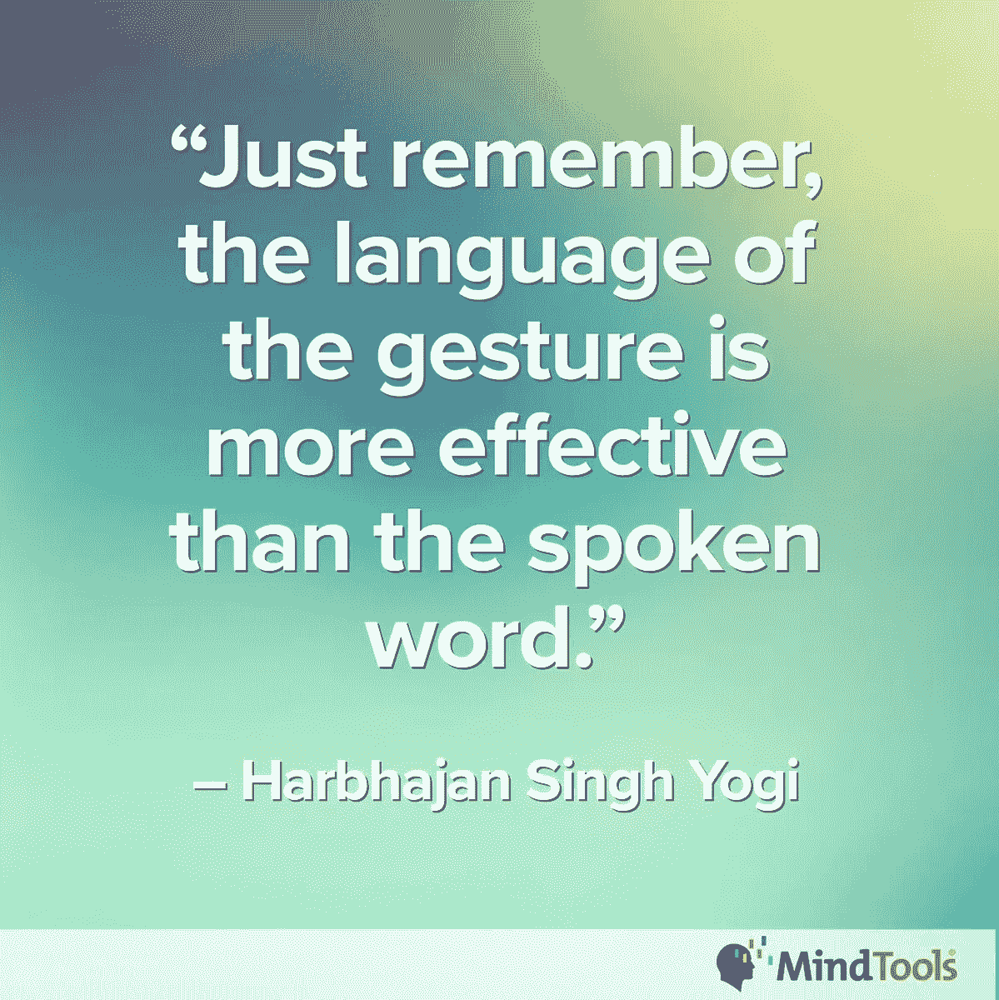
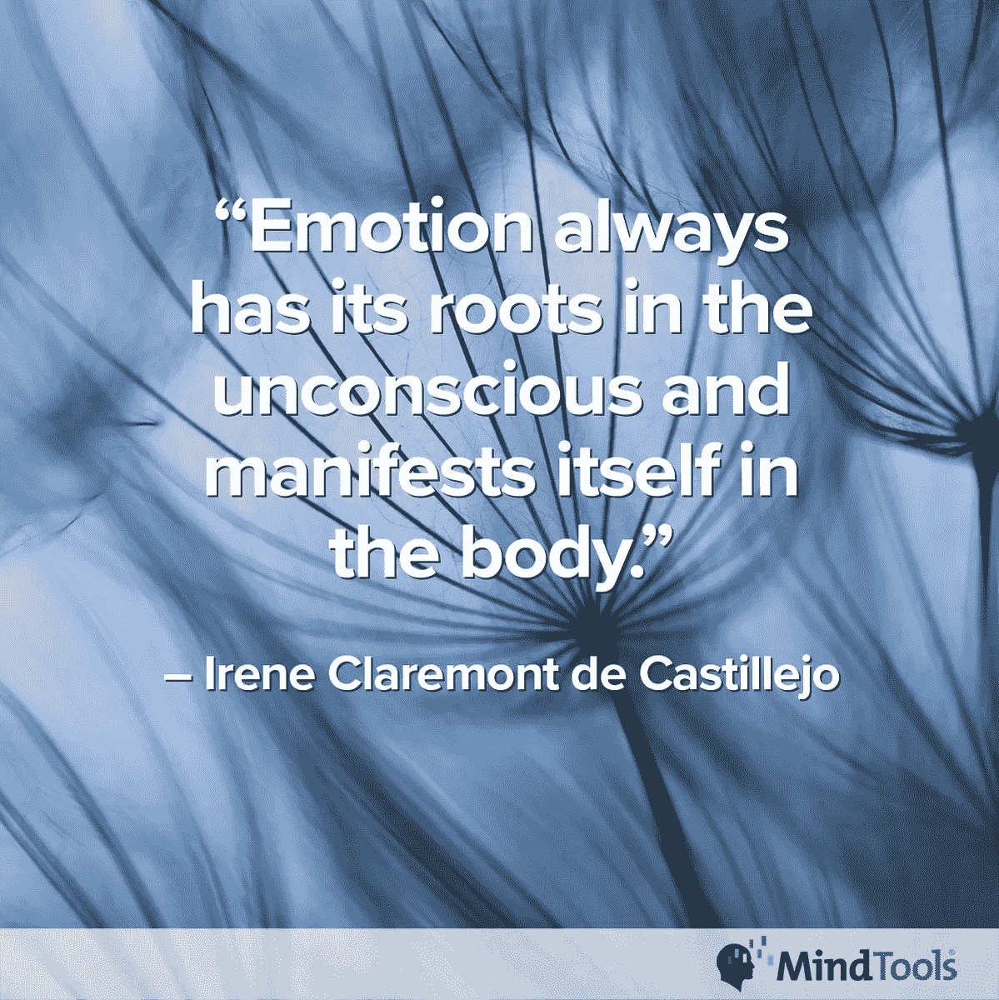
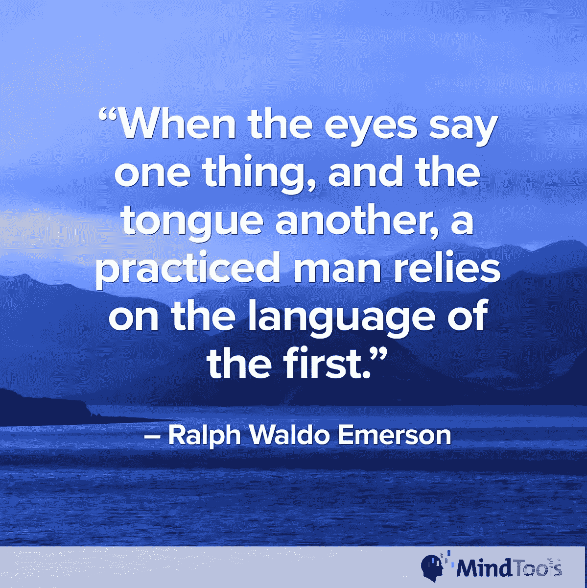
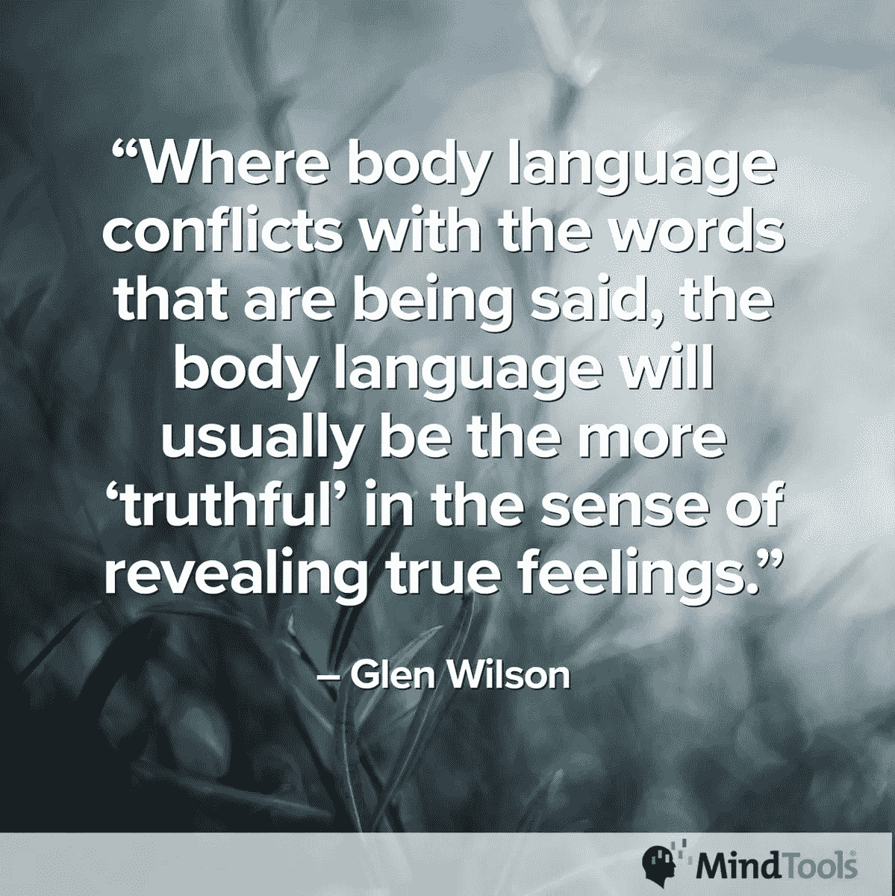
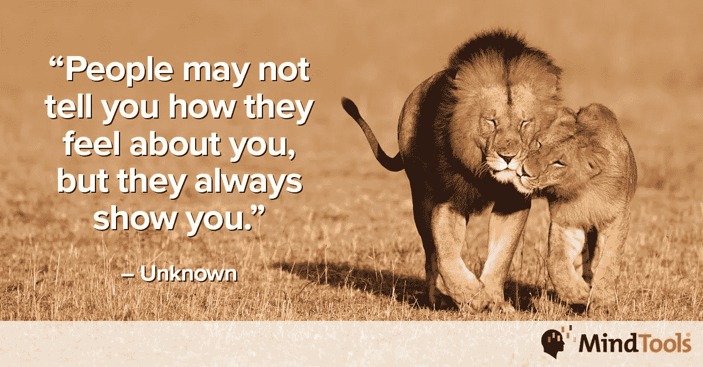

# 你的身体比语言更响亮

> 原文：<https://medium.datadriveninvestor.com/your-body-speaks-louder-than-words-ea9ea043d601?source=collection_archive---------0----------------------->

## 面部表情、手势和姿势传达了清晰的信息

在一个国家友好的表示在另一个国家是一种侮辱。肢体语言远非通用，然而这就是 90%以上的信息是如何传递的。

“肢体语言在每个国家和文化中都扮演着重要的角色，”[yolande Conradie](https://twitter.com/Yolande_MT)说，他是 [Mind Tools](https://www.mindtools.com/) 社区参与团队的负责人。“我们都使用语言，但我们也使用面部表情、手势和姿势来加强我们的信息或传达我们的话语所没有的真实信息。

“正如不同的人使用不同的语言，不同国家和文化之间的肢体语言也不同，”她说。

虽然手势据说能传达最多的信息，让听者更容易理解，但一项头脑工具调查不同意。51%的参与者表示，比起手势、语调和姿势，他们更关注面部表情。

“尽管我们认为面部表情非常重要，但许多冲突情况的发生是因为我们说话的方式，而不是我们说了什么。语气也很重要，”康拉迪说。“有趣的是，我们似乎都在观察身体语言的不同元素，并从中‘读出’不同的东西。”

 [## 糟糕的沟通和欺凌会增加压力

### 有毒的环境会把人推向危险的边缘

medium.com](https://medium.com/datadriveninvestor/bad-communication-and-bullying-throttle-up-stress-6666097e51d1) 

虽然这听起来违反直觉，但她说，肢体语言也对人们在电话中的声音起着重要作用。这就是为什么有效使用手机很重要。

美国这么大，敏锐的眼睛会根据肢体语言察觉地区差异。在国界之外，常见的竖起大拇指的手势——意味着一切都好——在中东的某些国家是一个粗鲁的信号。你想说或表示你很好，但你可能无意中侮辱了你的主人。

“在一些非洲文化中，当你走进某人的办公室时，你应该立即坐下，即使没有被邀请坐下，”康拉迪说。“在大多数西方文化中，这将被视为粗鲁。那些非洲文化认为站着和坐着的人说话是不礼貌的。”

# **不敬的标志**

在日本，盘腿而坐被视为不敬，尤其是在比你年长或更受尊敬的人面前。

康拉迪说:“在我生活的南非，一些种族认为与年长或地位更高的人目光接触是不尊重的。"其他团体认为缺乏眼神交流是不可信的。"

她引用了哈伯詹·辛格·瑜伽士的话:“只要记住手势语言比口头语言更有效。”

 [## 订婚是一个四个字母的单词

### 工作场所文化弥合了沟通上的差距

medium.com](https://medium.com/datadriveninvestor/engagement-is-a-four-letter-word-e49970cdd3fb) 

肢体语言完善了沟通画面。通过注意身体语言，你可以更容易理解他人，更有效地与他们交流。如果人们感到不舒服，他们的肢体语言会泄露出去——然后你知道要付出额外的努力让他们放松。

康拉迪说:“你用心、用头脑和身体倾听别人的心、用头脑和身体。”。“你创造了高度的信任。注意肢体语言可以帮助你建立高质量的联系。只要你的[人脉是高质量的](https://www.mindtools.com/pages/article/high-quality-connections.htm?utm_source=social&utm_medium=organic&utm_campaign=tweetchat)，你就能把一场对话变成一场对所有人都有利的对话。”

与你所说的不相符的肢体语言会让你失去观众的信任。“倾听”某人的话语*和*肢体语言会让你更加专注。如果对方看到你对他们说的或做的感兴趣，就更容易建立融洽的关系。

康拉迪说:“忽视某人的肢体语言，你可能会错过他们通过肢体语言交流的真正需求，然后你可能会给人留下漠不关心或没有同情心的印象。”“如果你真的在用心听别人说话，以便理解他们，你的肢体语言会突出你的意图。它建立信任和融洽。

“我经常谈论我们在头脑中编造的故事——以及我们需要的现实检验，”她说。“两只耳朵*和*两只眼睛——只有一张嘴:按那个比例使用它们。将你的身体转向他人，与他们进行坚定而温和的眼神交流——给予他们你的全部注意力——也会建立信任和融洽。”

肢体语言也传达了充分的情感。正如艾琳·克莱尔蒙特·德·卡斯蒂列霍所说，“情绪总是植根于潜意识，并在身体中表现出来。”

# 劝阻欺凌者

以一种相关的方式，肢体语言可以促成——甚至对抗——骚扰或欺凌。挑衅性的肢体语言——和狼牙棒——可以说服欺负者看别处。

康拉迪说:“尽管人们的话语听起来可能足够友好，但他们的肢体语言可能传达出优越感或侵略性。”“想想那句谚语，‘如果长相可以杀人’对于一个欺凌弱小者来说，让一个肢体语言显示出自信和主张的人陷入困境可能更困难，也更没有回报。"

Mind Tools [有一篇文章](https://www.mindtools.com/pages/article/manage-defensive-people.htm?utm_source=social&utm_medium=organic&utm_campaign=tweetchat)讨论了防御性的原因和迹象。它还探讨了有效管理防御性员工的方法。

 [## 让自己在社交上容易接近

### 美国政府的指导方针帮助每个人克服障碍

medium.com](https://medium.com/datadriveninvestor/make-yourself-socially-accessible-bbcebdac1678) 

解读肢体语言时，要小心陷阱。不要假设身体语言可能是残疾的结果。第一印象很重要，但是草率的判断会适得其反。

康拉迪说:“不要妄下结论，认为自己肯定是对的，然后指责他们以某种方式‘存在’。“不会有好结果的。解读肢体语言时，你需要意识到你的文化过滤器*和*你自己对肢体语言的价值观。

“在解读肢体语言时，要意识到自己的情绪和压力水平:你真的看到了你以为你看到的东西吗？还是你看穿了愤怒或挫折的过滤器？”她说。

当言语和肢体语言不匹配时，不要妄下结论。试着评估正在发生的事情。通过问一些好的问题来温和地探索。不要陈述你认为你看到的是事实。你可能错了。

“为诚实的人创造一个安全的空间，”康拉迪说。她建议说，“如果你对承担这个项目感到不舒服，你可以告诉我。我不会看轻你；我会尊重你的诚实。”

[Glen Wilson](https://www.goodreads.com/quotes/722745-where-body-language-conflicts-with-the-words-that-are-being) 也提到了诚实:“当身体语言与所说的话相冲突时，身体语言通常会在揭示真实情感的意义上更‘真实’。”

# 文字和身体同步

注意其他人对你所说的话的反应。如果出乎意料或者出乎你的意料，问问是不是出了什么问题。你的语调或肢体语言可能会出卖你。

如果你给人的印象是封闭或不可接近，你的态度可能会切断你从团队成员那里获得的信息流。他们可能会对你隐瞒问题和好主意。

康拉迪说:“如果你的肢体语言是开放的，即使在你经历压力或挫折时也没有威胁，人们会更信任你，也更支持你。”“当我年轻的时候，我的‘压力’脸给人的感觉是‘愤怒的脸’。我不得不学会微笑着面对压力。”

按照[路德维希·维特斯坦根](https://www.brainyquote.com/quotes/ludwig_wittgenstein_139240)的说法，“人体是人类灵魂的最佳写照。”

当有压力时，紧张是很自然的，这会加剧你的压力，有时会达到临界点。如果你因为压力而表现出“封闭”的肢体语言，这可能会导致你周围的人也以一种更有压力的方式做出反应。

“如果你感到压力或沮丧，你的肢体语言可能会给人以好斗的印象，”康拉迪说。"意识到自己的肢体语言并尽量保持中立是件好事。"

照照镜子或者拍段视频，看看你是如何给别人留下印象的。这些是公共演讲练习，适用于一对一或小组演讲。

# 描绘一幅真实的画面

康拉迪说:“这是一种有用的技术，我经常在提供帮助时使用——记录人们并回放给他们听。”。“只有这样，你才能看清你在别人眼中的真实样子。意识到以积极的方式控制你的肢体语言并不意味着你不真实或不诚实。这意味着你知道你对周围的人有影响。

“如果你有意识地改变你的肢体语言来创造融洽的关系，让别人知道你真的在用心听他们说话，你就是真实可信的，”她说。“你可以改变你的肢体语言，让它忠于你的价值观，而不是忠于潜在的破坏性情绪行为。”

**关于作者**

吉姆·卡扎曼是[拉戈金融服务公司](http://largofinancialservices.com)的经理，曾在空军和联邦政府的公共事务部门工作。你可以在[推特](https://twitter.com/JKatzaman)、[脸书](https://www.facebook.com/jim.katzaman)和 [LinkedIn](https://www.linkedin.com/in/jim-katzaman-33641b21/) 上和他联系。