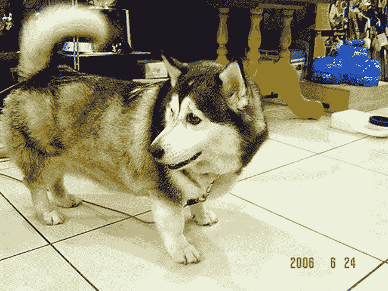
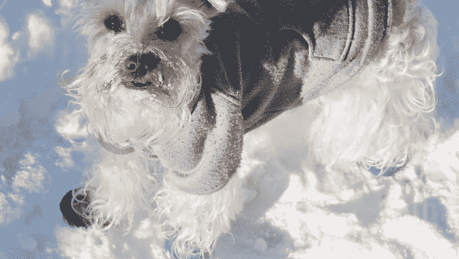

# 你的狗可能比你的公司更安全

> 原文：<https://medium.datadriveninvestor.com/your-dog-is-probably-more-secure-than-your-company-12059d4ed5bb?source=collection_archive---------17----------------------->

美国人花在宠物身上的钱是花在网络安全上的两倍

很有可能，你的云解决方案并不可爱或亲切。你可能挠不到你的数据中心的耳朵，也没有人把移动设备称为“人类最好的朋友”…到目前为止。

另一方面，养狗的人从来不会错过他们的狗的体检或疫苗接种，给他们的四条腿的朋友穿上保护鞋来盖住他们的爪子，并且会给已经有皮毛的动物披上毛茸茸的冬衣。

与此同时，全国各地的智能手机都有资格在收容所获得救助。根据皮尤互联网公司的数据，三分之二的美国人没有安装手机杀毒软件，超过一半的美国人经常在他们的设备上访问公共的、不安全的 wifi 网络，48%的人只在方便的时候更新他们的手机软件，或者根本不更新。

虽然科幻作家和千禧一代可能不同意，但我们对我们的技术没有像对我们的宠物一样的情感联系。这很好，实际上也很健康，但我们的移动设备确实保存着我们所有敏感的个人和财务信息。

美国人每年在宠物身上花费超过 600 亿美元。

这是 T4 在网络安全上花费的两倍。

网络罪犯敏锐地意识到了这种动态。Check Point 研究人员发现，每年 100%的企业都会遭到手机恶意软件的攻击，平均每个组织每年 [54 次](https://www.darkreading.com/mobile/mobile-malware-incidents-hit-100--of-businesses/d/d-id/1330453?piddl_msgorder=thrd)。个人和企业对智能手机的大量采用为潜在攻击者打开了机会之门。

没人想黑你的狗，但所有人都想黑你的手机。

点击此处，了解如何保护您的设备并确保可爱狗狗视频库的安全:

**如今，云是一只杂种狗，需要接种疫苗**

[Source](http://www.viralnova.com/cutest-mixed-breeds/) — probably the best article I’ve read all week

当你在网飞的时候，你的数据去了哪里？

通过多重云层，事实证明。网飞有自己的数据环境，自己的内容交付系统专用服务器……但是他们的流媒体业务全部托管在亚马逊网络服务的云服务器上，备份存储在谷歌云存储上。

如今，大多数公司都有类似的安排，称为混合云模式，[英特尔安全部门发现，57%的公司](https://www.forbes.com/sites/louiscolumbus/2017/04/23/2017-state-of-cloud-adoption-and-security/#3b70372f1848)混合使用私有云服务器和公共云服务，如 AWS、谷歌云或微软 Azure。

这就是共享安全模式如此重要的原因……虽然让云服务提供商巨头负责保护其客户的数据很重要，但客户也有责任保护自己的云。网络罪犯从安全漏洞中赚钱，一些疏忽(如客户假设他们的云服务提供商的安全措施足够)导致网络盔甲出现裂缝。

不保护自己的云的公司就像狗主人不给他们的狗打疫苗一样。

由于美国超过一半的狗都是杂种狗，而且绝大多数企业云模型都是杂种狗，这些混合环境需要正确的安全措施来安全和正确地运行。无论您的狗是纯种还是杂交，无论您的公司如何参与云，您都需要自己的云安全，就像您需要为您的狗接种疫苗一样。

养狗的人知道他们需要给他们的狗打疫苗——超过 70%的养狗人定期给他们的宠物打疫苗。然而，金雅拓的一项调查发现[只有 40%的公司数据](https://securityintelligence.com/news/lacking-cloud-security-policies-leave-60-percent-of-data-at-risk/)在云中被加密或保护。

比起我们的个人敏感信息，我们更关心我们的宠物。

**毛茸茸的狗穿外套——手机需要的不仅仅是箱子**

[https://www.rightscale.com/blog/cloud-industry-insights/cloud-computing-trends-2017-state-cloud-survey](https://www.rightscale.com/blog/cloud-industry-insights/cloud-computing-trends-2017-state-cloud-survey)

尽管有些狗有皮毛，但事实上，它们确实需要皮毛来抵御寒冷的天气。在充满召回、重金属和有害化学物质的宠物食品世界中导航，几乎和选择安全供应商一样激烈。狗需要一个关注、照顾和预防的世界。

另一方面，智能手机无疑得到了全世界的关注。但是当涉及到护理和预防时，移动用户最好把他们的设备留在避难所。《消费者报告》发现，[超过 90%的移动用户](https://www.cnbc.com/2014/04/26/most-americans-dont-secure-their-smartphones.html)依赖四位数 PIN 密钥作为他们唯一的安全功能——没有加密，没有移动防病毒，只是完全暴露和解锁，让网络罪犯大摇大摆地进入并窃取他们的敏感数据。

狗比手机可爱得多——手机唯一能与之接近的时候是在显示狗的照片的时候——然而狗也不会保留我们的银行密码、信用卡登录信息或工作邮件。

无论是因为我们对四条腿的朋友的情感依恋，还是因为普遍缺乏网络安全意识，我们对手机安全的文化态度需要赶上我们对宠物的态度。

我们的新闻源同样被其他人的宠物照片和不断的关于数据泄露和网络攻击的新闻通知所污染。我们在我们的狗身上投入了如此多的时间、精力和意识，却完全忽视了我们的网络安全。[只有 3%的公司](https://www.checkpoint.com/press/2018/97-organizations-unprepared-gen-v-cyber-attacks-says-check-point-software-2018-security-report/)同时拥有移动和云威胁防御安全……我们想知道为什么网络犯罪被预测为[比整个全球非法毒品交易](https://cybersecurityventures.com/hackerpocalypse-cybercrime-report-2016/)更有利可图。

现在是我们关心我们的网络卫生的时候了——教育我们自己，实施最佳实践，投资于我们自己的个人和组织安全——就像我们关心我们的狗一样。