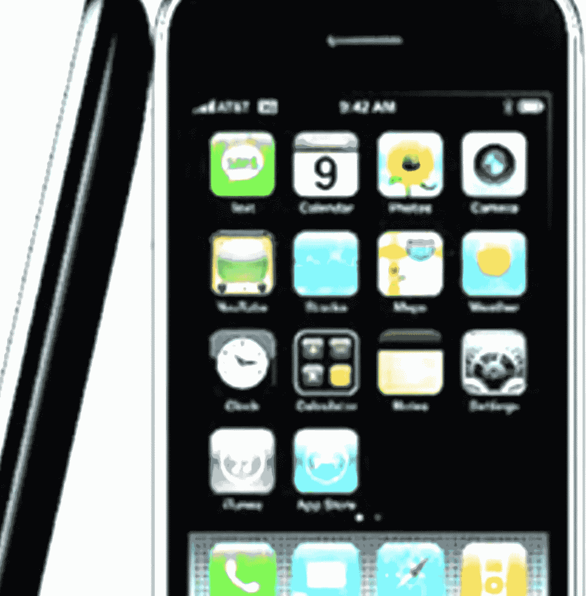

# 你(筋疲力尽的)大脑在大科技上

> 原文：<https://medium.datadriveninvestor.com/your-exhausted-brain-on-tech-the-false-lure-of-multitasking-e3df8bd205db?source=collection_archive---------8----------------------->

**我们不会被不断地打断(或者，用工作描述的说法，是一心多用)**

凯瑟琳·马杜

*(记者注:自 2017 年首次发表以来，本文已更新了新的研究)*

我记得 2007 年苹果发布第一款 iPhone 后不久的那一天。

我看到一位前同事真的抚摸着她闪亮的新智能手机，在办公室里赞美它的优点。

“这东西太神奇了，”她轻声说道。“它几乎可以做任何事情，”嘲讽地补充道，“当然，除了洗碗。”

Apple’s iPhone 3

十多年后，一项又一项研究表明，发短信、浏览 Twitter、接电话、回复电子邮件、在脸书上发帖、看视频、在洗碗机里听播客——多任务处理——产生的结果与我们被诱惑相信的恰恰相反。

也就是说，工作效率更低，更不专注，更疲惫。

对于我们中的许多人来说，我们的日常生活被数字设备所主宰——ipad、智能手机、平板电脑、笔记本电脑、个人电脑——这些设备是我们在现代社会中必须拥有的[功能。](https://gizmodo.com/i-cut-the-big-five-tech-giants-from-my-life-it-was-hel-1831304194)

苹果、三星等公司向我们兜售这样一个理念:我们都将更有生产力，为我们追求和过上更好的生活增加了时间。随身携带一台口袋大小的电脑会鼓励我们进行多任务处理，从而让我们觉得我们正在更快地完成很多事情。

但事实是我们没有。

“你的大脑实际上同时思考的能力非常有限，”波士顿麻省理工学院皮考尔研究所的厄尔·k·米勒教授说。"我们在任何时候都只能记住一点点信息。"

米勒解释说，我们可能认为自己在同时处理多项任务，但事实并非如此。

我们真正做的是在任务之间来回切换——而不是像我们认为的那样，同时执行或观看三到五个任务。

“但是[切换]发生了，而且代价很大……每次切换回一项任务时，你的大脑都必须回溯并找出它停止的地方，”米勒说。“这需要时间并会导致错误。”

米勒的研究一再得到支持。

想想斯坦福大学的安东尼·瓦格纳的一篇论文[，](https://www.pnas.org/content/115/40/9889.short)[，*，*，](https://news.stanford.edu/2018/10/25/decade-data-reveals-heavy-multitaskers-reduced-memory-psychologist-says/)，*。*

“嗯，我们不一心二用。我们的任务会发生变化，”瓦格纳告诉该刊物。

“多任务这个词意味着你可以同时做两件或更多的事情，但实际上我们的大脑一次只允许我们做一件事，我们必须来回切换。”

(photo credit: Getty Images)

在加州大学欧文分校(University of California at Irvine)2016 年发表的一项研究中，科学家在一家大型科技公司对 20 名女性和 20 名男性进行了 12 天的跟踪调查，这些人每天大部分时间都在使用电脑。

他们发现，虽然多任务处理对几乎所有人来说都是无效的，但如果你倾向于过度思考或冲动行为，那么是时候开始单任务处理了。

“毫无疑问，当你一次专注于一项任务时，你会更好、更快、更有成效，”米勒说。

“我们在一个可用信息少得多的环境中进化。任何信息都可能是关键的。灌木丛中的沙沙声可能意味着一只老虎要跳出来了。”

事实证明，人类进化到渴望信息，因为我们的生存依赖于信息。

米勒补充道:“我们的大脑发现新信息是有益的。但是他们没有能力处理我们这个信息如此丰富的现代世界。

斯坦福大学的另一项 T2 研究发现，持续的干扰是主要原因。研究人员报告说，当“高科技魔术师”被多种数字信息流轰炸时，他们无法专注于他们试图完成的事情。

“他们会情不自禁地想到他们没有在做的任务，”Eyal Ophir 在该研究的在线摘要中说道。

“高度一心多用的人总是从他们面前的所有信息中提取信息。他们无法在头脑中保持事物的分离。”

外卖？

一次做一件事。

陶醉在你可能已经做得很好的感觉中。

也在这里发表[。](https://www.voanews.com/a/digital-brain-drain-multitasking-isnt-productive/3312232.html)