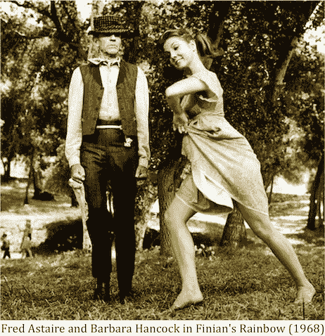
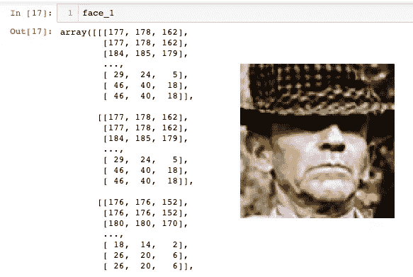
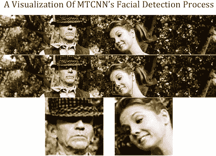
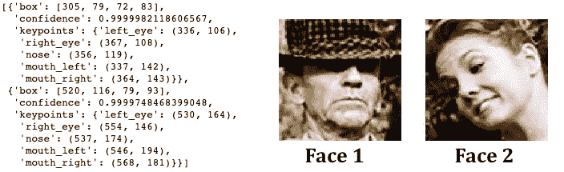

# 你的脸是张量

> 原文：<https://medium.datadriveninvestor.com/your-face-is-a-tensor-94d8bf00aa4f?source=collection_archive---------8----------------------->

几周前，我完成了一个面部相似度项目。该程序拍摄了一个或多个用户的照片，并从名人数据集中输出与该用户最相似的面孔。这些图片是 2015 年苏黎世联邦理工学院计算机视觉实验室的拉斯穆斯·罗特、拉杜·蒂莫夫特和吕克·范·古尔从维基百科和 IMDB 上搜集来的。他们使用的裁剪技术被称为可变形部分模型(DPM)，在他们的论文 [*中描述了没有花里胡哨*](http://rodrigob.github.io/documents/2014_eccv_face_detection_with_supplementary_material.pdf) 的人脸检测。

数据集附带了元数据，其中包括每个人的姓名、裁剪图片的文件路径以及图像中检测到的前两个人脸的数字分数。当我开始研究这个数据集时，我注意到一个人的元数据是如何被分配到每张被裁剪的脸上的。据称弗雷德·阿斯泰尔的图像在数据集中是第一位的，因为他的个人资料 ID 在 IMDB 上是数字第一位的。并非所有标有的面孔

 [## 机器学习的外汇交易挑战|数据驱动的投资者

### 机器学习是人工智能的一个分支，之前占据了很多头条。人们是…

www.datadriveninvestor.com](https://www.datadriveninvestor.com/2019/02/18/the-challenge-of-forex-trading-for-machine-learning/) 

例如，阿斯泰尔的名字属于他，其中一张照片是巴巴拉·汉考克的脸。只有一个正的数字面部分数与该图像相关联，这表明 DPM 模型只检测到一个面部。第二人脸得分被列为“NaN ”,这意味着在图像中没有检测到第二人脸。我很好奇为什么会出现这个错误，我决定从 IMDB 中找到原始图像。这张图片来自 1968 年的电影*菲尼安的彩虹*，包含了弗雷德·阿斯泰尔和巴巴拉·汉考克:

计算机辅助人脸检测的常见问题包括人的头部角度和位置、头部大小、与相机的距离、模糊的人脸、照明、戴眼镜、面部毛发和化妆。DPM 模型未能检测到弗雷德·阿斯泰尔，因为他的脸被帽子的阴影部分遮挡。我在几幅图像中注意到了这个问题，并决定研究 DPM 模型的可能替代方案。我研究了两个模型，并在上面的图片上测试了它们。我跟踪了杰森·布朗利(Jason Brownlee)关于人脸识别的文章，标题为*计算机视觉的深度学习，下面引用了*。

# **计算机和图像**

计算机将图像存储为像素强度的张量。张量可以包含两个或三个矩阵，其中每个矩阵代表一个颜色通道；即一个黑色和一个白色通道用于黑白图像，或者一个红色、一个绿色和一个蓝色通道用于彩色图像(*有更多的可能性*)。每个像素在每个矩阵中表示为一个 0 到 255 之间的数字，其中 0 表示颜色通道没有像素强度，255 表示该特定颜色通道可能的最大像素强度。黑白图像可以由三通道 RGB 格式表示，但是，这将通过向该张量添加另一个矩阵来增加存储相同黑白图像所需的内存(*这在使用 CNN 分类模型*时变得有用)。

A truncated array representation of Fred Astaire’s face in the RGB channel format.

# 模型 1: OpenCV 级联分类器

上周我用 OpenCV 库[克服了我最大的障碍](https://medium.com/@amitrani/why-your-opencv-window-keeps-crashing-and-how-to-fix-it-19e94ab2a801)；如果您对库有问题，您应该按照文档中关于创建环境的说明进行操作。OpenCV 有许多功能，包括一个`CascadeClassifier`类，允许用户导入预先训练的人脸检测模型。有这些模型的 OpenCV GitHub 文件夹可以在 [*这里*](https://github.com/opencv/opencv/tree/master/data) 找到。

这些预先训练的模型通过检测照片中可能包含人脸的矩形区域来工作；为每个矩形区域设置最小概率因子，并且可以由用户调整。无障碍面将有多个矩形区域。用`CascadeClassifier`类导入的模型可以调用`detectMultiScale()`方法。这个方法有三个参数:你要扫描的人脸图像，`scaleFactor`和`minNeighbors`。`scaleFactor`方法用于调整图像大小，而`minNeighbors`方法用于设置检测到的矩形区域数量的最小阈值。OpenCV 级联分类器需要调整参数，并且不会在人物处于不同位置的图像上一致地执行。

# 模式二:MTCNN

多任务级联卷积网络( *MTCNN* )利用级联结构和 CNN 来检测面部特征。MTCNN 是由 IEEE 的张、、、于乔在论文[使用多任务级联卷积网络的联合人脸检测和对齐](https://arxiv.org/pdf/1604.02878.pdf) (2016)中创建的。我用的是 ivn de Paz cente no 在他的 GitHub [*这里*](https://github.com/ipazc/mtcnn) 上找到的实现。

MTCNN 深度学习模型执行以下步骤来检测人脸:

1.  创建原始图像的几个尺寸版本，称为*图像金字塔；*
2.  在整个图像金字塔中定位潜在的面部区域；
3.  过滤掉图像中具有步骤 2 中提出的不一致面部区域的位置；和
4.  定位面部标志，如眼睛、鼻子和嘴巴

在图像金字塔的所有版本中包含一些面部区域的矩形区域很有可能成为面部标志。MTCNN 大大减少了手动调整像`minNeighbors`这样的参数的需要，因为它是在一个大型图像数据集上预先训练的，并且它专注于定位特定的面部特征而不是一般的面部区域。例如，如果 MTCNN 在图像中仅检测到人的嘴，则它将确定在图像中发现了部分遮挡的面部。我将 MTCNN 应用于*菲尼安的彩虹*图片。

MTCNN detects Fred Astaire’s face regardless of the shadow caused by his hat.

这张照片在原始照片中找到了弗雷德·阿斯泰尔的眼睛、鼻子和嘴巴。由于 MTCNN 将级联模型与深度学习相结合，手动调整保持在最低限度，检测人脸的准确性得到提高。当我将这个应用于我的面部识别系统时，MTCNN 花了几秒钟来定位用户的面部。我带注释的检测人脸的代码可以在这里 找到 [*。*](https://github.com/amitrani6/facial-recognition-system/blob/master/face_detection_functions.py)

MTCNN output for the *Finian’s Rainbow photo*

人脸的位置和这些人脸位置的置信度作为字典列表返回。一旦检测到人脸，您可以执行许多任务，从面部相似性到身份识别。我的面部相似度程序的 GitHub 库可以在这里找到*。*

# *来源*

1.  *布朗利，杰森。计算机视觉的深度学习:Python 中的图像分类、对象检测和人脸识别。第七节，人脸识别*