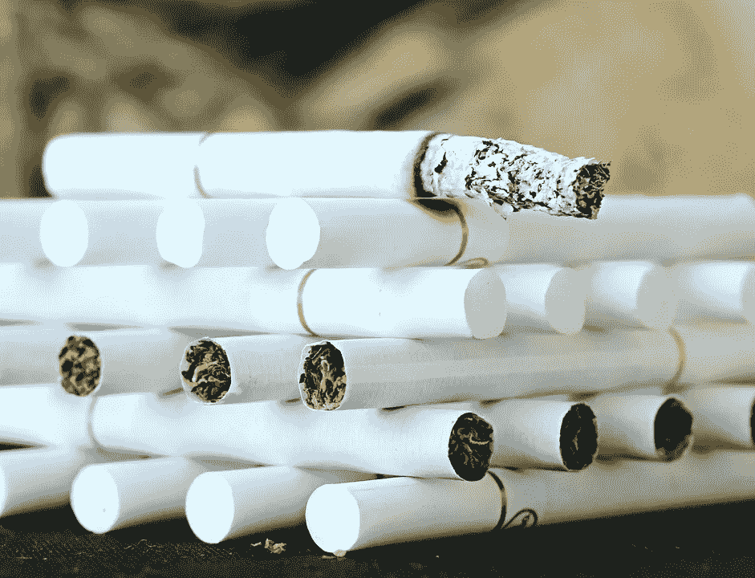
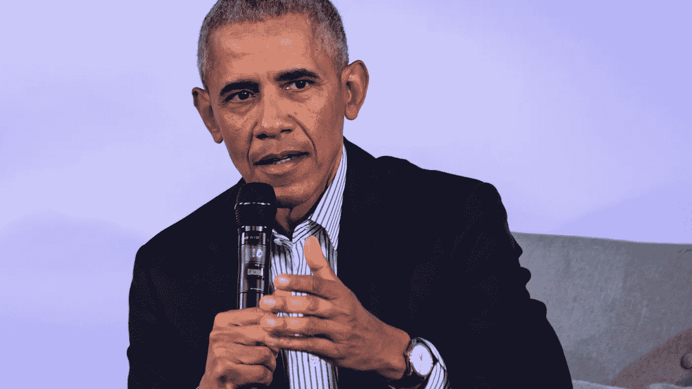

# 你的健康会影响到你的工作

> 原文：<https://medium.datadriveninvestor.com/your-health-is-coming-for-your-job-dd0c3d90db7f?source=collection_archive---------18----------------------->

***“我是做生意的，伙计，不是生意人。”—Jay-Z***

你有经验、教育、动力、决心、一流的精神……但是你吸烟，或者你超重，或者你不活跃。关于这些风险因素如何影响你的身体、精神、情感和社会健康，科学还有很多要学习的——事实是，企业已经想变得更加厌恶风险。

 [## 成功人生的 25 种自我提升方式|数据驱动的投资者

### “我活得越久，学到的就越多。学的越多，体会的越多，知道的越少。”―米切尔·莱格兰德时间到…

www.datadriveninvestor.com](https://www.datadriveninvestor.com/2019/03/12/25-self-improvement-ways-for-a-successful-life/) 

# 呼叫 Cig

Put that in your Resume and smoke it.

让我们明确一点——吸烟是一种 ***、*** 瘾，很难戒掉——但并非不可能。除了尼古丁上瘾和对健康的影响，我们下次告诉别人“这太恶心了”时，还需要考虑社会、情感和经济后果或者“你为什么这么做？”

记住，戒了还是要花钱的。💰👎

社交羞辱能抑制社会的整体方向吗？——陪审团还没有出来，或者更确切地说，在闭门弹劾会议中，随你喜欢。

# 超重-合格

说到判决…

…几十年来，医学研究已经探索了超重或肥胖的医疗保健、经济和环境成本，而不仅仅是免下车快餐菜单。证据明确表明，拥有过量的脂肪组织，尤其是在关键器官周围，对你的身体健康有害——除非你有一套强大的基因。

其他主要因素包括心理健康。而且，作为一级肥胖者，这位作家之前已经多次成为基于体重的欺凌的目标。本能是用学到的技能(学历+经验)来证明体重并不能定义任何人。

解释说:这就像在初中，第一周，踢足球，听到“在这里，肥他妈的！”从某人那里， ***礼貌地*** ，请求一个穿越场的通行证。

回应？从 30 码外把球垂直放在他们的脚上，然后他们得分，然后说“对不起，传得好”。

面对逆境，你需要证明自己比人强吗？号码

但是我们需要更好地教育我们的孩子健康风险因素的内部和外部影响吗？是的。

# 润-润-鲁道夫(古利亚尼)

在这个“有一个应用程序”的新时代，当涉及到改善我们的健康和寻找我们自己的“更好”版本时，技术既是礼物也是诅咒。

Right….now?

一方面，健康相关的设备和软件可以激励我们；通过设定目标、集体活动和绩效指标来减少我们久坐不动的天性——奇怪的是，直到蒂姆·库克(Tim Cook)和博诺(Bono)创造了宇宙中最糟糕的手三角(巧合？).而且，就个人而言，这位作者仍然认为我们还有很长的路要走，以达到不朽——也就是说，超越我们的数字不朽。

然而，与任何值得信赖的“全天候”轮胎解决方案一样，我们的健康计划自然会存在缺陷。

大型组织已经用健身跟踪设备激励员工赢得“奖励”和促进工作场所的健康，并使用你的数据来改善商业实践。用简单的语言来说，这意味着你的生产力和工作保障可能与你每天的运动直接相关。

但是你会说…

# “那又怎么样？…

这和我没有得到其他候选人的工作有什么关系？"

你的雇主，引用 H-to-O-V 的话，会说:

“我们是做生意的，伙计。”

公司——盈利的、非盈利的、非盈利的、非政府组织——都依靠一样东西生存:**钱**。当产品、服务、*或*员工不重视金钱时，他们就会被烧伤。人们被解雇，公司重组，所有这些都是为了帮助组织生存。

**那么，让我们把这些点连接起来:**

你准备申请公司的新职位或晋升。

你是明星员工。

你准时出现。

你符合要求。

候选人二:明星，准时，符合法案排序。经验、教育、资格:都一样。

你有点超重，每天抽一包烟。

候选人二在健康体重指数范围内，不抽烟不喝酒，每天早上在他们的有机素食非转基因奶昔之前跑 5 英里。

据统计，吸烟者在损失的时间和生产力上花费更多。研究表明，吸烟者平均每天额外休息 20-80 分钟。

你会选谁？

# 在抱怨某事的时候，你本可以已经做了。

不，你不能拯救所有人。然而，就像数学中的极限一样，虽然你永远不可能真正达到零，但你可以通过解方程来接近零。

正如前总统巴拉克·奥巴马最近在讨论社会中的政治“觉醒”文化时所说:“……如果你所做的只是扔石头，你可能不会走那么远。”

他是对的。作为一代人，我们经常抱怨“不应该这样！”然而，我们仍然有家人、爱人、朋友和同事有不健康的习惯——包括我们自己。

我们需要像在工作、教育和职业道路上一样，在健康上多下功夫。没有健康，我们就无法实现我们所追求的伟大。以此为重点，让我们用我们的社区意识将我们的话语传达给那些想要和需要倾听的人:

“我们能帮上什么忙？”