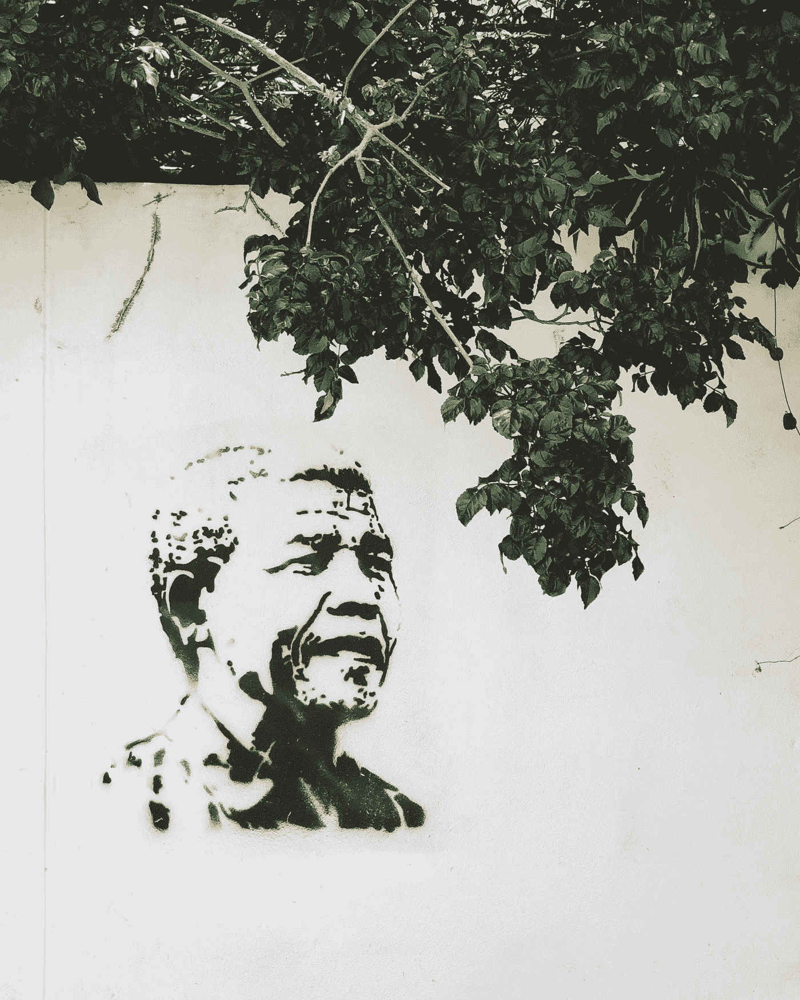

# 你的领导力影响定义了你

> 原文：<https://medium.datadriveninvestor.com/your-leadership-impact-defines-you-e8a6ca1e9af6?source=collection_archive---------25----------------------->

## 任何值得去改变的地方都没有捷径可走

Photo by [John-Paul Henry](https://unsplash.com/@jphnry?utm_source=medium&utm_medium=referral) on [Unsplash](https://unsplash.com?utm_source=medium&utm_medium=referral)

我们作为领导者的影响力取决于他人如何看待你。感知就是现实。

[庞肖曼兹](https://twitter.com/LadyPontsho)和斯布西索恩科西非常了解那个领域。两人都是成功的企业家，这要归功于他们的领导力，以及他们知道如何运用这种领导力。

曼兹是 Fab 妇女奖和 Fab 妇女杂志的创始人。她是媒体企业家、励志演说家、作家和慈善家。

恩科西创立了设计和运营思想领袖运动的 Growth Peak。他还是一名演讲者，专门研究乡镇经济。

 [## 这些领导技巧可以创造影响和利润

### 领导者和老板有着本质的不同和影响力

medium.datadriveninvestor.com](/these-leadership-tips-can-create-impact-and-profit-12df70ed066a) 

“领导选择的艺术会对你周围的人产生积极的影响，”曼兹说。

恩科西补充说，影响力领导给予他人领导自己的能力。

从[积极倾听](https://medium.com/@JKatzaman/strategic-social-listening-is-real-life-90c8a07b7c3f)开始，通过良好的沟通提高你的领导影响力。当你理解你的团队的需要和需求，并能把它们与组织的愿景和目标联系起来时，你的影响就最大了。

“要有同情心，做出非自私的决定，”曼兹说。“诚信永远是赢家。

“向你的团队灌输，去任何值得去的地方都没有捷径，”她说。"他们必须努力工作来实现他们的目标。"

# 从结尾开始

最有影响力的领导力来自不同的视角。

“向后工作，”恩科西说。“定义你想要产生的影响。

“然后看看你的技能组合，看看你能运用哪些技能，以及如何运用它们来达到目的，”他说。“如果你找不到，那就该升级技能了。再次向后工作以获得影响。”

 [## 你如何克服失败，实现你的梦想？

### 向周围的人学习，努力让自己变得更好

medium.datadriveninvestor.com](/how-can-you-overcome-failure-and-fulfill-your-dreams-1549cab1e35f) 

特定的领导技能会对商业产生明显的影响。

向他人保证，他们每个人在公司成功中都扮演着重要的角色。这不仅包括员工，也包括客户。没有他们中的任何一个，你的生意就名存实亡，你的努力也没有任何回报。

“在所有的交易中，你必须以勤奋、道德、正直和同情心而闻名，”曼齐说。

恩科西欣赏作为一名领导者的优点。

“就领导力而言，技能和品质之间只有一线之隔，”他说。“战略思维可以看作是两者兼而有之。它包含了流行的清单:沟通、同情、激励、指导等等。”

# 时间问题

任何人为了成为影响力领导者所能做出的最大牺牲就是时间——花更多的时间和团队在一起，可能花更少的时间处理个人事务。在不与家人和朋友失去联系的同时，保持工作与生活的平衡很重要。

“和爱人在一起的时间变少了，”曼兹说。“在与不道德的人的一些交易中，你可能会赔钱，但诚实的回报是无价的。旅程可能很长，但很值得。”

 [## 享受来自多元化社区的奖励

### 当你包括广泛的人群时，想法就会涌现出来

medium.com](https://medium.com/an-idea/enjoy-the-rewards-from-a-diverse-community-87d8f56b5de9) 

具有开放的心态和灵活性是至关重要的。

恩科西说:“作为一名领导者，你必须接受多样性才能产生影响。”“这意味着，那些追随你的人提出的、不符合你‘理想思维’的想法，必须由你来倾听、塑造、培养和支持。这是严重的“自我牺牲”不容易。"

领导影响力体现在品牌质量上。这不仅需要产品和服务的完整性，还需要它们创造的记忆。这在今天和未来几年的社区中得到加强。如果你的所作所为被人们铭记，你的品牌就是永恒的。

“创造一种文化，庆祝小的开始，鼓励一致性，”曼兹说。

“通过邪恶手段获得的一切最终都会崩溃，”她说。“建立在诚信和社会影响力基础上的企业能够持久。尽管我们可能愿意相信，金钱不是一切，也不能保证世代财富。道德和诚信永远是赢家。”

**关于作者**

吉姆·卡扎曼是[拉戈金融服务公司](http://largofinancialservices.com)的经理，曾在空军和联邦政府的公共事务部门工作。你可以在[推特](https://twitter.com/JKatzaman)、[脸书](https://www.facebook.com/jim.katzaman)和 [LinkedIn](https://www.linkedin.com/in/jim-katzaman-33641b21/) 上和他联系。