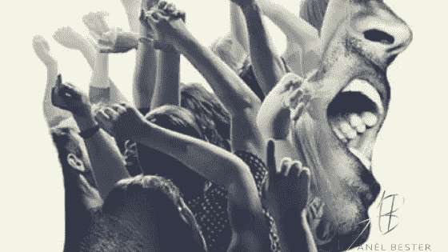

# 你的生活反映了你的精神控制水平

> 原文：<https://medium.datadriveninvestor.com/your-life-reflects-your-level-of-mind-mastery-cf66b1c194f7?source=collection_archive---------31----------------------->

我正在给你写这篇诙谐的文章，但是去他妈的。

让我们开门见山吧。

# 对你来说，美好的生活是什么样的？

如果这是一个有酒、音乐和喝醉的朋友的大聚会，停止阅读。

走开。

这不是给你的。

如果从另一方面来说，这是为了留下遗产，请注意。

# 你的日子是你生活的缩影。

没错，亲爱的。

每一天都很重要！

也就是说，如果你想成为传奇，每一天都必须在这个空间中度过。

扔掉你的日历。

在这个社会里，为了让大众接受你，你可以做什么，不可以做什么。

去他妈的群众。

***这就是你，***

***你的人生，***

***贵在茁壮成长。***

我希望你开始真正注意你的能量。

对我来说，这是一个精神-身体-灵魂的组合，每天都需要激活、挑战、培养和关注。

当你做对了，你就再也不会感到筋疲力尽了。

你再也不需要“假期”来充电了，因为你每天都会充满电。

但是你必须离开无处可去的跑步机。

如果没有让你紧张，你必须停止一遍又一遍地做同样的事情。

我将与你分享我是如何看待它的，然后我邀请你看看什么感觉像地狱是的，你如何将它融入你自己的生活，什么感觉像地狱不，让它去吧！找到适合你的方法。

*   灵魂

我不相信我是有灵魂的肉体。我是一个有着人类体验的身体的灵魂。我的灵魂，她已经确切地知道我想要什么，以及我如何能立刻实现它。她随时都在我身边。她早就看穿我了。她知道如何引起我的注意，但在考虑如何吸引之前，我必须对收到的信号持开放态度，并说他妈的是的。

这实际上看起来像什么？

我的一天从写日记和冥想开始。我没有使用任何一种冥想技巧。我随波逐流。有时候我坐着念咒。有时候会盯着手中温热的一杯咖啡，让思绪游走。有时我的冥想在我的自行车上进行。我的世界没有对错之分。

我有意识地选择保持开放，我知道她的指导通常是以瞬间兴奋的形式出现的！现在让我们明确一点，当我说“兴奋”时，通常伴随着大量的恐惧。两者在我体内有完全相同的化学反应，不妨用两者来放大这种感觉。

我说好，我决定就这样做，然后我去厕所。

一切都很好。

这种关系的力量在于，每当我开始嗅到被压倒的可能性时，我就简单地与灵魂重新连接。无论我在哪里。我只是专注于我的呼吸，让它慢下来，然后*选择信任。*

她从未让我失望过。

永远不会。

*你有没有创造空间来倾听你灵魂的指引？*

*   头脑

几十年来，我都是思想的奴隶。

这甚至不准确。

我的思想被社会所控制——充满了恐惧、限制、基于顺从和绝对服从的社会期望。

令人窒息。

像许多其他人一样，我在受苦。

我拼命地试图通过大量的酒精来逃避，试图通过吃减肥药来隐形，直到我只剩下皮包骨，试图通过吃到昏迷来隐藏在层层脂肪后面，试图通过看一小时又一小时的电视来逃避到一个不同的现实中。

终于到了死亡似乎是最佳选择的地步。

即使他们威胁要在地狱里永远燃烧也无法阻止我。

我宁愿永远燃烧，也不愿继续生活在极度的痛苦和沮丧中。

都是基于我脑海中发生的故事。

受害者身份、苦难、注定要存在——这些是我脑海中的主题。

你能理解吗？

我是幸运儿之一。

我选择了反击。

重新开始我的生活，从了解我的思想开始。

我现在知道了思想的真正力量。

她喜欢写故事，这个故事创造了我的情感，支配了我的行动，最终创造了我的外在现实。

我是她的情妇。

我来决定。

我来写这个故事。

如果这个故事不令我满意，如果它没有给我力量，如果它不是来自爱的空间，我可以改变它。

心态工作从每天写日记开始。

至少一个小时。

一周七天。

这很重要。

**思维模式通过喂养她来持续工作。**

所以我用书滋养她，用新的见解，新的知识，总是质疑。

我允许她在我的生活中创造挑战，并把它们变成项目。

当她能够解决一个难题时，她的思维就会活跃起来。

因此，与其希望过轻松的日子，不如希望过冒险的日子。

这将让你保持思维敏捷，保持注意力集中，并最终让你振作起来。

*在你的生活中，你在哪里创造了锻炼头脑的机会？*

不得不长出那块肌肉作为唯一的选择就是萎缩亲爱的。

你感觉脑死亡了吗？

*   身体

身体是你强大灵魂和聪明头脑的载体。

这意味着，如果你渴望过一种标志性的生活，在这种生活中，你的灵魂将你置于史诗般的冒险面前，你的大脑受到刺激，总是渴望更多的挑战，**你的身体最好处于最佳状态。**

你不是整天坐着的。

当你开始尊重你的身体——像驾驶宾利一样给她加油，像训练野兽一样训练她，像女王一样宠爱她，像女神一样取悦她——她会用她的潜力让你震惊！

这就是为什么大众会给你吃那种让你上瘾的东西。这就是为什么他们创造了一种实际上正在毒害你的饮食。这就是为什么他们尽可能地让你分心，以至于你总是筋疲力尽。

我的身体是开启我心灵潜能的钥匙。

我也开始明白，作为一个高成就者，我骨子里是好胜的。

为什么不利用这一点，而不是像他们希望的那样感到羞耻呢？

我将我的竞争天性引入体育运动。

**我也经历了巨大的转变，当我参加远远超出我现有能力的比赛，然后为了成功必须投入、训练、吃饭、睡觉。**

我的日子变得更加富有成效和创造力。

我的生意变得对他人更有影响力和启发性。

我的头脑变得更加清晰。

我不得不更多地依靠我的灵魂来获得力量。

不管我是否参加比赛，我一周训练七天。

*赛车更上一层楼。*

也明白我不会像个白痴一样训练。

我按照精心设计的计划进行训练。

我考虑到我的 A，B，C 种族。

我考虑到力量和灵活性的必要性。

力量和耐力。

在我的“休息日”,我做深层调理的阴瑜伽。

*你是如何对待和训练自己的身体的？你还会把她当做事后诸葛亮吗？你让她在没有挑战她的情况下走过场吗？却没有建造她？*

# 要明白，所有这些，这种生活方式，都是基于我对茁壮成长的承诺。

它被兴奋和目标以及我想有所作为的强烈愿望点燃了。

我致力于每天至少影响一个人的生活。

以任何形式或方式。

因为我的日子就是我生活的缩影。

这就是全部了。

如果你还想熬过这一周，他妈的别说了！

你没有意识到你的生命是一份礼物吗？

你没有意识到你不知道你的截止日期，你没有完全出现的每一天，都是一天的浪费吗？

什么

这

操？

把这篇文章作为一个坐下来的机会，做一些深刻的反省，并有意识地致力于创造生活。

如果你想创造一个充满分心和痛苦的普通生活，我为你有意识地这样做而鼓掌。

另一方面，如果你想要更多，如果你想要传奇，决定到底是什么样子。

从你的灵魂

对你来说

对你的身体。

然后，

每天都出现。

只有死亡是不可避免的，

繁荣是那些勇敢挑战机器的人的选择。

带着爱和感激，

阿内尔