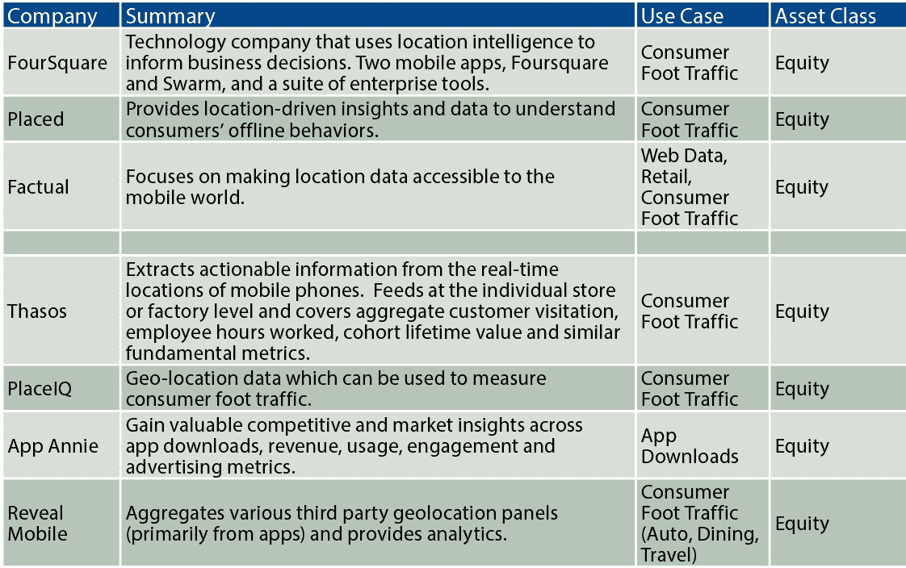

# 你的手机是一座金矿(对对冲基金而言)

> 原文：<https://medium.datadriveninvestor.com/your-mobile-phone-as-a-gold-mine-for-hedge-funds-729b8ddf94df?source=collection_archive---------8----------------------->

警报响起。该起床了。

仍然睡眼惺忪，你伸手拿起手机查看你的信息。你打开手机。不知不觉中，追踪开始了…

但是这种追踪并不是某种秘密的、引起偏执的政府监视行动。相反，是脸书和 Instagram 等手机应用程序传输的地理位置数据让你能够被跟踪。

这些数据可以代表由应用程序或服务提供商收集的关于您的手机在特定时间的位置的几乎任何信息。从你醒来的那一刻到你睡觉的时候。

事实上，甚至在你睡觉的时候。

事实证明，对对冲基金来说，这是一座名副其实的金矿…

# GPS =未开发的 alpha？

据估计，[全球大约有 20 亿智能手机用户。这些设备中的每一个都可能包含至少几个能够跟踪用户位置的应用程序。例如，涵盖导航、天气、购物和社交媒体的应用程序是一些最常见的地理位置数据来源。即使我们实际上没有使用这个应用程序，仍然可以获得地理坐标，表明我们的手机在任何时候的位置。](https://thehub.smsglobal.com/smartphone-ownership-usage-and-penetration)

通过使用手机的 GPS 向操作系统(例如，Android)发送 API 调用，应用程序可以确定我们在哪里，我们在那里呆了多长时间，我们和谁在一起，以及更多关于我们的偏好和习惯的信息。然后，他们可以将这些地理位置数据出售给感兴趣的客户，包括投资公司和数字营销商。

想想你手机上所有需要你的位置信息的应用程序。优步需要它来连接你和他们的司机。健身应用程序会跟踪你的跑步路线，并帮助提高你的整体表现。Foursquare " [利用位置智能构建有意义的消费者体验和商业解决方案](https://foursquare.com/about)

嗯…

事实上，是 Foursquare 提供了现在被认为是地理定位数据巨大价值的经典例子。该公司首席执行官 Jeff Glueck [发表](https://medium.com/foursquare-direct/foursquare-predicts-chipotle-s-q1-sales-down-nearly-30-foot-traffic-reveals-the-start-of-a-mixed-78515b2389af)一篇中期文章，提前预测 Chipotle 在 2016 年 Q1 的销售额将下降 30%。由于该应用程序允许其客户在他们访问的地方进行登记，Glueck 能够利用这些信息观察到墨西哥快餐店的客流量呈下降趋势——他在 Chipotle 本季度业绩发布之前做得很好，不出所料，该季度业绩显示亏损严重，销售额大幅下降。

[来源](http://www.futuresmag.com/2018/02/15/bucketing-alternative-data)

如今，像 Thasos Group 这样的公司已经成为对冲基金行业最受推崇的地理位置数据提供商。该公司寻求从实时位置数据中提供“[可操作信息”，主要是通过其新的地理定位服务 Streams，该服务收集与送货到装卸码头、装配线上的工作时间、医院的病人数量、零售企业的客流量等有关的实时移动电话数据。](http://thasosgroup.com/)

正如联合创始人约翰·科林斯所解释的那样，该公司从许多不同的来源获得被动的原始位置数据，包括“当某人早上起床，准备工作，在上班的路上，在办公室坐在会议室里，在午餐时，[以及]在回家拿一些杂货的路上……”这使得公司能够从“一系列丰富的访问地点”中获得数据。为了进行必要的分析，Thasos 组建了一个由数据科学家、工程师和金融专业人士组成的团队，据创始人兼首席执行官 Greg Skibiski[称，“这些人正在推动用于做出明智投资决策的数据类型发生根本性变化。”](https://globenewswire.com/news-release/2018/05/29/1513397/0/en/Thasos-Group-Wins-Best-Alternative-Data-Provider-at-2018-Inside-Market-Data-Inside-Reference-Data-Awards.html)

与此同时，从买方的角度来看，这些投资决策越来越多地是从原始地理位置数据中提取的趋势的结果。投资组合经理现在可以跟踪各个公司的销售情况，不断变化的人口模式和零售趋势的变化，所有这些都来自于 Thasos 等应用和数据提供商提供的信息。由于可能有数百万部智能手机提供这些信息，基金通常会有一个健康的样本规模，从中推断数据并进行分析。

以新的数据驱动型对冲基金 Trinnacle Capital Management 为例。联合创始人埃里克·科尔曼·昆铂[去年](https://www.opalesque.com/664933/Data_comes_before_strategy_for_this_new_big493.html)承认，他的公司已经汇编了一些非常强大的地理位置数据集，使其能够“看到大部分人口的行为和移动，这让我们对特定公司以及整个行业或产业有了一个非常清晰的了解”。根据咨询公司 Greenwich Associates 2017 年的一份报告，超过五分之一的资产管理公司和对冲基金在他们的愿望清单上有地理位置数据。

# 侵犯隐私的掠夺者？

但对于对冲基金来说，获取地理位置数据并不容易。展望未来，他们可能会遇到许多障碍，以确保数据的道德使用得到一致(和可信)的维护。毕竟，虽然我们中的许多人不会介意我们的数据被用于研究，但我们中的许多人也不一定希望它被对冲基金用来盈利或用于其他一些未知的目的。

问题的核心是，地理位置数据的所有者是否得到了客户的批准，可以将他们的数据出售给第三方。在剑桥分析公司丑闻之后，可以理解的是，人们想要格外小心地保护他们在地理定位等问题上的隐私。

我们真的希望去礼拜场所、去医院或去一个互助小组吗？我怀疑我们大多数人都不知道。位置数据可能伤害的也不仅仅是普通公民。健身应用 [Strava](https://www.theguardian.com/world/2018/jan/28/fitness-tracking-app-gives-away-location-of-secret-us-army-bases) 和 [Polar](https://www.businessinsider.my/polar-exercise-fitness-app-exposed-soldiers-spies-location-details-2018-7/?r=US&IR=T) 都泄露了与军事人员个人信息相关的敏感位置数据。这可能会对国家安全产生严重影响。

隐私国际的 Frederike Kaltheuner 去年警告说，利用位置数据为其交易策略提供信息的对冲基金拥有“关于个人生活、社区、整个国家和市场的前所未有的人口水平的洞察力”。鉴于这种侵入我们生活的可能性，因此，在不久的将来，匿名化这些数据可能会成为一种强制性的保护措施。

Trinnacle 的昆铂保证，他的基金处理的所有数据都是匿名的，“我们不仅遵守美国的数据隐私规则，还遵守欧盟和德国的数据隐私规则，这些规则要严格得多。所以，我们永远无法追踪一个人，而且我们也不在乎这个。我们关心大局。”据报道，Thasos 的斯基比斯基先生也证实其数据“是自愿的，匿名的，并被汇总以确保符合法律和道德标准”。

但数据法本身很可能会继续收紧。例如，欧盟全面的《一般数据保护条例》(GDPR)于 5 月生效，特别将位置数据视为“[个人数据](https://gdpr-info.eu/art-4-gdpr/)”下的可识别信息。位置数据也可能揭示与一个人的种族有关的“[敏感个人数据](https://gdpr-info.eu/art-9-gdpr/)；政治、宗教或哲学信仰；和健康或性取向，GDPR 认为所有这些都需要特别保护。

虽然替代数据没有“一成不变”的定义，但证明对对冲基金有用的特定类型的非传统数据集无疑展示了替代数据的意义。网站抓取是一种类型。[卫星图像](http://www.datadriveninvestor.com/2018/09/18/looking-to-the-skies-for-alpha/)是另一个。尽管即将出台的隐私法可能会抑制其对 alpha 世代的影响，但地理定位数据无疑将在这场另类数据革命中发挥主导作用。

在未来几个月和几年，这类数据似乎将继续证明其对对冲基金的价值。事实上，地理定位数据供应商 Advan Research 认为，超过 1000 家对冲基金最终将把地理定位数据集纳入其交易策略。这最终意味着我们的手机作为阿尔法的来源只会变得更加珍贵。

*原载于 2018 年 10 月 17 日*[*www.datadriveninvestor.com*](http://www.datadriveninvestor.com/2018/10/17/your-mobile-phone-as-a-gold-mine-for-hedge-funds/)*。*