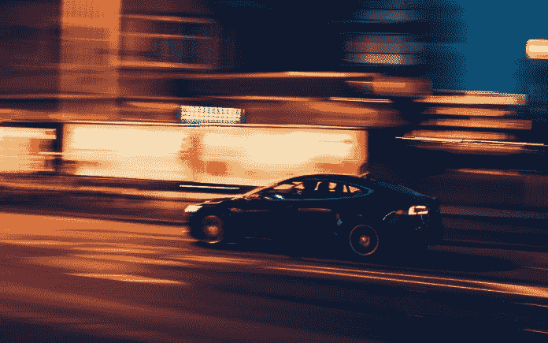
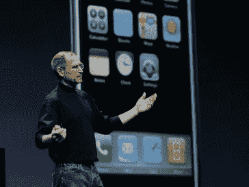
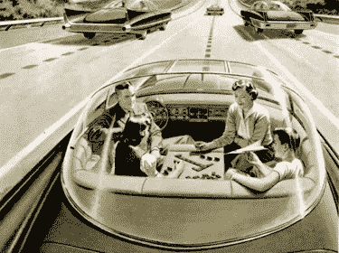
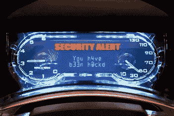
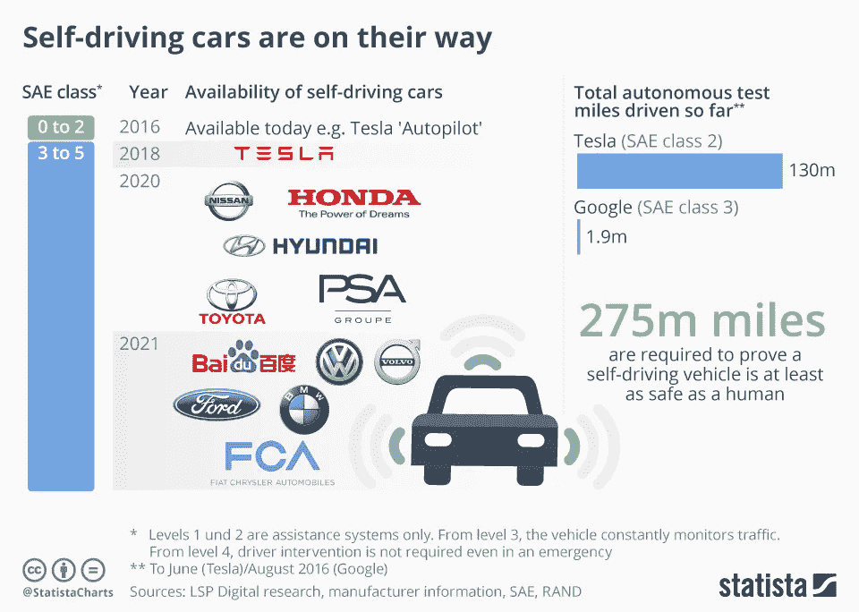
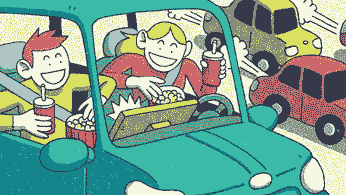
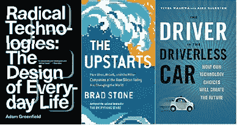

# 你的下一辆车:你的下一部智能手机——带轮子的

> 原文：<https://medium.datadriveninvestor.com/your-next-car-your-next-smartphone-on-wheels-4eece9bd914b?source=collection_archive---------10----------------------->

## **随着人工智能的进步，我们正走向汽车的 IPHONE 时代**

当 iPhone 在 2007 年推出时，它不仅仅是一部更好的手机。它还是一台相机，一个音乐播放器，一个通往越来越多令人兴奋的应用程序和互联网本身的门户。这是融合技术带来的幸福结果。汽车行业也将迎来类似的 iPhone 时刻(该术语由作家马里奥·赫格尔(Mario Herger)创造)。随着排放标准的不断提高，它们将是电动的。他们将被连接到互联网。他们将会自动驾驶。它们将变成你额外的客厅、娱乐空间、办公室和小睡的机会。它们将成为工作、吃饭、购物、睡觉和接吻的工具。

Business Insider

更重要的是，你甚至可能觉得没有必要拥有这个“车轮上的家”。租借和分享这个美妙的艺术品比拥有它更便宜也更容易。丢弃你的车，它一生中 97%的时间都在停车场生锈——占用了宝贵的空间——将为你节省大量的钱。

这一观点吸引了拥挤城市中聪明但低收入的千禧一代。想想机器人出租车和拼车——我们的移动解决方案的优步化或滴滴化。在五年内，它们都成了家喻户晓的流行语。

 [## 在自动驾驶汽车发生事故的情况下，谁应该承担法律责任？数据驱动的投资者

### 我仍然认为自动驾驶汽车是一种奢侈品，而不是必需品…

www.datadriveninvestor.com](https://www.datadriveninvestor.com/2018/11/02/who-is-legally-accountable-in-the-case-of-an-autonomous-vehicle-accident/) 

# **它们的含义是什么？**

## 对城市及其居民的影响

*   预计我们的城市将会焕然一新。全自动驾驶汽车将减少道路上 90%的车辆数量，但仍然运送相同数量的人。停车位会变成绿色。这是休闲和种植蔬菜和花卉的好去处。而且当气候变化引起的暴雨淹没我们过度沥青化的城市时，作为新的排水点也是必要的。此外，预计污染较少的城市，因为下一代智能汽车将转向电动。
*   预计交通会更加顺畅。[AI](https://www.datadriveninvestor.com/glossary/artificial-intelligence/)——由于拼车成为新常态，授权的智能系统将把所有联网汽车推向最有效的路线——尽管路上的汽车会越来越少。减少车辆数量也有助于改善空气质量。此外，预计人工智能驾驶的汽车将更加安全。百分之九十的车祸是由人为错误造成的。人工智能驾驶的汽车会“自然”避开它们。当然，汽车卷入的每起事故都会引起媒体的过度关注，直到这也成为新常态的一部分。

完全自动驾驶的汽车将在未来实现，比宣传的还要遥远。主要是因为人类可以以非常不稳定的方式穿过交通。当然，并不是我们所有人都一直如此，但是规则的例外行为比软件生产书呆子们所能想象的更加不可预测。(当一辆清扫车突然在十字路口转了一个大圈，穿过绿灯的车道时，该如何反应？)因此，就目前而言，相比无人驾驶或自动驾驶，我更喜欢人工智能驾驶的汽车这个术语。事实上，当完全自动驾驶的汽车最终从人工智能驱动的汽车中进化出来时，卡车，而不是私人汽车，将会占据主导地位。卡车经常一遍又一遍地行驶在同一条路线上，这使得一切都变得更容易预测。此外，让他们排成一排驾驶，节省燃料，这种利润是巨大的——这是一种强大的动力，促使他们首先关注这一领域的软件创新，走向完全自主。2015 年，戴姆勒率先推出了无人驾驶卡车。卡车、公共汽车紧随其后，然后是你自己的汽车。

城市改造是一项巨大的工程，但却是值得的，因为它们改善了所有参与者的生活质量。改造的速度和深度将取决于市长和部长们的远见卓识。不幸但自然的是，他们倾向于专注于他们的短期关注，由于媒体的炒作和推特上的海啸，这些关注被强化和扩大了。此外，他们的长期愿景可能不会超过他们最后一次可能的连任日期。

# 对移动用户的影响-以前称为驾驶员

对于消费者来说，一旦他们摆脱了 20 世纪的陈词滥调，即你需要拥有一辆车来表达你的地位和抱负，他们的移动未来看起来更光明，例如更便宜和更平稳。得益于新的颠覆性商业模式的兴起。以优步及其国际同行为例。这些公司的目标都是在他们的网络中抓住尽可能多的司机。当这种方法奏效时，他们可以承诺并为所有人提供最短的等待时间。这对司机来说是好事，因为他们可以运送更多的乘客，这使他们能够在降低价格的同时赚取更多的收入。这反过来会吸引更多的乘客，把他们带到更便宜、更顺畅的市场。

从长远来看，预计政府会正式阻止个人拥有汽车。当你仍然想开自己的车时，它会被轻蔑地认为是不道德的，就像现在在世界的某些地方穿皮草一样。这可能会被认为有点粗俗，因为吸烟已经成为。如果你坚持拥有私人汽车，你会发现自己被征税。

虽然纳税并不有趣，但未来的移动交通工具将带来我们传统汽车从未达到的乐趣。新车将给我们带来车轮上的娱乐，由于自动驾驶，我们可以解放双手去拥抱它。下一代汽车广告将不再强调马力，而是触摸屏和仪表盘的创新。他们会在“吃饭、工作、睡觉、接吻”这几个方面交流自己的优秀之处。

此外，他们将强调反黑客安全软件的质量。软件制造商和传统汽车制造商——这两个类别将融合在一起——通常都是用心良苦的专业人士，乐于并自豪地向世界展示他们能创造的奇迹。但也有其他专业人士，更有犯罪意识。没有什么比闯入你的联网汽车并在那里制造混乱更让他们开心的了。软件安全性将成为引人注目的独特卖点。

最后但并非最不重要的一点，想象一下下一代移动交通工具将如何为残疾人、老年人以及青少年提供动力。他们现在有驾驶的“自主权”，而不需要开车。而且安全。新一代汽车将打出促进包容性的社会责任牌。

# 对商业的影响

汽车制造业的下一个巨大利润将不会来自汽车制造本身。它将通过管理和服务无处不在的汽车、出租车和公交车车队来产生，因为它们在我们的智能城市中高效、可持续地移动。从有利可图的商业角度来看，同样重要的是:为这些车队提供智能维护服务。

随着整个行业专注于开发最复杂的人工智能驾驶汽车，以及之后的全自动汽车，预计物体识别开发的关键支持行业将出现激烈的竞争和引人注目的革命。物体识别有两种方式。显然，无人驾驶汽车必须能够识别路上的一切，无论是移动的还是静止的。但在半自动驾驶汽车中，当方向盘后面仍然有人时，它的识别传感器也会监控半驾驶员，注意到过度疲劳的迹象，例如，眼睑运动。各种物体识别的显著结果可以投射到汽车的挡风玻璃上，提供带有实时安全指示等的增强全景。虽然我们都在朝着无人驾驶汽车的方向发展，但我们中的许多人可能不愿意让驱动轮离开。观看汽车在挡风玻璃上“看到”的增强版可以产生一种安心的效果。

内燃机可能会在一代人的时间内化为乌有。然而，作为一个反例，石油输出国组织研究预测，到 2040 年，道路上只有 7%的车辆是电动的。当然，这样的结果符合石油输出国组织的既得利益。因此，关注那些专注于提高电池效率的初创公司。此外，观看与锂相关的一切，锂是电动汽车下一代电池的稀土关键成分。

内燃机的消亡对德国汽车制造商来说是个坏消息。他们高度成功的汽车工程 DNA 已经与内燃机技术完全融合，从现在开始变得越来越多余。它将为没有被如此沉重的 DNA 遗产所阻碍的新玩家提供机会。首先是硅谷的大型科技公司，中国竞争对手紧随其后。但我们不应该夸大其词。现在，当谈到下一代汽车生产时，似乎大科技的软件制造商和芯片制造商牢牢地坐在驾驶座上。但是不要低估在传统制造商的实践和技术诀窍中制度化的深度专业知识的数量，这是大科技所缺乏的，因为它专注于干净的软件生产。

接受这样一个事实:未来的消费者不那么关注汽车的马力了——当你不再坐在方向盘后面，你的汽车在不受你这个地球人干扰的情况下智能地、最佳地行驶时，这有什么用？消费者将会专注于汽车的连接性。没有触摸屏的汽车将被视为二十世纪。提供最吸引人的娱乐环境的公司——谷歌、奥迪、索尼？—打造最具特色的卖点。同样，公司设法在你的车里创造最有效的办公室。和最好的反黑客软件。

拥有未来汽车大脑的公司将成为赢家。由于实现这种所有权是复杂的，预计传统汽车制造商、大型科技软件公司和娱乐企业之间会结盟。再加上与打车巨头的合作:他们可能不太了解实际制造汽车，但非常了解乘客，并为他们提供移动解决方案。我们已经看到了实质性的联盟。通用汽车和 Lyft 正在合作，Lyft、Waymo (Alphabet)和菲亚特克莱斯勒也是如此。德国领先的铁路公司 Deutsche Bahn 也加入其中。所有人的雄心:让你的汽车成为你的下一部手机。这将是一场艰苦的战斗，因为成熟的智能手机生产商通常比汽车生产商领先三年。但是潜在的利润是巨大的。**这将激发全世界的雄心。**

**推荐阅读:**

**关于作者:**
*Carl Rohde 博士教授是一位关于“未来预测&创新”的国际主题演讲人——具有学术深度和实践现实性。在过去的十年中，他与 50 所大学和 10，000 多名学生合作。目标:让所有人都参与到更多的趋势和创新中。罗德在阿姆斯特丹、巴塞罗那和上海都有研究职位。卡尔·罗德还领导着 www.scienceofthetime.com 的一个全球市场和趋势研究人员的虚拟网络***。**

*作为一个教育知识机构(大学、理工学院或其他),你有兴趣参与国际酷城搜索并想了解更多吗？[请点击这里](https://scienceofthetime.com/service-title-2/?source=post_page---------------------------)。*

*在 Twitter 上关注[Carl Rohde](https://twitter.com/CarlRohde?source=post_page---------------------------)并在 Medium 上关注[。](https://medium.com/@carlrohde?source=post_page---------------------------)*

**原载于 2019 年 9 月 24 日*[*https://www.datadriveninvestor.com*](https://www.datadriveninvestor.com/2019/09/24/your-next-car-your-next-smartphone-on-wheels/)*。**