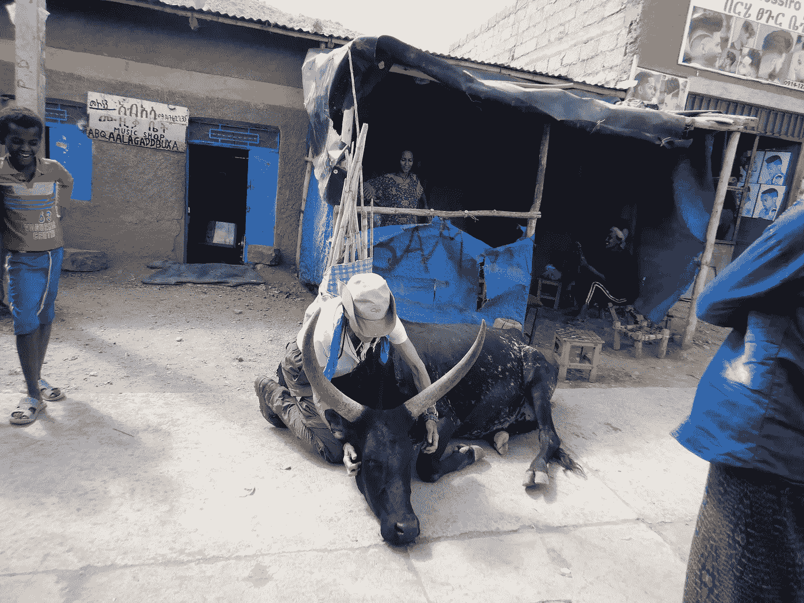
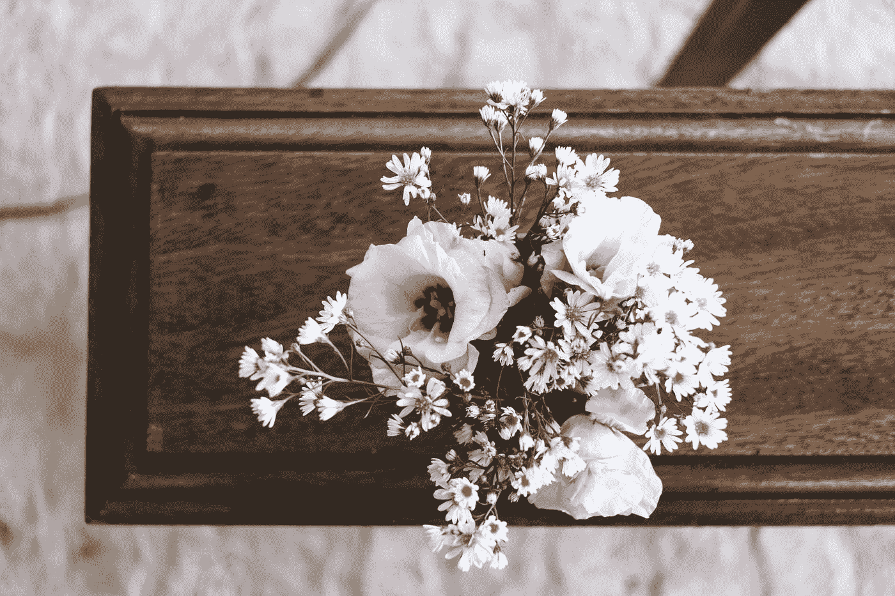
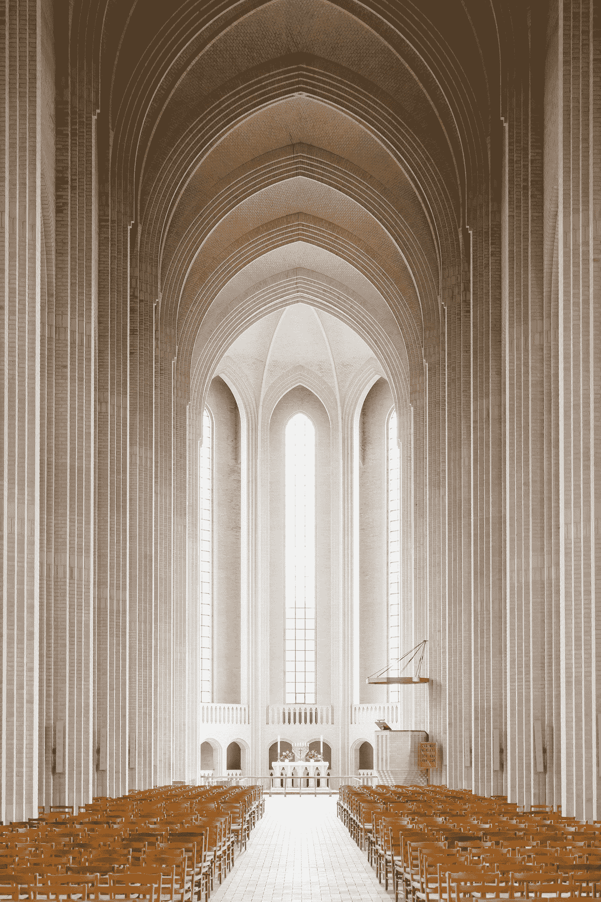
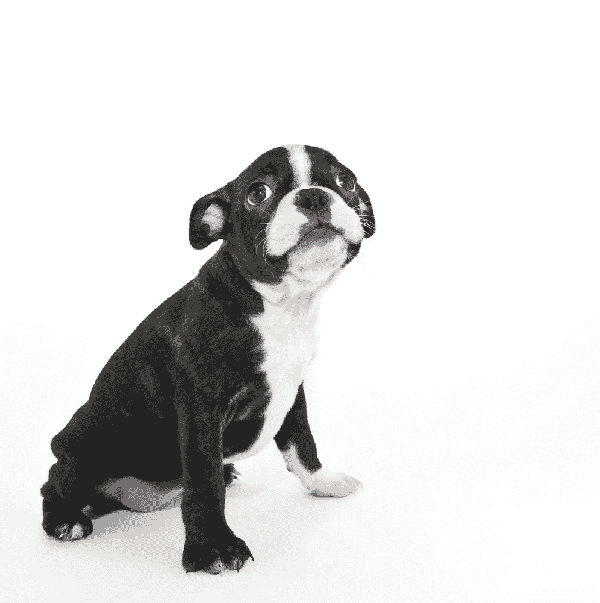

# 你的一件大事

> 原文：<https://medium.datadriveninvestor.com/your-one-big-thing-911736e1cb43?source=collection_archive---------7----------------------->

Photo by [Warren Wong](https://unsplash.com/@wflwong?utm_source=medium&utm_medium=referral) on [Unsplash](https://unsplash.com?utm_source=medium&utm_medium=referral)

## 做你来这里要做的事情的承诺和恐惧

"那么，如果你消除了所有这些限制，你会做什么？"

我一饮而尽。突然，我感到热泪盈眶。我脸红了。

我看向别处。

*操。这很难。*

奥维尔·雷和蔼地看着我。他认识我几十年了。他是我第一部获得三项大奖的书的助产士。他知道我的大部分故事，我也知道他的。作为我的教练，他正在做他应该做的事情:拆掉我的墙。去我的借口。剥掉我鞋柜上的油漆，强迫我看里面。

他等待着。一些脂肪的眼泪威胁要滚下我的脸颊。

*我不知道*，我虚弱地提议道。

*是的，你有。*

我操。他是对的。我确实知道。

我正处于巨大的转变之中。明年春天，我将卖掉房子，搬到西北地区，这是我长久以来的梦想。

但我也在写另一本书。这本书，虽然我并没有这样计划，但它有效地记录了我最终做我喜欢的事情的道路，我想做的方式，而不是感觉我总是必须做一些事情来取悦或打动别人。这种冲动，在我们取悦他人的驱动力中被许多人所共有，在一定程度上是成长为一个农家女孩的结果。我的价值永远是由我所做的事情来定义的，无论是扔掉干草、装鸡蛋、割草还是修剪草坪。

 [## 精疲力竭耗尽了简单的答案|数据驱动的投资者

### “大多数卫生专业人员知道如何照顾病人，但不知道如何照顾自己。”医疗保健…

www.datadriveninvestor.com](https://www.datadriveninvestor.com/2019/01/15/burnout-exhausts-easy-answers/) 

盎格鲁新教价值伦理放大。我们很多人都有同感。我们总是并且永远被这样一种感觉所困扰:如果我们不忙，我们就是道德败坏。宗教经常传达这样一种观点，即如果我们有时间，我们就会手淫(善意地说，这确实是消磨几分钟的好方法，但我跑题了)。

我在其他地方写过，这种强迫性在我们的清教徒/加尔文主义历史中有着强大的根源，它被混进了美国的做事方式中。不管是对是错，我可能会说，无法长时间休息，深度休息，充电，真正享受我们周围的世界(在我们做了所有事情之后剩下的东西)是一种疾病。

这并不意味着不工作。这确实意味着工作，但正如千禧一代和新生代(如果你相信代际观念的话)所展示的那样，有更好的谋生方式。比如，花更多的时间和我们爱的人在一起，花时间深呼吸，比一周一次，一年几天更频繁地放慢脚步。人生真的太短暂了。

这一点在你过了 60 岁时再清楚不过了。我们还有多少时间的现实从来没有如此严峻过，因为有些时间可能并不那么美好(取决于许多因素)。

现在，到了大多数人认为的退休年龄(这不适合我，但请和我一起呆在这里)，我即将开始我的一件大事。

Orvel Ray 对工作有所了解(他和 Jay Levinson 一起写了六本畅销书，其中包括非常受欢迎和最畅销的游击销售和营销系列，他建立了一个价值数百万美元的销售培训业务，所以是的，他知道)刚刚看了我最近在埃塞俄比亚一个小村庄的街道上安抚和按摩一头巨大奶牛的视频。

Julia Hubbel

她已经放松到我的手中，然后迅速躺在我的脚下，给我她整个身体的工作。*我擅长这个*。不仅仅是好，这是我最伟大的艺术形式之一。大多数人做不到我为动物做的事情。我在动物周围有一些东西，让它们放松、信任，并允许我在它们的身体上工作。不是所有的动物，因为任何真正的动物爱好者/工作者都知道，它们就像我们的指纹一样不同。我在冰岛有一群群马像救世主一样聚集在我周围，等着轮到它们被擦洗、摩擦和爱护，我在埃塞俄比亚有一群群马非常害怕我，它们几乎弄断了它们的绳索。后者更多的是因为那些马把人类和打人联系在一起，特别是打脸，所以任何人类=虐待。这些动物需要大量的时间和爱来平静和抚慰。

我在有限的时间里尽我所能。大多数时候它是有效的。

这不仅是一种本能，我做这件事比做世界上任何其他事情都开心。我不知道怎样才能更经常地这样做，因为那是蜜蜂的膝盖。然而，这正是奥维尔·雷所问的。苛求，其实是因为他知道在我内心最深处有一种强烈的跳动的欲望，想要做更多这样的事。实际上，更多。

他知道有一种方法可以让我把自己擅长和喜欢做的事情结合起来。我的工作就是找出那是什么，然后他妈的出去做。因为它是你的。

# 你的一件大事是什么？

奥韦尔·雷与另一位客户合作，他的一件大事就是帮助人们找到他们的一件大事。干得好，对吧？帮助别人找到自己在生活中的伟大角色，这是多么伟大的人生角色啊。

这是参数。这些对于任何一个已经实现了给他们带来巨大满足感的宏伟目标的人来说都是熟悉的:

# 感觉不可能。

# 它需要帮助。你不能单独做这件事(好)。

# 你不可能看到你将如何能够做到这一点。

# 没有清晰的路径(如果有，你现在已经完成了)

# 它会吓得你屁滚尿流，很危险(当然是)。它带来了深深的不适。

# 要求你改变*你是谁，而不仅仅是你做什么*

# 它以某种基本的方式服务于世界。

哇哦。

这是简·古道尔的东西。这是改变游戏规则的东西(事实上，我知道客户即将出版一本同名的书，敬请关注)。

不符合条件的，虽然很诱人，但对我来说，在西伯利亚骑马(在 2020 年底的名单上)符合条件。

没有。因为虽然这可能会是一次极好的冒险，但它不符合标准。这只是又一次大冒险。

就我而言，有几件事我做得很好:我是一个出色的作家和演说家，我是一个优秀的骑手，我对动物非常了解。

所有这些事情都需要在我的一件大事中找到一个位置和空间。

Photo by [Mayron Oliveira](https://unsplash.com/@m4yron?utm_source=medium&utm_medium=referral) on [Unsplash](https://unsplash.com?utm_source=medium&utm_medium=referral)

就在我离开奥维尔·雷的办公室回家之前，我去厨房把苹果核放进堆肥里。他的妻子丹尼斯穿着一身黑色礼服。

“去参加一个聚会？”我问。当时刚过下午 1 点。会发生。毕竟，现在是假期。

“不，乔·沙巴一周前去世了。他的仪式是下午两点在米尔高教堂举行。”

我知道乔又老又病。我惊呆了。就在那时，我知道我必须放弃我下午的计划。我甚至不能回家换衣服，但我穿着黑色的衣服。

乔·沙巴是科罗拉多州全国演讲人协会的创始人。他出生在东部，父母是黎巴嫩人，他完成了戴尔·卡耐基课程，并终生致力于成为我们社区备受爱戴的偶像。几十年来，他在丹佛开办了一个小型、廉价的课程，主题是*如何为了乐趣和利益而演讲*，这个简单的活动开启了一千名演讲者的职业生涯。

这些演讲者中的许多人后来成为了全国演讲人协会的主席，许多人都在场，许多人非常感谢乔开始了他们帮助他人的事业，这表明了乔对他的一件大事的承诺。

Photo by [JOHN TOWNER](https://unsplash.com/@heytowner?utm_source=medium&utm_medium=referral) on [Unsplash](https://unsplash.com?utm_source=medium&utm_medium=referral)

我一个人静静地坐在一长排空座位上，听着致谢，看着这个心爱的男人生活的照片和视频。

我不是乔。我也不想做或成为乔那样的人。但是，能够向那些深深感激这位永远快乐、向上的人(即使在一次非常严重的中风之后)的人证明这是一种非常美好的生活，这是非常有意义的。

对我们大多数人来说，人们不能这样说。这是我们时代的悲剧，任何时候都是如此。我们人性的悲剧。我们的生活中有太多的时间被我们的外表、我们是否出名、我们有多少像 T4 一样的人所占据。好像这些喜欢是我们内在价值的决定性衡量标准。

乔·沙巴有很多喜欢的人。这在他接触、感动、激励和改变的生活中显而易见。前来悼念他逝世的人们。在我看来，这才是值得过的生活，而不是为了地位而享受地位。而是因为你有一种深深的满足感，知道你所做的是好的工作。你发挥了自己的潜力，有勇气去做一件大事。

# 你来做的一件大事是你的，而且只属于你。

寻找它、定义它并享受它的旅程需要一生的时间。到目前为止，我已经有了一些很酷的东西，慢慢地成为焦点。

今年圣诞节，当我凝视着我空荡荡的房子时，我正慢慢放下对丹佛地区的所有依恋。告别熟悉的地方。我标记了我的最后一个春天，最后一个夏天，最后一个秋天。现在，我的最后一个假期。重访朋友。当我走向这样一种生活时，我会把失去一些人当作适当的过去式，在这种生活中，我不会把时间和财富花在那些对我没有同样感觉的人身上。这是让我的一件大事发生的必要工作的一部分。

如果我们的资源被其他人吸走，你和我就不能成为一件大事。或者，如果我们过于关注他人，以至于破坏了我们的时间和我们的承诺。

你和我可以像道歉一样生活。对于我们这些在成瘾家庭中长大的人来说，这是非常熟悉的。然而，这些教训仅仅是:通过点，新的眼睛的发展，看到别人对待我们的能力，只是反映了我们觉得我们应该得到的，以及我们当时的情绪。

这些正是给予我们情感力量的基石，如果我们选择发展它，进化成我们来到这里要做的事情。这些事件把同情和理解刻进了原本如此坚硬的外壳中，以至于我们不能让别人触摸我们。我已经很接近了。我很难接受，很难变得脆弱。这就是我们故事中的硬壳。一个大借口。

我们可以利用那些情况，那些故事，为我们提供所有需要的借口，来解释为什么我们不能这样做，成为那样的人，拥有我们真正想要的生活。

Deposit Images

# 你可以成为一个有借口的人。

就像我的前任，他外表美丽，但总是和永远遥不可及，是一个有借口的人，以他自己的方式，私下手淫比和一个爱他的人在一起快乐得多。这对我来说很难接受(我吞下了很多他的精子，但那是另一个故事)，但如果我想要我的生活中有爱，我需要做奥维尔·雷做过的事情:强迫自己面对我做的事情，我为什么这样做，并选择其他的道路。

想要理由吗？或者你想要像乔·沙巴那样的生活，丰富多彩，充满了他最喜欢做的事情，也同样受到他所接触的许多人的尊敬？这样的生活带来的连锁反应是无穷无尽的。跟撕腹肌或者你的 Instagram 喜欢没有关系。

它更多的是关于你和我是否足够关心我们自己，给这个世界——最终给我们自己——我们绝对最好的。

# 我们的一件大事。

Photo by [Nicholas Sampson](https://unsplash.com/@nicholassampson?utm_source=medium&utm_medium=referral) on [Unsplash](https://unsplash.com?utm_source=medium&utm_medium=referral)

写这封信是为了深深感谢奥维尔·雷让我了解这项服务，也感谢他这么多年来一直是我的教练和啦啦队长。你正在做一件大事。