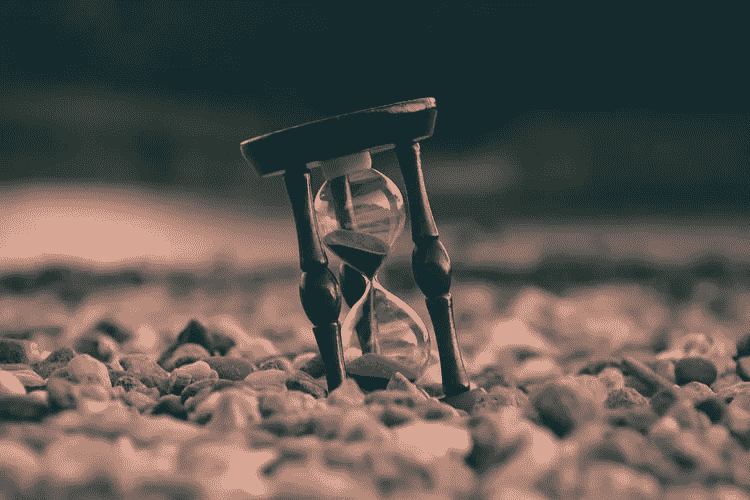

# 你的时代将会到来…

> 原文：<https://medium.datadriveninvestor.com/your-time-will-come-174719ee167c?source=collection_archive---------9----------------------->

**Be patient and be grateful**

> 不要忘记最好的还在后头。

都是为了开始新的旅程。我们余生的开始。

两年后，你可能会完成你的高级课程。

三年后，你将在世界各地学习，在你选择的大学学习。

五年后，你们将开始自己的职业生涯。你们中的许多人将为全球顶尖机构工作。

然后你会结婚。然后你可能会买一栋房子。

10 年后，你的生活将会被安排好。

再过 15 年，你就 30 岁了，从那时起，你的方向，你的生活就确定了。

 [## 摔倒不是失败。-数据驱动型投资者

### 你只有在放弃的时候才会失败。每个英雄都会倒下，我们活着就是为了失败者出现的时刻；上升到…

www.datadriveninvestor.com](https://www.datadriveninvestor.com/2019/01/17/falling-isnt-failing/) 

# 但是…

有些人 21 岁毕业，直到 27 岁才找到工作。

有许多人在 25 岁时才获得认证，他们很快就找到了工作。

有些人从未上过大学，但在 18 岁时找到了自己喜欢的东西。

有些人大学一毕业就找到了一份收入不错的工作，但他们讨厌自己的工作。

有些人利用这几年的间隙找到了他们的目标。

有些人在 10 岁时非常确定自己要做什么，但他们在 26 岁时改变了主意。

所以，我在这里的观点是，无论我们生活中发生什么，都是根据我们的时间，我们的时钟。

你环顾你的朋友，认为他们比你前进了一步，也许他们中的一些人落后了，但一切都按照自己的节奏发生。每个人都有自己的周期和计时器，你也有自己的。

**耐心点**

*   J.罗琳是一位失业的单身母亲。她被 12 家出版社拒绝，成为最富有的作者。她 32 岁时为《哈利·波特》出书。
*   马云被肯德基拒绝包括 30 份工作。他被哈佛拒绝了 10 次。他也没有通过学校和大学的考试。马云在 35 岁时创办了阿里巴巴。

40 岁以后买房依然可观，25 岁以后拿到学位依然是胜利。不要匆忙制定你的行程和时间表。因为正如**爱因斯坦所说:**

> **“不是所有有价值的东西都可以被计算，也不是所有被计算的东西都是真正有价值的。”**

这才是最重要的。你应该能够为自己创造有意义的、有目的的和充实的生活，并学会如何利用这一点来影响和改变他人的生活。

> 如上所见:[https://interact.pk/your-time-will-come](https://interact.pk/your-time-will-come)