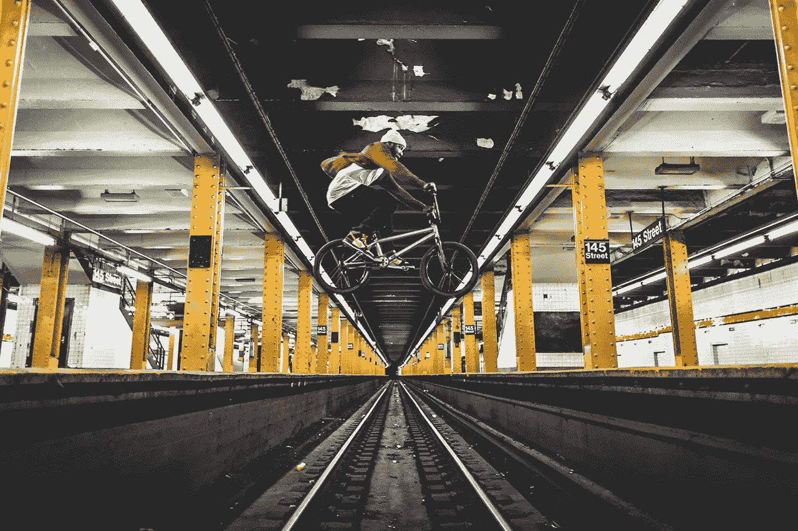
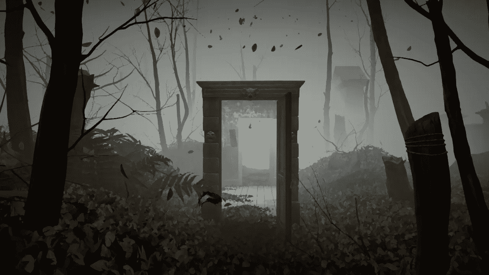

# 你的壁纸是你心情的反映。

> 原文：<https://medium.datadriveninvestor.com/your-wallpaper-is-a-reflection-of-your-mood-16a37b20856?source=collection_archive---------6----------------------->

## 这会影响你的工作效率。

感官反应，通过视觉，可以唤起情感。就像我们在地铁里等火车来的时候看到的广告一样，这些发光二极管默默地做着他们的工作，将一个想法，一个概念传递到我们大脑的潜意识中。一个后来被回忆为似曾相识的时刻；后来，当我们接触到广告中的产品时，却无法准确回忆起我们是在哪里以及如何将幸福的形象与洗碗液联系起来的。

正是这些类似的策略，我们每天都在使用——却没有直接意识到它对我们的情绪有着微妙的影响。

糟糕的一天，看着手机屏幕上闪烁着另一个通知；通过轻微的感官反应，展示一张爱人的照片或一处风景，让你心情愉悦，情绪高涨。

一张运动员肾上腺素激增的照片，这是我电脑当前的桌面背景；奈杰尔·西尔维斯特之一。

**Credits: 13th Witness / Nigel Sylvester.**

就在我认为我今天没有心情写作的时候，我找到了灵感，因为我最小化了我的网络浏览器来显示隐藏在下面的图像。

我们每天都这样做，你可能正在检查你的屏幕保护程序；想知道你是如何或为什么选择这个图像的。

它可能是你自己的照片，朋友或爱人的照片，你的父母的照片，一些令人兴奋的东西，如食物或风景摄影的美景，甚至可能是抽象艺术。

这都是一种内在的自我反省，一种我们常常没有注意到的反省；但对我们的行为方式有更大的影响。

例如，看到一个黯淡、黑暗的图像；令人气馁，而明亮的颜色或灵感的图像让我们兴奋，让我们充满愉悦。

在工作中，重要的不仅仅是工作场所的设计——信不信由你，我和我的同事在 UNSW 进行的研究发现，当电脑屏幕上出现一幅充满活力的图像而不是一片黑暗时，受试者会被极大地激励去完成一个项目，而不是拖延。

尽管大多数工作场所甚至可能会开放设置个人壁纸的选项，但一些公司还是倾向于保持简单；通过一个通用的桌面背景，公司的标志也许？

一个提醒人们工作场所团结一致的标志。

虽然个性化密码是一种选择，但这种选择不是为他们做出的——不像强制密码策略，它要求每 35 天更换一次密码；员工觉得这样做很令人沮丧，尽管这是为了他们自己的安全。

在壁纸/桌面背景/屏保上花些心思，会比你想象的对你的职业道德产生更大的影响；把它想象成你的虚拟工作场所——你不会想在一个黑暗、凌乱、不舒服的房间里工作。

那么，为什么你想要一张让人产生消极情绪的壁纸，而不是一张充满明亮色彩和积极色调的壁纸呢？

*试一试，做出选择。*

> **积极向上，激励人心**

> 凄凉，令人沮丧。

最初发布于[数据驱动投资人](https://www.datadriveninvestor.com/2018/11/11/your-wallpaper-is-a-reflection-of-your-mood/)，2018 年 11 月 11 日。