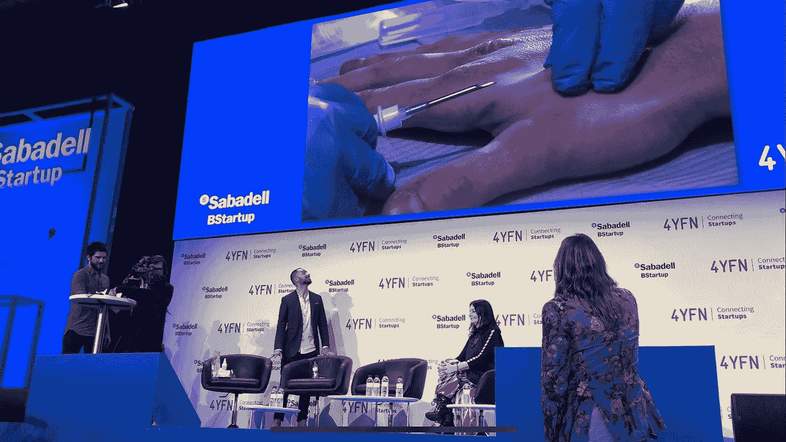
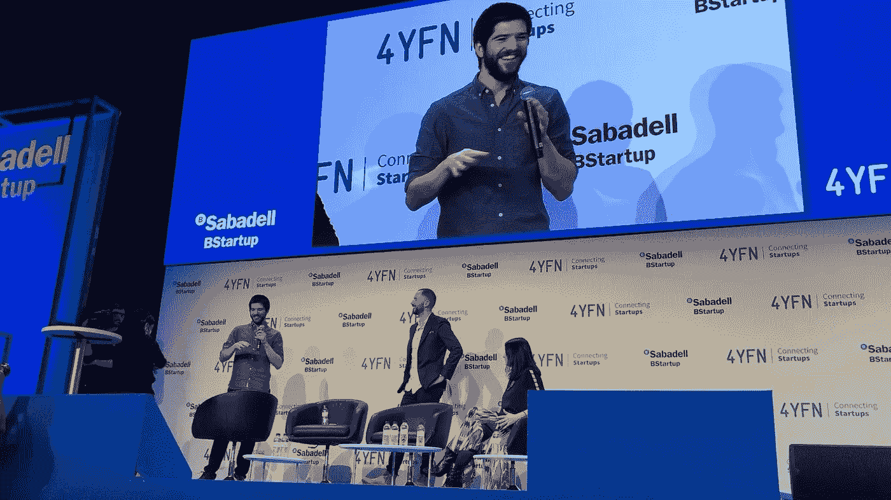
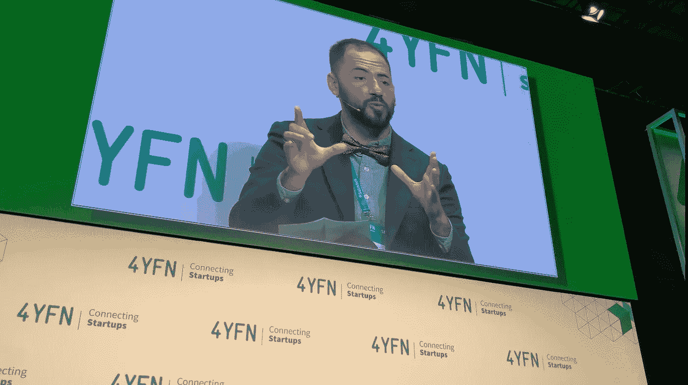
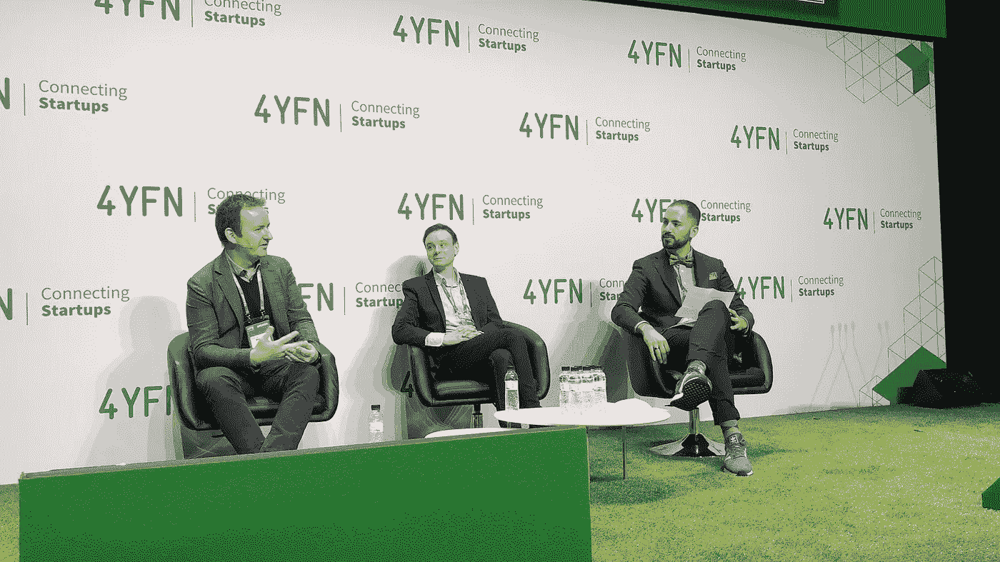

# 你已经是超人了，只是你不知道罢了:MWC·巴塞罗纳

> 原文：<https://medium.datadriveninvestor.com/youre-already-transhuman-you-just-don-t-know-it-mwc-barcelona-fa7c216aac15?source=collection_archive---------3----------------------->

## 你会与科技融合还是被甩在后面？

> 耳蜗植入、全脸移植和修复术在医疗领域被广泛使用。患有疾病的人经常服用他汀类药物、抗生素和二甲双胍来延长寿命。正是我们对这些设备和治疗方法的使用，让我们都变成了超人。

T 超人类主义是指通过科学技术超越人类生物学的限制，变得更加聪明，消除疾病，活得更长，甚至可能永远活下去。

我们现在在巴塞罗纳 MWC，这是世界上最大的移动技术大会，也是初创科技公司 4YFN 的会外活动。

埃德加·庞斯·福恩在舞台上就座时看起来很紧张。一场人体芯片植入的现场演示即将上演。埃德加是一名勇敢的志愿者，他很快就会被植入 RFID 芯片。芯片有米粒大小，将由经验丰富的身体改造从业者植入。

当身体改造医生戴上手套，对设备和埃德加手的植入部位进行消毒时，我们知道植入就要开始了。埃德加闭上眼睛说出了所有观众的想法，“我很紧张”。最后，随着摄像机的平移和放大，植入开始了。植入设备和芯片在摄像机上看起来很大，但在现实生活中却很小。

我们期望有血，但是没有血或者血很少，以至于很难在摄像机上看到。然后就结束了。整个过程结束得和开始时一样快。

> [DDI 编辑推荐——生活 3.0:成为人工智能时代的人类，作者马克斯·泰格马克](https://www.amazon.com/gp/product/B07M72V9KS/ref=as_li_qf_asin_il_tl?ie=UTF8&tag=ddi018-20&creative=9325&linkCode=as2&creativeASIN=B07M72V9KS&linkId=a3b80f7bac01c1db77e48dd84e5fb82f)

当埃德加从震惊中恢复过来的时候，舞台上明亮的灯光照在他的眼睛里，另一个人走上了舞台。这名男子已经植入了一个预编程的芯片，他将展示如何用这个芯片进行象征性的银行支付。为此，他们与西班牙萨巴德尔银行(Banco Sabadell)合作，展示了在芯片阅读器上挥动他的手如何能够实现从一个人到另一个人或从顾客到店主的支付。

第二天，一个关于超人类主义和如果你不到 50 岁就有可能长生不老的话题的小组讨论开始了。

超人类主义一直是新兴技术文化和精英的领域，现在已经进入了技术主流。在世界各地，现在有大量活跃的超人类主义社区，包括澳大利亚超人类主义，这是一个技术社区和智囊团，已经运作了 4 年。

小组成员包括 Stephen Dunne 和 Ben Murnane，前者是西班牙电信巨头 Telefonica 在 R&D 建立的实验室 Alpha 的数字治疗专家，后者是《安·兰德与后人类:智慧创造的未来》一书的作者。默南正在和美国第一位超人类主义总统候选人佐尔坦·伊什特万一起写他的下一本书。小组讨论由航空航天工程师、世界经济论坛全球未来理事会成员 A·罗德里格兹·维特洛主持。

小组讨论围绕神经科学、科幻小说对科学研究的影响以及支持超人类主义的技术展开。

odriguez Vitello 向我们介绍了几项令人兴奋的技术，这些技术正在帮助人类增强和扩展他们的能力。

这些包括延长寿命的技术，如 SENS 基金会的奥布里·德·格里的研究，他的团队发现了一种将小鼠寿命延长 3 倍的方法，即大约 300 人类年。这不仅仅是延长寿命，也是消除疾病。一项令生物技术界兴奋的发展是使用 CRISPR-Cas9 进行基因编辑，这可能被用于消除癌症、多发性硬化症和其他严重疾病。

恢复或增强我们感官的技术也在发展中。北感是植入一个人胸部的芯片，当这个人面对真正的北方时，它就会振动。而一个叫 Moon Ribas 的人有一个植入物，可以从地质监视器中感知地震活动。像这样的植入物或设备也有助于理解或感受他人的经历和情感。

通过人体冷冻术冷冻你的身体，希望以后当他们有技术消除你的任何疾病时，你可以解冻，这也越来越受到重视。你可以花 20 万美元冷冻你的整个身体，或者花 8 万美元通过一家名为 Alcor 的公司冷冻你的大脑。还有其他几家公司提供这些服务。

对于那些熟悉黑镜电视剧集《起死回生》的人来说，他们可能会有兴趣知道雷·库兹韦尔正在现实生活中尝试这样做，该集通过基于他们的社交媒体帖子、语音和视频记录创建一个数字版本的人。

雷·库兹韦尔(Ray Kurzweil)从根本上推动了语音、文本和音频人工智能领域的发展，目前是谷歌的人工智能总监，他计划通过在计算机上创建大脑来复制他父亲的数字版本，实质上是创建一个人的计算机大脑。未来，我们有望将整个大脑和意识直接上传到电脑上。

增强我们大脑的能力也是一个焦点，例如通过大脑植入物 Kernal 扩展记忆能力，或通过大脑上的电极使用经颅直接刺激来刺激特定任务和活动的神经活动，以及改善神经可塑性以帮助我们更快地学习。

但并不是所有的方法都是侵入性的。生酮饮食、间歇性禁食和热量限制是人们试图增强自我、活得更长更健康的其他方式。

unne 谈到了他在应用神经科学、大脑计算机接口和大脑刺激(向大脑发送信号)领域的工作。他说，他最感兴趣的是当你通过植入等方式与技术融合时，界面消失会发生什么，界面设计得如此之好，以至于你根本不会注意到它们。

然而，邓恩并不认为在我们的有生之年，再造数字版的我们并把我们的大脑上传到电脑上是可能的，因为他说，我们对大脑的了解还远远不够，无法实现雷·库兹韦尔想要实现的目标。

邓恩指出，我们仍然不知道意识是如何产生的，也不知道哲学之外的意识是什么。我们目前重建计算机大脑的唯一方法是通过忽略海马体和其他赋予我们人类智能的大脑组成部分来极大地简化模型。

邓恩说，大脑刺激，如提高有阅读障碍的人的数学能力，是有希望的。然而，他指出，如果我们增强大脑中的一个功能，我们需要从其他地方获取计算能力。例如，如果你没有视力障碍，学习盲文是很难的，因为你的视觉皮层已经被使用了。

另一方面，Murnane 最感兴趣的是一个名为量子考古学的研究领域，通过量子计算，如果我们对如何重建宇宙有足够的了解，我们就可以重建特定的时间点，并带回人类及其记忆。

Murnane 还谈到了在电影和媒体中更积极地表现超人类主义的必要性，指出科幻小说中的许多原型都是负面的，弗兰肯斯坦，终结者，前玛奇纳都对公众对科学发展的看法产生了负面影响。

与此同时，埃德加似乎已经从手上被植入芯片的震惊中恢复过来。他可以期待着不用钱包和钥匙，因为他可以编程他的芯片来打开他的房子，进入他的办公室，进入他的健身房，在超市支付他的食品杂货。

埃德加加入了欧洲各地成千上万的人，特别是自 2015 年以来一直使用芯片的瑞典，他们正在举行芯片聚会，人们聚在一起社交并植入芯片。这些聚会通常由大型科技公司组织。

欢迎来到未来，在那里我们已经超越人类并植入了微芯片。你会与科技融合还是被甩在后面？

观看人体芯片植入的完整视频:

**我写的是艾与******。如果你也想了解一个受新兴技术影响的世界，请跟随我。****