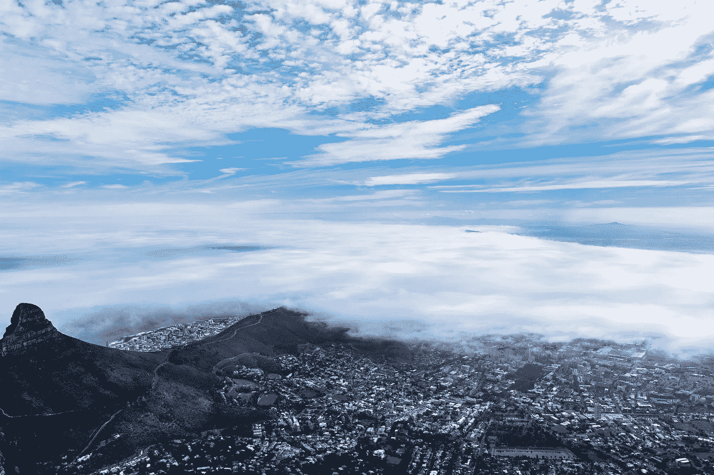
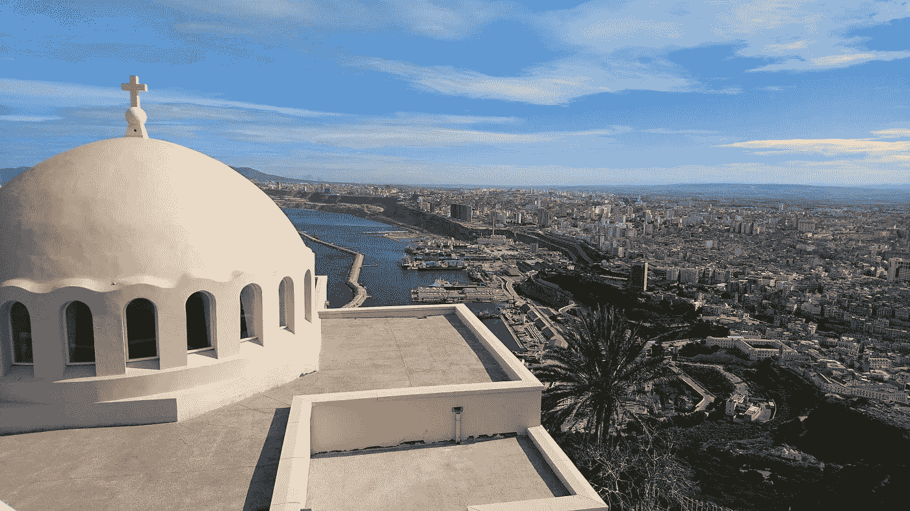
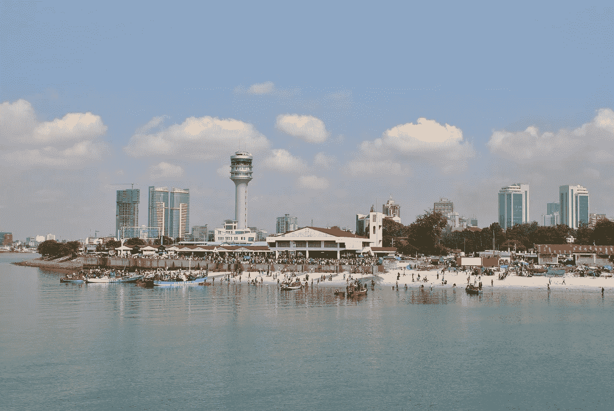
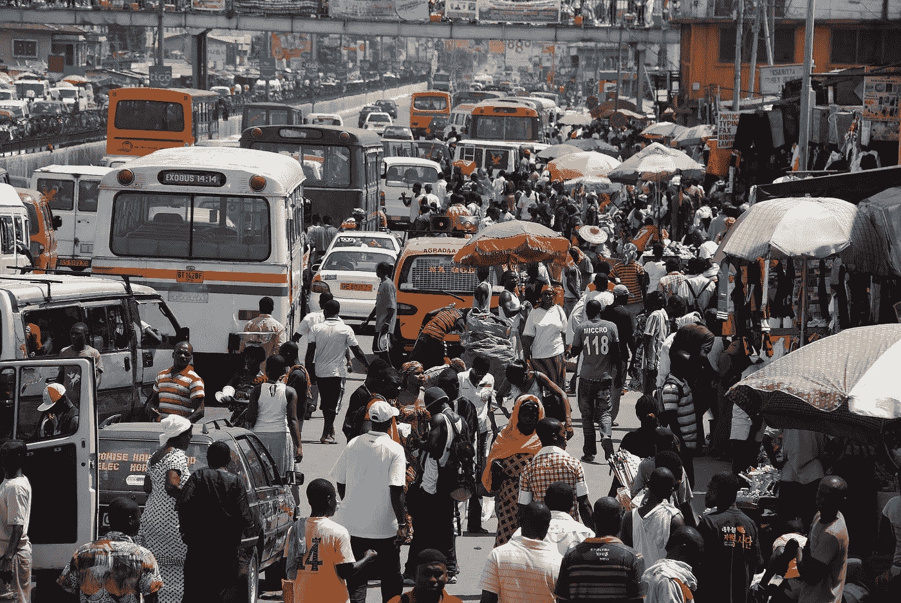

# 你完全做错了！！！！..如果你忽视了非洲在线用户

> 原文：<https://medium.datadriveninvestor.com/youre-doing-it-all-wrong-if-you-are-ignoring-the-african-online-user-b0e268ca8437?source=collection_archive---------15----------------------->

国际货币基金组织表示，在 2018 年至 2023 年之间，非洲的增长前景将是世界上最高的。QZ [[ii](#sdendnote2sym) 、纳斯达克 [[iii](#sdendnote3sym) ]和其他知名出版物在今年(2019 年)早些时候表示，在 2019 年预测的 10 个增长最快的经济体中，有 5 个将来自非洲大陆。遗憾的是，我的祖国远不在其中，但预测的五个国家是:埃塞俄比亚、坦桑尼亚、加纳、塞内加尔和科特迪瓦。

Credit: [https://unsplash.com/photos/zUAGzRDiD68](https://unsplash.com/photos/zUAGzRDiD68)

如果我们看看非洲表现最好的经济体，埃塞俄比亚，他们过去 10 年的记录相当令人印象深刻。到 2000 年，它是世界上第三个最贫穷的国家，但也是第二个人口最多的国家。从 2006 年到 2016 年，中国成为世界上人均 GDP 增长最快的经济体。截至今年，纳斯达克(NASDAQ)表示，埃塞俄比亚不仅是非洲增长最快的经济体，也是世界上增长第二快的国家，2006 年至 2017 年的平均增长率为 10.3%。

 [## 算法交易的机器学习|数据驱动的投资者

### 当你的一个朋友在脸书上传你的新海滩照，平台建议给你的脸加上标签，这是…

www.datadriveninvestor.com](https://www.datadriveninvestor.com/2019/01/30/machine-learning-for-stock-market-investing/) 

最近，根据 QZ 的数据，2018 年的增长放缓至仍然令人印象深刻的 7.5%，并再次升至 8.5%。% 2019 年[【六](#sdendnote6sym)】。埃塞俄比亚的经济由农业和服务业(尤其是交通和酒店业)驱动。他们对基础设施进行了大量投资。我记得很多年前，我去参加一个科技会议，途中在埃塞俄比亚停留。我对正在进行的基础设施开发的规模感到震惊。我们入住的酒店(在晚上很方便)有一部分仍在建设中:我们只是在黎明时才注意到这一点。

至于世界上其他增长最快的非洲经济体，卢旺达(7.8%)紧随埃塞俄比亚之后，然后是科特迪瓦(7%)、加纳(7.6%)和塞内加尔(7.6%)。值得注意的是，这 5 个国家可能不是大多数投资者所期望的国家，如南非、埃及、尼日利亚、阿尔及利亚和摩洛哥，它们被认为是“五大”市场，非洲有近 60%的消费者阶层(2.19 亿人)[【VIII](#sdendnote8sym)。事实上，像南非这样的国家似乎是国际投资者的自然选择。然而，我们甚至还没有触及博茨瓦纳、刚果民主共和国和肯尼亚等国家的经济重要性，这些国家都取得了经济进步，并从中受益。令人羡慕的是，博茨瓦纳自独立以来，一直是经济稳定增长超过 50 年的国家之一[。](#sdendnote9sym)

话虽如此，尽管我们庆祝这些国家的经济强劲增长，但我们必须记住实地的现实。并非所有的非洲都在经历这种快速增长。依赖石油的安哥拉是另一个没有过好年景的国家[[x](#sdendnote10sym)。我一直在努力寻找我的祖国马拉维的当前数据，这可能是一件好事，因为我们在这个选举年看到了前所未有的社会经济动荡，因此目前可能会让投资者失去兴趣。尽管如此，在所有这些剧变之前，非洲开发银行集团预计马拉维在 2018/2019 年的增长率为 4.6%[[Xi](#sdendnote11sym)]。今年，马拉维发生了多次反对选举结果的示威游行，导致收入损失。然而，10 个世界上增长最快的经济体中有 5 个来自黑暗大陆，这确实是一个令人印象深刻的事实。也有研究证明，在非洲的背景下，一个邻国的成功可以积极影响机会主义邻国的经济，特别是那些内陆国家。

随着非洲目前的收获，一些人认为新的叙事已经形成。一些人认为非洲正在崛起。有了事实、数字和信念，这为国际企业提供了在非洲寻找新市场或培育它们没有投入足够资源培育的市场的机会。

**不断壮大的中产阶级**

一项研究表明，非洲有 3.3 亿中产阶级人口。不幸的是，我想说的是，其中 2 . 19 亿人在“五大国”(埃及、南非、阿尔及利亚、尼日利亚和摩洛哥)。然而，剩余部分的很大一部分是来自其他 15 个国家的中产阶级(“边境 15”)。这个百分比包括了我们谈到的一些增长最快的经济体，以埃塞俄比亚为首。最后，只有大约 1700 万人来自像马拉维这样的小国。

在我们这个科技时代，接触这些潜在客户从未如此容易。然而，许多国际企业似乎并不关注该地区。国际企业能够转化但没有转化的在线用户很有意思。我假设这些国际企业没有瞄准非洲用户，要么是因为它们未能针对非洲用户的独特需求优化其在线业务、产品或服务，要么是因为完全忽视了市场。

11.5%的在线用户来自非洲[【十四](#sdendnote14sym)】。渗透率接近 40%。此外，非洲互联网用户的增长率为 11，481%，是世界上最高的！事实上，比世界其他国家的增长率加起来还要高[【XV】](#sdendnote15sym)。

整个非洲的中产阶级可以获得金融解决方案和支付方式，而非洲大陆的大多数人甚至不知道或无权获得这些。出于这个原因，你的一些产品是在他们的经济能力范围内获得的。

**不断壮大的工人阶级**

《华盛顿邮报》的一篇文章指出:

“从 2035 年开始，非洲达到工作年龄的青年人数将超过世界其他地区的总和，并将在本世纪剩余时间内每年持续下去。到 2050 年，每四个人中就有一个是非洲人。在本世纪末，将近 40%的世界人口将是非洲人。”许多人受过大学教育，有能力。即使那些没有准备好的人也愿意为在非洲建立的公司工作，如果他们接受过培训的话。非洲外包工作的潜力是存在的。

**你是如何忽视非洲市场或无意(或有意)忽视它们的？**

我被吸引来分享我的个人经历和烦恼，希望它们能引起非洲大陆其他人的共鸣，而不仅仅是马拉维人。

**1。阻止来自一些非洲国家的网站流量。发达国家的网站(和服务)可能可以无障碍地访问。我最近了解到，一个我以为关闭了 2 周的网站并没有关闭。他们只是决定来自世界这一部分的流量和用户不会帮助他们的底线。我在一项服务上测试了我的假设，这项服务允许你屏蔽你的 IP 地址来自哪个国家。我一切换到美国或其他发达国家的代理，网站就正常出现了。没有它，我们有“这个网站目前正在进行维护”的页面。有了这样的经历后，我决定查看该特定行业的其他网站，发现大多数网站也显示了同样的“停止服务”通知。我的一个住在马拉维的朋友在过去的 4 个月左右的时间里一直在我检查的第一个网站上工作，以赚取额外的钱。平台因他完成的工作欠他钱。他正等着尽快兑现。不幸的是，随着退出服务的通知，我不知道这将如何进行。然而，他是一个专注的用户，做着真正的工作，为公司的利润做出积极的贡献。**

人们不禁要问，他们的平台上是否收到了来自我们这个地区的用户的恶意活动。我有过这样的经历，来自俄罗斯的流量，在绝望和最后的尝试中获得控制，只是阻止了来自上述国家的所有用户。在我上面提到的服务的例子中，如果用户的子集可以忽略不计，那么在这个 IP 地址范围内拦截所有流量是有意义的。然而，我拒绝相信所有的恶意活动都来自我们的大陆。此外，我愿意相信有更优雅的解决方案来确保有益的用户不会受到这种全面决策的影响。

**2。网站没有针对不一致(或有时很慢)的网速进行优化。**

我们中的一些人在这里处理难以置信的不一致的互联网服务。一天或一段时间很快，而另一段时间慢得令人难以置信。我们谈到的同一个埃塞尔比亚今年发生了持续几天的网络中断[【XVIII](#sdendnote18sym)】。尽管报告称这是一次服务中断，但我们可以肯定地认为有时互联网连接很慢。

**3。有时政治会影响我们的访问**

在不止一个场合，我发现某些网站无法访问，却发现屏蔽我的 IP 地址带来了在线资源。这是我们处理某种政治危机的时候。潜在用户可能会看到你的内容或广告的网站包括 Twitter 和脸书，这些网站有时会被一些政府屏蔽。

**4。数据成本**

这对我来说是个大问题。当我偶然发现一个自动加载视频内容或其他富媒体的网站时，我很生气。事实是，在非洲大陆的许多地方，数据(互联网接入)率相当高。以马拉维的人口为例，只有 10%的人可以上网。我们拥有的少数几家提供商收取的连接费用高得惊人，与“负担得起”互联网接入的马拉维人的人均收入不相称。研究表明，马拉维人平均每月将大约 17%的收入用于免费上网。我也很生气有人通过 Linkedin 或任何平台向我推销机会，要求我首先观看视频或进行一些在线视频或在线电话会议，这些很容易是电子邮件或 LinkedIn 聊天消息。它完全激怒我的原因是，在我所在的地方，数据(互联网接入)非常昂贵。我月收入的 17%不是闹着玩的。然而，尽管面临这一挑战，我们中的许多人仍然找到了参与社交媒体、定期访问电子邮件和在线做生意的方法。就马拉维而言，进口车辆和其他货物是常态。

**5。针对非洲用户的不完整服务**

由于之前在西方生活过，我非常清楚作为一名付费用户，我在网上错过了什么。如今，我发现我的工作所依赖的重要服务的局限性。Paypal、Medium(我的文章无法获得报酬，因为“Stripe”):()、谷歌广告、亚马逊、Stripe(如果你建立在线解决方案)、一些在线视频内容提供商和一些 Youtube 频道，不一而足。如果我住在国外，我可以很容易地充分享受所有这些服务。然而，在非洲的部分地区，情况完全不同。当你需要对电子商务做一些重要的事情时，你可能会部分访问服务，例如提取在平台上获得的收入，用他们没有提供的借记卡/信用卡注册服务，甚至为你想要维持的服务支付费用。像给你的在线账户添加信用卡或借记卡这样简单的事情不仅令人沮丧，有时甚至是不可能的。我在不同的主机服务、在线出版服务、网络服务等等方面都有过这样的经历。这让我相信，互联网被扭曲成最受发达国家欢迎。我甚至敢说，甚至可能存在偏见或成见。这是一个令人沮丧的想法，尤其是当你不仅愿意为服务/增值付费，而且有能力这样做的时候。

# **那么这有什么意义呢？？？**

如果你提供在线服务，并且有能力让它更具包容性，那就去做:

*   针对慢速连接进行优化:对于来自互联网连接通常较慢的地区的流量，提供一个针对慢速连接进行优化的网站版本。
*   **请使用移动支付选项**:在非洲，移动支付账户超过了银行账户。让这一事实深入人心，并提供更多的支付选择，让它对美国用户更具包容性。在非洲的许多地方，移动货币是巨大的。与在整个非洲大陆提供这种服务的大型提供商合作，如 MTN、Airtel 和 M-Pesa。我喜欢 Upwork、脸书、GoDaddy 等公司提供的支付选择范围。他们意识到，一些地区需要更多的支付方式来充分实现货币化。我坚信马克·扎克伯格想通过 WhatsApp 为发展中国家带来下一个微信([我在之前的一篇文章中提到过)。](https://medium.com/@afrineur/why-mark-zuckerberg-facebook-and-whatsapp-will-own-the-african-future-6e943499772a)
*   为我们的地区定制您的一些产品:“**我们不向该地区发货**”是最令人恼火的通知之一。此外，这是 2019 年，找到一个解决方案，人们！！

但是，风险呢？:

在我写这篇文章的时候，我关注的是主要在网上进行的商业活动。优化你的网站，确保内容和功能对非洲用户来说是可访问的，这将花费你很多钱，但那是生意。希望你会有回报。不管你想在非洲做什么生意，你都要努力做好足够的市场调查来证明你的具体考虑。诚然，在我们大陆的许多地方，很难获得足够多的信息来帮助你做出决定。不过，也不是不可能。风险永远都在:看值不值得，就看你自己了。

最后，我要说的是:如果你们的公司忽视了非洲用户，我向你们保证，一个竞争对手将会出现，并夺走等待着你们的市场。其中一些竞争对手很可能是由非洲投资者和企业家提出的非洲解决方案。见鬼，如果我有资金，我会自己造一些。在其他情况下，来自像中国这样关注非洲的国家的公司和投资者会在你失败的地方获利。我鼓励你思考一下潜力，考虑一下你的平台是否可以做得更好。

**未来是非洲** [ [xxi](#sdendnote21sym) 。

我不是经济学家。我只是对非洲能为世界做出什么贡献以及为什么它是相关的充满热情。你有什么想法？

想要了解更多关于麦克莱恩·姆伯普拉的信息吗？在 Linkedin 或 Medium 上找到她。她在 [*写了 3 本书(一本从草根的角度看创业(《接受挑战》)和两本诗集，可以在亚马逊*](https://www.amazon.com/author/macleanmbepula) *上购买，或者你可以* [*注册并获得 100%免费的 kindle 版本*](https://www.creativeafrica.space/) *。*

**来源:**

[一](#sdendnote1anc)[https://www . un . org/africare newal/we B- features/investing-Africa-sound-business-and-sustainable-corporate-strategy](https://www.un.org/africarenewal/web-features/investing-africa-sound-business-and-sustainable-corporate-strategy)

[二](#sdendnote2anc)[https://qz . com/Africa/1522126/Africa-the-economies-to-watch-in-2019-and-emerging-debt/](https://qz.com/africa/1522126/african-economies-to-watch-in-2019-and-looming-debt/)

[三](#sdendnote3anc)[https://www . Nasdaq . com/articles/the-5-世界上增长最快的经济体-2019-06-27](https://www.nasdaq.com/articles/the-5-fastest-growing-economies-in-the-world-2019-06-27)

[四](#sdendnote4anc)[https://qz . com/Africa/1109739/埃塞俄比亚是世界上增长最快的经济体之一/](https://qz.com/africa/1109739/ethiopia-is-one-of-the-fastest-growing-economies-in-the-world/)

[v](#sdendnote5anc)[https://www . Nasdaq . com/articles/the-5-世界上增长最快的经济体-2019-06-27](https://www.nasdaq.com/articles/the-5-fastest-growing-economies-in-the-world-2019-06-27)

[VI](#sdendnote6anc)[https://qz . com/Africa/1522126/Africa-economies-to-watch-in-2019-and-emerging-debt/](https://qz.com/africa/1522126/african-economies-to-watch-in-2019-and-looming-debt/)

[七](#sdendnote7anc)[https://qz . com/Africa/1109739/埃塞尔比亚是世界上增长最快的经济体之一/](https://qz.com/africa/1109739/ethiopia-is-one-of-the-fastest-growing-economies-in-the-world/)

[VIII](#sdendnote8anc)[https://qz . com/Africa/1486764/how-big-is-africas-middle-class/](https://qz.com/africa/1486764/how-big-is-africas-middle-class/)

[IX](#sdendnote9anc)[https://thecommonwealth . org/our-member-countries/Botswana/economy](https://thecommonwealth.org/our-member-countries/botswana/economy)

[x](#sdendnote10anc)[https://macau hub . com . mo/feature/pt-economia-Angola na-mais-fraca-do-que-previso-em-2019/](https://macauhub.com.mo/feature/pt-economia-angolana-mais-fraca-do-que-previsto-em-2019/)

[Xi](#sdendnote11anc)[https://www . AfDB . org/en/countries/southern-Africa/马拉维/马拉维-经济展望](https://www.afdb.org/en/countries/southern-africa/malawi/malawi-economic-outlook)

[十二](#sdendnote12anc)[https://www . reger ingen . se/49 bb 58/content assets/947 b 93 ddf 56 E4 D8 d 889d 4115 b 4139 FDD/Paul-collier-assisting-Africa-to-achieve-decisive-change](https://www.regeringen.se/49bb58/contentassets/947b93ddf56e4d8d889d4115b4139fdd/paul-collier-assisting-africa-to-achieve-decisive-change)

[十三](#sdendnote13anc)[https://qz . com/Africa/1486764/how-big-is-africas-middle-class/](https://qz.com/africa/1486764/how-big-is-africas-middle-class/)

[十四](#sdendnote14anc)https://www.internetworldstats.com/stats1.htm

[十五](#sdendnote15anc)https://www.internetworldstats.com/stats1.htm

[XVI](#sdendnote16anc)[https://www . Washington post . com/news/democracy-post/WP/2018/06/09/the-future-is-African-and-the-the-United States-is-not-prepared/](https://www.washingtonpost.com/news/democracy-post/wp/2018/06/09/the-future-is-african-and-the-united-states-is-not-prepared/)

[XVII](#sdendnote17anc)[https://www . Washington post . com/news/democracy-post/WP/2018/06/09/the-future-is-African-and-the-the-United States-is-not-prepared/](https://www.washingtonpost.com/news/democracy-post/wp/2018/06/09/the-future-is-african-and-the-united-states-is-not-prepared/)

[XVIII](#sdendnote18anc)[https://www . VOA news . com/Africa/Ethiopia-has-its-internet-back](https://www.voanews.com/africa/ethiopia-finally-has-its-internet-back)

[XIX](#sdendnote19anc)[http://Malawi . misa . org/2019/02/23/digital-rights-how-feed-is-the-internet-in-Malawi/](http://malawi.misa.org/2019/02/23/digital-rights-how-expensive-is-the-internet-in-malawi/)

[xx](#sdendnote20anc)[https://www . weforum . org/agenda/2019/02/fin tech-in-saharan-Africa-a-potential-game-changer](https://www.weforum.org/agenda/2019/02/fintech-in-sub-saharan-africa-a-potential-game-changer)

[XXI](#sdendnote21anc)[https://www . Washington post . com/news/democracy-post/WP/2018/06/09/the-future-is-African-and-the-the-United States-is-not-prepared/](https://www.washingtonpost.com/news/democracy-post/wp/2018/06/09/the-future-is-african-and-the-united-states-is-not-prepared/)