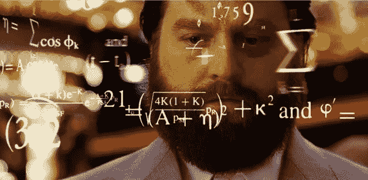
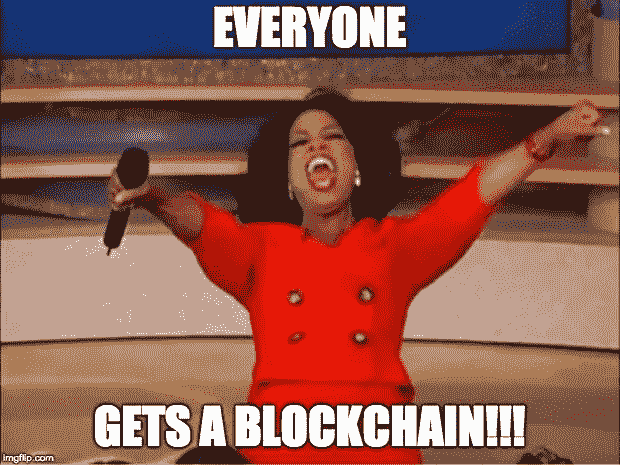
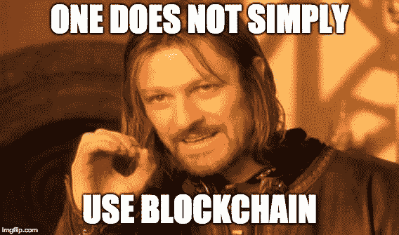

# 你不是一个人！没有人了解比特币或区块链

> 原文：<https://medium.datadriveninvestor.com/youre-not-alone-no-one-understands-bitcoin-or-blockchain-b7d68e48e373?source=collection_archive---------2----------------------->

作为比特币的新手，很容易感到不知所措，并被所有的术语搞糊涂。不要担心！我只想让你的比特币和加密之旅更容易理解，所以让我们一起加入战斗吧。

今天我想谈谈比特币的核心技术。其中一项技术是区块链，它可以说是整个加密领域中仅次于比特币的最被滥用和误用的词。我不会详细说明它是如何工作的——比如解释矿工如何解决加密算法，以确认向区块添加新区块的交易……zzz——不，我会讨论区块链的一般作用，以及它本身如何不会像许多人所说的那样“改变世界”。

**比特币区块链**

关于比特币，我们用同一个词来描述**网络**和**货币**。比特币**网络**是一种协议或协定，其内置资产或**货币**同名，即比特币。

现在，让我们把焦点放在比特币**网络**上，并简要讨论其背后的四项技术:

1.  点对点网络——对任何人开放，在这里你可以与人互动，没有中央权力或团体
2.  工作共识证明——又称挖掘，网络参与者利用计算机能力来确认交易
3.  加密技术—确保交易安全的技术
4.  区块链——一种记录交易的分类账或数据库

如你所见，区块链只是让比特币网络成为可能的四个部分之一。由于这四种技术协同工作，比特币网络是开放的、分布式的、无信任的和不可改变的，这导致了它最重要的好处，即去中心化。让我们在这里暂停一下，因为这是事情变得不正常的地方。

**区块链炒作列车**

自从比特币诞生以来，区块链这个词已经慢慢变成了一个无所不知、毫无意义的营销术语，不断出现在采访、ted 演讲、白皮书和日常对话中。每当有人想向你推销“咨询”服务或者“解释”为什么它比比特币更重要的时候。而实际上，区块链只是一个缓慢的数据库，没有内在的分散性。

有无数文章声称‘区块链将改变世界！’这些文章中有许多是这样描述这项技术的:一个开放的、分布式的、无信任的、不可变的、去中心化的数据库！等等，这听起来很像…是的，所有这些文章实际上都在描述比特币网络:一个开放的(#1)，分布式的(#1)，无信任的(#1，2，3)，不可变的(#2，3，4)数据库！(#4).这些文章错误地用比特币网络的属性来描述区块链。

*喘息！*

比特币网络选择区块链是因为它允许任何个人在开放和分布式网络中仔细(慢慢)跟踪和确认活动。这是为了确保一致性和信任。其逐块的性质是笨重和低效的设计，这对于管理比特币，一种数字货币和新的资产类别非常有效。然而，将它用于数字货币之外的任何东西都极具挑战性——稍后将详细介绍。我是说，你真的能把奶牛放到区块链吗？你应该吗？

**你真的想要一个区块链？**

当然，你可以将区块链从比特币网络中剥离出来，让它变得更加“高效”，并提供“即时”数据传输，但你这样使用它会立即失去无信任、透明和不可改变的属性。您可以创建一个私有的封闭版本，如 IBMs Hyperledger。这里的问题是，这将由财团 A，B，C(有限网络)控制，没有采矿，因为玛丽，胡安，鲍勃等。并不重要，所以速度更快！

*布乌特…*

即便如此，区块链实际上是在堆叠块和数据块。与 Oracle 数据库等其他数据结构相比，这是一个维护负担，因为 Oracle 数据库是私有的，而且速度很快！看，没有区块链我也解决了你的问题。本质上，当你使用一个私有的区块链时，它并不是真正去中心化的，而是一个不必要的复杂和笨重的数据库。

许多公司希望通过使用区块链来显得“了解情况”，但他们只是在利用一种趋势，并利用不知情的消费者为自己谋利。如果你看到公司或团体以这种方式使用它，那么明白你得到的产品不会提供比特币网络的所有*魔法*，它符合他们自己的利益，他们不明白它是如何工作的，并且它实际上可以做什么的承诺被夸大了。

区块链并不能解决所有问题，我的朋友。

那好吧！现在，你对比特币背后的核心技术有了更多的了解，区块链带来的真正价值，以及在比特币网络或数字货币之外的任何背景下出现的任何时候都保持着重要地位。如果你想更深入地了解这个话题，那么看看这篇伟大的[文章](https://medium.com/@jimmysong/why-blockchain-is-hard-60416ea4c5c)。这是一个漫长的旅程，有许多路径要走，所以下次请和我一起深入探讨比特币。以后再说！