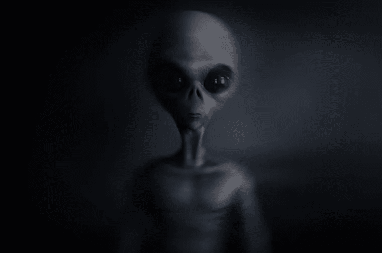
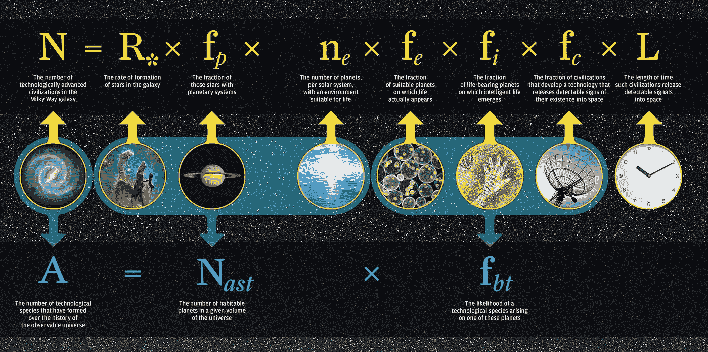

# 你正站在外星人的领地

> 原文：<https://medium.datadriveninvestor.com/youre-standing-in-alien-territory-cdad374251a9?source=collection_archive---------42----------------------->

很可能已经有外星人生活在你所在的星系中。

> 在过去的 20 年里，天文学家已经探测到大约 2000 颗外星行星，这些发现表明潜在的宜居世界在银河系中很普遍

Are We in Their Land?

> 只有我们吗？
> 
> 如果答案是否定的…
> 
> 我们肯定会问这样一个问题:“我们将如何应对这些外星生物？”

# 是什么引发了我的质疑

一天晚上，我抬头仰望天空。我看着星星不断向远方飞去。每一秒都在延伸自己，让自己飞走。

它让我*反思*我的想法，并*对未来*感到好奇。我看得越远，我思考的时间就越长。

我继续观察，它们形成了不同的形状和大小，这让我开始思考。

外面有什么可能的生命？我们星球之外存在更多生物的可能性有多大？

Star Sky

这让我对我们所知的生命产生了疑问，这种想法也让我对我们宇宙的可能性有了不同的看法和想法。

每天我们继续我们的正常生活，现在如果在 T21 以某种奇怪的方式，这些其他的生命以不同于我们的生活方式继续他们的生活。

# 真相

**既然我们得出了*好奇心*的结论。**

> 我们必须质疑现实，

外星人**存在**吗*甚至*？

根据对我们周围星系的多项研究，甚至在我们自己的参数范围内，很有可能在我们自己的领域内存在许多不同的生命形式。

所有的人，*有争议的*有他们自己相反的论点，每个人都展示了不同的研究，既展示又投射想法，形成基于证明或否定外星生命的想法的公式。

对我来说，我认为很有可能，而且有很多证据支持这个观点，我们的世界不仅仅是我们的宇宙。

> “美国宇航局的开普勒太空望远镜……表明大约 20%的恒星拥有适合生命的行星，“可居住带”，在那里液态水可能存在于世界表面。”

# 观察我的发现

在所有的发现中，我在*看到的有趣的*是**关于在我们自己的星系中有多少不同的可能行星*有可能*成为*外星人居住的***。

有*许多不同的故事*不断重复展示有许多**不同的领域是如何靠近的，**甚至是在" ***金发区*【s】**"——*那里可能存在水*(或者曾经存在过，意味着它曾经是一个 G.Z) —

> 然而，我们仍然似乎保持不变，在我们仍然的意义上，还没有发现任何前世生活的真正的确凿证据。

现在我提出一个想法，也许这些研究在理论上是***100%准确……***

**在这些研究中，假设一切都是绝对确定的，然而他们不知道为什么没有生命存在。**

**我相信什么**有可能**经过我的阅读；“在我们的星系中并没有我们能够发现的外星生命，尽管目前还没有，但也许已经有了。”**

**如果所有这些假设的生命发生在这里，发生在我们的银河系内，而它们起源的其余部分都消失了，那会怎么样？**

> **他们的生活会是怎样的？**
> 
> **他们长什么样？**
> 
> **为什么他们堕落了，或者没能保住社会？**

****关於*space.com*关於**，我读**

> **“宇宙已经超过 130 亿岁了，”沙利文在同一份声明中说。这意味着即使我们的银河系中有 1000 个文明，如果它们的寿命只有我们存在的时间——大约 1 万年——那么它们很可能都已经灭绝了。而其他的不会进化，直到我们很久以后。为了让我们有更多的机会成功找到另一个‘当代’活跃的技术文明，平均来说，它们必须比我们现在的生命持续更长的时间。”**

**现在这篇文章对我来说意味着什么，即使已经有研究表明*可能有很多文明，在我们这个时代我们*寻找的真正的外星人*实际上已经在时间内* **灭亡了**并且*已经灭绝了吗？*****

> **如果我们是最后的存在呢？**

**天文学家已经计算出，在我们的太阳系之外，有近一千颗行星可能是外星人的家园。这样就有了另外 2500 名“候选人”，他们将被检查是否有能力安置这些“外星人”。[https://www . space . com/14200-1600 亿-外星-行星-银河系. html](https://www.space.com/14200-160-billion-alien-planets-milky-galaxy.html)-放入候选链接**

**在每天的基础上，团队分析不同的事件，对于初学者来说，密切扫描生命的数百万种不同的可能性。**

# **德雷克方程**

**T 这里*已经*有了尝试*追踪电磁辐射*的想法，以及寻找恒星的形成，看看**是否适合**生命。**

**除了这些元素，还有关于*时间长度*的想法，以及*多久*文明能够在太空中被探测到的可能性。**

**大多数关于外星人的想法都属于德雷克方程——基于弗兰克·德雷克 1961 年研究的现代外星人生命概率定理；**

> **无线电天文学家弗兰克·德雷克于年首次提出……这个等式通过乘以几个变量来计算交流文明的数量。**

****

**The Drake Equation**

**基于最近的研究，以及之前的研究，比如由弗兰克·德雷克进行的研究，我们可以得出这样的结论:基于等式，生命有许多不同的可能性。**

# **结束的**

**从我们的星系到数百万其他星系，可能性是无穷无尽的，也不确定我们的世界之外会发生什么。**

**有如此多的因素需要考虑，以至于我们的想法是无限的。自从这些外星人恐慌开始以来，如此多不同的故事和阴谋被创造出来，公众的兴趣被激发得如此显著。**

**想法是无穷无尽的，在我们的太阳系之外有如此多不同的生命存在的可能性，这让我更加好奇。**

**明天我将发布另一篇关于从 20 世纪早期到现代的外星人恐慌的文章。**

****别忘了留几个掌声，感谢阅读。****

****下次见，****

*****~不断学习*****