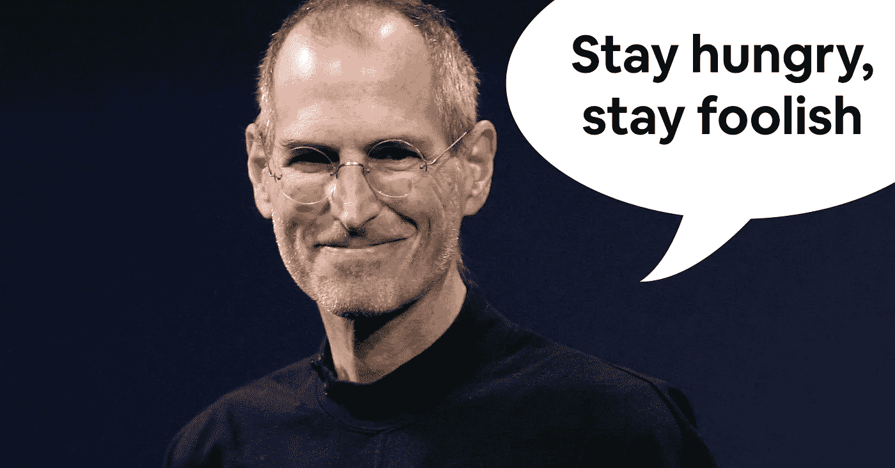
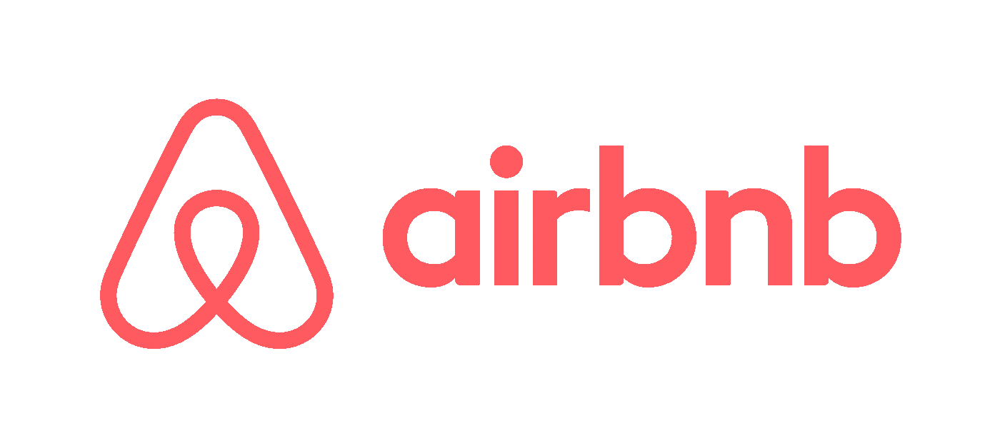
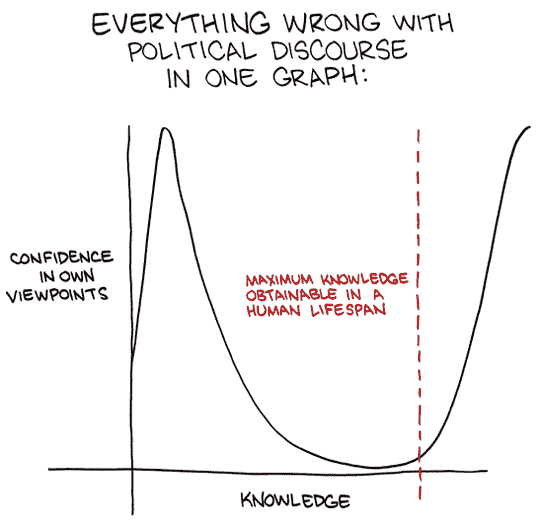

# 年轻和缺乏经验是企业家的优势

> 原文：<https://medium.datadriveninvestor.com/youth-and-inexperience-as-entrepreneurial-advantage-b647ec67a548?source=collection_archive---------19----------------------->

[Source](https://www.cnbc.com/2018/10/02/steve-jobs-heres-what-most-people-get-wrong-about-focus.html). Quote from a [Stanford commencement speech](https://news.stanford.edu/2005/06/14/jobs-061505/), adopted from an edition of The *Whole Earth Catalog*.

为什么今天最大的公司都是从愚蠢的年轻人开始的？

2008 年底，三个 20 多岁的年轻人身无分文，苦苦挣扎。他们新成立的公司已经耗尽了现金储备。他们正在与一个根深蒂固的行业作战，这个行业的历史可以追溯到公元 700 年。形势对他们不利。

出于同样的绝望和智慧，他们决定卖掉麦片盒子来维持公司的运转。绝望是因为他们别无选择。荒谬中的巧妙。他们利用自己的设计背景，在奥巴马-麦凯恩(R.I.P .)选举期间，模拟了以总统候选人为主题的盒子皮肤。他们把关于他们公司的信息传单放在每个盒子的折叠处。

他们卖了价值 3 万美元的东西，使他们的公司免于破产。

10 年后，Airbnb 成为一家价值数十亿美元的公司。

From origin to present, everything had to do with user-centric design.

事后看来，很容易指出 Airbnb 拥有取得巨大成功的所有要素。绝大多数互联网看起来更像 Craigslist，而不是今天时髦的现代网页设计。Airbnb 提供了由设计专家构建的漂亮界面，满足了人们的实际需求。但是，实时执行这样一个左场营销计划与专业知识关系不大，更多的是彻头彻尾的愚蠢。

没有营销顾问或所谓的“专家”会推荐什么最终为 Airbnb 赢得了宝贵的资金和媒体。这需要那些愿意执行最疯狂想法的企业家。那些甚至不知道他们所不知道的程度的人。

This is [one of my favorite SMBC strips](https://www.smbc-comics.com/index.php?db=comics&id=2177) — different context, but I believe the graph still applies.

这是传统智慧失败的地方。经验使其他企业家能够通过行之有效的方法逐步建立公司。缺乏经验打开了大门——隐藏在背后的可能是一枚哑弹，但往往是真金白银。

关于青春的价值，我最后要说一句话。年轻企业家具有弹性学习能力。这意味着他们能够快速适应不断变化的环境，而年长的企业家则更加固定。我没有偏见(作为一个 22 岁的年轻人)或贬损的意思。这只是我们自己的发育生物学。

为什么适应性比经验更重要？我认为这是因为今天增强的信息社会运行在加速的达尔文框架上。这个世界现在变化如此之快，以至于我们在大学一年级学的东西可能在毕业时不再适用。情况和环境变化越快，过去的经验“真相”就越不重要。

年轻和愚蠢的人之所以成功，是因为他们知道的太少，以至于认为不可能。今天的不可能可能成为明天的现实。

