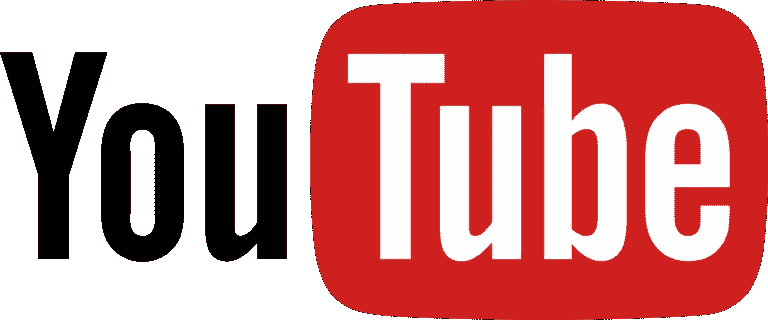
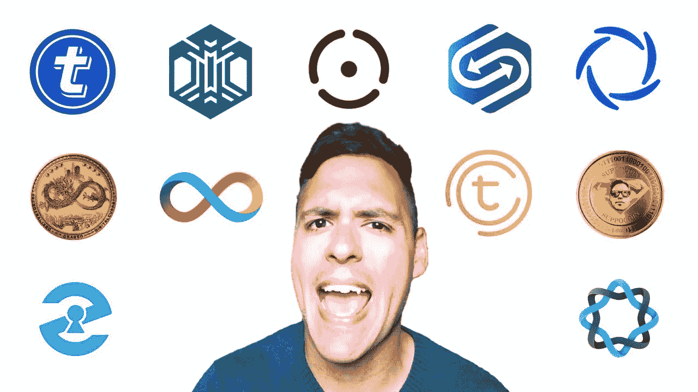
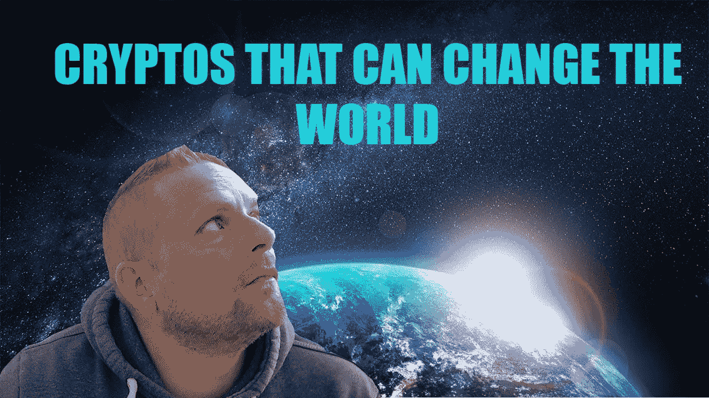
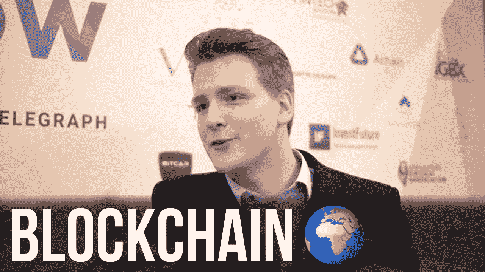

# YouTube，你的加密之旅的朋友和敌人

> 原文：<https://medium.datadriveninvestor.com/youtube-the-friend-and-foe-of-your-crypto-journey-d269fc5f8ded?source=collection_archive---------1----------------------->

当你第一次开始接触 crypto 时，无穷无尽的信息令人望而生畏。

我发现知道去哪里获得可靠的信息比了解区块链本身更具挑战性。

一路上，你会发现各种博客和文章，播客和视频。诈骗网站、虚假交易所、在 telegram 上冒充他人的骗子以及黑客都是威胁您加密之旅的危险因素。你会发现理解加密和区块链的学习曲线比学习如何保证你的投资安全更容易。

你首先会接触到的信息领域之一是 YouTube。

实际上有成千上万的“秘密”YouTubers。其中一些是诚实和开放的，并提供良好的信息。有些人看起来非常博学，但实际上他们抄袭了其他优步的内容，并打上自己的烙印。然后是过度夸张的商人，他们会不择手段地增加他们参与的项目的 FOMO(害怕错过)，以帮助他们自己的投资增长。

从略显露营和笨拙的 Suppoman 到过于自信和咿呀学语的隐鸦。从精准快速的击发盒矿到脑残的 JR 商业兄弟(请像躲避瘟疫一样躲避这些傻逼)。

评判他们的是 Doug Polk，这位自信的自称是 YouTube 上 crypto 评委的人。

不胜枚举，但一路走来，我看了，订阅了 100 个，甚至可能是 1000 个。

过一会儿你会缩小你的订阅范围。这可能是因为你不相信他们说的话，只是不喜欢他们，或者看穿了他们的谎言。

在加密领域，我最喜欢的 YouTuber 是**。一位公开而诚实的 crpyto 专家，从事密码工作多年。虽然该频道的语言可能很直白，但它总是以一种友好、不冒犯人的“英语”方式播出，这是许多文化无法理解的。通过这一关，你就是这个人的赢家。**

****

**他在一些项目中担任顾问角色，并受到密码界权威人士的高度尊重。**

**很多 YouTubers 的评论都是赞助的，这已经不是什么秘密了。诚实的人会声明这一点。而其他人坚持认为他们从来没有得到报酬，他们的评论总是公正的。一般来说，这是不正确的。另一方面，Keith 在得到赞助时总是会建议你。**

**Keith 倾向于主要关注 ico。首次公开募股(ico)相当于股票市场上的首次公开募股(IPO)。**

**虽然在某些情况下，ico 可能比投资于成熟的硬币市场风险更大，但它提供了更大的收益，让你有机会从底层进入市场。**

**Keith 最近建立了一个加密池，帮助普通投资者在一些重大和令人兴奋的项目上获得高折扣和奖金。资金池主要集中在项目的预售阶段。大多数预售都需要很大的最低投资，而我们大多数人都负担不起或者不希望冒很大的风险。通过集中投资，您可以获得售前奖金/折扣的好处，但同时您的支出可以更低，在某些情况下低至 250 美元。**

**虽然有其他泳池组，我强烈推荐基思的。该集团包括一些高知名度的投资者提供建议和援助，项目总是有效的，有很大的潜力。**

**与 crypto 中其他一些众所周知的身份不同，Keith 实际上花时间在他的电报组中直接通信。我发现有些人很少对他们的团体感兴趣，几乎从不与他们的成员直接交流。**

**在 https://www.youtube.com/keithwareingofficial 查看基思的 YouTube 频道，在 https://t.me/Officiallykeith 的 T2 加入基思的加密池**

****伊凡科技**我紧随其后。他是一名国际演说家、区块链教育家、软件开发人员和数据科学家。Ivan 的 YouTube 频道 Ivan on Tech 是一个真正的全球现象，它向全世界成千上万的观众传播关于区块链技术的知识。Ivan 通过有趣和激动人心的演讲使复杂变得简单。**

****

**在 https://www.youtube.com/c/ivanontech[查看伊万的 YouTube 频道](https://www.youtube.com/c/ivanontech)**