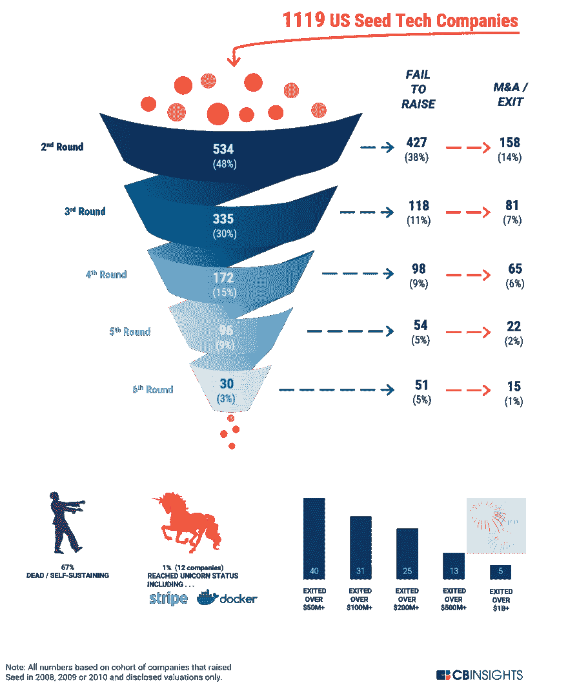

# 你已经筹集了风险资金，所以你是成功的，对吗？

> 原文：<https://medium.datadriveninvestor.com/youve-raised-venture-funding-so-you-are-a-success-right-66999cb7f243?source=collection_archive---------56----------------------->

我必须以一个免责声明开始这篇博客，这篇博客对我来说是主观的和不同的领域，但它是我想基于我的经验和对话来挑战的东西。

任何在创业行业工作的人，但这可能延伸得更广，都曾在一次谈话中听到有人说:

> “你听说过[插入通用创业公司名称]吗？他们刚刚通过[插入知名风险投资公司名称]筹集了 xx 百万美元？”

通常随之而来的反应是类似于*“哇，他们一定会大获成功的”*或者*“他们会很成功的”*。我们也听说初创公司痴迷于并不断谈论融资，因为他们认为这是成功的组成部分。然后，行业媒体强化了这一点，我经常听一个很棒的 SAAS 播客，我总是发现在介绍受访者时，演讲者首先提到公司名称，然后分享他们与谁筹集了资金，好像这就是他们的定义。

现在，我不得不承认，我把风投融资与过去取得的成功联系在一起，但这些初创企业真的成功了吗？或者我们应该质疑这个假设吗？

首先，我们经常听说筹集资金是对正在创造的东西的确认。验证意味着决策者消息灵通，但风投们在投资时真正知道什么呢？大多数潜在投资者将会被告知一个很棒的故事，关于为什么客户不断更新(粘性产品与优秀服务&支持)或销售渠道看起来像什么(最佳案例与承诺)。故事永远不会完全忠实于事实，更重要的是，他们从公司的创始人那里听到故事，这些人放弃了他们的工作、时间和金钱来试图使这一点成功，如果他们不热切地相信这将是一个成功，那么谁会呢？

人们通常认为风投是经验丰富的专家，因此知道什么会成功，但他们真的是他们所描绘的伟大先知吗？根据 Tomer Dean 在 Tech Crunch 上的文章(值得一读),只有 5%的风险投资基金成功赚钱。Tomer scenario 模拟了为什么会出现这种情况，以及风险投资基金取得成功的难度。他还强调说，大多数风险投资公司从向投资者收取的承诺资本的 2%年费中支付薪酬，他们不必为了生存而成功。

其次，显然有无数成功创业的例子(还有风投基金！)但是，如果你足够幸运地获得了资助，你注定会“成功”吗？有多少公司是融资后成功的？[根据哈佛商学院高级讲师 Shikhar Ghosh](https://www.inc.com/john-mcdermott/report-3-out-of-4-venture-backed-start-ups-fail.html) 的一份报告，大约 75%的美国风险投资支持的初创企业失败了，这远远高于大多数行业报告的失败率(25%-30%)，这种差异是由各自对失败的定义造成的。如果你把它延伸到没有交付预期的投资回报，那么 95%的风险投资创业都是失败的。发人深省的想法。

最近 [CB Insights 的一份报告](https://techcrunch.com/2017/06/01/the-meeting-that-showed-me-the-truth-about-vcs/)观察了 2008 年至 2010 年在美国进行种子融资的 1100 人，描绘了一幅类似的画面。下图展示了公司在哪个阶段退出的漏斗。一些突出的统计数据:

*   只有 1%的公司达到了独角兽的地位，这是一个非常强大的群体，包括 Airbnb 和 Stripe(这个百分比对每个群体来说都一样高吗？)
*   67%的公司要么倒闭，要么变得自给自足(许多公司后来因为媒体报道比他们大肆宣传的融资少而焦头烂额)

所以有人怀疑资金的重要性，但是成功的领导者有多重视它呢？我之前提到过一个 SAAS 播客，其中直接关注的是谁资助了一家初创企业，在随后的采访中，首席执行官或领导者从来不会谈论融资带来了多大的影响，或者让硅谷基金 Z 参与进来有多重要。他们关注的是他们的客户或他们正在解决的问题。这才是创业行业应该做的，而不是资金从哪里来。在受访者谈论投资者的情况下，是以“X 在为我们提供建议方面产生了巨大影响”的身份。

我并不是说风险投资是一件坏事，它为企业的启动、发展和壮大提供了一个很好的平台，也为像我这样的人提供了机会。然而，它不应该被视为成功的衡量标准。这是大多数初创企业都必须走的一步。成功是创建一家客户喜爱的公司，它解决了一个问题或挑战，并且是一个可预测和可重复的收入引擎。在我目前工作的地方，我们可能会在明年筹集 A 轮资金，我坚持认为，尽管我们会认识到这是重要的一步，但我们尚未取得任何成就，需要更加努力地打造我们的客户离不开的东西。如果有人走过来对我说:

> “我听说了你们筹集的资金，你们一定乐坏了”

我希望我的反应是:

> “不，还没有，但我们很高兴有额外的支持来帮助我们在未来取得成功”。