# 所有东西都是密码。外汇股票—2018 年 7 月 13 日

> 原文：<https://medium.datadriveninvestor.com/yptoall-things-cryptos-forex-stocks-07-13-2018-eb7d6d03d056?source=collection_archive---------0----------------------->

在过去的几周里，我意识到比起阅读大量关于金融市场的无聊文字，人们更喜欢视觉效果，所以决定改变每周博客的形式，更多地关注技术性图表研究，减少文字内容。继续前进，美国股市创下新高，在短暂的技术性反弹后，美元兑主要货币汇率上升& Cryptos 再次大幅走软。

# 疯狂的密码诗

T he Cryptos 本周再次下跌，在撰写本文时，总市值为 2500 亿英镑，数字硬币试图找到更高的低点。上周的反弹被证明是暂时的，因为加密领域又出现了一次黑客攻击。让我们回顾一下五大密码的图表，其中 EOS 是最弱的。

**比特币(BTCUSD — MT 看跌，ST 看跌)**

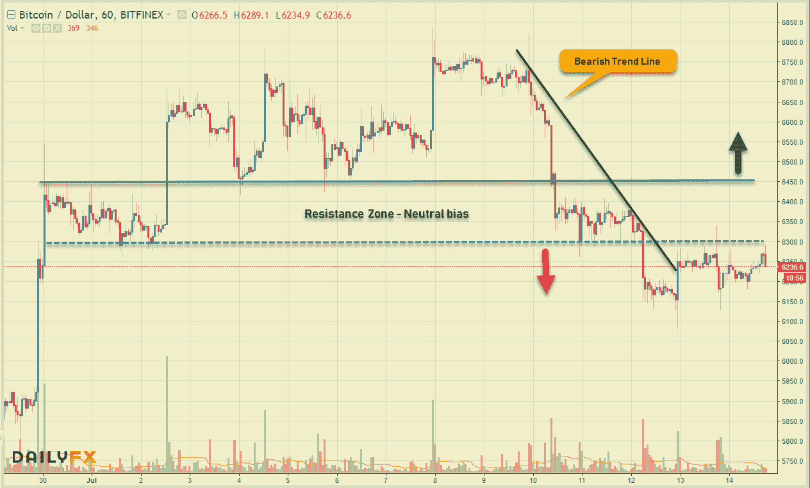

**以太坊(ETHUSD — MT 看跌，ST 看跌)\**

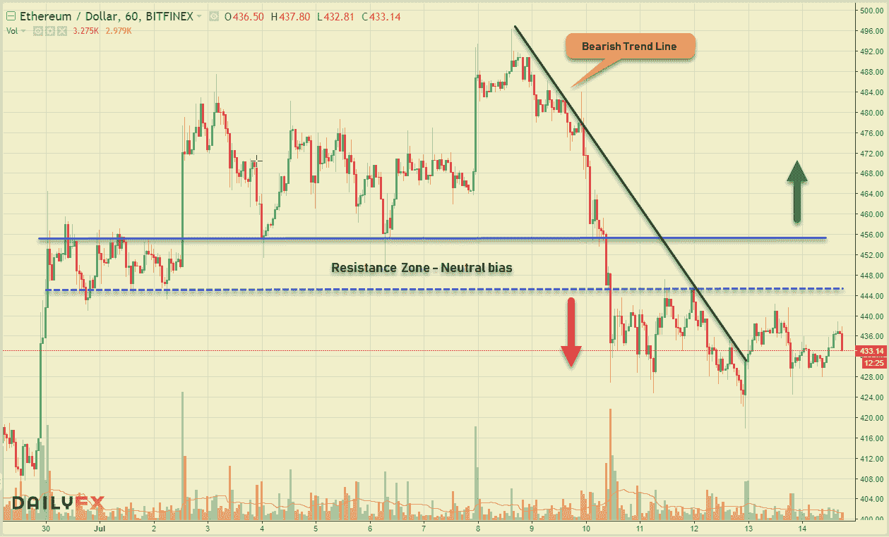

**比特币现金(BCHUSD — MT 看跌，ST 看跌)**

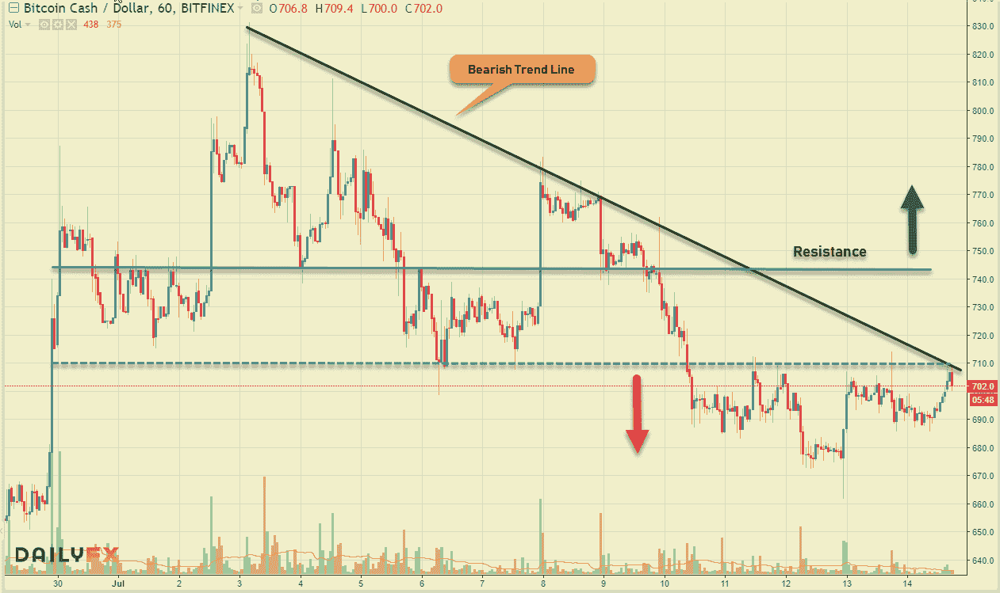

**Ripple (XRPUSD — MT 看跌，ST 看跌)**

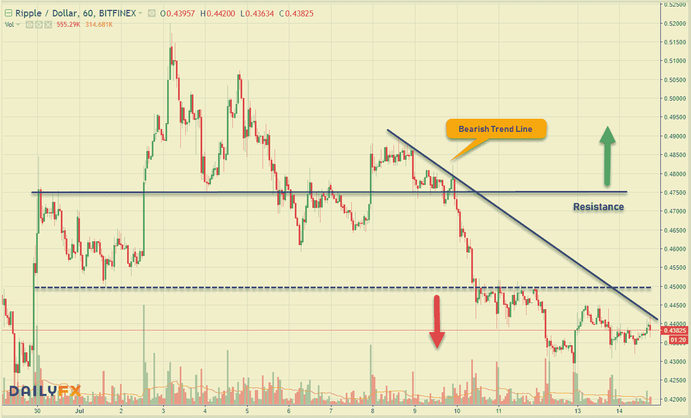

**EOS (EOSUSD — MT 看跌，ST 看跌)**

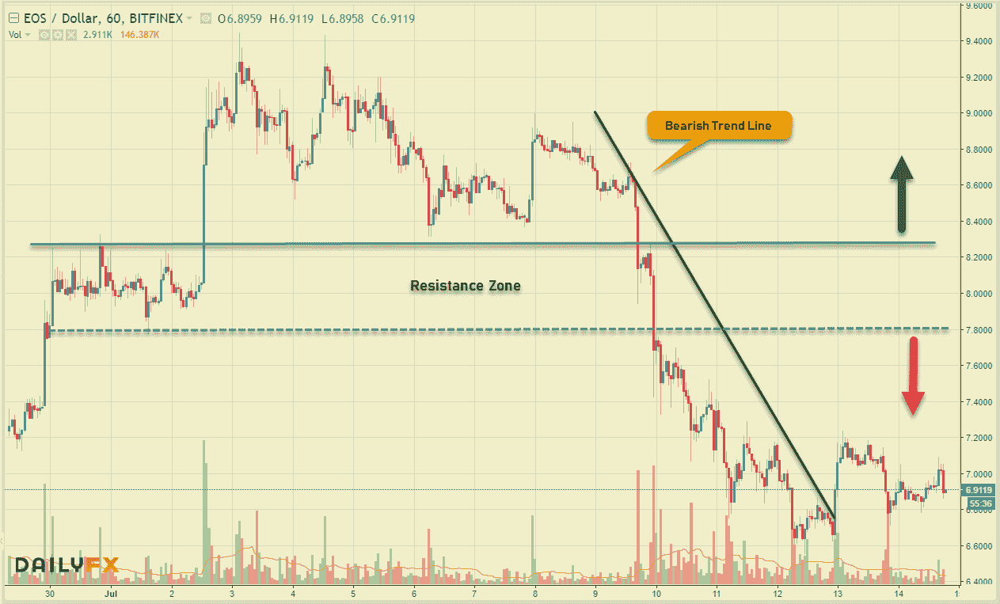

以下是 Cryptos 上周的主要头条新闻:

*   主要期货交易所 **CBOE** 申请比特币交易所交易基金，增加获批概率
*   黑客从加密货币交易所窃取 2350 万美元 **Bancor**
*   马耳他的加密公司推出与欧元挂钩的稳定加密货币
*   Opera 浏览器推出内置加密货币钱包
*   总部位于瑞士的 Sirin 实验室将于 11 月发布基于区块链的智能手机
*   币安支持世界上第一家非集中化银行

# 外汇市场

本周，随着美元走强，主要市场对美元的技术性反弹已经失去了动力。土耳其的政治举措进一步推高了里拉，延续了今年新兴市场的最大跌幅之一。而另一方面，随着贸易战升温，中国引导人民币兑美元汇率创下一年半来的最大单日跌幅。下周将会是一个繁忙的经济日历，加拿大、日本、英国和新西兰都将发布消费者物价指数。此外，澳大利亚就业、中国国内生产总值&和美国零售销售数据也将成为焦点。让我们看看 5 美元的短期走势。

**欧元(欧元兑美元-MT 看跌，ST 中性)**

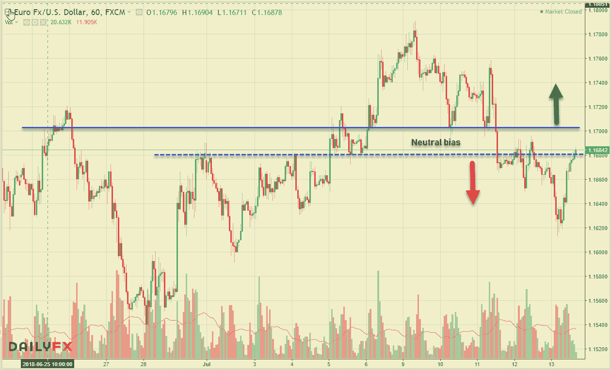

**英镑(GBPUSD——MT 看跌，ST 看跌)**

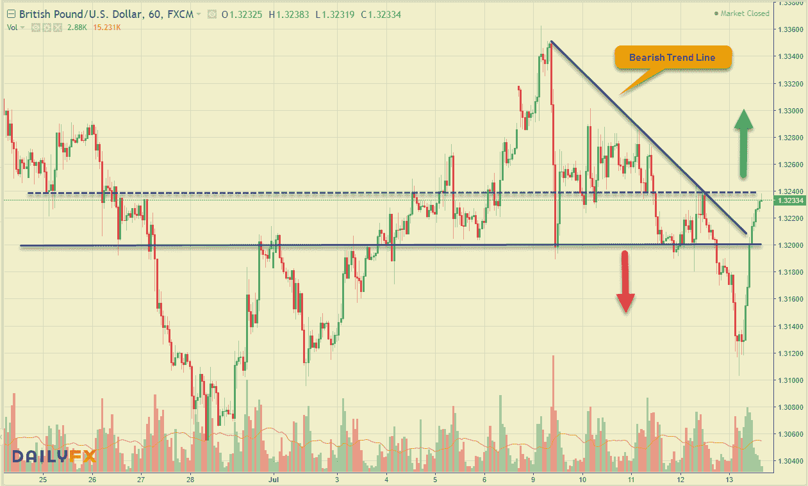

**日元(美元兑日元——MT 中性，ST 看涨)**

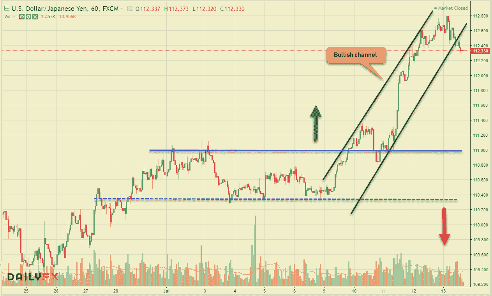

**澳元(澳元兑美元— MT 看跌，ST 看跌)**

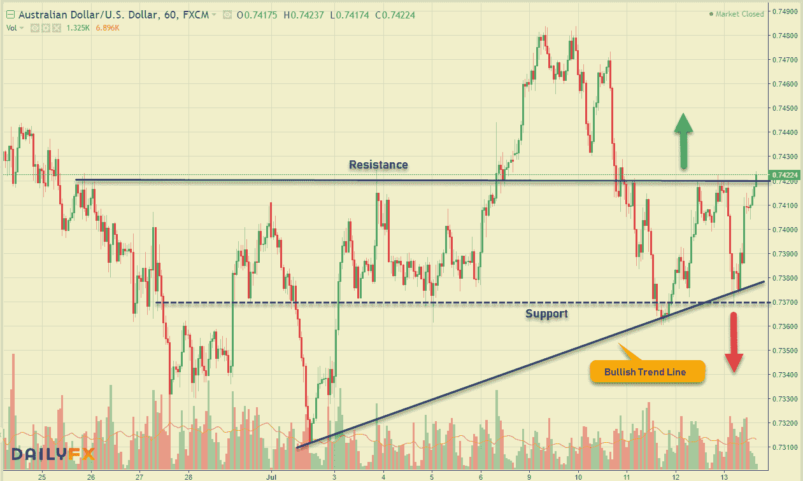

**龙尼(美元兑加元-MT 中性，ST 看跌)**

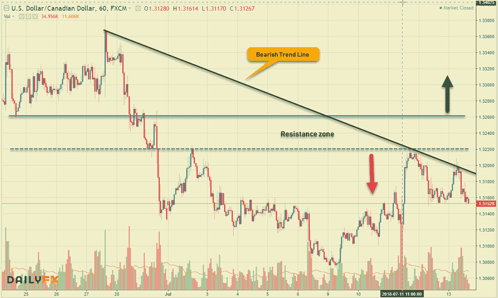

# 股票市场

全球股市强劲反弹，美国股市领涨。美国股指上周在科技股的带领下大幅上涨。标普 500 指数创下今年 2 月以来的最佳收盘点位。然而，随着世界上两个最大的经济体之间的贸易关税问题悬而未决，疑云仍然存在。看一看全球主要市场的每周数据，我们可以看到看涨情绪全面占据主导地位。

**美国——DJIA(+2.30%)，标准普尔 500 指数&(+1.50%)，纳斯达克(+2.34%)，**

**欧洲——富时 100 指数(+0.58%)，德国 DAX 指数(+0.36%)，CAC 40 指数(+0.98%)**

**亚洲——日经 225 (+3.71%)，BSE Sensex (+2.48%)，上海 50(+3.09%)**

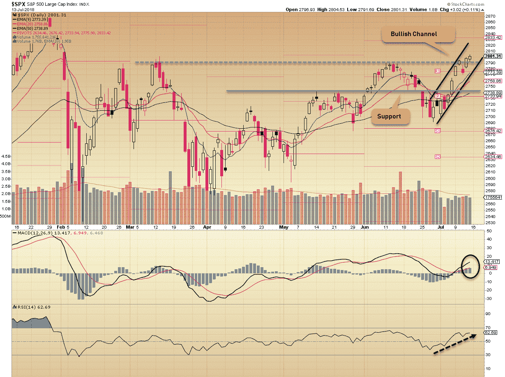

分析 S&P 图表，很明显指数已经进入牛市通道，超越了前期高点。看涨势头看起来将继续，即时 ST 支撑@ 2791.43。只要 2745 点不动，上升空间就有望持续。其他消息，临床阶段生物技术疫苗公司已经申请首次公开募股，初始注册金额为 4600 万美元。该公司希望在纳斯达克全球市场上市，股票代码为 **VCNX。**

在我们结束之前，这里是本周的交易理念。

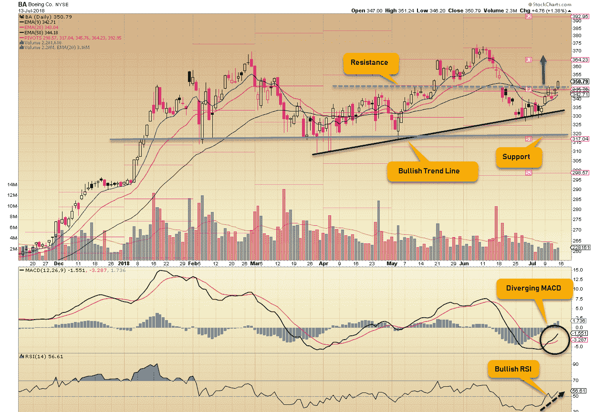

市场上周看起来肯定是这样的——祝大家交易愉快！

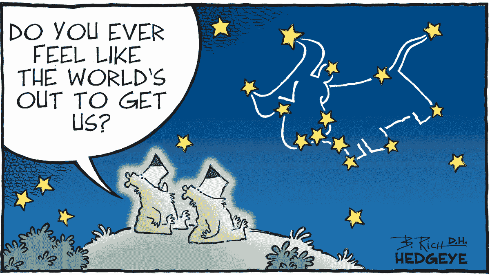

相关文章: [**交易美元专业外汇**](https://medium.com/datadriveninvestor/trading-usd-majors-in-forex-b616c7841bc7) ， [**交易心理&经验教训**](https://medium.com/datadriveninvestor/sttrading-psychology-lessons-learnt-2ea706908df2) ， [**百事通……一个高手！**](https://medium.com/datadriveninvestor/jack-of-all-trades-master-of-one-bb05ccafdf8a) 、 [**一刀切的交易策略？**](https://medium.com/datadriveninvestor/one-size-fits-all-trading-strategy-c8c2d7954740)

保持联系:[Twitter](https://twitter.com/fklivestolearn)|[StockTwits](https://stocktwits.com/trade_nut)|[LinkedIn](https://www.linkedin.com/in/faisal-khan-2a3009b/)|[Telegram](https://t.me/joinchat/IWzyHBGWCFwPQTe8Tm5H_Q)|[trade alike](http://www.tradealike.com/)

*原载于 2018 年 7 月 14 日*[*www.datadriveninvestor.com*](http://www.datadriveninvestor.com/2018/07/14/all-things-cryptos-forex-stocks%e2%80%8a-%e2%80%8a07-13-2018/)*。*