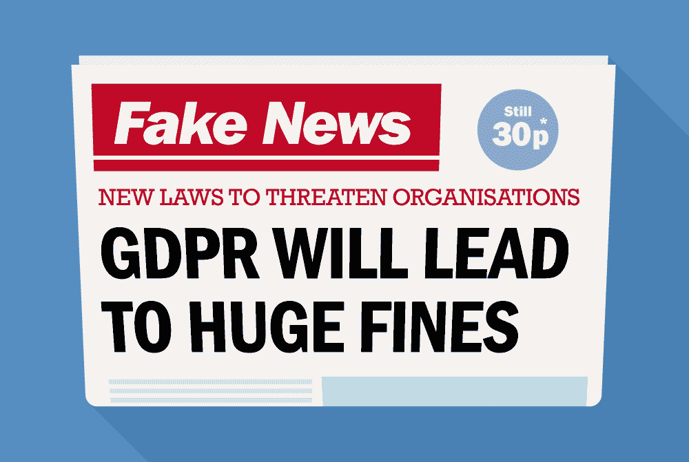

# 尤格 GDPR 粉末

> 原文：<https://medium.datadriveninvestor.com/yuuuuuge-gdpr-fines-2fadf1cd78d1?source=collection_archive---------8----------------------->

Turns out it wasn’t fake news

期待已久的事情终于发生了。一年多以前，GDPR 开始生效。我们搓着手等待着

等待着

等待着。

不要再等了。

 [## 人们对隐私的不理解是什么？数据驱动的投资者

### 你知道那种感觉。无论是访问应用程序、订阅还是你最喜欢的运动鞋。你按下…

www.datadriveninvestor.com](https://www.datadriveninvestor.com/2019/04/11/privacy-and-convenience/) 

本周，国际民航组织指控违反 GDPR，对万豪国际和英国航空公司总共罚款超过 3 . 55 亿美元。哇哦。

**[*卫报*](https://www.theguardian.com/business/2019/jul/08/ba-fine-customer-data-breach-british-airways) 本周早些时候报道了罚款情况。虽然这不是第一次罚款，但肯定是最大的一次。**

**信息专员办公室(ICO)是国家数据保护机构，负责在英国实施 GDPR。**

**ICO 表示，经过调查，他们发现在这两起案件中，包括姓名、出生日期、地址、信用卡和护照号码在内的个人信息都被盗。在万豪酒店的案例中，ICO 说有超过 3 亿人！黑客入侵客人记录，而英国航空公司有超过 50 万条记录被黑客入侵。**

**现在你可能会问，为什么万豪酒店在谁能披露更多个人信息的游戏中以明显优势获胜时，却被处以较少的罚款。**

**唉，情况并不完全相同。ICO 表示，英国航空公司的罚款是根据 2018 年 6 月因安全安排不佳而发生的数据泄露事件进行的。信息专员丹汉姆说，法律说得很清楚，“当你被委托保管个人数据时，你必须保管好它。不符合条件的公司将面临审查。”**

**而英国航空公司应对其已经控制的个人数据的不当和薄弱的安全措施负责。根据 2014 年与喜达屋酒店集团达成的妥协，万豪被罚款。万豪在 2016 年收购了喜达屋，而客户信息失窃直到去年才被发现。国际奥委会语气冷淡地表示，万豪在收购喜达屋时未能进行充分的尽职调查。万豪和信息专员丹汉姆毫不留情地继续说，“GDPR 明确表示，组织必须对他们持有的个人数据负责，”即使是被收购公司的过错。**

**因此，一方面，我们有一个组织没有做好充分的工作来保护其持有的数据，而另一方面，一个组织在进行公司收购时没有进行充分的尽职调查。**

**来自 IC Denham 的无情。**

**在沉默了将近一年之后，国际奥委会在两天内两次展示了它的权威力量！**

**这些金额令人瞠目结舌，但还不是他们可能被罚款的最高金额。根据 GDPR 法案，公司可能被处以全球收入的 4%或 2000 万美元的罚款。以较大者为准。**

**应当指出，这两种罚款都是可以上诉的。**

**此前最大的罚款是由法国数据管理机构 CNIL 对谷歌罚款 5000 万欧元，老实说，这对一家大型 FAANG 公司来说基本上是九牛一毛。请给我一份工作。**

**虽然我们预计这两个组织不一定会受到 GDPR 的重创，但很明显，美好的季节已经开始，ICO 已经提醒了这些公司。**