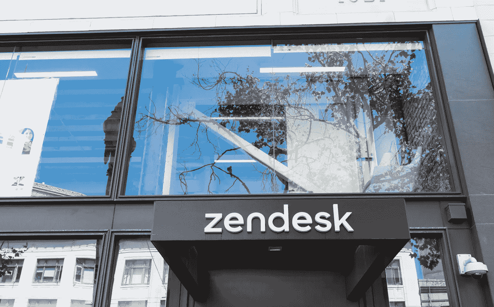

# Zendesk 在三年后，即 2019 年 9 月 24 日，披露了 2016 年的数据泄露事件

> 原文：<https://medium.datadriveninvestor.com/zendesk-discloses-2016-data-breach-after-three-years-i-e-on-september-24-2019-820d14fa0bea?source=collection_archive---------12----------------------->

Zendesk —一家客户支持票务平台发布了一份三年前发生的数据泄露公告。该公司在其网站上发布了一条消息，称 2016 年 9 月，发生了数据泄露事件，约 1 万名用户的数据遭到泄露。黑客拿走了用户的所有个人信息以及 Zendesk 的支持和聊天账户。这个黑客应该是第三方，他试图访问 Zendesk 的数据库并成功做到了。2019 年 9 月 24 日，Zendesk 明确披露了这一漏洞。Zendesk 在 tehir 官方网站上声明，调查正在进行中，但数据泄露影响了一小部分 tehir 用户，受影响的账户是在 2016 年 11 月 1 日之前注册的。

实际情况是，Zendesk 的客户通过 Zendesk 向他们的网站提供客户聊天服务。Zendesk 代理相应地管理聊天和票证。这些代理基本上是这些公司的雇员。代理解决最终用户的查询。

# **Zendesk 被泄露的数据**

Zendesk 解释说，数据泄露事件损害了其所有消费者的个人信息。这些消费者包括最终用户、顾客和代理商。从他们的帐户和门户网站窃取的个人数据包括:

*   最终用户和代理的姓名、电子邮件地址和电话号码
*   客户提供给 Zendesk 的传输层安全(TLS)加密密钥
*   与从应用程序市场和私人应用程序安装的应用程序的配置设置相关的所有数据
*   这些数据还包括应用程序用来验证第三方服务的集成密钥

据 Zendesk 称，在入侵发生后的过去几年里，他们没有发现黑客使用过的数据。在 10，000 个被泄露的密码中，有 700 个仅属于客户账户。它表示，他们正在采取动态措施来应对未来与他们系统相关的风险，并分析他们系统的不足之处。这次数据泄露对公司和消费者来说绝对是一场噩梦。

任何持有消费者数据的公司或组织都容易遭受这种网络攻击和身份盗窃事件。为了阻止安全漏洞的风险，人们应该认识到数据的重要性，并采取安全措施来避免毁灭性的情况。

# 对 Zendesk 有什么期待？

那些泄露了自己信息的人，甚至那些没有泄露的人，都期待着 Zendesk 将处理的安全和数据隐私问题。在数据泄露事件披露后，Zendesk 表示，在接下来的 24 小时内，他们将在 2016 年 11 月之前被泄露的支持和聊天账户中实施密码轮换机制。他们进一步表示，密码轮换将对共享身份验证和支持的平台产生影响。Zendesk 正与外部法医专家一起继续调查，并将寻求执法机构的帮助。

通过[数字身份验证解决方案](https://shuftipro.com/identity-verification/)、防火墙安装和受控数据访问措施，可以成功应对未经授权访问造成的数据泄露。任何差异都会进一步影响商业信誉和收入。

虽然在一篇博客文章和[官方网站](https://www.zendesk.com/blog/security-update-2019/)中，Zendesk 已经准备好考虑过去的缺失和未来的计划来弥补之前的损失。

Zendesk 的首席信息安全官马丁·范·霍伦贝克说，

***“我们客户及其数据的安全对我们来说至关重要，”***

他进一步说:

***“我们的目标是以透明的方式尽快传达这些信息，并就如何处理这些信息提供指导。”***

该公司开始通过电子邮件通知受害者。它表示，将重置 2016 年 11 月 1 日之前注册的所有受损账户的密码。这些人不包括已经更改密码的人和使用单点登录(SSO)访问 Zendesk 帐户的人。