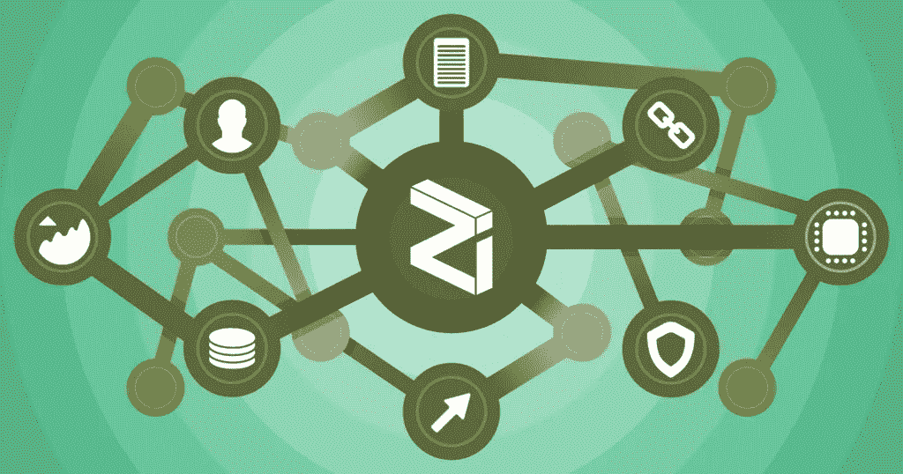
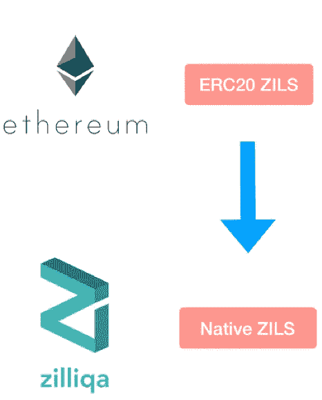

# Zilliqa:进展和更新，2019 年 6 月

> 原文：<https://medium.datadriveninvestor.com/zilliqa-progress-and-update-june-2019-ec09b0c3cc71?source=collection_archive---------5----------------------->

## 领先的下一代高速区块链。

Zilliqa 是取代以太坊成为领先的下一代高速区块链的有力竞争者。

正如你所记得的，在我关于这个项目的最后一次更新中，它在一月底成功地发布了它的 mainnet。

 [## 科罗拉多州正在成为亲加密法规的领导者-数据驱动的投资者

### 科罗拉多州已经成为区块链公司的滋生地和避风港。新任命的…

www.datadriveninvestor.com](https://www.datadriveninvestor.com/2019/03/22/colorado-is-emerging-as-a-leader-in-pro-crypto-regulations/) 

在许多小的错误修复和技术改进之后，引导阶段已经结束了。这意味着我们该交换代币了。

每个 ERC-20 ZIL，你会得到一个 Zilliqa 区块链本地的 ZIL，如下图所示。

ZIL 代币互换的截止日期是 6 月 30 日。所以没有立即完成的紧迫性。尽管如此，我还是强烈建议你尽快交换代币。

让我们一步一步地完成代币交换。

**第一步:设置你的新钱包**

你首先需要一个可以存放 ZIL 本地代币的钱包。我推荐 [Zillet](https://zillet.io/) 。它的工作原理非常类似于 MyEtherWallet。

*   要开始，请点击右上角的“+创建钱包”。
*   接下来，输入密码。
*   [请参考我的安全指南，了解安全密码的最佳实践。这可能是一个好机会[再次回顾整个安全指南](https://members.caseyresearch.com/special-report/getting-started-with-cryptocurrencies-part-i/)以确保您正确保护您的密码。]
*   将出现一个弹出框。将您的私钥复制并粘贴到您存储在某个安全位置的文档中。
*   单击“下载密钥库”按钮并保存您的密钥库文件。
*   接下来，点击右上角的“访问钱包”。现在，您可以在复制和粘贴您的私钥或上传密钥库文件之间进行选择。两种方式都会加载你的钱包。
*   现在你会在左上角看到你的 Zilliqa 地址。复制您的地址，并将其保存在您保存私钥的同一文本文件中，以供将来参考。

另一个钱包选项是[小卫星](https://chrome.google.com/webstore/detail/moonlet-wallet/aepcjklheilpnnokjfpgncfcdakhbgci)。

我个人并不是 Chrome 浏览器插件的粉丝，但这是 Zilliqa 团队推荐的钱包。它已经过 BitSentinel 的审计，并经历了一次漏洞发现活动。这是为了确保清除系统中的任何错误。

这里是小卫星及其特性的[用户指南。(Moonlet 也支持基于以太坊的令牌。)](https://medium.com/moonlet-xyz/moonlet-user-guide-and-its-key-features-1f7bea49a871)

**第二步:存放代币**

现在，您应该已经设置好了新的 Zilliqa 钱包。你应该记下你在 Zilliqa 的地址。

下一步是将您当前的 ERC-20 ZIL 代币存入支持代币互换的交易所。

你需要做的是选择一个交易所，然后按照它的指示去做。它的工作原理与使用交易所进行正常交易基本相同。

在撰写本文时，Okex 和 Koinex 是两个可用的选项。火币很快就会上市。

但是你最好的选择可能是币安，它也支持 ZIL 代币交换。

对币安来说，有一点需要注意:你找不到 ZIL·ERC 的专用存款地址——你的账户里有 20 个代币。只需将您的 ZIL 代币寄到您的 ETH 存款地址。币安将自动识别 ZIL 代币并存入您的帐户。

关于支持代币互换的交易所的最新列表，请参见 Zilliqa 的[电报通知频道](https://t.me/zilliqa)。

**Zilliqa 的进一步更新**

另一则新闻，Zilliqa 与伦敦国王学院合作推出了一个区块链教育项目。

Zilliqa 还与收入超过 340 亿美元的全球媒体和营销服务公司 Mindshare 成功完成了一个试点项目。

在试点项目期间，Zilliqa 的区块链向东南亚观众展示了一个实时在线广告活动，该活动跟踪广告浏览量并自动结算付款。

这个项目的目标是为数字广告带来透明度，以消除欺诈和浪费的广告支出。

根据令牌交换计划，Zilliqa 有望成为领先的下一代高速区块链之一。

**在 6 月 30 日之前将您的 ERC-20 ZIL 代币换成本地代币。**

感谢阅读！请随意查看我下面的一些类似的加密货币相关帖子。

*   [如何从科莫多(KMD)获得加密收入](https://medium.com/@rastogimanu461/how-to-earn-crypto-income-from-komodo-kmd-5217fd8bc129)
*   [“锁定”您的 BIX 代币，继续获得您的 BIX 奖励](https://medium.com/@rastogimanu461/lock-your-bix-tokens-today-to-continue-receiving-your-bix-incentive-reward-8ee80f4589ba)
*   [如何从本体中获得 ONG(ONT)](https://medium.com/@rastogimanu461/how-to-earn-ong-from-ontology-ont-acd92ffdd318)

你可以在 [Medium](https://medium.com/@rastogimanu461) 上关注我更多类似的帖子。