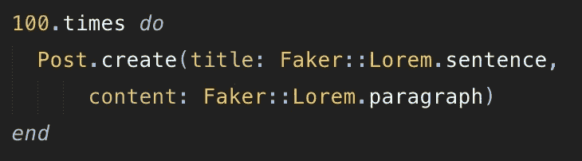
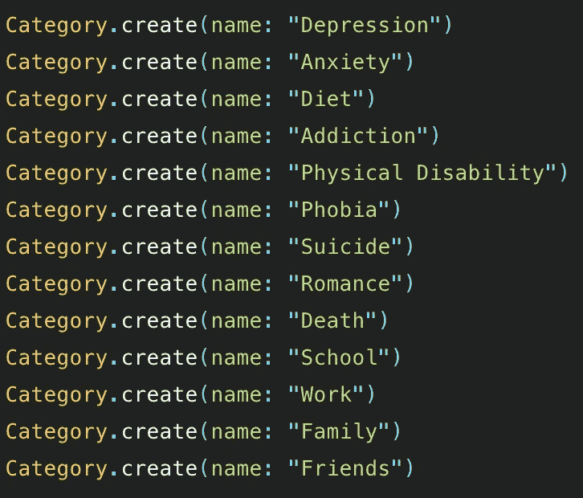
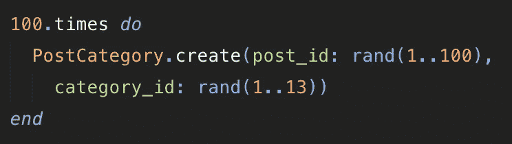
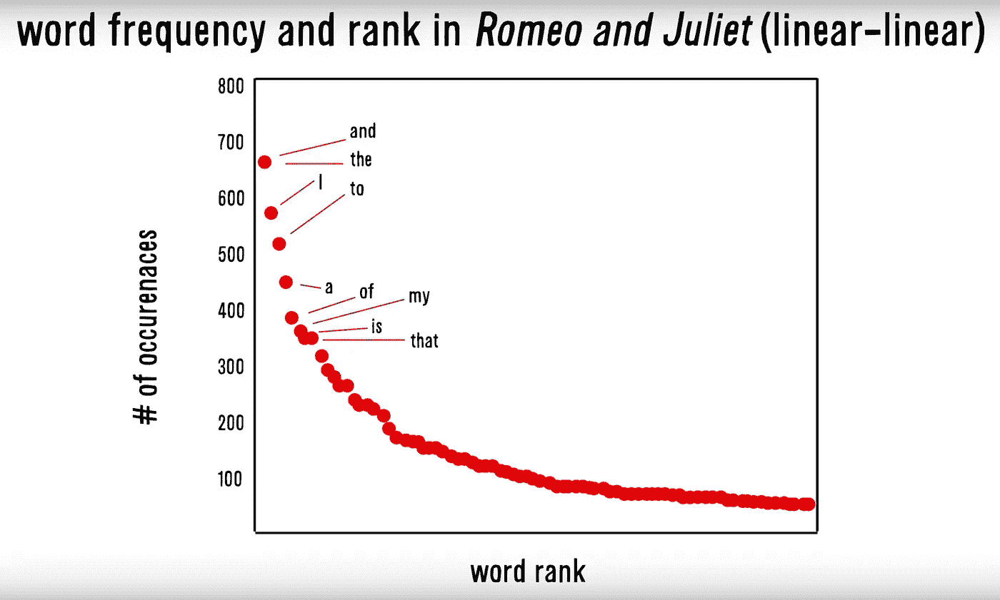

# Zipf 定律:分解及在应用程序开发中的应用

> 原文：<https://medium.datadriveninvestor.com/zipfs-law-breakdown-application-in-app-development-5e9cda70cdc8?source=collection_archive---------8----------------------->

我将以我是如何开始思考齐夫定律来开始这篇文章的主题。在一个项目中，我为我的应用程序创建了一些种子数据。我意识到种子数据对于大规模查看你在应用中建立的关系有多重要。正如你在下面看到的，我开始创建一些种子数据，并意识到我的连接模型，PostCategory，并不能真正地处理被推入的种子数据。

这让我想到了用户事后验证。如果用户在帖子上选择了错误的标签，而他们的帖子最终填充了错误的过滤器，该怎么办？这可能会造成糟糕的用户体验。我想到为每个类别创建一组流行语，然后为这些词扫描帖子标题和内容。如果没有关键词，我会提醒用户确保他们在类别标签方面做出了正确的选择。这让我想到…我怎么可能涵盖一个类别所能涵盖的所有单词呢？

答案是齐夫定律。

齐夫定律是一个使用数理统计制定的经验定律，它是连续帕累托原理的离散形式，我将在下面进一步深入讨论这条定律。哈佛大学的语言学家乔治·齐夫并不是第一个遵守这一定律的人，但他无疑对这一定律做了最多的研究，并使之闻名遐迩。该定律假设最常用的前 18%的单词占单词出现次数的 80%。

**最常用的 20 个单词**

2.  **之**
3.  ******和******
4.  ******至******
5.  ******答******
6.  ******在**中****
7.  ******是******
8.  ******我******
9.  ******那个******
10.  ******It******
11.  ******为******
12.  ******你******
13.  ******是******
14.  ******同******
15.  ******上******
16.  ******为******
17.  ******有******
18.  ******但是******
19.  ******是******
20.  ******他们******

****Zipf 定律的模式是这样的，列表中的每个连续单词是列表中第二个最常用的单词出现的次数大约是最常用单词的一半，列表中第三个单词出现的次数大约是最常用单词的三分之一，该模式以与单词排名直接相关的频率继续。甚至在著名的戏剧《罗密欧与朱丽叶》中也可以看到这样的例子。****

********

******Zipf’s law in action******

****齐夫定律的一个基础原则是帕累托原则。帕累托原则指出，20%的原因要对 80%的结果负责。这不仅体现在语言上，也体现在生活的大部分领域，甚至包括编码。作为编码人员，我们学到的第一件事是，应用程序的创建过程 80%是计划，20%是编码。同样的原则存在于语言中，甚至存在于社会结构中:世界上 80%的财富由 20%的人拥有。****

****齐夫定律也探索了最小努力原理的概念。生活遵循阻力最小的路径，它寻求最有效的方式。这也适用于人类语言的进化。作为演讲者，我们寻求使用尽可能少的词语来传达我们的想法，以使交流尽可能高效。作为听众，我们寻求尽可能多地听到单词，这样，作为听众，我们就不必做太多的工作来理解所传达的内容。如果你注意到排名较高的单词比曲线末端的单词长度小。****

****该定律似乎也适用于随机事件，甚至是蓄意事件。我们肯定会选择我们谈论的话题，那么为什么数据一次又一次地指向这个幂律呢？似乎齐夫定律已经被植入了我们的大脑。****

****另一个在法律下观察到的现象叫做优先附加过程。优先依恋过程是根据已经拥有的多少给予某物。这种现象解释了诸如****

1.  ****病毒式浏览量:某样东西的浏览量越多，它就越有可能被推荐，出现在新闻中，这两者都给了它更多的宣传。这是滚雪球效应。****
2.  ****单词的用法:最容易使用的单词是历史上使用次数最多的单词，因为它们容易使用，所以出现频率最高。****
3.  ****即使是很小的事情，比如你从厨房走到客厅的路。你地毯路径的 20%会占你地毯磨损的 80%。****

****齐夫定律只是对人类行为的另一种观察。我们为其他人开发应用程序，考虑这些法律有助于我们更好地设计应用程序。在我的情况下，我可以考虑使用的最常见的单词，并且在一定程度的准确性内，我可以放心地在我的应用程序的验证器方法中包含最常见的单词。****

****该定律也适用于人工智能中的一些应用。人们可以潜在地使用 Zipf 定律作为人工智能算法中的偏置部分，以进一步将节点的权重推向某个结果。Zipf 定律可以潜在地应用于一些计算机视觉算法中，以正确地预测它正在看的东西。不仅仅是为了阅读笔迹，也可能是为了生活中任何遵守齐夫定律的领域。****