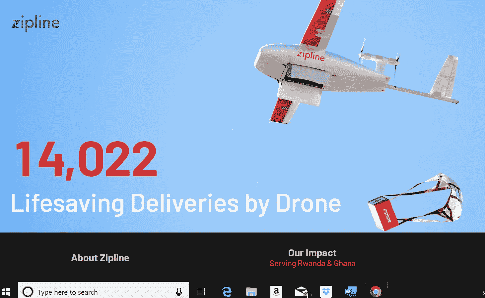

# Zipline 加入谷歌和亚马逊的十亿美元无人机游戏俱乐部

> 原文：<https://medium.datadriveninvestor.com/zipline-joins-google-and-amazon-in-billion-dollar-game-of-drones-club-ae01c91bc04?source=collection_archive---------12----------------------->

Zipline International 在利用无人机建立自主送货服务的竞赛中是一个真正的潜行者，这种服务既可行又有真正的商业案例。亚马逊，谷歌，甚至达美乐比萨，在过去几年里已经花费了数百万美元测试飞行的 AVs，希望它们能够成为比丑陋的棕色巴哈马群岛的人类或顶部有发光达美乐标志的汽车里的孩子更便宜的包裹运送者。但是他们仍然被安全问题和简单的经济问题所困扰。

与此同时，一家名为 Zipline 的 SF AV 交付初创公司刚刚筹集了 1.9 亿美元的风险资金，使其总资本达到 2.25 亿美元，并从投资者那里获得了 12 亿美元的估值。

 [## 我们为军事人工智能做好准备了吗？-数据驱动型投资者

### 今天，算法可能会以迷人的形状出现，例如索菲亚，一个态度可爱、开明的机器人…

www.datadriveninvestor.com](https://www.datadriveninvestor.com/2019/02/21/are-we-ready-for-military-ai/) 

他们是怎么做到的？创始人凯勒·里瑙多(Keller Rinaudo)、威廉·赫茨勒(William Hetzler)和基南·怀罗贝克(Keenan Wyrobek)几年前制作了 iPhone 驱动的机器人宠物罗莫，取得了一些成功，但这些年轻的企业家很快决定，他们想做一些更具社会影响力的事情。

他们发现，世界各地每年都有许多人因无法获得救生和关键医疗产品而死亡，原因是所谓的最后一英里问题:由于缺乏足够的交通、通信或供应链基础设施，无法将关键药物从城市运送到农村或偏远地区。

他们开始搜索发展中国家，以了解基于无人机的物流在哪里以及如何帮助拯救生命。

“我们发现，全世界每年有数百万人死亡，因为他们在需要时无法获得所需的药物，”首席执行官里瑙多说。“这是发达国家和发展中国家都存在的问题。但这是一个我们可以通过按需无人机送货帮助解决的问题。”

在 UPS 和疫苗联盟 Gavi 80 万美元的资助下，该公司研究了这一概念的可行性，即让偏远地区的医疗保健工作者通过短信或电话订购供应品，并由中央配送中心派出的无人机送货上门，通常在半小时或更短时间内完成。

2016 年 10 月，Zipline 和卢旺达政府推出了世界上首个国家无人机送货服务，为全国各地的输血诊所提供按需紧急血液运送。

自 Zipline 在卢旺达推出以来的三年里，其无人机已经进行了超过 14000 次送货，供应了该国一半以上的血液供应。

Zipline 无人机可以携带 4 磅货物，最大速度约为 70 英里/小时，全天候航程为 100 英里。每个配送中心可以为 7700 平方英里提供药品。Zipline 的无人机只在配送中心起飞和降落，不需要在其服务的诊所增加额外的基础设施。送货是从空中进行的，无人机下降到接近地面的位置，然后将药物空投到医疗中心附近的指定地点。

今年早些时候，Zipline 将加纳加入其客户名单。该公司已经开始在加纳的四个配送中心运营 30 架无人机，每天向这个西非国家的 2000 家医疗机构分发疫苗、血液和救生药物。

Zipline 表示，它将利用新的资金扩大其在非洲、美洲、南亚和东南亚的医疗供应交付服务，并从今年开始，从北卡罗来纳州开始向美国扩展..该公司表示，其目标是在未来五年内用无人机服务 7 亿人。

首席执行官凯勒·里瑙多在一份声明中说:“全世界越来越多的人感到科技并没有让绝大多数人受益。”旧的传统智慧认为，建立一家成功的科技公司需要利用人们的个人信息或劫持他们的注意力。Zipline 希望在硅谷建立一种新的成功模式，向世界展示拥有正确使命的正确技术公司和最佳团队可以帮助改善地球上每个人的生活。"

Zipline 背后有很多聪明的资金，包括红杉资本、谷歌风投、SV 天使、减法资本、杨致远、保罗艾伦和斯坦福大学。

而且，你怎么能不喜欢这样一家公司，它的使命是:“……为地球建立即时交付，允许药品和其他产品按需以低成本交付，而不使用一滴汽油。”

*原载于 2019 年 5 月 22 日*[*【https://medium.com】*](https://medium.com/p/3fcfa1a46d19/)*。*