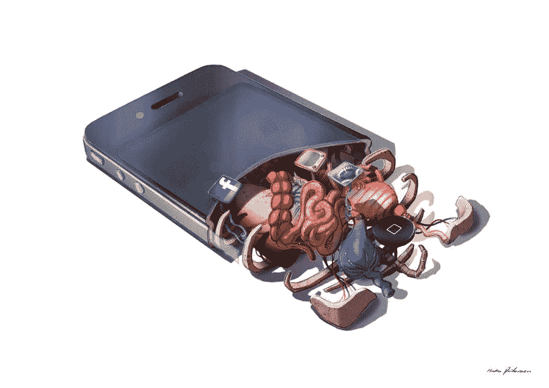

# 僵尸

> 原文：<https://medium.datadriveninvestor.com/zombies-474ca95500fa?source=collection_archive---------14----------------------->

## 那是我们吗？

德国美因茨大学的哲学家 Thomas Metzinger (2004 年)一直在推动这样一种观点，即自我是一个神话，是一种大脑模拟，尽管无可否认，它非常有用。他声称从来没有自我。你生来没有，当你死时，没有自我死亡，因为它只是你大脑中的一个“软件模拟”。

在梅青格的书《无名之辈:主观性的自我模型理论》(2004 年)和《自我隧道:心智科学和自我的神话》(2010 年)中，梅青格讨论了一些有趣的证据来支持他的理论。什么是自我？哲学家喜欢使用大词，并经常以特定的方式定义它们。我们是否可以说，自我是一个由大脑神经网络创造的计算空间，它区分了有机体的内部和外部？狗有自我吗？大概吧。

恐怖小说作家和悲观主义哲学家托马斯·利戈蒂似乎读过梅青格的书，他写道:

> 被某种力量——称之为意志、生命力、生命世界、生理或心理过程、自然或其他——像玩具一样上紧发条，生物体按照它们的指令继续运行，直到它们停止运行。在悲观的哲学中，只有力是真实的，而不是被它激活的事物。他们只是傀儡，如果他们有意识的话，可能会错误地认为他们是自我缠绕的人，靠他们自己就能成功。(利戈蒂，2012 年)

他总结道，

> “秘密已经泄露:我们是复制基因的生物机器人，生活在一个寒冷空旷的物理宇宙中的一个孤独的星球上。…我明白你的意思，你最好相信我会调整自己的行为以适应它。”

我认为分析中遗漏了一个重要方面。正如利戈蒂所宣称的那样，我们不是自动上弦的木偶,“靠自己的力量获得成功”。相反，作为高度社会化的生物，我们的大脑通过直接的潜意识过程相互联系，例如通过镜像神经元(Keysers，2011)。自然的抽象“傀儡主人”具体化为牧师、酋长和国王，他们利用媒体来幕后操纵。

人类在社会结构中的僵尸化嵌入性的观点依赖于以下论点，即，

*   有意识的自我是大脑细胞物理信息处理活动的结果。
*   行为主要来自感官刺激的潜意识过程。
*   人类无法控制自己的命运，因为作为一个复杂的系统，其行为是自我调节过程的结果。

看第一项，我们知道光的视觉模式通过眼睛进入大脑。声音模式通过耳朵传来。触觉(压力)、味觉和嗅觉(化学信息)也会到达大脑。大脑的模拟和并行处理能力介入，随后是一系列行动，这是生物信息处理能力中最重要、最令人兴奋的部分。根据 Spivey (2007 年)，

> “行动随着时间的推移而发生，它们不断地改变刺激环境，刺激环境又不断地改变心理活动，心理活动不断地表达和修正其行动倾向。这是一个连续的循环，数据输入不断地修改输出，即动作，而动作反过来又修改接收数据的内容和方式以及处理数据的方式，再次修改动作。”

因此，so Spivey (2007)，

> 你和你感觉你正在处理的信息没有什么不同。当你自省和自我反省时，感觉像是在回答问题的“你”(以及感觉像是在问这些问题的你)是由与世界其他部分相同的信息媒介组成的。物理物质元素之间时空关系的动态模式构成了世界上的过程(我们经常称之为事物)，这些相同类型的模式也构成了你的思维——因为归根结底，你的思维只是世界上的另一个过程，就像任何其他过程一样。

Spivey (2007)拒绝接受计算机启发的思维隐喻。已经没用了。在计算机中，硬件和软件是分离的，尽管软件依赖于硬件结构。对于斯皮维来说，头脑是*“世界数据的一部分，而不是处理这些数据的一个单独的东西。”*

如果我们把媒体技术考虑进去，把它与大型组织、公司、政府的人机组合中的社会网络联系起来，我们可以看到“人”已经被服从命令的“工作人员”所取代。

“工作人员”仍然是一个个人主义的概念，有一些个人责任，像希特勒的心腹艾希曼。这个概念没有错但是没有充分描述这个概念。在一个更大的组织中，是“团队”消解了个性，把个人变成了机器中的一个齿轮，一台根据其话语、意识形态、目标和方法(包括道德价值观)运转的机器。我们非常熟悉成为这种“团队”的一部分。例如，它可以是公司中的工作团队、军事单位、任务组或特警队。

在适当的情况下，人类很容易服从权威，并按照上级的意志行事，斯坦利·米尔格拉姆的著名论证就是如此。

> 1961 年至 1962 年间，斯坦利·米尔格拉姆进行了一系列实验，在这些实验中，人类受试者被给予精心设计的一系列逐渐增加疼痛的电击，以确定人们会在多大程度上服从命令，即使他们知道这些命令是痛苦和不道德的——以确定人们会如何不顾后果地服从权威。这些实验在当时受到了严厉的批评，但最终被科学界证明是正确的。[(维基百科，2014)](http://en.wikipedia.org/wiki/Obedience_to_Authority:_An_Experimental_View)

卡夫卡(Kafka，2011 年)害怕的人的解体，在虚拟人物格雷戈里·萨姆萨(Gregory Samsa)变成一只昆虫中完成，在网络化社会中达到高潮，“单独在一起”(Turkle，2012 年)，其中“单独”消失了，因为一个人总是插上电源，插上数据流。

Source: [DeviantArt: Madspetersen](http://art_meats_technology_by_madspeitersen_d2svhoj-fullview.jpg)

数据流可能来自你的上级，或者像脸书或推特这样的社交媒体，已经被间谍网络严密监视。潜意识失去了反抗的力量，因为有“信息恐怖”，类似于宗教派别的运作，但由于机器的复杂性和范围，潜在地更强大。这个仪器不是机器。这是一个由身体、钢铁和硅树脂组成的聚合体，通过光纤连接在一起，横跨全球，确保资金总是向上流动。Mads peiter sen(2014)的图像象征着人成为机器，机器成为人，机器本身象征着与 Mads 在他的绘画中使用的所有这些通信设备的通信。

“我沟通，故我在”是沙漠中战士的呐喊，为帝国军队“嵌入”了通讯设备，这与 19 世纪早期使用指南针和骆驼的探险家大相径庭。

一个短暂的奖励是一个英雄的成就，一枚奖章，一个肩膀上的轻拍。然而，最有可能的是，这位老兵将最终成为贫民区无家可归的受害者，与创伤后应激障碍作斗争。只有单位有价值，没有个人有价值，因为个人=人已经死了，一个僵尸。散发着不可战胜性的是人机联合体。

我不同意基特勒。没有人肉，机器智能就无能为力，反之亦然。事实上，企业集团是尼采的超人，没有任何尼采式的道德品质。这是一个纯粹为资本积累服务的怪物，它的后院是一个巨大的头骨墓地，这些头骨曾经认为它们是人类。然而，我承认奇点是一种可能性，一种超出我们控制能力的网络化人工智能(阿姆斯特朗，2014)。

“他们”是怎么做到的？人类的他者，无意识，在紧密结合的社会中总是可以通过宗教和法律获得。然而，大众社会更难处理，就像我们在法国大革命中看到的那样。还需要其他东西，如强大的大众媒体。通过弗洛伊德关于潜意识的思想，潜意识变得可以接近和操纵，后来埃迪·伯奈斯将潜意识变成了一种成功的宣传工具，称之为公共关系(柯蒂斯，2002)。1928 年，伯奈斯(2005)发表了他的开创性著作《宣传》,他在其中概述道，

> 我们被相对少数的人——我们一亿二千万人口中微不足道的一小部分——所支配，他们理解大众的心理过程和社会模式。正是他们控制着公众的思想，利用旧的社会力量，发明新的方法来约束和引导世界。(伯奈斯和米勒，2005 年)

当“他们”控制欲望和消费时，自我变得无助，在群体中寻求安慰，没有意识到群体也同样成为宣传的牺牲品。大众已经变得精神错乱，今天我们随身携带的小设备——“智能”手机确保了这种状态。我们变得对我们的数字宠物上瘾，它们给我们提供精神分裂症的日常毒素，渲染枪支暴力，虐待，厌女症和种族主义，这是正常的。上瘾者自己变成了其他人的英雄，信息色情。正如福柯所说*“现代思想事实上从来没有能够提出一种道德”* (1994，第 328 页)，而*“对于现代思想来说，没有道德是不可能的。”*群体行为，无论多么恶劣，都是由个人无法控制的力量通过直接接触认知器官的神经机制形成的。

**参考文献**

h .阿伦特(2006 年)。艾希曼在耶路撒冷:关于平庸之恶的报告。纽约:企鹅图书公司。

阿姆斯特朗(2014 年)。比我们聪明:机器智能的崛起。加州伯克利:出版社:机器智能研究所。

伯奈斯和米勒(2005 年)。宣传。纽约布鲁克林:Ig 酒吧。

柯蒂斯，a .(制片人)，柯蒂斯，a .(编剧)(2002)。自我的世纪【电视广播】。联合王国:英国广播公司四台。

离经叛道的艺术(2014)。马德斯派特森。从 https://www.deviantart.com/madspeitersen/gallery/[取回](https://www.deviantart.com/madspeitersen/gallery/)

福柯，M. (1994)。事物的顺序:人类科学的考古学。).纽约:古典书籍。

f .卡夫卡和 I .约翰斯顿(2011 年)。蜕变。纽约林登赫斯特:翠贝卡图书公司。

Keysers，C. (2011 年)。镜像神经元的发现如何改变我们对人性的理解。肯塔基州列克星敦:社会大脑出版社。

茨韦塔纳·利戈蒂(2012 年)。反对人类的阴谋。纽约州纽约市:海马出版社。

茨韦塔纳·梅青格(2004 年)。不是任何人:主体性的自我模型理论(1。麻省理工学院出版社平装版。).马萨诸塞州剑桥。:布拉德福德书。

茨韦塔纳·梅青格(2010 年)。自我隧道:心智的科学和自我的神话。纽约:基础书籍。

米尔格拉姆，S. (1974)。服从权威:一个实验观点。伦敦:塔维斯托克。

m . spivey(2007 年)。思想的连续性。纽约:牛津大学出版社。

特克尔，S. (2012 年)。为什么我们对技术期望更多，而对彼此期望更少。纽约:基础书籍。

维基百科。(2014).服从权威:一个实验观点。检索自[http://en . Wikipedia . org/wiki/compliance _ to _ Authority:_ An _ Experimental _ View](http://en.wikipedia.org/wiki/Obedience_to_Authority:_An_Experimental_View)