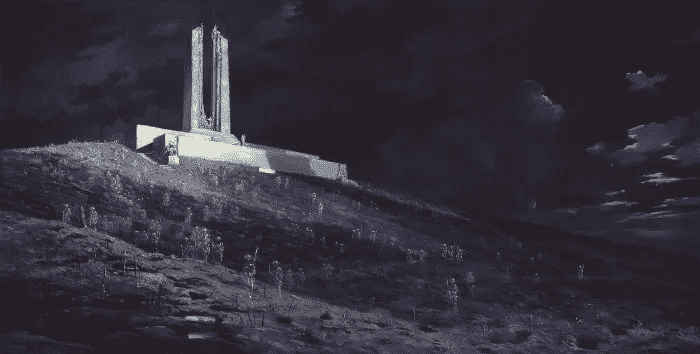
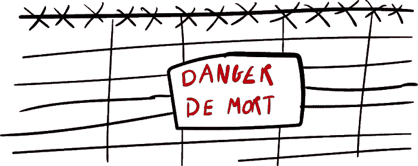
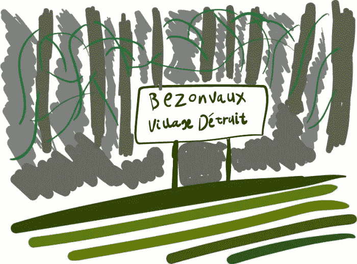
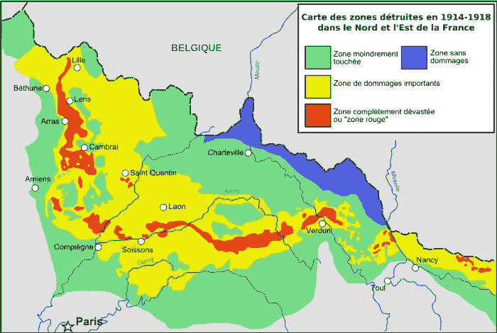
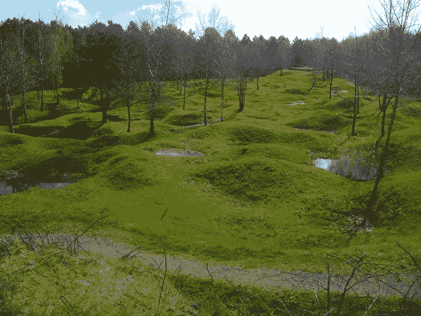
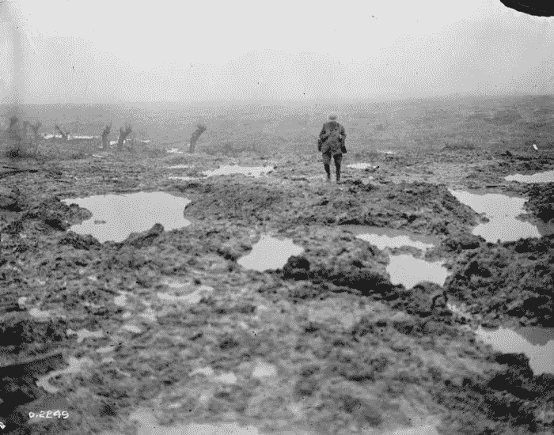

# 红色区域:一战幽灵出没的地方

> 原文：<https://medium.datadriveninvestor.com/zone-rouge-where-the-ghosts-of-wwi-haunt-the-earth-40604395def7?source=collection_archive---------3----------------------->

## 欢迎来到世界上最奇特、最迷人的废弃地区之一。

每天早晨，在法国东北部一个偏僻的角落，加拿大国家维米纪念馆的两座塔楼赫然出现在薄雾中。纪念碑周围是许多空旷的土地，除了苍白的小草什么都不生长。在纪念碑的中央是一座名为“失去的加拿大”的雕塑。这是一个穿着斗篷的年轻女人。她低着头，眼睛看着数米下的石棺，石棺上挂着一顶头盔和一把挂在月桂树枝上的剑。第一次世界大战期间，11000 名加拿大士兵死在维米附近。许多死亡发生在维米岭战役期间。这座纪念碑现在就矗立在那场战斗的遗址上。这些人为之献出生命的土地现在变得空寂无人。

***Ghosts of Vimy Ridge by Will Longstaff***

德国人打算让西线成为消耗战。1914 年，当德国意识到他们被卷入了一场与法国和俄罗斯的战争，因为他们不幸卷入了一个竞争联盟，他们决定了一个在当时看来明智的战略，考虑到当时的情况。他们将首先使用他们全部的军事力量来迅速羞辱他们认为弱小的法国。他们绝对会打败他们。他们会杀死他们的士兵，摧毁他们曾经死去的土地。那样的话，法国的士气会很快崩溃。然后，他们将把军队运送到他们的东部边境，那里当时与俄罗斯接壤，他们将在那里与更强大但动员更慢的俄罗斯军队作战。当然，由于比利时和英国对德国人的抵抗，事情没有按计划进行。双方最终都在战壕里战斗。

 [## 区块链会引发全球金融体系的动摇吗？-数据驱动型投资者

### 2008 年的金融危机表明(对一些人来说),大型金融机构需要被密切关注和…

www.datadriveninvestor.com](https://www.datadriveninvestor.com/2019/01/11/will-blockchain-trigger-a-shakedown-of-the-global-financial-system/) 

这种情况持续了好几年。双方都倾向于使用炸弹和化学物质徒劳地试图击败对方。每当一方出现，试图要求额外的土地，在一个安全地隐藏在后方的将军的命令下，敌人会用机枪把他们打成碎片。

当和平最终回归时，法国将维米岭战役的遗址赠与加拿大，以示感谢。纪念碑周围的土地形状奇特，用栅栏围了起来。栅栏上悬挂着鲜红的标语:

***危险！禁止入内——未引爆的炸药。***

这个地区是红色区域*的一部分，面积 1200 平方公里，大致沿着旧西部战线。战争结束后，法国政府绘制了四年激烈战斗对国家造成的破坏。*

*前线是一片地狱般的景象，到处是淤泥、炮弹碎片和废弃的设备，布满了大片浑浊的水坑。潜伏在泥土下的是等待引爆的地雷，以及身份不明的士兵尸体。战前，那里有农场、村庄和树林。现在他们几乎认不出来了。实验得出结论，每平方公里约有 30 枚未爆炸的炮弹，来自铅、汞和芥子气等原始化学武器的污染非常严重，导致土地贫瘠。*

*被摧毁的村庄用简单的标志标出。bezon vaux——Detruit 村。更多的标志贴在小堆混凝土和砖块旁边。“这里矗立着教堂”。一个写着“Grande Rue”——“高街”的标志矗立在现在是林地的灌木丛中。在一片年轻的森林中间，一块石头上挂着一块匾，上面写着“咖啡馆——杂货店”。*

**

*法国政府将红色区域定义为“完全被摧毁”。财产损失:100%。对农业的损害:100%。无法清洗。人类的生活是不可能的。这个地区被用栅栏围了起来，交给了大自然。*

**

*即使在今天，唯一被允许进入的人是法国政府的一个特殊部门，其工作是清除该地区的地雷——这项行动在 101 年后仍在进行。虽然这个地区充满了各种各样的士兵纪念碑，但这片土地本身也不允许我们忘记。900 吨生锈但危险的炮弹仍然堆积在安全的仓库里。[整辆坦克被挖出](https://jamescrocket.us19.list-manage.com/track/click?u=96a22b3d26d922269da89799b&id=58e6bd02e8&e=a79c8ea15c)。恐怖从过去复活，从 100 年的沉睡中产生。这场战争还在继续夺走生命。1918 年，当敌对行动停止，幸运的士兵返回家园时，超过 1000 人因触发遗留的未爆炸装置而死亡。*

*但是大自然恢复得比我们想象的要快。这片土地在 1918 年被法国政府宣布为永久有毒的禁地，现在却生机勃勃。草、灌木和树林找到了穿过有毒土壤的方法，治愈了伤痕累累的土地。那些树林是野猪、鹿、田鼠、老鼠和野猫的庇护所。尽管在该地区安家的动物的肝脏仍然显示出高于正常水平的铅含量。*

**

*今天，随着排雷行动慢慢清除潜在的危险，该地区比过去要小。但是根据一些政府机构的预测，整个地区需要 700 年才能完全清理干净，1914 年至 1918 年间的四年间造成的破坏是如此可怕和彻底。*

**

*奥匈帝国是 1914 年唯一一个真正渴望战争的国家，但四年后它已不复存在。德国失去了土地和君主制，被迫进入一个不稳定的时期，这导致了希特勒的崛起。对俄罗斯来说，参与战争是 1917 年革命的众多原因之一，这场革命导致了沙皇的终结和共产主义的兴起。*

*在英国，其社会影响大于政治影响。为了维持外交联盟，损失了 100 多万士兵，这使得一代人没有父亲，没有儿子的母亲，没有丈夫的妻子。这位老处女和她死去丈夫的褪色照片成了五六十年代电影中的固定镜头。她们的丈夫为之战斗的土地现在空无一人，但有迹象表明这里曾经是什么。*

*红色区域坐落在那里，无时无刻不在提醒着人们战争的徒劳和无意义。但它也是自然恢复力的纪念碑，它忘记了我们人类的问题和破坏。*

*[*【怪异的西班牙】*](https://weirdspain.substack.com/) *是一份时事通讯，面向那些想要更深入了解他们的第二故乡及其人民的移民，以及世界各地想要更多了解这个神奇国家正在发生什么以及为什么会发生的西班牙爱好者。* [*在这里订阅，在你的收件箱里收到这些文章。*](https://weirdspain.substack.com/subscribe)*